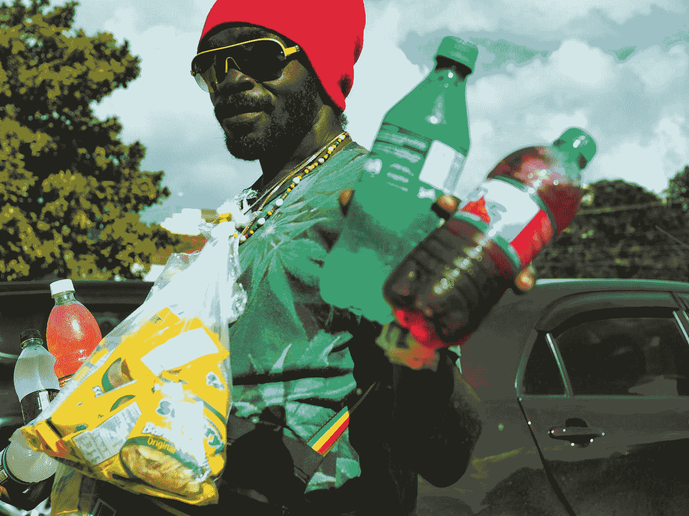

# 销售的艺术:从街头小贩身上学到的经验

> 原文：<https://medium.datadriveninvestor.com/the-art-of-sales-lessons-learnt-from-a-street-seller-a28e76b435a8?source=collection_archive---------8----------------------->

Photo by [Evieanna Santiago](https://unsplash.com/@evepsf30?utm_source=medium&utm_medium=referral) on [Unsplash](https://unsplash.com?utm_source=medium&utm_medium=referral)

## 坐在办公桌前，眼睛盯着电脑屏幕，我们经常会忘记销售产品的技巧。我们经常忘记如何与访问您网站的人联系，以及如何让他们购买我们的产品。

> 销售产品是一门艺术。你需要让人们相信购买你的产品是他们能做出的最佳选择。
> 
> 你需要与你的客户建立联系；你需要让他们明白，他们支付的价格也是最低的。这些都是你需要销售你的产品没有任何麻烦。

上次我去德里的时候，我有幸看到一个街头小贩在近距离销售他的产品。我对他说服顾客购买他的产品的熟练程度感到惊讶。

他站在人行道上，手里拿着麦克风。当路过的人们没有注意到站在路边的街头小贩时，他突然对着麦克风说

> “你今天面临了一个问题。不是吗？而你却在担心如何摆脱它”。

## 突然，人们看向他，他成了他们吸引的中心。这是我从他那里学到的第一件事。如果你真的想引起人们的注意，那么你首先需要引起他们的注意。

一旦他能够引起每个人的注意，他就去和每个人谈话，听听他们的问题。他风趣的话语和不可避免的魅力让每个人都笑了。很快，他和每个人都成了朋友，并继续介绍他的产品。

就在那一刻，我意识到他是一个多么高效的销售人员。他知道要销售他的产品，他必须与他的顾客建立某种联系。所以，一旦他吸引了顾客的注意力，他就很快开始这么做。

## 卖家突然对人群说

> “如果你认为我的产品不能帮助你，那么你可以随时来这里拿回你的钱。不要讨价还价，这是我卖的产品能给你的最低价格”。

他的话很简单，但它鼓励人们去尝试他正在销售的产品。因此，他用 25 分钟的努力赚了将近 1000 美元。

这次经历让我大开眼界。我们花了大量时间在 Instagram、脸书和任何我们能找到的地方投放广告。

但是我们完全忽略了销售产品的基本规则。做广告不会神奇地卖出你的产品。

## 你必须在大众中创造吸引力，与他们建立融洽的关系；最重要的是，你需要证明价格的合理性，并向他们保证他们不会比你提供的更好。

## 这些都是你需要了解和有效地做的事情，以增加你的产品的销售。