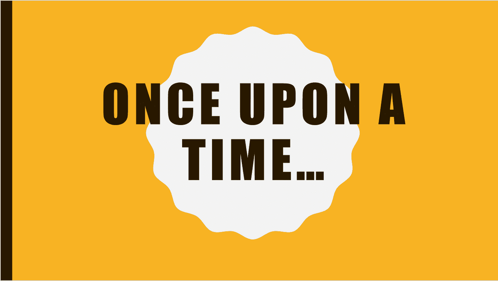

# 讲故事的艺术

> 原文：<https://medium.datadriveninvestor.com/the-art-of-storytelling-c1f29eb211ad?source=collection_archive---------15----------------------->

今天，我要和你谈谈你拥有的一种非常特殊的力量。这是一种力量，它将决定与你的听众建立联系还是完全失去他们。所以，你一定想知道这是什么力量？嗯，简直就是讲故事！

我会告诉你:

*   为什么讲故事很重要
*   三种不同类型的故事
*   一个好故事的要素

那么，让我们从头开始——为什么讲故事很重要？

当我们还是孩子的时候，有四个小词能够吸引我们的注意力和想象力。你记得他们吗？

 [## 从语音到对话的飞跃:人机交流的挑战

### 机器人无处不在，几乎无所不在。我们甚至已经开始与他们交谈，在这种情况下…

www.datadriveninvestor.com](https://www.datadriveninvestor.com/2018/08/02/making-the-leap-from-speech-to-dialogue-the-challenge-for-human-to-machine-communication/) 

***从前……***

这些神奇的话语告诉我们，我们将要进行一次大胆的冒险，遇见新的人，或者探索一个全新的世界。尽管我们关注这些故事是因为我们被娱乐了，但我们也学到了重要而有价值的课程，比如追寻我们的梦想，确保帮助他人，警惕危险。

快进一下，你们都长大了，但什么都没变。故事也一样有力量。他们抓住你的注意力，给你一个教训，激励你采取行动。现在你明白了为什么将讲故事融入到你与观众的互动中是如此重要。

接下来，你可以使用三种不同类型的故事

**个人旅程**

如果你现在的职业选择、业务、产品是因为你的个人经历而存在的，那么一定要说出来。

它可能是一个解决问题的决定，也可能是你头脑中的一个灯泡，让你成为今天的你。

这就是人们爱听、想联系的那种故事。这说明了为什么你有资格解决这个问题。

**克服巨大障碍**

我们都爱那个英雄的征途奋斗。你或你的一个朋友克服了不可能实现的目标。当然，我们都有。为了走到今天，我们都经历过必须克服的障碍和困难。这就是为什么当你分享你的挣扎时，很容易产生共鸣。

也许你几年前克服的挑战，正是某人现在面临的挑战，而你的故事可能正是解决他们问题的东西。

**一个励志故事**

你知道《心灵鸡汤》已经卖出了 1.12 亿份吗？这是为什么呢？这仅仅是因为人们想要得到启发。他们渴望那种知道不可能可能的感觉。看看你的周围，从著名的运动员、电影明星，甚至你的朋友——我们周围都有鼓舞人心的故事，他们需要被讲述。

继续，一个好故事的要素是什么？

如果你了解讲故事的科学，你会发现这完全是一场荷尔蒙的游戏。一个好的故事会在你的大脑中引发一种叫做天使鸡尾酒的物质的释放，这种物质是多巴胺、催产素和内啡肽的混合物。当你坠入爱河或喝巧克力或咖啡时，同样的荷尔蒙会被激发出来。当多巴胺被释放到你的血液中时，它会让你更加专注、更有动力、记忆力更好。

如果你想让你的故事有这种效果，这里有一些简单的提示

*   画一幅画，建立悬念(敦敦敦)或推出悬崖衣架。
*   使用生动和感性的语言
*   设置故事的转折点或弧线。
*   带着这个故事的寓意离开

因为就像有人说的，“人们会忘记你说过的话，人们会忘记你做过的事，但人们永远不会忘记你带给他们的感受”

所以，亲爱的读者，你的故事是什么？