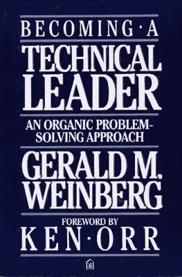
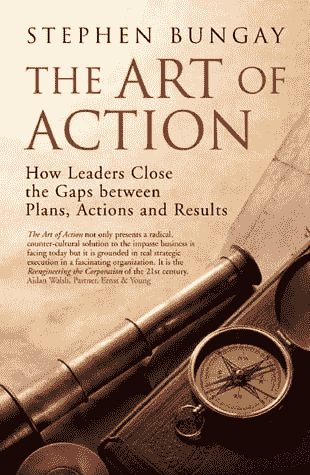
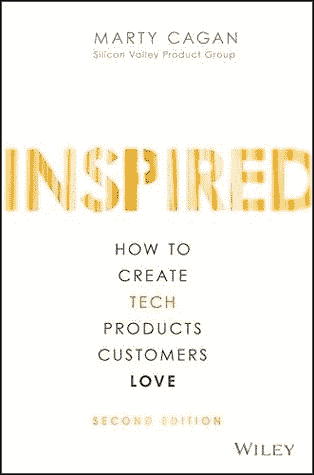
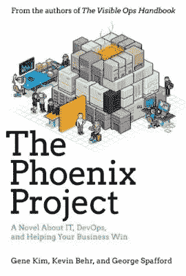

# 技术领导的艺术——考虑管理的技术人员完整资源指南第 1 部分

> 原文：<https://medium.datadriveninvestor.com/the-art-of-technical-leadership-complete-resource-guide-for-technologists-considering-management-a7474fb13240?source=collection_archive---------10----------------------->

*原载于* [*LinkedIn*](https://www.linkedin.com/pulse/art-technical-leadership-complete-resource-guide-part-soboyejo/)

你可能和我几个月前一样。

纠结这个唠叨的想法— *“我该不该？”*

决定管理是否适合你并不总是一个简单的决定。对于技术个人贡献者来说，这可能更令人生畏。

如果你像我一样成功地迈出了这一步，你可能会发现这篇文章有助于你定位自己。我有初学者心态的优势，这提供了一个独特的有利位置。

# 分解它

我将内容分解为一些核心领域，我正在快速学习，这是任何优秀技术经理(新的或经验丰富的)的关键。

*   领导力
*   战略和执行
*   产品开发和创新
*   交付管理和保障性
*   组织
*   文化和团队构成
*   资源管理
*   目的和意义

我写这篇文章时考虑到了工程师或技术个人贡献者。但是，如果你不符合这个条件，这里也有适合你的东西。

我浏览了几年来遇到的一些很棒的资源。希望听到您的反馈。

我决定将这篇文章分成多篇。第一个将包括前四个要点，其他的将在后面的文章中介绍。

# 论领导力

[成为技术领导者](https://leanpub.com/becomingatechnicalleader)——**杰拉尔德·温伯格**

在这个列表中，没有任何一本书像这本书一样全面地论述了技术领导力的主题。标题说明了一切。Gerald 知道他在说什么，他在技术领域工作了多年。这是一本由真正的从业者而不是记者或管理学教授写的书。

他的主要观点围绕着他认为一个技术领导者需要具备的三件事

*   刺激
*   组织
*   创新/有想法

一个好的经理有三个缺点中的两个。在这三个方面都优秀会让你成为一颗宝石。

**激励**

任何领导者都必须能够影响。

根据约翰·麦克斯韦的说法，“如果你认为你在领导，但没有人跟随，那么你只是在散步”。

杰拉尔德指出，激励的第一个障碍是不能像别人看待你那样看待自己。激励的一部分是认识到工作背后的人类现实。

《好老板，坏老板》的作者罗伯特·萨顿也强调了类似的观点。

> “最有效率的老板会花大力气去理解他们的情绪、怪癖、技能和行为是如何影响他们的下属的表现和人性的”—罗伯特·萨顿

你会如何回答这个问题:**“为我工作是什么感觉？”**

**整理**

一个伟大的领导者知道如何为他们的创新者获取资源。她还营造了一种环境，在这种环境中，每个人都感到自己被赋予了权力。

每个人都了解问题，管理思想的流动，做出决定并执行这些决定。组织得好意味着少一些戏剧性。有时候不是解决问题，而是回避问题。

管理涉及一些行政任务(尽管组织远不止于此)。对大多数人来说这并不有趣，但是如果你忽视这些，你可能会把你所有的好工作置于危险之中。你的信誉也可能岌岌可危。

**创新**

一个好的技术领导者明白大多数“新”想法是从其他环境中复制旧想法。

一个好的解决问题的领导者会探索其他可以利用的好主意。在你确认你理解了问题之前，你不应该提供解决方案。

> 在你说出以下任何一句话之前，你必须能够合理而肯定地说:“我理解”，“我同意”，“我不同意”，或者，“我暂停判断。”——**莫蒂默·j·阿德勒**(如何阅读一本书)

作为解决问题的领导者，这是创新的关键。在这个职位上，你应该体现三个特点

*   没有兴趣重复别人或自己已经做得很好的事情
*   花更多的时间完善想法，而不是提出想法
*   当别人解释他们的想法时，花时间倾听他们

这是一本 80 年代中期出版的旧书。与这个列表中的其他一些书相比，读起来可能有点过时。尽管如此，它充满了智慧。

*“成为技术领袖不是发生在你身上的事，而是你做的事。”—* ***维特·科塔卡***

# 引用其他名著

> “决策集合了逆势领导的许多优秀品质——灰色思维、自由思维、巧妙倾听、授权但保留最终责任、巧妙拖延、忽略沉没成本、考虑运气以及倾听自己内心的声音。将这些特质编织在一起本身就是一门艺术。做得好的话，结果是一件美好的事情，也是有效领导的有力工具。”— **史蒂文样本** ( *反向投资者领导力指南)*
> 
> "当轮到别人领导时，被当作追随者的人也把别人当作追随者."
> 
> “限制我们学习的一个因素是我们认为自己已经知道了一些东西。”
> 
> “当一个组织在一个领导者离开后立即变得更糟时，这说明了那个人的领导力是什么？”
> 
> “接单的一般都是半速跑，没有充分利用自己的想象力和主动性。大卫·马奎特 ( *调转船头)*

# 论战略与执行

[行动的艺术](http://www.stephenbungay.com/Books.ink)——**斯蒂芬·班盖**

这是我最想推荐的两本书之一。战略这个词在大多数组织中是一个常用词。但是，不常见的是对大多数执行失败的原因的了解。斯蒂芬·班盖在本书中正面解决了这个问题。

他的灵感来自普鲁士军队时代的两位军事领袖——赫尔穆特·冯·毛奇和卡尔·冯·克劳塞维茨。

看到军方的配合并不奇怪。许多商业术语从军事中汲取灵感:公司、指挥和控制、总部、战略、战役等

他将执行失败归因于三个因素:

*   知识差距(应该知道的和实际知道的之间的差异)
*   一致性差距(计划和实际采取的行动之间的差异)
*   效果差距(行动和预期结果之间的差异)

这本书的关键教训在于使用一种被称为*定向机会主义*的方法来缩小这些差距。以下是一些中心思想

*   领导者应该更多地关注于明确定义和传达总体意图和目标，而在详细的策略上花费更少的时间
*   随着你在级别上的进一步下降，让下面的人来决定要采取的行动。在从领导那里获得明确的*什么*和*为什么*之后，团队应该关注如何使他们的行动与意图一致。
*   这些相同的群体应该有自主权来调整和适应他们的行动，以适应不断变化的环境或情况，同时保持整体意图的指导

如果你熟悉 OKRs，你可能会发现这个框架是如何与这个概念相吻合的。你明白为什么 okr 在按计划执行时会起作用。稍后会有更多的介绍。

这是完成任务最多的一本书，因为它内容丰富。但是，我向你保证，读完这本书的一半，你就有足够的时间开始大的改变。

# 引用其他名著

> “领导们必须搞清楚*为什么*以及*什么*。他们的员工需要的不仅仅是里程碑作为激励。他们渴望意义，理解他们的目标与使命的关系。”
> 
> "有这么多的人如此努力工作，却收效甚微。"
> 
> “个人希望推动自己的成功。他们不想等到年底才打分。他们想知道他们在做这件事的时候做得怎么样，以及他们需要做哪些不同的事情。”——**约翰·杜尔登** ( *衡量什么重要)*

# 论产品开发与创新

[灵感](https://svpg.com/inspired-how-to-create-products-customers-love/)——**马蒂·卡甘**

任何技术经理都有很好的机会帮助推动创新。然而，光想出好主意而什么都不做是不够的。在这本书里，Marty 展示了一个伟大的方法来制造顾客喜欢的产品。

他首先阐明了您希望在产品开发早期降低的风险。

它们包括

*   价值
*   可用性
*   可行性
*   商业生存能力

实现这一点的方法包括产品开发期间的两个独立阶段:发现阶段*和交付阶段*。前者是许多组织所欠缺的。**

*事实上，当你开始制造一个产品时，你有一套假设。在走得太远之前，你需要一个快速可靠的方法来确认这些。您希望在发现阶段减轻上述风险。*

*另一个关键转变是用产品发现取代路线图。在产品研发上投入精力比试图猜测路线图要有价值得多。我相信你已经看到了许多未能兑现承诺的路线图。那么，我们为什么一直使用它们呢？*

*组织需要朝着结果而不是产出前进。如果你不确定你的组织目前倾向于哪种方式，你可以探索一下表明你正在功能工厂工作的 [12 个迹象](https://hackernoon.com/12-signs-youre-working-in-a-feature-factory-44a5b938d6a2)。不要只关注产出而忽视结果。*

*转变为基于结果的思维模式的一个可靠方法是思考拥抱 OKRs——我确实回到了这个话题上！*

*众所周知，OKRs 始于英特尔的安迪·格罗夫。同样来自英特尔的约翰·杜尔登帮助宣传它，看到它走向谷歌和其他几家高成就的公司。OKR 代表目标和关键结果。这有助于你衡量什么是重要的。*

*查看[衡量约翰·杜尔登的重要程度](https://www.whatmatters.com/)以此为题上学。*

*很少有事情像因为你解决了一个痛点或增加了快乐而获得用户对你产品的好评一样令人满意。这本书有一些伟大的想法，可以帮助你实现这个愿望。*

# *其他伟大的阅读*

*   **创新者的食谱:发明下一步的要素*作者**史蒂文·约翰逊***
*   **冲刺:如何在短短五天内解决大问题并测试新想法*作者**杰克·纳普***

# *论交付管理*

**

*[凤凰计划](https://itrevolution.com/book/the-phoenix-project/)——**吉恩·金、凯文·贝尔和乔治·斯帕福德***

*所以，你有一个伟大的想法，并且你已经学会了去实现它。你现在如何反复大规模交付它？*

*对于一本虚构的书来说，这对于任何技术领导者来说都是一个惊人的阅读。它讲述了一个虚构的公司濒临倒闭的故事。该公司发现了受精益制造原则启发的 DevOps 实践。这给了他们一条出路。*

*有许多经验教训，但关键的要点是围绕着“*三种方式*和“*四种工作*”。*

*这三种方式的主题是*

*   *强调整个(价值流)的绩效，而不仅仅是零件*
*   *构建反馈回路*
*   *持续学习*

*每一种*方式*都有其目的和预期结果，如果做得正确的话。这个[发展的三种方式](https://www.pinkelephantasia.com/three-ways-devops/)总结在总结这个主题方面做得非常出色。我不确定我能做得更好。检查它[出来](https://www.pinkelephantasia.com/three-ways-devops/)。*

*这四种工作可以帮助你评估你正在做的事情的价值。一个危险的地方是 WIP(工作进行中)土地，那里只有咬牙切齿。你需要一个特殊的镜头来检查团队时间都花在哪里了。*

*工作的种类可分为*

*   *与业务成果相关联的业务项目*
*   *有助于维持业务项目高吞吐率的内部项目*
*   *基于前两种工作类型管理流量或修复的运营变更*
*   *可能会把你当午餐的计划外工作(不惜一切代价避免这些)*

*你对你的资源花在哪里有多清楚的了解？除非是故意的，否则最后两个项目是你想花最少时间的地方。*

*如果你是 DevOps 的新手，这是一本描绘清晰画面的好书。否则，它会提醒人们，如果没有它，可能会出现什么样的混乱局面。*

*这就完成了这一部分。期待下一篇文章，涵盖我所学到的作为一名技术领导者取得成功的关键的其他领域。*

*如果你喜欢读这篇文章，请分享、鼓掌、发微博。此外，对你在旅途中发现有价值的书籍或资源发表评论。*