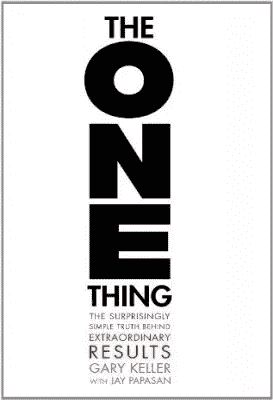
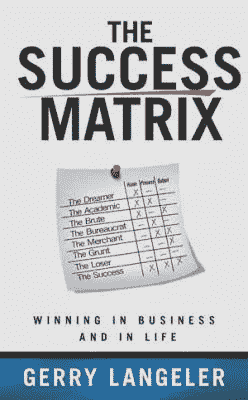
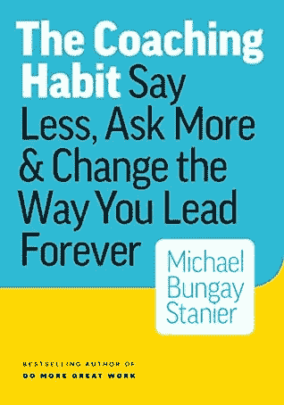
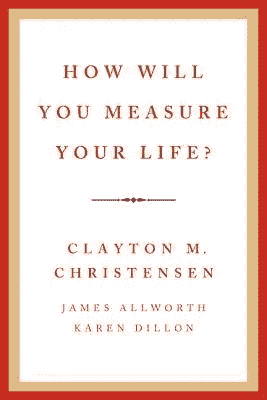

# 技术领导的艺术——考虑管理的技术人员资源指南第 2 部分

> 原文：<https://medium.datadriveninvestor.com/the-art-of-technical-leadership-resource-guide-for-technologists-considering-management-part-2-9f84ac902ae3?source=collection_archive---------30----------------------->

现在是凌晨 5 点。

你刚刚意识到你忘了给手机充电。

这并不能阻止你在昏暗的灯光下伸手去找手机时手机发出的嗡嗡声。你肯定不想吵醒你的另一半。你已经适应了第一次当经理，这对家里的每个人来说都有点压力。

您会注意到工作消息组上的来回聊天。这是由于前端的问题。所以，你松了口气。

“感谢上帝！这不是我的申请”，你小声嘀咕着。

您的职责不仅仅是支持大规模的可靠系统。在推动创新、战略和执行的同时，你还必须管理你的员工并激励他们。更不用说审批时间表的管理任务了。

没错。你还得批准上周的时间表。

如果一切顺利一点就好了。

# 一些背景

如果上面的故事引起了你的共鸣，那么当我写这篇文章的第一部分时，我就想到了你。从那以后，我意识到这些教训超越了技术专家或拥有经理头衔的人。

技术领导不需要正式的头衔、角色或职位。你现在应该知道了。

你可能正在考虑进入管理层的决定。或者，你是第一次做经理，试图找出如何才能成功，同时避免陷阱。

你也可能是一个经验丰富的经理，思考着什么能让你成为一个伟大的技术领导者。更好的是，你是一个对提高技术领导力感兴趣的个人贡献者。

如果这些对你有意义，那么这里就有适合你的东西。

# 回顾全局

自从我第一次尝试技术管理以来，这些想法一直让我受益匪浅。

这是我第一篇[帖子](https://www.linkedin.com/pulse/art-technical-leadership-complete-resource-guide-part-soboyejo/)的后续，继续分解我认为每个技术领导者(新的或经验丰富的)都需要关注的领域。

*   领导力
*   战略和执行
*   产品开发和创新
*   交付管理和保障性
*   组织
*   文化和团队构成
*   资源管理
*   目的和意义

我在第一篇[帖子](https://www.linkedin.com/pulse/art-technical-leadership-complete-resource-guide-part-soboyejo/)中提到了前四点。我将在这里深入探讨最后四个要点。

我将涵盖一些我多年来接触到的伟大资源(书籍)。有这么多可以选择。我很想听到你的反馈。

事实上，如果你一口气读完这篇文章和第一篇文章，我欠你一杯咖啡。如果你在辛辛那提，请在 LinkedIn 上给我打电话。

我们开始吧。

# 论组织

# [一件事](https://www.the1thing.com/) —加里·凯勒

我们决不能把活动和生产力混为一谈。

认为忙碌反映了我们完成了多少工作是很危险的。不需要问轮子上的仓鼠它走了多远。

加里的书对我很有影响，因为这些教训适用于生活的方方面面。他清楚地认识到专注于一件事的必要性。

你知道优先权这个词直到一个世纪前才出现吗？优先权一词没有复数形式，因为它只处理一件事。因此，前 5 个优先事项的概念可能是一个矛盾。

> 在我的一件事情完成之前，其他的事情都是干扰——加里·凯勒

像下面这样的问题引出了这种急需的清晰性:

*   我能做什么来实现我的饮食目标？
*   我能做什么来增加我的净值？
*   为了更好地管理我的员工，我可以做哪些不同的事情？
*   我能做什么来推进这个项目？
*   为了按时交付更高质量的结果，我可以做什么不同的事情？

你能从问题的框架中感受到那种清晰的感觉吗？

你可以把这个聚焦问题重新定义为:*我能做什么事情，这样做的话其他的事情会变得更容易或不必要？*

一个缺乏组织的技术领导者正在把他的城堡建在下沉的沙子上。你需要组织，即使你不得不委派一部分。如果你专注于一件事，你会变得更有条理。

正如我所说的，这是一本超越作品的伟大著作。这也是一本令人愉快的读物。

**其他伟大的阅读**

*   彼得·德鲁克的《自我管理》
*   *前 90 天:行之有效的更快更聪明地达到目标的策略*迈克尔·d·沃特金斯著

# 文化和团队构成

# [成功矩阵](https://www.goodreads.com/book/show/18854800-the-success-matrix) —格里·兰格勒

我在第一篇[帖子](https://www.linkedin.com/pulse/art-technical-leadership-complete-resource-guide-part-soboyejo/)中提到了 OKRs(目标和关键结果)。但你必须让文化正确，才能让它发光。

在*从优秀到卓越:为什么有些公司实现了飞跃……而有些公司没有*中，吉姆·科林斯明确表示，你需要弄清楚谁应该坐在公共汽车上，以及给他们安排合适的座位。

《成功矩阵》(另一本真实的虚构书籍)在这里被打上了标记。

故事从主角为高管面试的最后阶段做准备开始。

他回顾了几本畅销书，但没有找到一本合适的书来帮助准备最后的面试。因此，他求助于一位老导师，这位导师带他浏览了*成功矩阵*。

*成功矩阵*是你可能期望在一个组织中看到的那种人的细分。它很可能也反映了一个组织整体的 DNA。三个关键要素构成了矩阵的核心。

*视觉、过程和输出*。

*愿景* —是一种广泛理解的方向感，包含长期的竞争领导力。在个人层面上，这是一种根深蒂固的信念，即随着时间的推移，你希望你的生活走向何方。

*过程* —这些是不受人员变动影响，重复生产及时高质量产品和服务的结构、方法和程序。在个人层面上，它是独立于暂时的挫折或干扰来实现你的愿景和目标的手段、方法和技术。

*产出* —包括以可预测的规律生产的盈利产品和服务。就个人而言，这是你正在实现人生目标的切实证据。

生成的矩阵和相关角色的映射分解为以下内容:

一个*梦想家*在愿景方面做得很好，但是缺乏一个与愿景相匹配的过程和输出。你知道和你一起工作的那个人有很好的想法，但不知道如何实现它，而且从来没有付诸实践。

一个*蛮*缺少流程。他们产生输出，即使这意味着黑它。但是，该解决方案可能无法扩展。

你想要的成功在三个方面都很出色——视觉、过程和输出。

它有助于通过这个镜头评估你的团队或组织。

你希望所有的成功都在你的团队中。这首先要弄清楚发展的机会在哪里。

当你为你的员工找到合适的位置时，成功矩阵是指导这种发展的一个很好的工具。它也有助于团队中的成员管理团队的组成，并最大限度地发挥协同作用。

**其他伟大的阅读**

*   *克服团队的五大功能障碍*帕特里克·兰西奥尼
*   《强有力的:建立自由和责任的文化》帕蒂·麦考德著
*   戴夫·洛根、哈利·费希尔·赖特和约翰·金的《部落领导:利用自然群体建立繁荣的组织》

# 资源管理

# 教练习惯 —迈克尔·班盖·斯坦尼尔

作为一名经理，你必须珍惜和对待与团队成员相处的有限时间。

对于大多数人来说，这是通过一对一的会议实现的。

这些年来，我观察到，最好的管理者会利用这段时间进行指导。

在本书中，迈克尔充分认识到了在指导过程中提问的重要性。

根据他的说法，一个忙碌的经理只需要七个好问题就能从根本上提升他们的领导力。他接着列出了所有伟大经理都会问员工的七个基本问题。

第一个问题是我发现最有用的。

简单而有效:“你在想什么？”

毫不奇怪，这与脸书在其状态部分使用的提示相同。

你的时间表可能只允许你 30 分钟或更少，你不想花一半时间在闲聊上。关于天气或体育的友好交谈是很好的，但不应该主导 1:1。

如果这段时间是关于你的团队成员的，那就让他们参与进来。

一对一地关注状态更新通常也是危险的。这只是其中的一小部分，但不要把它看得太重。它需要削减更深，以利用这作为一个教练的时间。

你正试图建立一个伟大的团队，你需要对事情的进展有所了解，并提供重要的双向反馈

谷歌进行了一项研究，探索[是什么让一个经理变得伟大](https://www.inc.com/the-muse/signs-great-leader-manager-google-research-study.html)，成为一名好教练是第一位的。

此外，如果你发现你在常规的 1:1 中做了大部分的谈话，你就没有做好辅导工作。没有什么比使用有效的问题来引导你的团队自己解决问题更好的了。

注意，这不是书上说的，但是我曾经有过这样的时刻，当一些事情发生的时候，我的 30 分钟缩短到了 10 分钟。我没有跳过整个时间，而是问了一个不同的问题。

我发现，给一个人时间，最有效的问题是:“你的世界中有什么挑战需要立即关注？”。

聪明人会问问题，因为这是他们学习的方式。一个伟大的教练都离不开这个，更别说一个经理了。

**其他伟大的作品**

肯尼斯·h·布兰查德和斯宾塞·约翰逊的《一分钟经理》

罗伯特·萨顿的《好老板，坏老板:如何成为最好的……并从最坏的中吸取教训》

# 目的和意义

# 你将如何衡量你的生活？——克莱顿·M·克里斯坦森、詹姆斯·奥尔沃斯和凯伦·狄龙

一个朋友曾经告诉我，在成长的过程中，他从来不能肯定地说他的父亲在做什么。然而，他显然能够知道他的父亲有一个好老板还是一个坏老板。

尽管你可能会选择逃避，但生活会影响工作，反之亦然。

如果工作有如此大的影响力，那么生活就必须有意义和目标——无论是在工作中还是工作之外。

丹·平克在他题为[动机之谜](https://www.ted.com/talks/dan_pink_on_motivation?language=en)的 TED 演讲中，强调了*目的*是创造高绩效环境的三个要素之一。另外两个是*自主*和*精通*。

> 目的:渴望做我们所做的事，为比我们自己更伟大的事情服务——丹·平克

如果你自己都没有把握，你就无法帮助你的团队有意义、有目的地工作。

那么，你如何发现工作和未来的意义和目标呢？

一个流行的答案是追随你的激情。对少数人来说这可能是真的，但对大多数人来说，这个答案是错误的。我计划在以后的文章中解释原因。

更合理的路径需要两个关键因素。清楚地了解自己擅长什么，并与“什么”背后的“为什么”保持联系。西蒙·西内克在他著名的 TED 演讲中提到了后者。

在个人层面上，你擅长的事情可以推动你做一些有影响力的事情。这是发现个人意义和目标的沃土。

你也可以将此应用到你的团队中。你还想帮助他们理解你的组织或产品背后的“为什么”。

克莱·克里斯滕森在本书中进一步阐述了这些观点。他通过描绘一些帮助特定公司成功的原则来做到这一点。然后，他将这些课程映射到个人应用中。所有这些都是为了让你评估你将如何衡量你的生活。

他推荐了寻找目标和意义的三个步骤:

*相似性*——包括弄清楚你希望自己成为什么样的人、团队或组织

承诺:分配时间、工具和资源，坚定地承诺成为你想成为的人

*指标*——有清晰的方法来衡量你的进步

雷伊·达里奥说了很多关于追求有意义的工作和有意义的关系的话。这是它的核心。

作为一名技术领导者，你需要帮助你的团队解决这个问题，但这必须从你开始。

**其他伟大的阅读**

雷伊·达里奥的《原则:生活与工作》

斯科特·亚当斯的《如何在几乎所有事情上都失败的情况下仍然大获全胜》

好到他们无法忽视你

# 舍入

我没有把所有这些书都写好，所以你可能得自己读一些。我也不同意各自作者表达的每一个观点。这些书无疑包含了一些你可以从中受益的金块。

希望你在这里找到了至少一件有用的东西，帮助你成长为一名技术领导者。

如果你有，请分享、点赞并发微博。请分享您作为技术领导者取得成功的关键。此外，对你在旅途中发现有价值的书籍或资源发表评论。