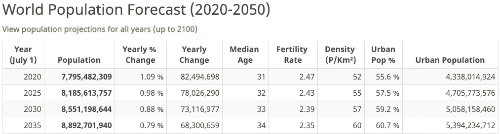

# 人工智能 80 亿数据集生态系统

> 原文：<https://medium.datadriveninvestor.com/the-artificial-intelligence-8-billion-dataset-ecosystem-c6fca346612e?source=collection_archive---------21----------------------->

from [http://www.worldometers.info/world-population/](http://www.worldometers.info/world-population/)

大约 5 年后，也就是 2024 年，世界人口预计将达到 80 亿左右。现在，这 80 亿人中并不是所有人都将使用支持自然语言处理(NLP)的服务，但这是开始评估支持对话式自然语言理解支持系统的假设性单层生态系统模型的潜在影响和价值的良好基础。

我知道，有很多话要说。让我们深入了解一下这一切可能意味着什么。

为什么是 2024 年，为什么要进行这样的分析？

问得好。

**首先，为什么要进行这样的分析？**在人工智能(AI)、建筑机械和用于解决问题的深度学习(ML & DL)神经网络等学科中，有一个被称为泛化的硬约束。神经网络被设计成从一组训练数据中学习。训练数据代表了神经网络在输入新数据时应该识别的模式。通常，该训练数据受限于特定的问题或目标。根据深层学习神经网络的复杂性，你可以按照上面提到的模式，认为问题或目标或多或少已经定义好了。模式就是背景。

问题是生活并不是那么明确。我们的大脑能够理解一系列更广泛的同时发生的事件，然后或多或少地确定哪些同时发生的事件需要上升到关注和行动的水平。人工智能模型有一个问题，一种需要解决的模式，而且它不关心自身问题所涉及的外部世界，这就是“泛化问题”。神经网络不能一概而论。它们解决了定义明确、受到约束而且有效的模式匹配问题。

在人工智能领域，有处理器挑战、数据挑战、趋势挑战和语言挑战。**本次调查聚焦于语言挑战。**在人工智能语言生成空间中，有许多子领域，如自然语言理解(NLU)、自然语言处理(NLP)和自然语言生成(NLG)。问题在于，当我们说话时，我们的大脑包含一组支持思维的并发进程。在某个时刻，这些过程的关键可能会集中在一项独特的任务上，比如选择下一首听哪首歌。接下来是选择我们登陆的歌曲的动作。这一行动可能采取的形式是查莉 XCX 特洛耶·希文于 1999 年创作的《Alexa，play》[。然后你的思绪可能会回到另一个线索，也许是那个特别的人和昨晚。](https://youtu.be/6-v1b9waHWY)

关键是，我们永远活跃的头脑不仅仅局限于命令驱动的发音，这是 NLP 解决方案设计的类型。

在本文的其余部分，我将使用 Alexa 作为例子，因为我们大多数人都知道它。然而，问题并不局限于 Alexa。这个问题在人工智能自然语言理解领域普遍存在，想想聊天机器人和提供商，如 CaptialOne、[humping Face](https://huggingface.co/)等，这就是底层生态系统解决方案可能有价值的原因。

**用户体验差距**就在这里。一旦我们开始与 Alexa 这样的人或物交谈，我们的大脑就会参与进来，我们开始成为我们自己，一个持续的思想和表达实体。因此，在我们说“Alexa，查莉 XCX 演奏的 1999”之后，我们与 Alexa 的对话可能是这样的，“Alexa，你对昨晚发生的事情有什么看法？”Alexa 完全不知道它刚刚听到的第二个字符串(句子)来自它的命令驱动训练。Alexa 会如何应对？这是 NLP 用户，你和我，几乎每天都或多或少地在计算机生成的对话系统中遇到的问题。

当新的和不寻常的句子被发送到像 Alexa 这样的 NLP 系统时，他们只是不知道如何响应。网上到处都是 Alexa 傻傻的回应例子。然而，Alexa 正在学习这些新句子。对于 Alexa 不知道如何回应的每一组新的会话字符串，Alexa 都会学到一些东西，或者存储数据以供分析，以便下次发出这样或那样的句子时，Alexa 可以用某种有意义的东西来回应。同样，问题是 Alexa 正在以牺牲客户体验为代价进行学习。这是一件大事。

对于 Alexa 来说，这个问题比你想象的要糟糕得多。为什么？因为在其当前的实现中，Alexa 将总是被约束于其消费者发布的会话字符串，世界和可能的人类发音的非常小的子集，因此可能学习会话字符串。这意味着 Alexa 在其当前的实现中，或多或少会在遥远的未来学到很多东西(Alexa 的提供商有数据来确定这个用户体验问题有多广泛)。今天这个潜在问题有多大？有:

> [“…超过 1 亿台装有 Alexa 的设备…”](https://www.businessinsider.com/amazon-reveals-alexa-sales-2019-1)
> 
> 亚马逊最终透露了 Alexa 设备的销量

因此，如果今天发给 Alexa 的命令中只有 1/100 流入了 Alexa 不理解的一些对话，就像上面的“Alexa，你对昨晚发生的事情有什么看法？”不管这 1 亿台设备的使用率如何，对 Alexa 来说，这仍然是 100 万个不太好的客户体验。我的猜测是，随着客户群的增长，Alexa 团队会想尽一切办法来降低不太好的体验比率——这种情况碰巧存在，因为 Alexa 的底层功能受到限制。Alexa 的训练受限于它所拥有的，它所知道的，而不是它不知道的——泛化问题。

“**的答案为什么要经过这个分析？”**调查与 NLP 系统的对话超过 NLP 训练数据时可能改善的客户体验，评估提供改善的客户体验结果的可能生态系统选项。

**为什么是 2024 年？**因为如果一个实体今天就开始启用推广生态系统基础设施，一个旨在跨越和支持 NLP、NLG、NLU 提供商的基础设施，将需要第一年来获得一个初始客户并构建一个基线最低可行产品(MVP)。到第二年年底，假设的实体应该已经建立了一个可扩展的服务模型，并开始扩大其客户群。到第三年到第五年，假设的实体将被期望执行其章程，这是一个广泛的基于生态系统的自然语言理解解决方案，用于那些超出单个提供商训练集的对话。因此，到 2024 年，我们预计会有一个合理的客户群来充实生态系统模型的章程。

2024 年可能会有多少对话？这个实体的规模会有多大，是整个潜在 NLP 市场的一部分？

让我们对 NLP 客户进行一些评估，这些客户的体验将通过一般化解决方案得到改善。根据上面的图表，如果预计 2024 年将有大约 80 亿人，其中大约 45 亿人在城市地区。假设到 2024 年，大多数城市人口将有机会在他们一天中的某个时间使用 NLP 界面。为了便于讨论，我们假设全球 35 亿农村人口中有一半也在一天中的某个时候与 NLP 支持的解决方案进行交互。也就是说，将会有一部分农村人口无法获得现代技术。在这个模型中，可以说是开放的，到 2024 年，我们每天的 NLP 客户总数可能会达到 62.5 亿左右。

与基于 NLP 的系统交互的 62.5 亿人中的大多数将发出“命令”并在没有任何误解的情况下获得他们的结果。然而，有一个子集将落入我们上面的场景。这 62.5 亿人口中有多少人会遵循上述场景，开始与基于 NLP 的服务进行通信，并在通信交换的另一端说出或键入 NLP 系统的训练上下文之外的内容？

让我们看看是否可以粗略地得出一个每天的使用模型，以便确定对提供“一般化”服务的服务的需求的一些想法。我们将从一天开始，因为需求，每天的人数，很容易乘以 360，加上一些蒙混因素，得到一个每年的数字。

在与 NLP 系统交互的这 62.5 亿人中，将有一个子集具有 Alexa 类型的语音和聊天机器人类型的对话服务。为了保守起见，我们假设只有 10%的 NLG 回复是 Alexa 和聊天机器人类型的，或者有 6.26 亿人使用 Alexa 类型的语音系统或聊天机器人，我们假设只是建立一个基线，其中 1/100 的交互超过了人工智能训练(导致不太理想的客户体验)。人们喜欢和世界上的“Alexas”玩游戏，喜欢谈论只有他们知道上下文的事情。基于人类的行为模式，真正的移民比例超过 1%似乎是合理的。时间和数据将决定真正的数字。目前，1%将我们的生态系统支持模型缩减为一天内 625 万人的可寻址市场。

如果每个顾客在一天中只与 Alexas of the world 和聊天机器人进行一次对话。实际上，上面会使用一些乘数来表示一天中客户参与的平均数量。例如，Alexa 可能在早上有三个客户约定/命令，在下午和晚上有四个，总共有 7 次 Alexa 交互，加上一次与银行的聊天机器人对话，可能还有一次与他们提供的互联网或电力提供商的对话...到 2024 年，我们每天都会接触到许多 NLP 支持的体验。关键是，上述 625 万的 NLP 交互量不足以代表 2024 年一天内 NLP 会话支持服务的总潜在市场。

因此，我们需要一个乘数来表示一天内超过系统训练数据的一些总的假设 NLP 体验。我们已经确定，一天中与 NLP 系统的交互可能不止一次。为了时间的简洁，让我们选择 2 作为乘数作为起点，因为我们知道，由于一天中 NLP 交互的平均数量，它大于 1。随着数据和时间的推移，这个数字会变得更加精确。记住，这只适用于使用 NLP 系统的 1/100 的 NLP 用户，他们的反应超过了 NLP 训练。因此，作为一个基线，在 2024 年，估计每天有 625 万次 2，或**1250 万次 NLP 客户体验可能不太好**，因为交换的人类部分将超过 NLP 系统的训练数据。

为什么有人愿意投资提供基于生态系统的泛化解决方案服务来满足这 1250 万潜在客户的需求呢？让我们**跟随假设的 2024 年的钱**。

我们假设的服务收入模型，每天，可能看起来像这样(比如，从 Alexa 或 chatbot 服务获得上下文帮助的每个请求三便士):

每天的收入(03 x 12.5 米)= 375，000 美元

或者每年 136，875，000 美元

这只是为提供生态系统解决方案建立一个可能的收入流，以询问“NLP 生态系统推广解决方案看起来合理吗？”

对于 1 亿多台 Alexa 设备，假设每天只有 1/100 的客户交互超过了 Alexa 训练集或 100 万次不太好的客户体验，假设所有这些 Alexa 设备都在一天的某个时间点被使用。在这些情况下，如果 Alexa 服务有一个可以访问的 API，该 API 将为对话提供改进的上下文值，然后可以提供改进的响应，那么 Alexa 服务将花费 3 美分来提供改进的客户体验，然后将该响应添加到其库中。对于 Alexa 团队来说，一个 3 美分可重复使用的解决方案听起来是一项不错的投资。别担心，还有很多其他意想不到的人类话语不在 Alexa 的图书馆里。这就是这个模型的奇妙之处，人类的思维过程不断产生新的表达方式。

考虑最后一个想法。随着我们沿着这条人工智能道路前进，人工智能架构不断改进，处理能力日益强大(见证量子位处理)，神经科学进步，以及基于人工智能的服务和解决方案的商业消费不断增加，人们似乎一致认为，在遥远的未来，这些趋势不可避免地会走向人工通用智能，或 AGI。如果你同意这些趋势，同意某种类型的 AGI 必然性，那么由此产生的 AGI 将继续增长，成为一个人工超级智能或 ASI。**要考虑的想法是**随着当前趋势从人工智能向 AGI 发展，一条以人为中心的道路，其中人工智能解决方案集成了人类组件，就像这里概述的一般化解决方案，比完全取代人类更可取。

️ 2019 Malcolm Dickson，保留所有权利

最初发表于[数据驱动投资者。](https://www.datadriveninvestor.com/2019/02/04/the-artificial-intelligence-8-billion-dataset-ecosystem/)

## 来自 DDI 的相关故事:

 [## 为什么数据会改变投资管理

### 有人称之为“新石油”虽然它与黑金没有什么相似之处，但它的不断商品化…

medium.com](https://medium.com/datadriveninvestor/why-data-will-transform-investment-management-4a60966c1c81)  [## 数据科学和软件工程哪个更有前途？

### 大约一个月前，当我坐在咖啡馆里为一个客户开发网站时，我发现了这个女人…

medium.com](https://medium.com/datadriveninvestor/which-is-more-promising-data-science-or-software-engineering-7e425e9ec4f4)