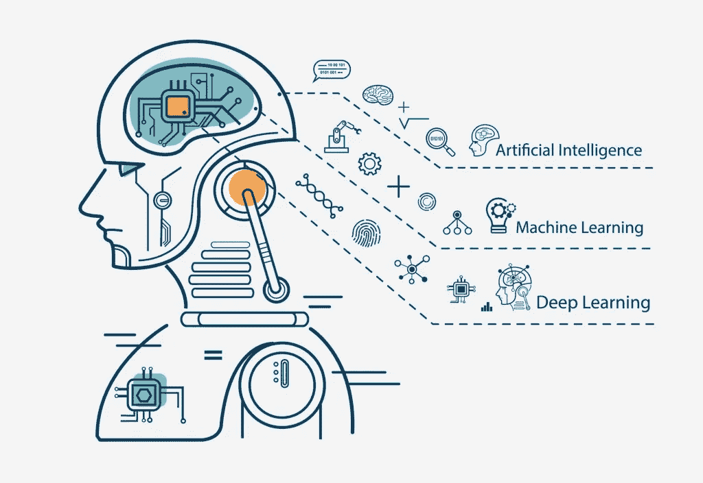

# 人造雨伞

> 原文：<https://medium.datadriveninvestor.com/the-artificial-umbrella-e9c5b6ff1738?source=collection_archive---------3----------------------->

现在，科技行业正在呈指数级增长，每个人都在谈论诸如**机器学习**、**深度学习**、**人工智能**和什么东西**算法**这样的术语。

但是它们是什么意思呢？如果有关系的话，它们之间有什么关系？为什么有那么多人在谈论他们？！我明白了，你想参与这个*疯狂的人工智能秘密*，我也是！

## 人工智能

让我们从基础开始，一起复习一下。什么是*人工智能*，或者说 *AI* ？

简而言之，人工智能本质上是试图让计算机和机器变得智能的计算机科学领域。但这意味着什么呢？好吧，想象一下一台电脑拥有和人类一样的认知(或思考)能力！是啊！一台电脑能做你我能做的事情，甚至更多。

关于计算机的事情是，它们实际上比我们聪明得多，比 T21 聪明得多。我们经历一生，经历我们所做的每个决定的一个结果。难道你不希望我们能经历所有潜在的结果吗？计算机之所以能够做到这一点，是因为它们能够一遍又一遍地播放各种场景，并决定最佳的行动计划。

 [## 挑战你对人工智能和社会看法的 4 本书|数据驱动的投资者

### 深度学习、像人类一样思考的机器人、人工智能、神经网络——这些技术引发了…

www.datadriveninvestor.com](https://www.datadriveninvestor.com/2019/02/28/4-books-on-ai/) 

你可以参考我的[另一篇关于人工智能基础的文章](https://medium.com/@mirabhattacharya/a-i-see-you-a-quick-intro-to-ai-1907031c39d7)来了解更多关于 AI 到底有多深。

Doesn’t make sense yet? We’re going to cover the difference in this article.

## 算法

在谈论 AI 的时候，*算法*这个词经常出现。*Algor——什么*？这不是我们六年级时用来快速解决魔方的词吗？嗯，*差不多*。

一个**算法基本上只是一个模式，或者一套规则**，在解决问题的过程中遵循，尤其是计算机。一个基本的例子是用于*除法的算法。*

但是，当涉及到 AI 时，**算法**是什么？因为我们现在知道算法告诉计算机什么时候做什么，当连接在一起时，算法变得更强大。一个**算法简单地陈述了指令**，通过这些指令做出决定，其中 **AI 使用经过训练的数据做出决定**。人工智能围绕着算法的使用。

## 机器学习

现在这一切和机器学习(ML)有什么关系呢？*机器甚至可以学习吗？答案是**是的**。ML 是人工智能的一个*应用*。它允许系统根据经验学习和改进，而不需要被编程去做什么。*

*人工智能只是 ML 所属的**更广泛的保护伞**，它帮助机器以我们认为“智能”的方式做事。*

*对于医学诊断和图像处理来说，ML 有巨大的应用。*

## *深度学习*

*现在让我们继续深入学习… *那是什么*？深度学习(DL)真的只是机器学习的**子集，是人工智能**的**子集。如果你看不出来的话，这一切都是嵌套的。它能够从**未标记**和**非结构化**的数据中**无监督地学习**。***

*它让我们训练人工智能在给定一组输入的情况下预测输出。它使用多层*从任何*原始输入*中逐步提取更多信息*和模式。例如，这可以用于图像处理，其中较低层识别边缘(基本)，而较高层识别对人类实际有用的更有意义的数据，例如数字、字母或人脸。*

## *我们学到了什么？*

*在整篇文章中，我们收集了一些关于什么是人工智能的基本信息，以及所有这些词语的真正含义。让我们来看看我们的**关键要点**:*

*   *人工智能就是让计算机*变聪明的过程。**
*   *算法是用来解决一个*问题*的*过程*。*
*   *机器学习是人工智能的一个子集，它允许计算机*自主学习**
*   *深度学习是机器学习下的一个子集，它允许计算机在*层*中从*未标记*和*非结构化*的数据中*学习更多*。*