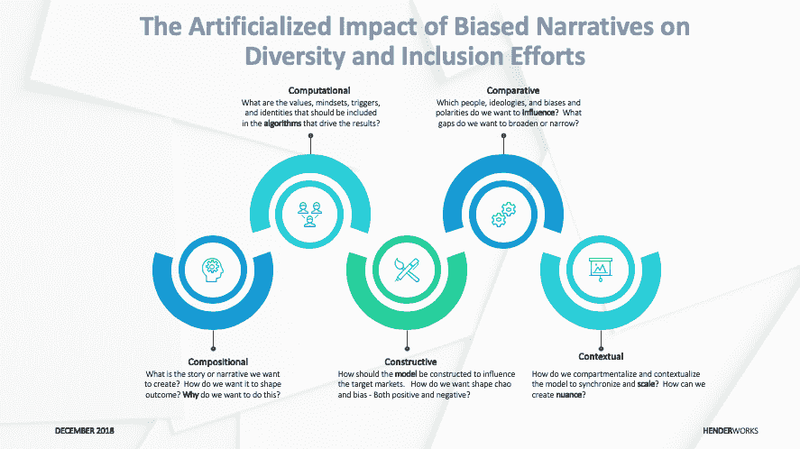

# 偏见叙事对多样性和包容性努力的人为影响

> 原文：<https://medium.datadriveninvestor.com/the-artificialized-impact-of-biased-narratives-on-diversity-and-inclusion-efforts-5421ae00e487?source=collection_archive---------19----------------------->

保守的右翼煽动者正在利用各种平台和工具，利用数据经纪人提供的第三方数据，针对人口和群体进行高度结构化的说服。

数据经纪人是从广泛的来源收集和汇总消费者信息以创建个人和个人群体的详细资料的公司。然后，这些公司将你的个人信息出售或分享给其他人。该图概述了信息收集、分析和货币化的五种方式。

*   你想创作的故事或叙事是什么？你想如何塑造结果？为什么要这么做？
*   **计算** —驱动结果或预期结果的算法中应该包含哪些价值观、心态、触发因素和身份？
*   **建设性** —构建什么样的模式来影响目标细分市场？你想如何塑造这些群体中的情绪、混乱和偏见——积极的和消极的？
*   你想影响哪些人、意识形态、偏见和极性？优先考虑？你想缩小或扩大哪些思想差距？
*   **上下文** —您如何划分模型并使其上下文化，以实现同步和扩展？你如何建立细微的差别——微妙的区别？

追踪社交媒体模式的数据和算法跨越众多人口统计和心理表征是关键。多样性很重要。情绪模式和反应很有见地。

所收集的数据正被用于为各种目的开发关于个人和团体的信息。迄今为止，最常见的用途是有针对性的营销活动。然而，它被用来放大情绪，强化根深蒂固的偏见，并错误地将观点引向期望的结果。心理统计学和人口统计学数据聚合正朝着这些目标细分。

心理测量学被定义为使用人口统计学来确定特定人群的态度和品味，如在市场营销研究中。“心理细分”的使用越来越多。这个过程包括根据消费者不同的个性特征、价值观、态度、兴趣和生活方式，将你的目标市场(样本)划分为不同的细分市场。它在其他多样性方面(种族、性别、残疾、性取向等)区分样本。).这种级别的细分允许数据收集者以非常集中的方式从事非常有针对性的产品、服务或政治设计说服策略。

心理统计学有点像人口统计学。心理信息可能包括多样性的更多次要维度，如习惯、爱好、消费习惯和价值观。人口统计学解释了你的目标“是谁”(如多元化的主要方面)，心理统计学提供了更多关于他们围绕购买、参与和宣传的决策方式的信息。

> ***刺探:对个人私事的更为密切的询问***

有助于根据心理特征划分一般人群的一些因素包括但不限于以下内容:

**1。生活方式:**习惯、态度、品味、道德标准、经济水平等。，共同构成了个人或群体的生活方式。基于这样的属性可以做出某些推论。例如，一个农村人的生活方式可能与一个城市人非常不同。许多产品基于这些差异进行推广，并允许研究进一步细分目标市场。

**2。活动、兴趣、观点:**人有不同的活动和兴趣。这些兴趣和活动很大程度上反映了个人的偏好和动机。

**3。价值观、态度和教养:**我们每个人都携带着一种自出生以来就固有的文化价值观，因为我们在哪里出生和长大。我们的成长造就了我们的生活方式。因此，每个人都有不同的价值观、态度和生活方式。

**4。社会阶层:社会中具有共同经济、文化或政治地位的广泛群体。不同的人属于不同的社会阶层。在很大程度上，这些阶层是基于收入和与这些阶层相关的消费习惯。人们会通过购买来维持或提升他们的社会阶层。许多人会联想到作为特定社会阶层的一部分而建立声誉的产品、服务和组织。换句话说，他们有身份意识。**

**5。个性:**一个个体的身体、精神、情感和社会特征的总和。这取决于生活方式和社会阶层。一个人可能有丰富的个性，只有当他或她有很高的购买力以及对服装的品味来维持这样的生活方式。于是，“品牌”个性的概念就产生了。原因是不同的品牌针对不同的个性。

> ***解析:分解成部分，分析***

结合了人口统计学信息的心理学可以用来影响和说服消费者和市民。使用算法、人口统计学和心理学信息，可以通过多种方式对受众进行细分。

随着这些系统、过程、工具和实践变得越来越复杂，它们可以用于各种目的。一些主要方式包括:

**1。数据挖掘:**从各种来源(脸书、Instagram、Twitter、LinkedIn 等)收集信息。)并将它们组装成目标片段。这种分段发生的一些常见方式如下:

a.产品特征(他们购买的产品)

b.人口统计学和生物统计学数据(他们是谁)

c.地理数据(他们居住的地方)

d.心理(他们的行为方式)——生活方式/目的

e.行为(他们购买的原因)

**2。聚类:**使用一种算法，关于单个数据的信息按照相似程度排列。信息可以进一步分成统计上更相似或不同的子组。这种聚类可以允许更精确的专注于营销、个人偏好或设计的构思。

> ***突然的:使(一个事件或情况，通常是坏的或不受欢迎的)突然地、出乎意料地或过早地发生***

**1。预测和设计结果**:通过识别具有这种详细程度的市场成员，营销和设计团队更有可能对如何预测和设计客户体验有一个更清晰的方向。

**2。样本大小/输入量:**当查看大量变量的模式时，子分组算法将量作为确定分组是否有价值的手段。这为营销或干预创造了关键机会。

**3。跨行业相关性:**这些目标定位方法与许多组织和行业相关。这种细分中使用的这些类型的变量(产品特征、人口统计和生物统计、地理、心理和行为)在许多其他业务领域中是常见的。因此，可以容易地调整该过程。

**4。主题专业知识和技术专业知识:**子群发现算法的应用需要了解业务环境的人的帮助。他们对目标变量的选择有助于集中分析。这与领域专家(脸书、推特、Instagram 等)的参与相结合。)对成功至关重要。

**5。竞争优势的关键杠杆:**强大的数据分析使组织能够更高效地响应市场/客户请求，并获得竞争优势。预测结果和反应变得更加可预测。

> ***确定优先次序:根据期望的最终结果瞄准高影响力社区(促进或阻止多样性、公平和包容性的成功)***

包容性煽动者必须超越传统的多样性维度，开始以严肃和开放的方式分析他们的数据。机会在于获得市场、客户和公民的多维视角，以便设计一种更容易有的放矢的包容性营销方法，提供更个性化的体验。“随着组织在这个选择的时代变得越来越成熟，数据和包容性思维是组织赢得其选民的心和思想的关键原则。”

包容煽动者和变革推动者必须明白，这些系统可以被用来“扭曲”或改变 DEI 的努力，偏离其最初的路线、意图或目的。这些变态者正以越来越浮夸和教条的方式放大他们对 DEI 努力的关注。

> 我们的工作进入了一个新的“支点”。保持消息灵通。

我一直在研究人工智能和机器学习在许多情况下对多样性、公平和包容性的影响。我把这种情况称为“[#反常](https://www.linkedin.com/feed/topic/?keywords=%23perversity)”

由计算宣传项目制作的题为“IRA(俄罗斯互联网研究机构)和美国的政治极化”的报告提供了社交媒体公司与参议院情报特别委员会共享的对这一攻击的首次主要分析。看这里:【https://lnkd.in/g5_P7Hi】T4

《华盛顿邮报》最近刊登了一篇关于这一努力的报道:[https://lnkd.in/g-WmVRc](https://lnkd.in/g-WmVRc)

## 汉德工程咨询公司总裁兼首席执行官。