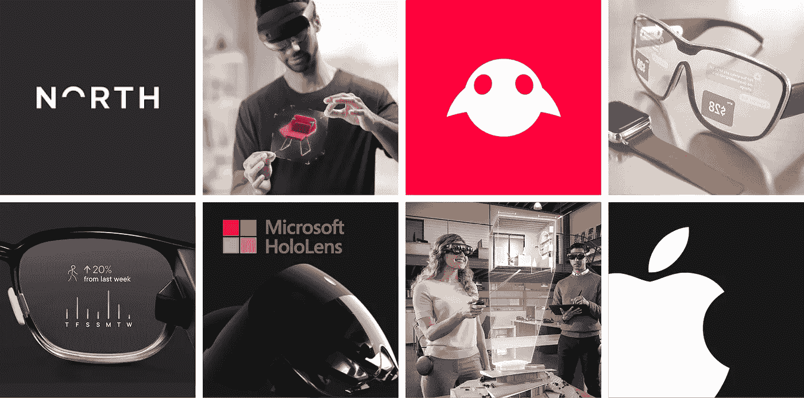

# 增强现实竞赛和增强现实的未来

> 原文：<https://medium.datadriveninvestor.com/the-augmented-reality-headset-race-and-what-it-all-means-661a534bfeb5?source=collection_archive---------7----------------------->

## 为什么科技公司正在开发增强现实耳机

如果在你看来，科技公司正在竞相创造增强现实(AR)/混合现实(MR)耳机，你没有错。最近,[报道称,](https://www.theinformation.com/articles/apple-eyes-2022-release-for-ar-headset-2023-for-glasses?utm_medium=email&utm_source=cio)苹果预计 2022 年发布增强现实耳机，2023 年发布眼镜。根据一次内部会议泄露的信息，苹果副总裁 Mike Rockwell 分享了关于 AR 苹果耳机和 AR [苹果眼镜](https://www.tomsguide.com/news/apple-glasses)的设计和功能的细节。与此同时，[The Verge 报道称](https://www.theverge.com/2019/10/22/20926528/samsung-augmented-reality-headset-patent-application)三星已经申请了一项 AR 耳机专利。这只是两个例子。[正如美国消费者新闻与商业频道报道的](https://www.cnbc.com/2019/11/11/smart-glasses-that-replace-phones-may-be-the-next-hottest-tech-trend.html):

> 大型科技公司中的大多数大牌都在竞相创造我们随处佩戴的智能眼镜，这种眼镜可能会取代我们的手机。微软、亚马逊、谷歌、Snap、脸书苹果、Magic Leap 和其他公司都在开发某种形式的智能眼镜或耳机，这将改变我们对周围世界的看法。我们不再需要从口袋里掏出手机来与人交谈或与应用程序交互，而是可以简单地通过对着一副眼镜说话和看东西来做这些事情。

有一场比赛，谁能第一个做出一副人人都会戴的眼镜，这意味着它们必须足够时尚和圆滑，无论你去哪里都可以整天戴着。这项技术的支持者希望有一天你能用一副智能眼镜取代生活中的屏幕。

 [## 人工智能和虚拟现实的融合-你能期待什么|数据驱动的投资者

### 在技术领域，融合是合乎逻辑的一步。就在几十年前，你可能需要一个专门的…

www.datadriveninvestor.com](https://www.datadriveninvestor.com/2018/08/30/the-convergence-of-ai-rv-what-you-can-expect/) 

美国消费者新闻与商业频道的故事描绘了一幅令人想起黑镜和钢铁侠的美好画面，尽管还有许多技术障碍需要解决，比如电池耗尽。尽管如此，市场上已经有比你想象的更多的 AR 和混合现实耳机，[正如 Tom's Guide 的概述所示](https://www.tomsguide.com/reference/ar-glasses)。

问题是:为什么技术创新者要在 AR 和 MR 耳机上下赌注？毕竟，尽管 eMarketer 表示增强现实的使用正在增长，但 eMarketer 也表示，最多只有 21%的人每月至少使用一次增强现实。“每月至少一次”可能包括那些只是顺便玩玩 Snapchat 增强现实功能的人，或者可能在商店中使用应用程序来配置产品，而几周内不会再次使用增强现实。

## 增强现实和采用

事实是，增强现实仍处于萌芽状态。为了让增强现实站稳脚跟，像 iPhone 一样真正突破进入主流，需要做很多事情，其中包括:

●科技公司需要创造消费者买得起并能持续使用的硬件(想想电池寿命)。

●设计师需要为硬件建立一个优雅的用户界面(这个问题一直困扰着虚拟现实耳机)。

●企业需要创造引人注目的内容，让人们反复使用，而不是一次性完成(考虑实用性，而不仅仅是娱乐)。

但问题就在这里:硬件创新者不能等待所有的部分都到位。苹果并没有通过等待消费者告诉他们设计什么而成为世界上最有价值的品牌之一。苹果打了一些精心策划的赌，认为我们日益增长的移动社会将容纳一部设计优雅的智能手机，或者越来越注重健身的消费者将真正购买一部戴在手腕上监测健康的智能设备。因此，苹果推出了 iPhone 和 Apple Watch，尽管消费者并不需要这些产品。

现在，技术创新者正在创造一种设备，等待解决问题或改善用户生活的方法。这没关系。市场和时代精神/趋势也需要保持一致，以实现正确的文化契合。创造一款满足正确的用户、内容和市场需求的耳机确实需要时间——据报道，苹果公司正在考虑在 2022 年发布耳机。从现在到 2022 年，很多事情都有可能发生。最大的问题是:除了游戏和零售体验，我们还会看到多少增强现实内容？未来两年至关重要。

增强现实扎根所需的所有力量仍在凝聚。当需求增加时，没有一家技术公司愿意落在后面。这就是谷歌推出谷歌眼镜的原因——事实证明，在增强现实内容供应充足以证明任何人都有理由购买一副眼镜之前，谷歌太超前了。苹果在 Apple Watch 上也有点领先——最初，许多苹果观察人士只是将这款设备视为另一款可穿戴设备，并不了解苹果在不断增长的健康市场上的表现，但这也是苹果的一项战略，在该产品上市后，该战略得到了迭代和发展。

增强现实耳机创新者正在经历我称之为创新曲线的版本。当有一个明显的消费者问题需要解决时，创新曲线是相当直接的，当采用率与时间相比时，创新曲线介于线性和指数之间(想想曲棍球棒模型)。吸收的道路是陡峭的，创新者需要快速行动以满足需求，否则就会输给更快的竞争对手。与 AR 耳机的情况一样，消费者需求不太明显，斜率更平缓，等待拐点出现陡峭甚至指数增长。创新者需要忍受更长的旅程，采用将会更慢，但随着消费者需求开始加速和[产品-时代精神契合度](https://a16z.com/2019/12/09/product-zeitgeist-fit/)被唤醒，那些能够开发产品的公司会获得回报。

在以后的文章中，我会更详细地讨论创新曲线。这个概念跨越了 AR 以外的想法和技术，我很高兴能够讨论它。敬请期待！