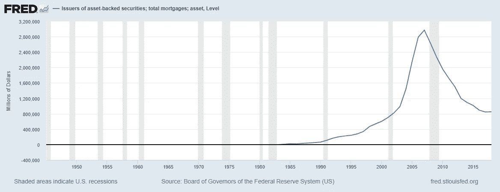
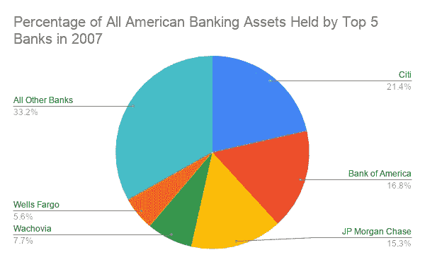
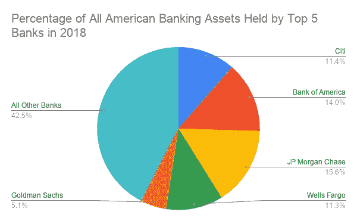
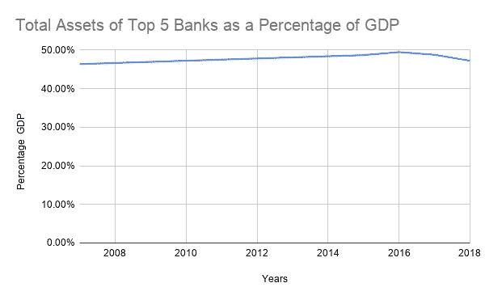
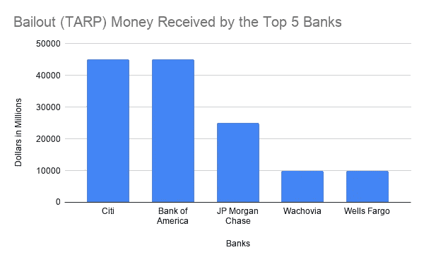
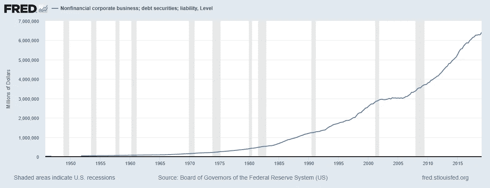
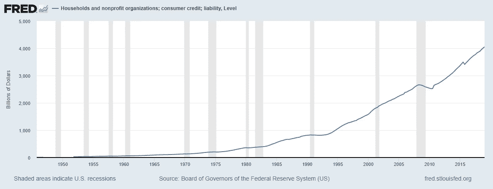
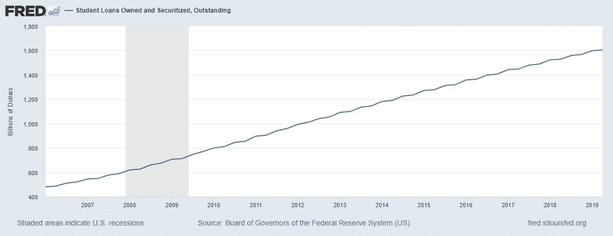

# 银行系统需要彻底改革

> 原文：<https://medium.datadriveninvestor.com/the-banking-system-needs-an-overhaul-ba94ef8c3350?source=collection_archive---------5----------------------->

如今的银行体系比金融危机开始时更稳定了吗？号码

这一提议不仅修复了银行系统，还让银行业比以往任何时候都要好。

Photo by [Etienne Martin](https://unsplash.com/@etiennemartin?utm_source=medium&utm_medium=referral) on [Unsplash](https://unsplash.com?utm_source=medium&utm_medium=referral)

20 世纪 80 年代初，当我还在上高中的时候，我几乎每天都阅读《T2 华尔街日报》。我有一堆*巴伦的*期。我最老的一期《巴伦周刊》有一幅牛市突破道指 1200 点的插图。是的，你没看错。当道琼斯指数突破 1200 点时，这是一件大事。不久前，道琼斯指数在一天内上涨了 38 点，标志着大牛市的开始。

 [## 为什么包容性财富指数比 GDP 更能衡量社会进步？|数据驱动…

### 你不需要成为一个经济奇才或金融大师就能知道 GDP 的定义。即使你从未拿过 ECON 奖…

www.datadriveninvestor.com](https://www.datadriveninvestor.com/2019/03/08/why-inclusive-wealth-index-is-a-better-measure-of-societal-progress-than-gdp/) 

早些年，在阅读巴伦的作品时，我特别想起了金妮·梅和莎莉·梅的广告。我确信房利美和房地美也在那里。我很难理解这些证券是什么。我知道他们是债务池中的利益。我不明白怎么能给这笔债务估价。资金池中持有的债务的原始债务人的信誉会有所不同。众多债务人之间的多元化能降低这种风险吗？我觉得很傻，因为我不明白为什么有人会买这些。对我来说，谈到投资，有太多唾手可得的果子要处理。为什么要弄那些东西？我有朋友在大学毕业后通过抵押贷款支持证券赚了很多钱。

# 我们面临着金融体系再次崩溃的风险吗？是的。

在从事法律工作的同时，我开始强烈怀疑消费者信用报告机构的准确性。我也对像邓白氏这样的商业信用机构持怀疑态度。我对标准普尔(Standard & Poor's)和穆迪(Moody's)等债券机构感到疑惑，但在我的破产实践中，我没有看到这些高端评级机构的直接影响。我敏锐地意识到消费者信用报告是多么错误。我想知道不同级别的信用报告如何影响这些证券化的债务池。我不用想太久。2008 年我得到了我的答案。我一直都是正确的。一场严重的衰退将导致足够多的违约，让整个债务证券化“纸牌屋”崩溃。幸运的是，自 2007 年以来，证券化抵押贷款债务大幅减少。这是金融领域的一个亮点。见下图，该图显示了自 2008 年以来这些工具的减少。

An interactive version of this graph can be found on the Federal Reserve Economic Database (FRED) at [this link](https://fred.stlouisfed.org/series/BOGZ1FL673065005A).

虽然抵押贷款的证券化已经明显减少，但金融部门的其他措施并不那么好。当经济再次衰退时会发生什么？很大一部分债务将会违约。这次银行系统准备好了吗？我们还有“大到不能倒”的银行吗？我们应该做些什么来保护我们的国家免于另一次金融崩溃？请参见下面的两张图表，它们比较了 2007 年和 2018 年全国所有银行资产集中在五大银行的百分比。

An interactive version of this graph can be found at [this link](https://docs.google.com/spreadsheets/d/1aIE41owLh7LS6R3MHYrRAXSLRhWfk1ztejbLAFbopoA/edit?usp=sharing).

2007 年五大银行的确定是基于*环球金融*网站[此链接](https://www.gfmag.com/awards-rankings/best-banks-and-financial-rankings/the-worlds-biggest-banks-2008-)的信息。只有在 2007 年还是商业银行的银行才被列入这份名单。实际的资产持有数据也可以在上述链接中找到。该国所有商业银行的总资产数据是从 FRED 收集的，可在[此链接](https://fred.stlouisfed.org/series/TLAACBW027SBOG#0)找到。计算结果可以在上面提到的交互式图形链接中找到。

An interactive version of this graph can be found at [this link](https://docs.google.com/spreadsheets/d/1aIE41owLh7LS6R3MHYrRAXSLRhWfk1ztejbLAFbopoA/edit?usp=sharing).

2018 年前 5 大银行的确定是根据维基百科上的数据汇编而成的[此链接](https://en.wikipedia.org/wiki/List_of_largest_banks_in_the_United_States)。高盛被纳入 2018 年版本，因为它现在是一家商业银行，而在 2007 年不是商业银行。这些银行的财务信息可从 MSN Money 网站的[链接](https://www.msn.com/en-us/money/markets)获得。该国所有商业银行的总资产数据是从 FRED 那里收集的，可在[此链接找到。](https://fred.stlouisfed.org/series/TLAACBW027SBOG#0)

五大银行的总资产占 GDP 的比例是多少？见下图。

An interactive version of this graph can be found at [this link](https://docs.google.com/spreadsheets/d/1aIE41owLh7LS6R3MHYrRAXSLRhWfk1ztejbLAFbopoA/edit?usp=sharing).

五大银行总资产的汇编来自 MSN Money 网站上的数据，网址为[此链接](https://www.msn.com/en-us/money/markets)。弗雷德可通过[此链接](https://fred.stlouisfed.org/series/GDP#0)获得 GDP 数据。

同样，从 2007 年以来，当考虑五大银行总资产占 GDP 的百分比时，情况几乎没有变化。与 2007 年相比，这看起来像是我们在金融系统内部朝着更大的稳定性取得了任何进展吗？五大银行仅控制全部银行资产的 57%这一事实是否让我们比 2007 年时更安全，当时五大银行控制全部银行资产的 66%。唯一显著的变化是，花旗在所有银行资产中所占的比例是 2007 年的一半。不幸的是，我们最大的银行仍然“太大而不能倒”。

2008 年至 2009 年，政府，最终是美国纳税人，为救助五大银行付出了什么代价？见下图。

An interactive version of this graph can be found at [this link](https://docs.google.com/spreadsheets/d/1aIE41owLh7LS6R3MHYrRAXSLRhWfk1ztejbLAFbopoA/edit?usp=sharing).

上图的数据来自 *ProPublica 的*网站[这个链接](https://projects.propublica.org/bailout/list)。

这些银行偿还过这笔钱吗？不要！诚然，这些银行偿还了纾困的“会计责任”。然而，这些银行从未偿还美国人民为其鲁莽行为付出的经济代价。现在，为银行说句公道话，其他金融服务公司对金融危机负有更大的责任。这些其他行业是保险公司(如美国国际集团)和准政府证券化公司，如房利美。对金融部门内这些其他行业的监管超出了本文的范围。显然，立法者必须考虑如何更好地监管这些非银行金融服务公司。

我们准备好应对金融体系面临的新压力了吗？不幸的是，地平线上还有其他风暴云。**见下图，该图显示了公司债务的大幅增长:**

An interactive version of this graph is available on FRED at [this link.](https://fred.stlouisfed.org/series/NCBDBIQ027S)

**见下图，该图显示了消费者债务的大幅增长:**

An interactive version of this graph is available on FRED at [this link.](https://fred.stlouisfed.org/series/HCCSDODNS)

请看下图，该图显示了学生贷款债务的大幅增长。

An interactive version of this graph is available on FRED at [this link.](https://fred.stlouisfed.org/series/SLOAS)

我不会讨论“反向收益率曲线”和其他衰退指标。事实是，经济衰退即将到来。衰退总会到来。经济不会永远扩张。我不知道衰退何时会发生。我不会准确预测下一次衰退将在何时发生。我所知道的是，我们的金融部门需要为即将到来的衰退做好准备。从这次对我们银行业的检查中，我对金融部门在没有更多救助的情况下抵御即将到来的经济风暴的能力感到非常不安。

# 我们应该如何确保银行体系的稳定？

我们想要的是一个稳定的银行体系，能够有效地配置贷款，促进经济的强劲发展。这些是我们需要采取的步骤。

## 第一步:

《格拉斯-斯蒂格尔法案》必须重新实施。这就是商业银行与风险较高的投资银行的区别。摩根斯坦利和高盛将不再是商业银行。任何想要提供商业银行服务，如支票账户、信用卡和借记卡的经纪公司或投资银行，都必须与为投资银行客户提供此类服务的商业银行签订合同。

从 20 世纪 30 年代初格拉斯-斯蒂格尔法案颁布到 80 年代末，我们国家没有发生银行危机。在 20 世纪 80 年代末，我们经历了 T2 储贷危机。这场危机的部分原因是取消了对房地产投资的一些“避税”激励措施。其他原因是 20 世纪 80 年代初的利率危机。最大的原因是一种放松监管的模式，这种模式脱离了针对这些“非银行”的类似格拉斯-斯蒂格尔法案的监管结构。S & Ls 当时不被视为“银行”。风险更高的投资是由小金库进行的，因此，许多小金库倒闭，我们遭遇了一场危机。

那么，我们卓越的政府是如何应对这场危机的呢？**仅仅几年后，由于政府屈服于银行业的游说影响，格拉斯-斯蒂格尔法案被银行系统废除。** **银行变得更加有利可图。可以预见的是，仅在格拉斯-斯蒂格尔法案被废除 9 年后，我们就迎来了自上世纪 30 年代以来第一次真正的银行危机。2008 年的金融崩溃和随后的大衰退甚至不足以让我们的政府重新制定行之有效的方法来避免这种混乱。我们的政府为谁工作？我们的政府似乎是为了大银行和保险公司的利益，而不是为了人民的利益。**

## 第二步:

大银行的解体

银行总资产超过美国银行总资产 2%的银行应划分为不同的地理区域，这样较小的银行在美国的银行总资产不超过 1.5%。这将结束银行“太大而不能倒”的问题。

银行会大声疾呼，这些大银行通过实现规模经济让客户受益。扯淡！任何一家银行无法提供的巨额贷款都可以由多家银行分担风险。金融体系稳定性的提高，远远超过了借款人成本的可能小幅上升。

## **第三步:**

**国会应该通过全国性的高利贷法**

国会需要通过立法，在美国，任何时候任何金融机构或其他贷款人都不能收取超过 25%的利率。每年年初，在该法规生效日期后的第一年，最高利率应下降 2%，直到最高利率降至 15%。

最高利率相对逐渐降低的原因是，银行需要时间来适应银行业的这些巨大变化。考虑到目标是让银行只剩下两个利润中心，这方面的推动太大可能会动摇整个金融部门。这样的灾难对谁都没有好处。

**法律应该取消大多数银行费用**

在法令颁布后的第一年年初，除了非充足基金(NSF)费用之外，银行不得收取任何费用。这意味着没有自动提款机费用，超过限额的信用卡费用，滞纳金等。资金不足的费用上限应为 30.00 美元。应该要求银行对这些 NSF 费用的惩罚性部分支付 100%的税款。这将导致银行为收取的每笔 NSF 费用支付至少 27.00 美元的税款。

所有账户都应该被要求向储户支付利息。

**应通过要求银行剥离所有非贷款业务的立法**

应要求银行剥离所有非贷款业务，下一个标题下显示的新业务除外。此类非贷款业务包括投资公司、信托部门等。**这个想法是让银行的主要利润来源是支付给储户的利息和向借款人收取的利息之间的差额。只会有另一个利润来源。**

我把兴趣分成三个部分:银行的资金成本，借款人为借款支付的租金，以及风险溢价。资金成本很小。资金成本是银行支付给存款人的利息乘以银行的法定准备金率。考虑到自从上世纪 80 年代末我在《金融 101》中首次了解到这一要求以来，现金储备计算变得不必要的复杂，以及这一资金成本非常小的事实，对这些储备的进一步讨论超出了本文的范围。“货币租金”是银行因贷款而获得的补偿部分。风险溢价是计算利息时最重要的因素。它旨在补偿银行承担的风险。由于这个原因，高风险贷款的利率更高。风险最低的贷款有非常优惠的“优惠利率”。

虽然商业银行业务对银行来说不再有利可图，但银行更有可能发放合理的贷款。不发放贷款就意味着没有收入。贷款最终将被限制在 15%以内。次级贷款仍然存在，但贷款的风险溢价不会高到让借款人破产的程度。将会发行类似数量的信用卡，但这里的风险溢价不会高到让持卡人破产的程度。银行仍然会有不错的利润，但是不能再贷款给那些风险太大而不能以 15%利率贷款的人。这也将使许多人免于破产。

有了基于支付能力的医疗保险和联邦政府担保的学生贷款，紧急贷款的需求将几乎消失。法令中要求银行向储户支付利息且不收取任何费用的部分，将确保人们有充足的机会存一些钱以备不时之需。

银行将更有可能贷款给小企业，因为他们将被切断从次级债和信用卡债务中获得的惊人利润。给小企业更多的资金增加了这些企业成功和发展的机会。小企业能力的增强意味着这些企业会雇用更多的人。

**不应允许银行基于信誉拒绝开户**

不应允许银行基于信誉拒绝开立新账户。应该允许银行不根据信誉给储户开支票。应该要求银行向每个人发放借记卡。应该允许银行限制借记卡，使其不能透支。这些津贴保护银行免受任何基于信誉的问题。为每个人开立账户的要求消除了“无银行账户者”的任何问题。

**应该只允许政府支持的学生贷款**

所有学生贷款将由联邦政府担保，并遵守联邦政府的还款准则。没有政府支持的学生贷款将被禁止。政府会定期将学生贷款的最高利率设定在低于 7%的水平。

# 银行的其他业务是什么？

这是计划中我最喜欢的部分。美国经济体系中有两个主要的管理问题可以通过银行来解决。由于非银行业务的剥离，银行会有过剩的员工能力。在我的生活中，抓到一个记账错误的银行是非常罕见的。我们应该利用银行的这一技能来帮助我们。

美国永远不应该是一个没有现金的社会。每个美国企业都应该接受现金。现金是个人自由的重要组成部分。我们国家的一些文化需要现金，比如一些阿米什人社区。不成为无现金社会的许多理由超出了这个故事的范围。注意到这一点，有一些很好的理由应该禁止在企业对企业交易(B2B)和工资交易中使用现金。在这里，我将把原因限制在税收和福利管理上。

在这个提议的系统下，每个企业将有一个指定的银行来处理所有 1099 要求和工资交易。出于工资目的的独立承包商将被禁止。每个企业都需要有一个工资账户——即使所有者是唯一的雇员。银行将处理所有工资预扣要求。企业的所有收入将被要求存入“预扣银行”的企业账户。除了接受现金外，所有企业都必须接受借记卡/信用卡。对于一些不接受信用卡但可以接受借记卡的企业，如破产律师，可以对“信用卡”要求进行例外处理。

在这个系统中，银行将负责从企业账户中移除销售税。如果企业的产品/服务适用不同的销售税率，企业需要为银行区分不同的产品。每个企业的每个地点都需要指定一家银行作为其“预扣银行”其他银行的商业信用卡和商业账户上的所有支出都将有适当的信息传输到“预扣银行”进行 1099 记录保存。所有的商业支出都必须来自商业账户或商业信用卡。企业主应该为将非业务交易记入企业账户或企业信用卡而承担罚款。

银行可以根据企业的规模、企业成立以来的年数、员工人数以及国会允许的其他经过深思熟虑的原因，向企业收取合理的预扣服务费。银行比大多数小企业更擅长记账。这一负担应该转移给银行，这样企业就可以把更多的时间放在为客户服务上，而不是处理棘手的监管问题。

企业将负责在存款时向银行准确报告现金存款的税务状况。现金存款应该是总存款的很小一部分。在这些现金存款中，最大的一部分通常是企业的收入。

“预扣银行”将被要求以电子方式分别向企业和员工发送所有 1099 和 W-2。“预扣银行”会将这些表格保存在“在线金库”中，以便业务接收人和员工轻松访问。“预扣税银行”会将工资预扣税申报单和销售税申报单传送给业务部门进行审查。这些企业会将这些申报表传送给国税局和其他税务机关。

有了这个系统，小企业的税务准备将比我们目前的系统简单。由于易于记录，个人纳税准备也会容易得多。有了这个系统，银行通过提供一种他们处于独特地位的盈利服务，对整个经济会更加有用；所有资金都通过银行流动，因此银行最适合处理预扣。银行可以与当前的工资服务提供商签订合同，或买断他们的合同，以帮助这个工资/1099/预扣系统。

当我处理税务纠纷案件时，我从未遇到过不是小企业或独立承包商的客户。这个系统将解决这个问题。

# 这种银行/税收制度的优点

在这一制度下，每个 18 岁以上的美国人都必须提交纳税申报表。即使没有收入，这也是必须的。国税局将被要求确定谁有资格获得不同种类的政府援助，并将必要的信息传递给适当的机构。这些机构将被要求通过电子手段和邮件通知任何有资格获得其服务的纳税人。获得这些服务的资格将不再需要更多的文书工作。

任何有资格获得 Medicaid/ACA 补贴、食品券或任何其他政府服务的人将由适当的机构通知其资格。没有必要填写任何文件。

在失业的情况下。前雇员会申请失业。失业办公室将通知食品券办公室，如果符合要求，这些福利将自动发放。失业者不需要在食品券办公室或任何其他政府援助办公室办理文书工作。

在学生贷款和财政援助的情况下，政府的学生贷款办公室将从国税局获得有关学生补助金资格的信息。没有必要申请拨款或更新财务信息。年度纳税申报表和定期预扣税款足以满足这些财务报告要求。这个系统对公众来说会容易得多，并会大大减少政府在这些服务方面的行政费用。

偿还学生贷款的人会从他们的工资中扣除一定比例的学生贷款。这将基于雇主的“预扣银行”收到 IRS 关于预扣适当百分比的指示。最大比率应为 10–15%。当借款人没有工作时，他们什么也不欠。在三十年结束时，贷款被视为已付，不管所借的全部金额是否已经偿还。那些总收入低于一定数额的学生将不用支付他们的学生贷款。这项服务不需要借款人提供任何文件。

# 结论

有了这个故事中的提议，金融部门内部的稳定性将会大大提高。当然，这种稳定性是有代价的。这些规模小得多的银行将出现重复就业，这将使贷款成本略高。尽管如此，这将增加就业。与此同时，由于银行业利润下降，会有一些人失业。那些失去工作的人将通过供求法则被重新分配到经济的另一部分。经济的其他部分会增长得更快，因为银行更有可能发放更多的商业贷款。消费者不再背负高息债务，这将进一步刺激经济的其他部分，从而让更多的钱进入消费者的口袋。这是一个复杂的成本收益权衡系统，但结果将是一个更稳定的银行体系，以及就业在整个经济中更有效的分配。

作为税收的“预扣税代理”为银行提供了一种更有效地利用资源促进经济发展的方式。小企业将不再负担扣缴税款的困难过程和责任。

最后，政府将更有效地为我们的公民提供福利。目前，学生贷款救济、食品券、医疗补助和其他政府项目都需要繁琐的文书工作。我知道目的是阻止人们寻求政府救济，从而节省政府资源。这种繁重的文书工作的沉重管理成本对政府来说是昂贵的。将钱交到那些处于财务劣势的人手中将刺激经济。

我们系统的这些变化将是仔细的成本效益分析的主题。这些都不是简单的计算。当然，一想到这个系统，银行业游说团体就会尖叫。如果可能的话，他们会争论到时间的尽头，这个系统会伤害这个国家。这太傻了。他们可能会有一些小但有效的论点，即这个系统会更昂贵，但我相信这样的系统会很快证明自己是一个比我们目前拥有的更好的系统。商会可能会对“预扣银行”系统剥夺小企业的决策权提出类似的主张。同样，我相信这个系统会很快证明自己比我们现在拥有的更好。共和党人会尖叫说，更多的这些“懒人”只会靠政府过活。同样，我相信这个系统会证明自己。

问题是，在一个游说者控制华盛顿的国家，这样的制度如何实施？答案是，在试图实施这些变革之前，我们需要改变我们的政府。看我的故事，'*要真正'抽干沼泽'，我们的国家需要做出这 11 个改变'*在[这个链接](https://medium.com/swlh/to-really-drain-the-swamp-our-nation-needs-to-make-these-11-changes-715eac5de9cc)关于如何改变政府。如果我们不改变我们的政府，我们将会陷入这个国家在这个故事中同样的陷阱，*穆勒报告是重要的，但是这个来自历史的令人心寒的教训更重要*在[这个环节，](https://medium.com/swlh/the-mueller-report-is-important-but-this-chilling-lesson-from-history-is-more-important-1af4a765a771)陷入其中。