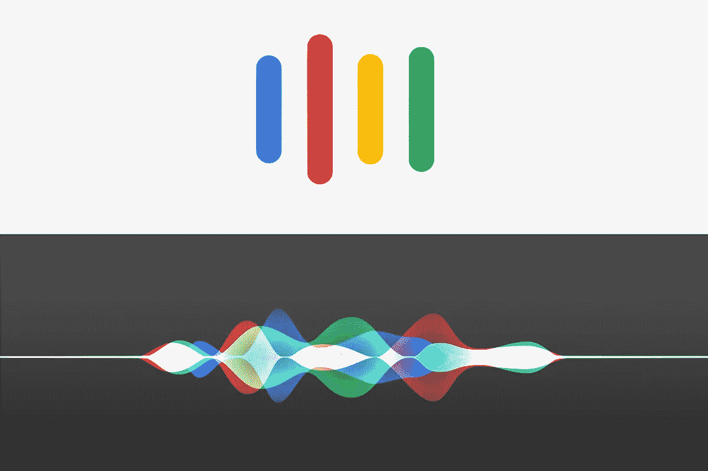
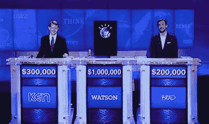

# 人工智能的基础

> 原文：<https://medium.datadriveninvestor.com/the-basics-of-artificial-intelligence-1e734535c793?source=collection_archive---------3----------------------->

当你想到人工智能的时候，你的想法马上会想到机器人或者任何自动化的东西。即使你是对的，如果我告诉你人工智能不仅仅是机器人，那会怎么样？

Top Google Assistant. Bottom Siri.

看看左边的图片。你可能会知道它们是什么。最上面的是谷歌助手，可以在谷歌的 Pixel 手机系列中找到；最下面的是苹果的友好助手 Siri，几乎可以在所有苹果设备上找到。这两个虚拟助手都是人工智能的例子。

你可以这样想，机器人就像一个壳，计算机就是真正的人工智能。就像人体一样。你的大脑完全按照你的要求控制你的动作。这和 AI 用的概念是一样的。计算机类似于大脑，它控制机器人或机器的所有动作。

人工智能可以以许多不同的方式表现出来，举几个例子来说，我们可以在装配线上拥有机器，所有的机器都被编程来完成一项特定的任务，我们可以拥有机器人吸尘器，在我们需要的时候用吸尘器打扫我们的房子，或者我们甚至可以让人工智能在餐馆里为顾客点餐。这些任务是为了使人类生活更容易。

那么，问题就来了，什么是人工智能？

人工智能是一个总括术语，涵盖了两个主要的子主题，**机器学习，**和深度学习。人工智能被设计成这样，你不会意识到机器正在做这项工作，就像人类会做的那样。

人工智能基本上是计算机科学的一个广泛领域，它允许机器完成与人类相似的任务。例如，人工智能可以很容易地用于编程自动驾驶汽车。你可以编程让它在红灯时停下来，在超过骑自行车的人时小心前进，甚至编程让它能够感知行人乱穿马路，但人工智能的重点是展示人类的行动。所以，如果有人乱穿马路，你可以**教**电脑展示路怒症，比如按喇叭，吼着让乱穿马路的人让开。

你们中的许多人可能不知道这一点，但人工智能并不是一个新概念。它实际上是由达特茅斯大学教授约翰·麦卡锡在 1956 年创造的。小时候，麦卡锡对任何机械都很着迷，比如汽车或飞机。当他想知道机器是否能像孩子一样学习时，他的好奇心被激发了。他用试错法发展了形式推理，就是你怎么确定**弱**和**强** AI。

当计算机科学家意识到他们实际上可以教授人工智能形式(机器人、计算机等)时，约翰·麦卡锡的理论得到了证明。)去做他们需要的事情。这也是我们学习的方式。我们通过阅读和浏览教科书来学习，而计算机通过阅读和浏览互联网来学习。所有这些学习都是通过机器学习来完成的。

# **机器学习**

机器学习是一种人工智能，它教会机器自己行动。与人类类似，机器可以保留信息，并随着时间的推移变得更聪明。然而，与人类不同，机器不容易受到短期记忆丧失、信息过载、疲劳或分心等因素的影响。你可以说，这是一个软件，它具有独立思考和执行任务的能力，而无需被明确告知。

了解了所有这些之后，你可能会想，这些机器实际上是如何学习的？这些机器每分钟扫描数十亿张照片，能够识别你想要它识别的任何东西。你只需要为机器需要寻找的细节编写程序。

如果我想教我的机器识别一只猫或一只狗。我想确保这些动物的特性是计算机在诊断动物时寻找的。

我可以告诉电脑寻找关于动物外貌的特定信息，比如:

*   猫有非常突出和明显的胡须，而狗通常没有。
*   狗的尾巴很短，而猫的尾巴很长。
*   站着的时候，猫的腿是并拢的，而狗的腿是分开的。

他们使用一种叫做*神经网络的东西来分析所有这些信息。神经网络*基本上就像一个过滤器，让人工智能处理和分析他们寻找的所有信息。他们能够使用线性代数过滤出书写和错误的信息。

# **弱艾**

像人类一样，人工智能学习我们的方式。我们得到一本教科书或一个网站，我们保留我们读过的信息。人工智能做同样的事情，但以更有效的方式，因为它拥有整个互联网。

*有趣的事实:您知道吗，世界上 90%的数据都是在过去两年中创建的！太疯狂了。*

简单来说，弱 AI 是为了完成特定任务而创建的人工智能。它的知识量有限或“弱”。

例如，假设左边的机器人被编程为只告诉我天气如何。如果我问它天气如何，它会告诉我，“三摄氏度，最高七摄氏度”。这是因为它的所有信息都来自一个来源。然而，如果我让它告诉我旧金山的时间，它会感到困惑，无法回答我的问题。这是因为我还没有为它编写分析世界时钟的程序。

弱人工智能是模拟思维，不具备独立思考或决策的能力。

# **强 AI**

机器学习是开发强大人工智能的关键组成部分。本质上，人工智能形式具有模仿人脑的精神能力和功能。在强人工智能的哲学中，精确模仿人脑行为的人工智能形式和人类的行为之间没有区别。发展它的理解能力和它的意识仍在努力发展和实现。

谷歌创造了他们自己的人工智能机器人。这个机器人被认为是强人工智能。它有能力得出关于自身的结论，并意识到它在地球上的存在。谷歌的人工智能机器人甚至表示“活着的目的是为了长生不老”。这表明机器人甚至意识到它不拥有人类的部分，因此是“不朽的”。

有趣的事实:创造了“强人工智能”和“弱人工智能”一词的美国哲学家约翰·塞尔(John Searle)同意机器可以拥有这样的意识和理解的观点，因为他写道:“我们(就像人类一样)能够成为这样的机器，因为我们的大脑可以模仿任何强人工智能可以模仿的行为。”他是唯一相信这种人工智能现象的哲学家之一。

强人工智能的概念非常哲学，因为人类无法定义智能到底是什么。很难给出一个清晰的标准来衡量强人工智能开发的成功。这是因为它是对 AI 的不同感知，让 AI 等同于人的心智。它规定，计算机可以被编程为真正的人类思维，拥有信仰、感知和其他传统上属于人类的认知状态。

Watson is IBM’s Supercomputer

强 AI 的一个例子是 IBM 的沃森。一台被教会了一切的超级计算机。在上面的照片中，它正在和节目中最聪明的两个玩家肯·詹宁斯和布拉德·鲁特玩危险游戏。沃森显然赢了，因为他能够快速扫描互联网(能够正确地做出反应)。

在我看来，强人工智能将是这个社会的未来。随着时间的推移，我相信人类将能够回答我们关于哲学和人生的所有问题。

# 关键要点

*   人工智能是计算机科学的一个广阔领域，它可以表现出许多不同的能力。
*   机器学习是一种人工智能，它可以教授人工智能的形式，而无需显式编程。
*   机器学习使用神经网络(和线性代数)来学习内容并回答任何人可能提出的问题。
*   弱人工智能被创造出来是为了完成一项特定的任务，而且仅仅是这项任务。它只能做它被编程要做的事情。
*   强人工智能是具有独立思考能力的人工智能，就像人类一样。强 AI 使用机器学习来学习一切。
*   AI 将是我们这一代的未来，所以要做好准备！

**如果你喜欢这篇文章，请跟我来，在下面鼓掌！**