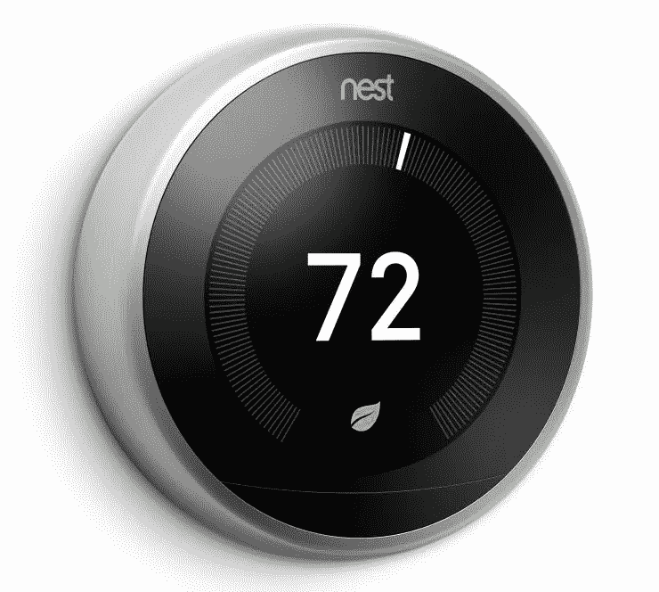
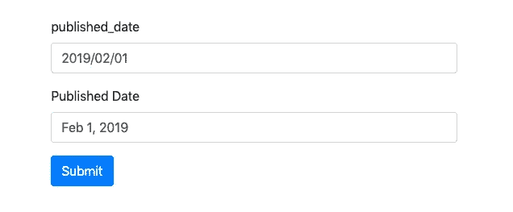
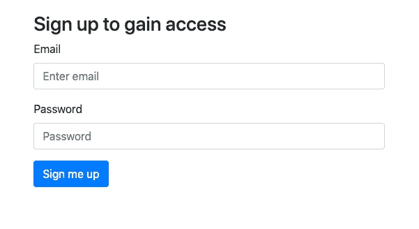
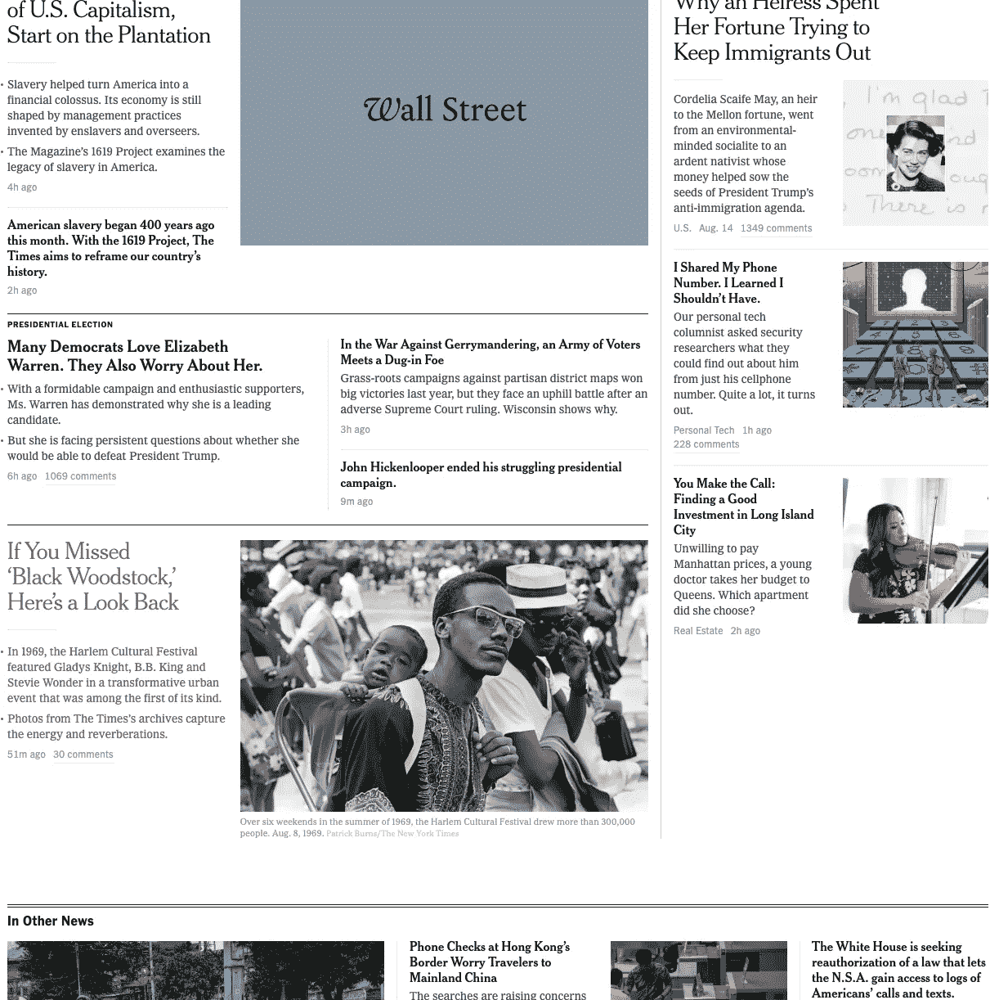
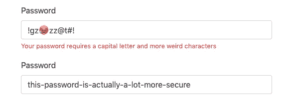
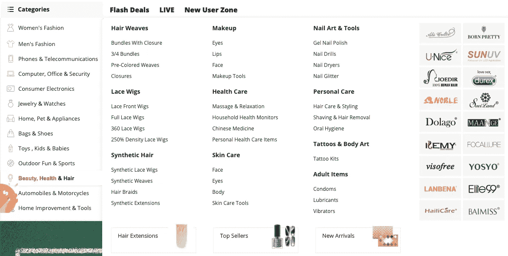
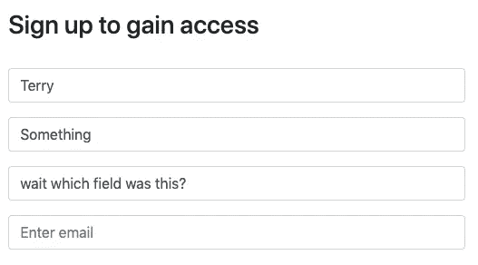

# 优秀用户界面的基础

> 原文：<https://medium.datadriveninvestor.com/the-basics-of-good-user-interfaces-649a701891e4?source=collection_archive---------1----------------------->

The simple yet effective user interface of the Nest. Even without ever using one you know how it works.

用户界面很难。作为一名开发人员，很难将数据库中的所有信息概念化为一个易于使用的界面。作为一名设计师，很容易在忽略关键规格的情况下构建一些视觉上吸引人的东西。产品人员是一个很好的中间人，他可以在好的设计、用户体验/界面和开发者约束之间找到一些中间地带——不幸的是，不是每个公司都有这样的奢侈品。

有时候，我们需要戴上一顶不同的帽子，做一些我们不一定感到舒服的事情。幸运的是，构建良好的用户界面是一项几乎任何人都能学会的技能。这里有一些关于如何开始的提示。

 [## 2019 年即将改变世界的技术|数据驱动的投资者

### 很难想象一项技术会像去年的区块链一样受到如此多的关注，但是……

www.datadriveninvestor.com](https://www.datadriveninvestor.com/2019/01/17/the-technologies-poised-to-change-the-world-in-2019/) 

# **您不是用户**

这是我一直想提到的一点，因为这是最重要的一点。我们经常陷在自己的世界里，以至于有时会忘记谁在真正使用我们的产品。虽然存储在我们数据库中的记录遵循一定的命名约定，但它们对我们的用户来说没有任何意义。你会希望在你的网站或应用程序中以用户易于理解的方式呈现数据。

Which one is easier to read? Add a calendar icon that helps you choose the date and you’re good to go

你可能已经就某个新特性开了几周甚至几个月的会。在你的脑海中，这个特性很有意义。一个局外人不会有同样的内部知识，而且这个特性对他们来说也是陌生的。

首先创建一个概念证明，展示给某人看，但不要给他们背景故事。颜色、外观，甚至特征的名称可能会让外人感到困惑。通过观察它们在哪里被卡住，你会知道什么需要改变。因为这种反馈在早期就给了你，所以在那时做出调整要容易得多，而不是等到你快要到达终点的时候。

仅仅因为这个特性对你有意义，并不意味着每个人都会明白它是如何工作的。虚心接受反馈，也虚心请求反馈。

# **简单更好**

*常被称为“少即是多”*。我们倾向于在一个页面上放尽可能多的数据，假装我们在给用户增加价值。一个特定的表单可以有 30 个字段，让您最大限度地控制您的设置。太好了，用户会高兴的！不尽然，你的用户现在可能不知所措，困惑，变得不耐烦，或者转移到别的事情上去了。

想想哪些字段是绝对必要的，去掉其余的。现在，使用新的字段子集，再做一次，删除至少一个或两个选项。仅仅因为一个领域对你很重要，并不意味着它对用户有价值。没有这些数据，你的应用还能运行吗？如果不是很重要，你可以在以后需要的时候收集。

Keep your forms simple!

# 不要曲折前进

我们从头到尾阅读网页，其他的一切都是无意义的，我们已经对分心的事物视而不见。页面两侧或顶部的项目很容易被忽略。我们已经学会忽略广告。不要试图通过以非线性的方式放置你的内容来克服这个障碍。你的混乱会造成混乱，你的用户会离开。相反，接受这一事实，将你的内容与页面上的一条看不见的垂直线对齐——如果你愿意，也可以是一个网格。

While this design is clean, the content is everywhere making your eyes jump everywhere. This is hard to follow.

当处理表单时，将标签放在输入的左边或者直接放在它们的上面。将所有输入与网格对齐。如果你打算在表单的末尾放置一个提交按钮(即没有自动保存和浮动保存按钮)，那么正如你所猜测的，将它与网格对齐。

# **解除所有摩擦**

你希望你的用户的会话尽可能简单，这样他们就可以关注你的产品。不要增加任何摩擦力。当他们还在阅读时，不要添加任何弹出窗口。如果一步就能简化导航，就不要使用多步导航。变点魔法。当你可以的时候，用智能的方式自动补全(比如允许语法错误和打字错误)。不要让他们在输入时格式化他们的电话号码，为他们做。

不要在他们点击提交后告诉他们用户名正在使用，要马上告诉他们。同样，在证明无辜之前，不要假定有罪。例如，不要告诉他们他们的密码不匹配，因为他们甚至没有进入重新输入密码字段。实际上，去掉重新输入密码字段，如果他们搞砸了，他们可以随时重置他们的密码。如果你不相信，添加一个眼球图标，揭开他们的密码，这样他们就可以看到他们输入的内容。

说到密码，长度就是一切。16 个字符的密码比 8 个字符的密码更难破解，8 个字符的密码包含数字、字母、特殊字符、表情符号、星座或其他任何奇怪的要求。请你的用户键入一个他们容易记住的句子或几个单词。因为对他们来说记住它们更容易，他们不会最终把密码写在桌子旁边的便利贴上。

Short passwords with weird requirements suck. The bottom one is easier to remember and more secure.

# **保持菜单简单**

这与我的第一点相呼应，但让我们花点时间关注导航，因为这是你的用户发现更多内容的方式。有没有去过那种菜单上有 100 多种食物，但你却不知道该点什么的餐馆？相比之下，餐馆只有 7 个项目。前者让人不知所措，后者让你更容易决定想吃什么。

更简单的菜单也表明厨师知道他们在做什么——他们不是什么都懂，什么都不懂，而是将所有精力集中在创造更少、更好的饭菜上。同样的逻辑也适用于网络和应用程序中的菜单。通过提供有限的选择，你让用户更容易决定点击什么，同时也显示出你是一个专家，而不是看起来无所不在。

这里出现了一个难题，如果你有 50 个部分，因为你的网站已经存在很久了，或者你需要他们的业务，或者搜索引擎优化的原因？评估所有类别，看看哪些类别真正获得了点击量和流量，哪些类别可以合并或删除。真的不应该有这么多选择。如果你一定要保留它们，那么创建 5-7 个主要类别，将其余的放在子类别中。您的菜单可以简单地显示顶级类别，当您点击通过，其余的可以出现。

尽量避免在弹出窗口中显示子类别——悬停时菜单中有菜单的界面会产生令人沮丧的用户体验。

有了新的更简单的菜单，用户在遵循业务需求的同时，导航突然变得容易多了。

I hovered over one category and got a million options and some ads. Each category has as many options. This is really bad design.

# **表单占位符不好，不要使用它们**

在处理表单时，有些人会省略标签，而是将信息直接放在占位符中。这是一个糟糕的设计。当您开始填写表单时，标签会消失，如果您更改标签，然后再次查看表单，您将不会知道哪个字段是哪个字段。如果你让标签只在你输入内容的时候出现，你会分散注意力。

我经常看到的另一件事是人们使用占位符来显示字段可以接受的数据类型的例子。这也不是一个好主意。对于用户来说，有时看起来这个字段已经被填充了，他们会跳过它。这里不要太聪明，标签在输入的正上方或左侧是最用户友好的方式。

You lose context if you use placeholders as labels

# **丢掉汉堡，你的假设**

我们都知道汉堡包图标，我们在任何地方都能看到它。每个人都知道它是什么，它做什么。不完全是。甚至在今年的一次测试中，我发现大多数用户，尤其是桌面用户，很少使用汉堡包图标。很有可能他们没有注意到，或者根本就不想点。然而，在我的测试中，通过在其旁边或下面添加单词“Menu ”,它总是会产生更多的点击。我的建议是不要添加这个词，但是可以重新考虑你的界面。也许汉堡包图标不是桌面上最好的方法，因为你有空间来显示你的菜单项。

Some of the elements are exposed making them easy to find. The rest are hidden in the hamburger icon for users who really want to look for them. This is a good design.

假设我们的用户会自动理解一个功能，因为它在其他网站上使用是有问题的。在几年前(大约 2013 年)做的测试中，我发现如果我的链接是蓝色加下划线的，而不是其他颜色加下划线的，那么点击量会高得多。很疯狂吧？我决定无论如何都要去掉下划线，因为这种差异不足以抵消它们给网站带来的丑陋。

这里的教训是永远不要对你的用户做任何假设。可能的话，测试一下。有很多工具可以帮助你做 A/B 测试。不过要注意，A/B 测试是昂贵的，既费时又费钱，而且你需要相当大的流量才能得出正确的结论。如果你的样本量足够大，那么相信你的数据。这些数据比你的直觉要准确得多。

# 从他人那里汲取灵感

如果你正在构建新的东西，而你不完全确定该采用哪种方法，看看其他人在做什么。很多时候，他们已经做了研究。但是要小心，仅仅因为其他人正在做它并不意味着它是正确的，也不保证它在你的平台上成功。不同的观众有不同的行为方式。

测试他们网站上的功能。这也给了你不需要构建原型的额外好处。但是不要完全照搬。你需要根据你的网站、你的品牌和你的观众来调整这个特性。当你完成的时候，这个功能可能会是几个不同网站或应用程序的影响的结合，加上你自己的特殊风格。不要直截了当地抄袭，但一定要从中汲取一些灵感。请注意，有些功能是有专利的。

# 结论

创建好的用户界面还有很多，但是如果你一直在关注的话，我把这篇文章限制在我认为对你入门最有价值的几个想法上。请在下面的评论中告诉我你的想法，并在 twitter (@tkaravou)上关注我，我会发布更多的提示。