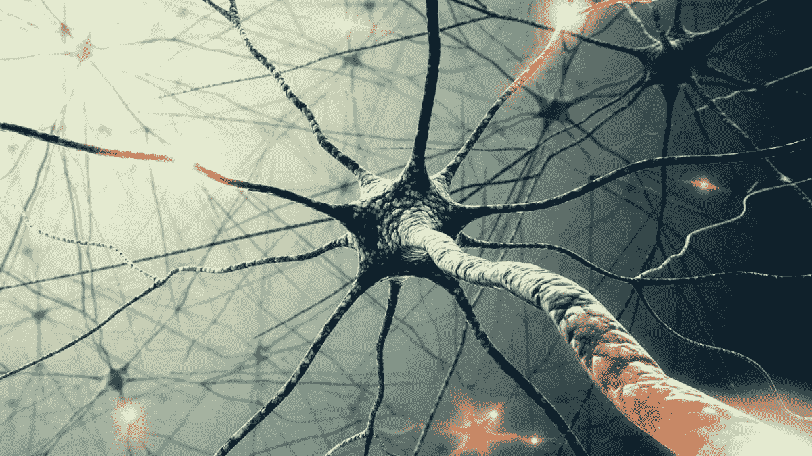
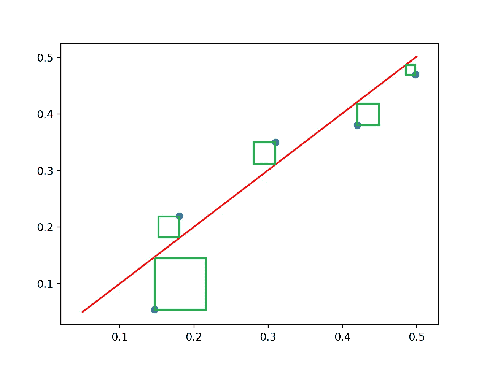

# 神经网络的基础

> 原文：<https://medium.datadriveninvestor.com/the-basics-of-neural-networks-304364b712dc?source=collection_archive---------1----------------------->

早在公元前 800 年，当古希腊人写下神创造的机械人时，人类就一直梦想着创造智能发明。在过去的一个世纪里，技术一直呈指数级发展，并把我们带到了一个自我意识机器人的梦想不再与魔法联系在一起的地步。人工智能的发明让我们能够创造出惊人的程序，远远超过任何人的能力。

人工智能领域的关键进步是**神经网络**的发现，这使得我们能够做出令人惊叹的事情，如创建聊天机器人和检测恶性肿瘤。在此之前，程序员创建了相对简单的回归模型来预测和分类数据。然而，这些模型有其局限性。

# 什么是神经网络

神经网络就像它的名字一样。它是一个用来处理信息的神经元网络。为了创造这些，科学家们着眼于当时最先进的数据处理机器——大脑。我们的大脑利用神经元网络处理信息。它们接收输入，对其进行处理，并相应地向与之相连的神经元输出电信号。利用生物拟态，我们能够应用我们大脑的结构来推进人工智能领域。

人工神经网络重建人类神经元的结构来处理信息，从而产生比以前使用的回归模型更准确的结果。

# 神经网络的组成部分

神经网络由 3 个主要部分组成:

## 输入层

这实际上是为神经网络处理输入信息的层。每个圆圈代表一个特征(一条信息)。这可以是任何东西。对于房价预测程序来说，它可能是你房子的平方英尺，对于计算机视觉程序来说，它可能是屏幕上一个像素的值

## 隐藏层

这些层为神经网络做所有的处理。你想要多少就有多少。一般来说，你的隐层越多，神经网络就越精确。每一层都由模仿我们大脑神经元的节点组成。这些节点接收来自前一层节点的信息，将其乘以**权重**，然后添加**偏差**。图表中的每条线代表一个重量。这听起来可能令人困惑，所以这里有一个类比:

假设我想预测我的 SAT 分数，我已经收集了两条数据:我准备的小时数，以及考试当天我吃的早餐。这些将进入输入层。很明显，我花在准备上的时间会比我的早餐对我的分数产生更大的影响(否则每个人都会在 SAT 中获得高分)。正因为如此，我花在学习上的时间得到了一个要乘以的明显更大的**权重值**。现在，当然，你的早餐可能会稍微影响你的分数，所以它会得到一个低得多的权重值。

## 输出层

这一层只是将网络最后一个隐藏层的信息汇集在一起，以输出程序所需的所有信息。

综上所述，神经网络从输入层获取信息，在隐层进行处理，在输出层输出想要的信息。运行神经网络的整个过程被称为**前向传播。**

# 训练神经网络

The squares of the difference between the prediction and actual value

理解了神经网络的结构后，您可能会想知道神经网络如何知道使用什么样的偏差和权重。神经网络通常以随机权重和偏差开始，但随后一遍又一遍地训练自己，直到达到最佳性能。他们通过计算当前的误差量来做到这一点。这就是所谓的**神经网络的成本**。这是通过找出网络预测和期望结果之间的差异，并找出这些误差值的平方和(目标输出)来计算的。在图中，红线代表简单神经网络的预测。蓝点是正确的预测。神经网络计算预测值(红线)与实际值(蓝点)之间的距离，并对其进行平方(创建绿色方块)。然后，它将这些平方值相加，得出神经网络的成本。

## 优化权重和偏差

训练神经网络的整个目标是最小化成本。神经网络使用一种叫做**反向传播**的过程来实现这一点。这似乎是一个复杂的词，但它很简单。正如我之前提到的，前向传播是当你通过神经网络运行信息，给你一个结果。反向传播是字面上相同的东西，但向后。你只需要从输出层开始，反向运行神经网络来优化权重和偏差。数学很复杂，超出了本文的范围，但是如果您有兴趣学习它，您可以随时去网上搜索！

虽然这篇文章只涵盖了神经网络的基本理论，但实际执行所有这些复杂的过程需要大量的高级微积分和矩阵运算。还有很多东西需要学习——从神经网络类型(如 RNNs、CNN 和 GANs)到其他重要的训练计算，如梯度下降。

21 世纪围绕着数据的使用，人工智能是有史以来最强大的数据处理工具。正因为如此，**人工智能会颠覆每一个行业。**不管你是老师、厨师、律师还是医生。人工智能 100%有能力颠覆你的行业。不相信我？人工智能可以为学生制定定制的课程计划，设计创造性的新食谱，起草法律文件，并对各种医疗疾病进行高度准确的诊断。**不管是好是坏，人工智能正在改变世界。**

# 原帖:

 [## Mayank Jain -神经网络基础

### 早在公元前 800 年，当古希腊人写下…

mayankjain.ca](https://mayankjain.ca/blog-posts/4) 

# 如果你喜欢这篇文章:

*   在 [Medium](https://medium.com/@mayankj2112) 上关注我，在 [LinkedIn](https://www.linkedin.com/in/mayankj2112/) 上与我联系，了解我的最新作品！
*   订阅我的时事通讯，跟随我的旅程！：

 [## 注册我的每月更新！

### 注册以跟上我每月的进度，包括项目、会议、文章等等...

www.subscribepage.com](https://www.subscribepage.com/mayank)