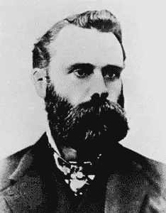
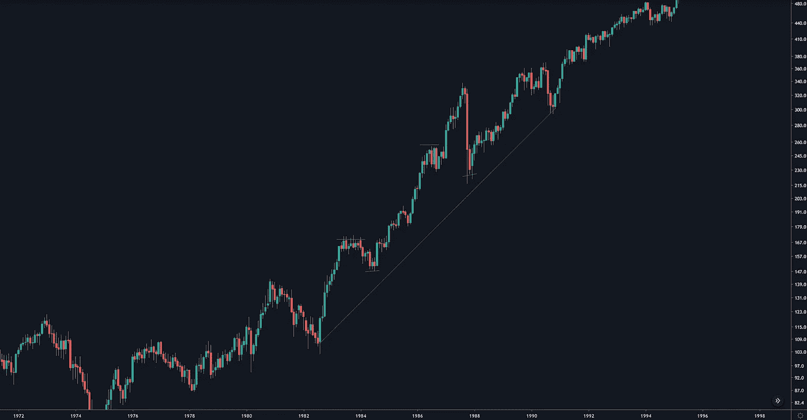
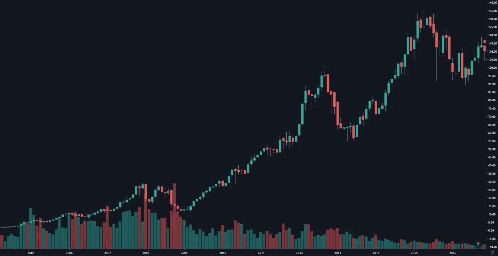

# 技术分析的基础。道氏理论。

> 原文：<https://medium.datadriveninvestor.com/the-basis-of-technical-analysis-the-dow-theory-f645d13ff149?source=collection_archive---------2----------------------->

金融史上的一个关键人物无疑是查尔斯·道。在他的一生中，他创建了道琼斯工业指数和道琼斯运输指数，华尔街日报，以及后来被称为“技术分析”的基础。在这篇文章中，我们将考察的是道氏理论。

Photo by [Chris Liverani](https://unsplash.com/@chrisliverani?utm_source=unsplash&utm_medium=referral&utm_content=creditCopyText) on [Unsplash](https://unsplash.com/?utm_source=unsplash&utm_medium=referral&utm_content=creditCopyText)

# 他的生活

Charles Henry Dow

查尔斯·亨利·道于 1851 年出生在美国的康涅狄格州。他的第一份工作是在马萨诸塞州做城市记者。他专门研究商业和经济文章。他的文章被仔细研究过，以至于他的一篇文章推动了采矿业的发展，并使一些人成为百万富翁。1889 年 7 月 8 日，他和他的合伙人爱德华·戴维斯·琼斯一起创办了华尔街日报。后来，在 1896 年，道开始了他的道琼斯工业平均指数，通过跟踪 12 家公司的收盘股票价格，将他们的股票价格相加，然后除以 12。道琼斯工业平均指数(DJI)迅速成为股票市场的指标。他接着创造了道琼斯运输平均指数(DJT)。虽然前者如今很少使用，但道琼斯工业平均指数仍被视为美国股市的表现指标。在创造了两条均线之后，道开始创造他自己的市场运动理论。维基百科写道..

> ..发展了道琼斯理论，该理论认为股票市场趋势和其他商业活动之间存在联系。陶氏认为，如果工业平均指数和铁路平均指数都朝着同一个方向移动，这意味着一个有意义的经济转变正在发生。他还得出结论，如果两个指数都达到新高，这表明牛市正在进行。道不相信他的想法应该被用作市场涨跌的唯一预测者。他认为它们应该只是投资者用来做商业决策的众多工具之一。

1902 年 12 月 4 日，道因健康问题在家中去世，享年 51 岁。

# 道氏理论

我们从道氏理论中学到的一点是，市场波动包括顶部、底部、上升趋势和下降趋势。道继续写道，“价格趋势”。这些原则是我们现在所说的“技术分析”的基础。技术分析师遵循这些原则来定义一个金融工具的历史方向和方向的变化，以找到最可能的未来价格方向。

作者提到每一次价格变动都可以用三种趋势来分析，主要趋势，次要趋势和次要趋势。从大到小，上述价格趋势引发了每一次进一步的价格分析。

主要趋势可以持续几年，次要趋势可以持续几周或几个月，与主要趋势相反，次要趋势可以持续一周。

上升趋势的定义是“……价格必须创造更高的高点和更高的低点”。另一方面，下跌趋势必须创造“……更低的高点和更低的低点”。横盘走势以上两者都没有。

The S&P 500 doing higher highs and higher lows. — The image is taken from [www.tradingview.com](http://www.tradingview.com)

# 卷

道琼斯还写了交易量。虽然它起着次要的作用，只能用股票来衡量，但成交量可以帮助我们解释趋势的变化。例如，如果市场上没有足够的买家，或者许多交易者大量出售股票，那么价格就会下跌。

Example of a volume profile on the Apple stock. — The image is taken from [www.tradingview.com](http://www.tradingview.com)

# 结论

尽管道没有将他的发现标准化，他的工作成为了我们现在所说的技术分析。许多其他交易者建立在这些原则的基础上，创造和发展了交易者的工具包。这就是“艾略特波浪理论”和一般波浪分析。

*来源*

1.  【https://en.wikipedia.org/wiki/Charles_Dow 号
2.  技术分析——金融市场技术人员的完整资源

免责声明:

为了投资这些市场，你必须意识到风险并愿意接受它们。不要用你输不起的钱去交易。本文包含的信息仅用于教育目的，不作为任何特定投资的建议。在任何市场交易都有很高的风险，可能不适合所有的投资者。