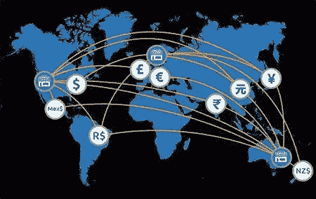

# 万亿美元市场之战

> 原文：<https://medium.datadriveninvestor.com/the-battle-for-a-quadrillion-dollar-market-f079a6597eb0?source=collection_archive---------0----------------------->

**简介**

区块链应用的最初用例之一是金融支付的去中心化。在更极端的情况下，人们渴望银行可能会被新形式的自我管理、自主的实体所取代。这现在看来相当理想化和不现实。看起来，尽管银行有很多错误和频繁的不良行为，但它们不太可能很快消失。相反，许多银行正在寻求采用区块链技术来帮助提高效率，并利用正在出现的新机遇。解决方案正在内部开发，通过加入财团，或通过与区块链初创企业的合作。

本文对支付和结算领域的一些参与者进行了高度审视，然后考虑并比较了两家区块链初创公司提供的具体解决方案:Ripple Labs(“Ripple”)和 Ivy koin Network(“Ivy”)。

**那么，什么是支付？**

每天，数万亿美元通过一个或另一个现有的支付网关或消息系统在发送者和接收者之间传输，其中最著名的是环球银行间金融电信协会(“SWIFT”)。这些支付代表企业向其他企业提供商品和服务的结算(“B2B”)、企业与客户之间的交易、个人之间的交易以及银行间交易结算。

大多数支付都是通过金融机构(FI)主要是银行直接或间接进行的。目前，转让机制笨拙而复杂，往往涉及多方参与。这导致了延误，而且处理成本往往很高，这意味着某些支付形式在财务上不可行(如小额支付)。区块链技术和加密货币尤其可以提供更高效、更快速和更具成本效益的解决方案。

**谁是玩家？**

目前重要的现有公司有 SWIFT、CHIPS、Fedwire 和 ACH。其中，SWIFT 可能是美国以外最知名的。按管理的支付量计算，它也是最大的——每天大约 5 万亿美元。

渴望分享蛋糕的区块链新来者可以分为两类。首先，那些提议创建新市场的，比如小额支付市场，或者允许目前没有银行账户的人获得类似银行的服务。例如 Stellar、Lend 和 Everex。第二，那些选择与现有金融机构合作并提供互补解决方案以提高效率和速度并降低成本的公司。例子是波纹和常春藤。

这项业务的第三个潜在的强大竞争来源是致力于区块链解决方案的财团。R3 可能是其中最著名的。它由一个大型企业财团所有，包括汇丰银行和美国银行等大型全球性银行。Hyperledger 是另一个强大的财团，成员包括 IBM、美国运通、ANZ 和 ABN-AMRO。最后，企业以太坊联盟是一股不可忽视的快速增长的力量。

【SWIFT 会如何应对竞争？

在加密领域，人们经常谈论“网络效应”。用外行的话来说，这实际上意味着达到临界质量所带来的规模效益。如今，SWIFT 已达到临界质量。它的客户中有 11，000 家银行，其信息服务(支付指令)在 200 多个国家的支付中发挥着重要作用。SWIFT 也通过转向分布式账本技术来应对竞争对手带来的生存威胁。它开发了自己所说的“全球支付创新”(GPI)。今年 3 月，它成功完成了概念验证。现在有超过 160 家银行使用这项服务为他们的客户提供近乎实时的支付。一些人怀疑 SWIFT 是否有专业知识或灵活性来与更精简的竞争对手相匹敌，但其市场地位为进入提供了一个非常大的障碍。

**遵守反洗钱规定**

金融机构受多种监管报告要求的约束。这些报告的性质因地区而异，可能需要向多个监管机构提交报告。以适当和及时的方式完成所有要求的事情被称为“合规”。在支付方面，监管问题主要在于资金来源的来源和资金可能用于的目的。基本上，这意味着确定资金是否是非法活动的收益，以及资金接受者是否可能以非法方式使用资金。防止向受制裁方(如朝鲜)付款也很重要。如果金融机构执行不合规的资金转移，它将面临巨额罚款的风险。

发送付款的金融机构有责任进行检查，以确定与付款相关的合规风险。这些支票通常被归入反洗钱条款的范畴。更具体地说，它们涉及 KYC(了解你的客户)和 KYT(了解你的交易)数据收集。这使得金融机构能够确认发送方和接收方的身份以及转账的目的。可以对收集的数据进行评分，以计算数字风险系数。通常，金融机构会以分层的方式对风险因素进行分类(如低、中、高)。那些属于高等级的支付将受到更严格的审查。在许多司法管辖区，对于大额支付，合规报告要求更加严格。通常情况下，门槛在 1 万美元左右。合规性监控和报告既费工又费钱。区块链解决方案可能会使金融机构在这两方面都大幅减少。

**主权身份合规**

有几个区块链项目正在开发建立不可改变的个人身份和声誉的账本。思域和 Selfkey 就是两个例子。这种类型的验证肯定有助于满足 KYC 要求，并可能在金融机构中得到采用。

**有无令牌的区块链？**

本文主要关注两个方面:更高效的付款处理和更高效和有效的合规义务处理。这两者能否通过一个解决方案来实现？该解决方案是否需要令牌或数字资产来提供其功能？

就涟漪效应而言，答案是可能的。就常春藤而言，答案是肯定的。下面会有更多的讨论。有趣的是，R3 和 SWIFT 都宣布他们的许可专用网络不会创建或要求使用本地资产。也许这与拥有一个人可能给 FI 带来的额外负担有关。毕竟，代币引入了一个附加市场敞口(如流动性和波动性风险)的额外步骤。如果没有完全分散，那么也可能存在不可接受的交易对手风险。还有一个主权风险问题，即监管机构或政府可能会要求代币发行者停止其业务。如果代币发行者在其代币经济中扮演核心角色，那么这种事件将被证明是非常具有破坏性的。

**什么是涟漪娱乐城？**

Ripple 开发了 RippleNet，它将其描述为“通过 Ripple 的分布式金融技术发送和接收支付的单一全球银行网络”。目前在他们的解决方案套件中有两个功能提供:xCurrent 和 xRapid。前者不需要使用 Ripple 的本地资产 XRP(即使用是可选的)。已经有超过 100 家金融机构注册了 RippleNet，但其中大多数都在不使用 XRP 的情况下测试 xCurrent。Ripple 认为最终会迁移到 xRapid，这确实需要使用 XRP。这种信念是由于 xRapid 有能力释放 Nostro 账户中的巨额休眠资金而形成的。如果 SWIFT 能够围绕 Nostro 账户扩展其概念证明，那么这种信念可能会受到挑战。毫无疑问，使用 RippleNet 执行的交易是快速、廉价和可伸缩的。目前，交易时间约为 4 秒，记录速度为每秒 1，500 次交易。交易成本接近于零。一个名为 Cobalt 的升级版本即将发布，该版本计划将交易时间减少到 1 秒，并扩展到 50，000 tps，这与 Visa 的能力相似。

在合规性方面，Ripple 采用了一个消息传递模块，可以在网络上的银行之间实现双向通信。这将捕获支付的详细信息，包括 KYC 数据和其他风险信息。金融机构仍有责任管理并确保遵守其管辖范围内的法规。然而，Ripple 与金融机构及其监管机构和中央银行密切合作，提供支持。从公开可获得的文献中不清楚，如果需要的话，消息模块可以在多大程度上适于提供增强的遵从性数据捕获。

什么是常青藤产品？

常春藤是一家位于洛杉矶的初创公司。今年早些时候，它完成了私人代币出售，不打算进行公开的 ICO 融资。Ivy 的定位声明是“在全球范围内促进安全、透明的商业支付”。

他们的重点是需要广泛验证的法定货币和加密货币业务支付；也就是说，对于更大的金额(例如，10，000 美元或等价的加密货币)。很明显，常青藤把目光瞄准了 B2B 市场中受到更严格监管的那一部分。它提出了一个将全面的 KYC 和 KYT 数据绑定到支付的解决方案。这是通过它的本地令牌 IVYA 来实现的，该令牌将携带一个散列到一个填充了支付信息的安全数据容器。该公司声称，与 SWIFT 的 10 个数据点相比，它可以收集和发布多达 74 个 KYC 数据点，以及 120 个或更多 KYT 数据点。

Ivy 打算通过智能合约使用以太坊网络进行支付处理，并估计这将支持高达 1，000 tps。目前还没有迹象表明每笔交易的可能成本，但就智能合同的通话而言，还需要支付一笔天然气费用。鉴于 Ivy 的初创性质，在产品发布之前仍有一些内容需要介绍。该公司估计将于 2019 年在 H1 推出其 MVP，尽管它已经与一家支持中期试验的大型银行签约。其对反洗钱合规性的重视是否足以让其获得采用，将取决于金融机构如何看待本地令牌的使用以及可用的替代方案。有趣的是，R3 提出了一种以共同信息注册为形式的实用工具来解决这一挑战。

**总结**

尽管有一些创新，支付系统仍然低效、缓慢且昂贵。这使得他们成为颠覆性技术的主要目标。最大的现任银行 SWIFT 也通过采用分布式账本技术来应对 Ripple 和各种联盟等初创企业带来的挑战，尽管迄今为止规模相对较小。变革之风很明显。

在所有的挑战者中，就产品开发和采用而言，Ripple 可能是最先进的。常春藤将是值得关注的一个，但它几乎还没有离开起跑线。财团可能是出了名的麻烦，但其中有强大的参与者，有重大的既得利益。

无论谁成功，都会有丰厚的收入。区块链解决方案显然将是其中不可或缺的一部分。至于数字资产是否会发挥作用，目前还没有定论。代币持有者会咬着指甲，希望不仅是他们的马赢得了比赛，而且他们的代币也能赢得比赛。

参考资料:

【https://ripple.com/files/ripple_solutions_guide.pdf 号

【https://www.ivykoin.com/ 

[https://www . R3 . com/WP-content/uploads/2018/04/区块链 _kyc_aml_utilities_R3-1.pdf](https://www.r3.com/wp-content/uploads/2018/04/blockchain_kyc_aml_utilities_R3-1.pdf)

