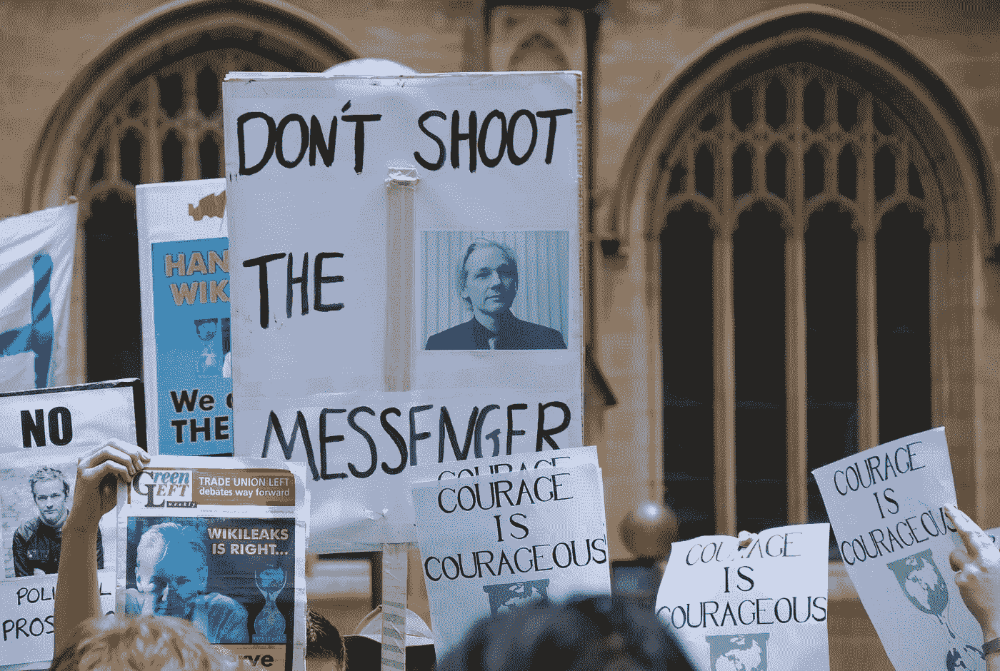
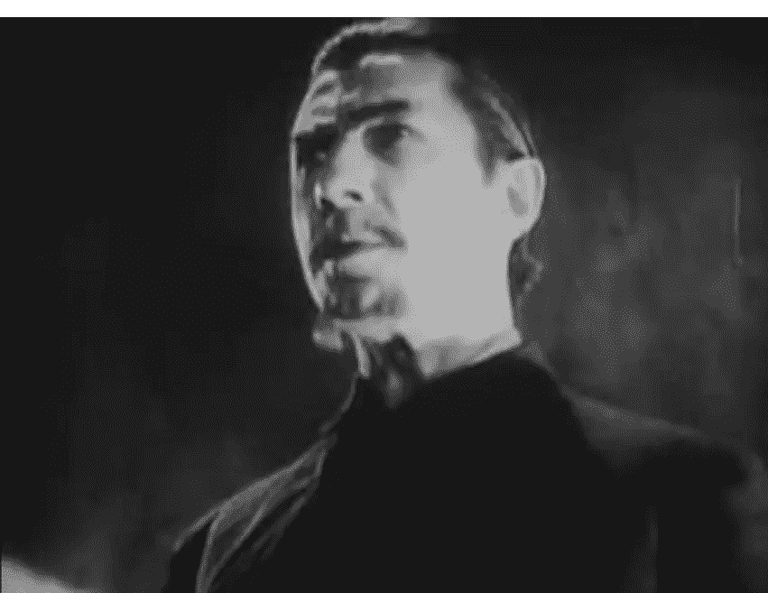
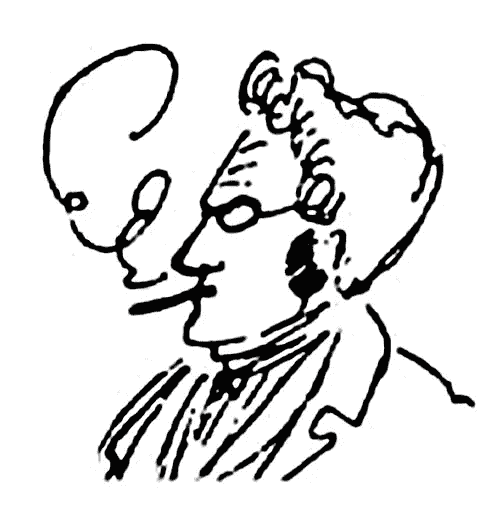
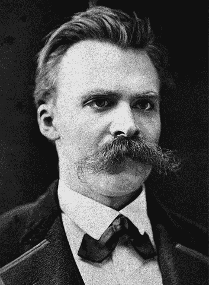

# 为自我而战

> 原文：<https://medium.datadriveninvestor.com/the-battle-for-the-self-1369e02637a6?source=collection_archive---------4----------------------->

Source: [Wikipedia](https://upload.wikimedia.org/wikipedia/commons/c/c8/Sydney_Wikileaks_2010-Dec-10.JPG)

## 或者如何变得独一无二

在我的上一篇文章[僵尸](https://medium.com/@gert.gast/zombies-474ca95500fa)中，我对大众僵尸化的诊断是基于梅青格对神经科学数据的哲学解释(2010 年)，部分是基于对当前人机融合的社会技术观察，人机总是相互连接，相互连接，并在全球范围内受到完全监控。用朱利安·阿桑奇的话说，

> 我看到现在有一个网络空间的军事化，在军事占领的意义上。当你在互联网上交流时，当你使用现在与互联网联网的移动电话交流时，你的通信正被军事情报组织截获。**这就像你的卧室里有一辆坦克。** **当你在唱歌的时候，你和你的妻子之间是一个士兵。就我们的通讯而言，我们都生活在戒严令之下，我们只是看不到坦克，但它们就在那里。在这种程度上，本应是一个民用空间的互联网已经成为一个军事化的空间。(阿桑奇，2016 年)**

在我的[僵尸](https://medium.com/@gert.gast/zombies-474ca95500fa)帖子中，我诋毁了西方成熟公民，不仅仅是因为他们被描述为启蒙运动前的农奴(康德，1992 ),这是由于专制的保姆国家的控制。我进一步质疑“我”是否不仅仅是大脑的“计算机”模拟。David Golumbia 在他的著作《计算的文化逻辑》(2009)中将这种意识形态称为计算主义，Metzinger (2010)也支持这种观点。

下面的文字是对这些观点的批判。人类 200 多万年的进化表明，我们通过五官、强健的身体和交流的社会结构来应对现实世界的能力支持了这样一种观点，即我们牢固地嵌入了现实世界。如果我们的本能是基于幻觉和幻想，我们就不会幸存。在哲学上，自我**需要被拯救，它的**独特性**需要被恢复，在它被宗教、黑格尔哲学和最近的计算主义抛弃之后。对于这种批判，马克斯·施蒂纳的哲学，一个后黑格尔派的哲学家，是相当有帮助的。但稍后会有更多关于他的内容。**

但首先，深入了解一下“僵尸”的概念会有所帮助，因为它并不像看起来那么微不足道。

在柯林斯和马布林的书《德里达初学者》(1996)中，我们发现了德里达解构思维中的一个重要概念，即不可判定性的想法，或 [Aporia](https://en.wikipedia.org/wiki/Aporia) ，希腊语中的僵局或困惑，在文化现象中表现出来，例如在僵尸电影中。从 17 世纪开始，在海地被奴役的西非人的宗教中出现了僵尸的比喻。对于西方殖民主义者来说,“伏都教”是一种充满血祭和食人暴行的邪恶宗教。*“但是僵尸是一种不同的恐怖:一个没有灵魂、思想、意志或语言的躯体。据说这是一具复活的尸体，或者是一具被巫术弄得没有灵魂、没有头脑的活体。”*(柯林斯&马布林，1996)。

这个怪物吸引了好莱坞。20 世纪 20 年代末，电影《T4》中的白色僵尸 (1932) *“为好莱坞设定了公式:白色科学遭遇黑色魔法。”柯林斯说，这是一次令人焦虑的遭遇。如果西方理性主义者对“生”和“死”的区分不成立呢？*

柯林斯&马布林继续说道，

> 僵尸可能活着也可能死了。但它跨越了这些范畴:它既是活着的，也是死去的。同样，它既不是活的，也不是死的，因为它不能承担这些术语的“全部”意义。…僵尸短路了通常的区分逻辑。两种状态都有，但都没有。它属于一种不同的秩序:就生与死而言，它是无法决定的。

已故法国哲学家雅克·德里达(1978 年)解构了西方二元区分的文化逻辑:活着/死了，男性/女性，理性/非理性，白人/黑人，或真/假，他展示了主导术语如何体现了一种邪教或神话般的优越性，一种所谓的辩证理性，没有给“不可决定”留下任何余地。在德里达之前，法兰克福学派的批判理论家西奥多·阿多诺和马克斯·霍克海默已经把西方的文化逻辑——启蒙运动——认定为一个神话。他们写道，

> 神话变成了启蒙，自然变成了纯粹的客观……当不再有任何未知时，人类想象自己摆脱了恐惧……这决定了去神话化和启蒙的进程，它将有生命与无生命结合在一起，正如神话将无生命与有生命结合在一起一样。启蒙是神话般的恐惧变成了激进。实证主义的纯粹内在性，它的最终产品，不过是一个可以说是普遍的禁忌。没有任何东西会留在外面，因为仅仅是外界的想法就是恐惧的根源。(霍克海默和阿多诺，1984 年)

僵尸的外在才是恐惧的真正来源，躲避着理性的力量。因此，在西方文化中，“不可决定的”必须被驱除，它要么是死的，要么是活的，但不能两者都是。然而，僵尸可能是不可根除的，并会卷土重来。如果不是作为一个僵尸，那么作为一个幽灵，或吸血鬼，在生与死之间，或在男性和女性之间，雌雄同体，或在人类和机器之间，机器人。

在实践中，复活自我可能不像已经指出的那样容易。一场为“自我”、隐私权、反对监控和新闻自由的战争正在进行，这场战争的缩影是三个人的名字:朱利安·阿桑奇、爱德华·斯诺登和切尔西·曼宁。对于德拉加斯内里(2017)来说，他们代表了*“一种新的思考和处理政治的方式——构想抵抗的形式和实践……他们正在将政治景观本身抛入危机之中。”*

对德拉加斯内里来说，对这些“密码朋克”的迫害程度表明，通过告密者和黑客的攻击，国家权力的秘密安全受到了根本性的威胁。*“斯诺登、阿桑奇和曼宁是一场运动的主角，这场运动质疑我们的立场，质疑定义我们现在的机制。”*(德拉萨内雷，2017 年)

对德拉萨涅利来说，利害攸关的不仅仅是隐私权。他在问问题*“关于服从和公民权与国家、民族、法律、民主的关系。”他在问谁？*

Max Stirner, caricature by Friedrich Engels. Source: [Wikipedia](https://de.wikipedia.org/wiki/Max_Stirner)

1843 年，一位年轻的黑格尔派哲学家已经在他之前这么做了。当时欧洲的贵族国家和市政当局就像今天的政府一样专制。记者进了监狱，马克思可以逃到英国(时代变了)，中欧的人们转向国内，自己照顾自己。德语单词[“gemütlichkeit”](https://www.merriam-webster.com/dictionary/gemutlichkeit)就是那个时候造出来的，他们发明了圣诞树！这个文化时代被称为[毕德麦雅](https://en.wikipedia.org/wiki/Biedermeier)。因此，毫不奇怪，一位哲学家会挖掘这个通常被称为“非政治”时代的意识。但毫无疑问，在 1848 年的 R [进化中，在](https://en.wikipedia.org/wiki/Revolutions_of_1848)[“gemütlichkeit”](https://www.merriam-webster.com/dictionary/gemutlichkeit)之下，革命的水壶正在升温并爆炸。这位哲学家就是[马克斯·施蒂纳](https://en.wikipedia.org/wiki/Max_Stirner)，他写下了他的主要作品[《自我和他自己的](https://en.wikipedia.org/wiki/The_Ego_and_Its_Own)，在 1844 年更好地翻译为[《独特及其属性】](https://en.wikipedia.org/wiki/The_Ego_and_Its_Own)，根据大卫·布卢门菲尔德(2018)的说法*《对现代社会的第一次无情批判》*。

施蒂纳的第一句话是“所有的东西对我来说都不算什么”，然后继续说:

> 我不应该关心什么！首先是正义的事业，然后是上帝的事业，人类的事业，真理、自由、人性和正义的事业；此外，我的人民，我的王子，我的祖国的事业；最后，甚至精神的原因和一千个其他原因。只是我的事业从来不关我的事。为只考虑自己的利己主义者感到羞耻！

“照顾自己”总是有一个可疑的名声。在大多数社会中，政府、国家、国王、公共利益、你的邻居或上帝和他的教会永远是第一位的。在战争时期，如果有必要，年轻的男性和女性被期望做出最大的牺牲。在今天的后后现代时代，它是“自我”的 Alt-Control-Delete，梅青格的现象自我模型，大脑的模拟，幻觉，幽灵(2010)。在这里，我想起了马克斯·施蒂纳的鬼魂，雅各布·布卢门菲尔德(2018)写道，

> 然而，在挖掘这具哲学尸体时，我发现施蒂纳的精神已经活在我们中间。因此，我进行了一项法医调查，研究他的思想是如何随着时间的推移而保持不死的。

Nietzsche Source: [Wikipedia](https://en.wikipedia.org/wiki/File:Nietzsche187a.jpg)

正如尼采的《同一的永恒回归》(查拉图斯特拉如是说)，我们在重复启蒙运动中关于国家权力和主权、反抗和反抗以及为自由和真实的“我”而战的思想，就像幽灵一样一直萦绕在我们的心头。革命从未完全胜利，但国家也是如此。

根据布卢门菲尔德(2018)，施蒂纳与其唯心主义老师黑格尔相反，是唯物主义者或后唯物主义者。对他来说，个人拥有财产的能力是独一无二的。为了拥有财产，你需要意识到你作为一个个体拥有获取财产的权力。在黑格尔的术语中，这样一个个体不仅仅存在于自身中，而是为了自身而存在。布卢门菲尔德说，

> 所有者是通过拥有他们的财产，而不是被他们所奴役，来标记他们存在的独特性的人。..换句话说，所有者使自己成为个体。一个拥有者不是通过一个更高的召唤或一个特定的原因形成的。成为一个主人就是通过占有自己的条件和消除与自己格格不入的一切来使自己个性化。

对施蒂纳来说，这个拥有者是独一无二的，**独一无二的一个**，它远不止是一个自我，一个“我”，或自我。它有自己独特的入口。它是奇异的和独特的。其他的一切都是泛泛而谈、幽灵或固定的想法*“在我们的头脑中飘荡(因为我们都在处理语言和思想)。”*布卢门菲尔德接着说道:

> 我们必须拥有自己。如果我们能够确定我们的整个存在，以至于我们愿意并有能力把它作为一个整体来分解，那么我们就把自己变成了财产；我们让自己成为了独一无二的个体。

总之，我认为我们必须重新获得对施蒂纳意义上的“财产”的控制，这不仅仅意味着物质财产，更重要的是我们的隐私，我们行动、行动、参与或退出的自由，当然还有能够在网上保护我们机密的自我。如果你密切关注时事，你会注意到，尽管有审查制度，但由于互联网，人们之间的全球交流和讨论增加了，它允许思想的传播，反对所有公司和国家压制它们的企图。我们必须支持阿桑奇为他的自由和维基解密而战，因为这是我们唯一关心的问题。黄背心的抗议现在正从法国蔓延到欧洲和其他地方，这也是我们关注的问题。成功的抵抗需要行动者不卑不亢，而是在独特中拥有自己。因此，以布卢门菲尔德作为总结，

> 施蒂纳的哲学对每一个进步和自由的观点来说都是一个大混蛋。它不是以某种优越的传统、种族、性别、民族的名义表现出来的。施蒂纳说，去他们的，也去你的。我不在乎你的价值观、你的问题、你的事业——我在乎我自己。只有在我们学会如何照顾自己之后，我们才能开始关心对方。

**参考文献**

阿桑奇、阿佩尔鲍姆、穆勒-马古恩、齐默尔曼(2016)。 *Cypherpunks:自由和互联网的未来*【Kindle】。从 Amazon.com 取回

布卢门菲尔德，J. (2018)。所有的东西对我来说都不算什么:马克斯·施蒂纳的独特哲学。从 Amazon.com 取回

j .柯林斯和 b .梅布林，Appignanesi，r .(编辑).(1996).*初学德里达。英国剑桥:图标图书公司*

de Lagasnerie，G. (2017)。反抗的艺术:斯诺登、阿桑奇、曼宁。从 Amazon.com 取回

德勒兹和瓜塔里(1987 年)。一千个高原:资本主义和精神分裂症。明尼苏达州明尼阿波利斯:明尼苏达大学。

j .德里达和 a .巴斯(译)。).(1978).*写法和区别*。英国伦敦:Routledge & Kegan Paul

Golumba 博士(2009 年)。*计算的文化逻辑*【Kindle】。从 Amazon.com 取回

霍克海默，m .和阿多诺，T.W .，卡明斯，j .).(1989).*启蒙的辩证法*。纽约州纽约市:连续体

康德，我，汉弗莱，t。).(1992).什么是开悟这个问题的答案？检索自[https://www . stmarys-ca . edu/sites/default/files/attachments/files/Kant-What % 20 is % 20 enlightment _。pdf](https://www.stmarys-ca.edu/sites/default/files/attachments/files/Kant--What%20Is%20Enlightenment_.pdf) (原著出版于公元 1784 年)

茨韦塔纳·梅青格(2010 年)。自我隧道:心智的科学和自我的神话。纽约州纽约市:基础书籍。

施蒂纳，m .，马丁，J. J .(编辑。).新泽西州宾顿。).(2012).自我和他自己:个人对抗权威的案例。从 Amazon.com 取回