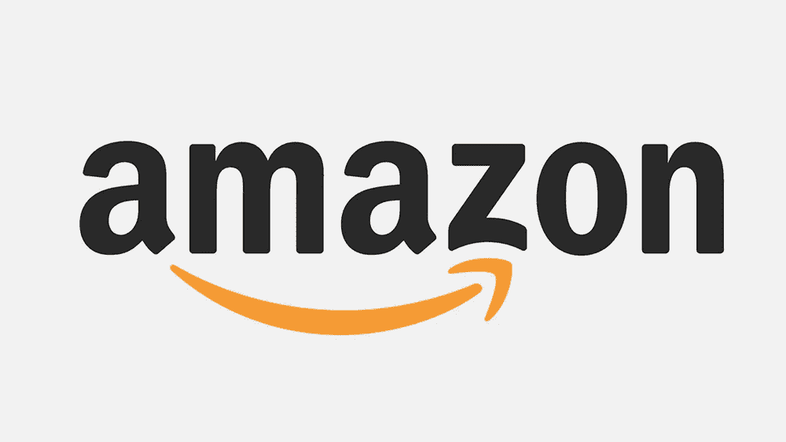

# 亚马逊的美丽

> 原文：<https://medium.datadriveninvestor.com/the-beauty-of-amazon-334838e0ee8b?source=collection_archive---------3----------------------->

## 没有集权的协调

随着我对加密货币的了解，我注意到了点对点互动和去中心化的力量。泛泛地谈论权力下放很有意思，因为我以前只在政治领域考虑过，我一直认为较小的地方政府比遥远的联邦控制更适合服务于人民的需求。加密社区的影响力拓展了我对许多问题的看法。加密社区对企业银行家和政府一样反感。我受到挑战，要把我对政府的观点背后的原则应用到任何权力结构中。这样做的时候，我发现自己在任何情况下都更加怀疑集中控制。

抱着这种观点，我开始注意到一件事:过去十年中许多最好的发明仅仅是让个人更容易相互交流或做生意的平台。优步、Airbnb、脸书、Twitter、Pinterest、Craigslist、Kickstarter——它们所做的只是把你和另一个人联系起来。没有一家提供产品。他们只是把人们想做的事情——互相交谈或互相做生意——提供一个发生的地方。正如优步和 Airbnb 创造了威胁传统出租车和酒店行业的互联网平台一样，亚马逊也创造了威胁传统零售店的平台。

现在，对我来说，实际上是易贝代表了最终的点对点网络市场。你想卖的任何东西，在世界的某个地方都会有人愿意买。你想买的任何东西，在某个地方都有人在卖。易贝是这些人找到彼此的典型地方。不过，易贝没有成为实体零售店的威胁是有原因的。也就是说，易贝以其多样性而闻名，而非其可负担性。这是你买可收藏的棒球卡的地方，而不是卫生纸。

另一方面，沃尔玛几十年来一直是价格实惠的巅峰。它以低廉的价格提供大规模生产的商品，并降低了数亿消费者的基本生活成本，从而赢得了或许是资本主义最具标志性象征的地位。它还因扼杀小企业(以及它们的创意)而臭名昭著——尽管这只是它满足顾客能力的自然结果。然而，大规模生产和大规模交付的一个事实是，它带来了可负担性，但不是多样性。我知道你在想什么——“没有变化？！但是他们有 17 个牌子的牙膏！”这可能是真的，但他们没有为我过时的三星 Galaxy S6 提供手机壳。

为什么沃尔玛不能满足我非常特殊的需求？和任何商店一样，沃尔玛是市场决策的集中点。我们可能不会想太多，特别是因为他们很擅长这个。他们的业务实际上取决于他们估算哪些产品最受欢迎、需要订购多少、应该卖多少钱以及需要多长时间交付一次的能力。尽管如此，他们的知识还不完善，只是一个估计。批量订购产品和在实体店进货存在固有的限制，沃尔玛必须决定满足哪些客户的需求。

这就把我们带到了亚马逊:易贝的多样性与沃尔玛的可负担性的最佳结合点。许多人会认为亚马逊是一个“在线商店”，但它被称为“在线市场”是有原因的不像网上商店(比如“walmart.com”)，亚马逊不决定在其网站上列出哪些品牌或产品，或者设定什么价格。它允许任何人出售任何东西，因此避免了在市场上扮演中央决策者的角色。然而，同样的事情也可以说是关于易贝。那么，为什么亚马逊能够对传统零售业构成威胁，而易贝却不能呢？

实体零售店的主要优势一直是降低了批量送货的运输成本。在易贝，逐项装运的低效率和高成本使得它对于那些除了销售最小数量的产品之外什么都不想卖的卖家来说是一个不切实际的选择。但是易贝只提供销售平台，亚马逊提供销售平台和运输服务。亚马逊的真正贡献远不是简单地撮合买家和卖家，而是它在协调单个卖家的商品交付方面的天赋，以创造高效的集体运输。实际上，这为小型企业提供了一种集中需求和资源的方式，这样他们每个人都可以获得以前只有主要供应商才能获得的大批量运输的好处。传统零售商店削弱了小公司，亚马逊给了他们在同一水平上竞争的工具。它有能力促进这种协调，而不是作为市场决策的中心点，这就是为什么我有数百个 Galaxy S6 案例可供选择。