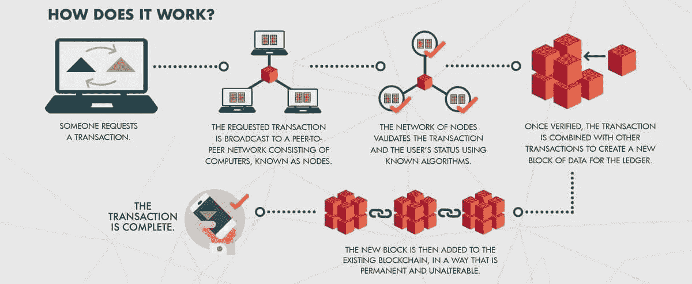

# 区块链之美

> 原文：<https://medium.datadriveninvestor.com/the-beauty-of-blockchain-13638ce41eae?source=collection_archive---------11----------------------->

Source: tokentarget

如果你到现在还没有听说过 [**【区块链】**](https://en.wikipedia.org/wiki/Blockchain) 技术，那么我可以假设你可能已经把头埋在沙子里或者刚刚从月球旅行回来。

你通常会听到术语区块链与加密货币****【一起使用——区块链和加密货币共享基本思想，加密货币利用区块链技术。区块链也被称为分布式账本技术或 DLT。****

**** [## 5 行业转型区块链应用|数据驱动投资者

### 除非你一直生活在岩石下，否则我相信你现在已经听说过区块链了。而区块链…

www.datadriveninvestor.com](https://www.datadriveninvestor.com/2019/02/13/5-real-world-blockchain-applications/) 

加密货币在 2017 年引起了相当大的兴奋，有 [**去中心化**](https://en.wikipedia.org/wiki/Decentralization) 的愿景，也有未来不受银行控制的梦想。**比特币的价值攀升至 20，000 美元以上，而 [**的狂野西部【ico】**](https://en.wikipedia.org/wiki/Initial_coin_offering)的首次公开募股(Initial Coin Offerings)正在为任何有想法利用区块链技术将企业令牌化的人筹集大量资金。**

**然而，区块链变成了另一个时髦词，尽管有这么多噪音和兴奋，许多人仍然不知道它是什么或它意味着什么。**

****

***Source: The Bernie Group***

## **引导方向的几个定义**

**区块链有两种基本类型:公立和私立。**

*   **区块链教允许任何人在没有官方许可的情况下读写数据。交易是公开透明和不可改变的。数据不能以任何方式篡改或更改。(对于自然希望对客户数据保密的企业来说，这可能是一个潜在的障碍)。**
*   **私有的区块链有已知的参与者，他们控制读写访问，作为私有网络工作。这些方法速度更快，可伸缩性更强，但是更加集中，容易被操纵。私有区块链对一组关联公司、一个行业团体或一个公司内的一个部门都很有用。**

**最初，由于最初硬币发行的炒作和短暂时刻，采用区块链技术的观点被视为有风险的，因此自然地，许多行业都很谨慎。****** 

******金融科技(fintech)仍然是区块链发展的领导者，但目前其他部门和行业也在不断努力逐步扩大其区块链计划。现在炒作已经过去，许多人看到了区块链的各种优势和潜在的使用案例，这将不可避免地继续其成熟的自然过程。******

******随着区块链的采用从可能走向实际，我们将继续听到组织通过将区块链集成到他们当前的业务模式中所带来的变化。或者通过使用这种颠覆性技术来改变系统和流程。******

> *******早在 4 月，福布斯发布了一份公司名单，这些公司的最低收入或估值为 10 亿美元，并且正在实施区块链技术。*******
> 
> ******亚马逊、花旗集团、脸书、谷歌、IBM、荷兰国际集团、英特尔、摩根大通和万事达卡等公司。******
> 
> *******你可以在这里看到榜单****↦****[***区块链 50:十亿美元宝宝***](https://www.forbes.com/sites/michaeldelcastillo/2019/04/16/blockchain-50-billion-dollar-babies/#1be1578e57cc)*******

*******随着区块链技术不断被更好地理解，随着时间的推移，成功采用该技术的人数将会增加，因为它具有颠覆医疗保健、能源、银行、法律服务等主要行业的惊人潜力。*******

## *******用例*******

*******由于区块链技术促进了加密货币直接支付的有效使用，它克服了许多长期存在的问题，这些问题是我们目前通过银行系统的当前基础设施日常处理的。*******

*******这项有益的技术承诺几乎不可破解的交易，创造前所未有的安全商务和记录保存。再加上即时无边界资金转移、安全清算、更好的结算和反洗钱机会，金融科技(fintech)行业在区块链发展中处于领先地位的原因显而易见。*******

> *******“有利可图的行业正在改变传统银行业”*******

*******该部门正在成为下一个伟大的技术革命。今天的创新金融科技解决方案的光明前景恰当地包括更高的安全性、更快的交易和金融服务的革命性选择。在不断变化、技术驱动的文化中，盈利行业正在用可行的解决方案转变传统的银行和金融，以充分满足消费者和企业的需求。*******

*******我们现在看到，2018 年出现的纯数字金融中介正在崛起，它们正在成功提供高级支付服务。*******

*******像 [**Revolut**](https://www.revolut.com/?lang=en) 、 [**Curve**](https://www.curve.app/) 、[**Loot**](https://loot.io/) 和[**Starling Bank**](https://www.starlingbank.com/)**等公司都是提供从预算、储蓄、控制支出、即时转账等工具的一切。*********

*****同样涌现出来的还有一些独立公司，它们的支付服务非常适合区块链。这些旨在提供进一步的好处，并克服典型的问题领域。*****

**********

*****随着这些数字金融中介和使用区块链技术提供高效支付服务的公司的崛起，我们显然正在缓慢而明确地摆脱应对过时和控制型银行系统的需要。*****

## *****那么这对我们消费者来说意味着什么呢？*****

*****我们已经能够以前所未有的方式受益。我们再也不用小心翼翼地随身携带大量现金、塑料卡，或者排队从 ATM 机取款。我们再也不用担心旅行时换钱了。有了更低的成本和更方便的访问，我们可以立即发送所需的现金给我们所爱的人，并轻松跟踪我们的所有支出。我们孩子的未来很可能是这样的，他们不知道在银行里等上几个小时是什么感觉。*****

## *****这对企业来说意味着什么？*****

*****更低的费用、直接支付、欺诈活动的减少，仅凭这些优势，企业采用利用区块链技术的支付服务是完全有意义的。*****

*****赌博、成人娱乐和约会等行业中的高风险商家习惯于应对高退款率和严重欺诈。幸运的是，对于高风险行业来说，加密货币等替代支付选择无疑有助于将这些问题最小化。通过明智地转向加密货币解决方案，高风险类别的商家可以享受传统支付方式无法提供的多种好处。*****

*****对银行来说，这将减少金融犯罪多发领域的欺诈行为。它还可以在 [**【了解你的客户(KYC)**](https://en.wikipedia.org/wiki/Know_your_customer) 等领域为他们节省数亿美元的处理成本。在这方面，每年都要花费大量资金来遵守尽职调查法规。区块链将无缝地允许一个机构通过另一个组织访问潜在客户所需的验证细节，从而避免重复 KYC 进程。*****

*****区块链技术可以对[汽车行业](https://www.e-zigurat.com/innovation-school/blog/blockchain-automotive-industry/)、[慈善](https://www.forbes.com/sites/ilkerkoksal/2019/07/12/how-blockchain-technology-can-re-invent-charity/#17dbd7a132db)、[云存储](https://hackernoon.com/decentralized-cloud-storage-how-it-will-change-the-face-of-the-internet-22-np1f2349h)、[征信](https://www.forbes.com/sites/samantharadocchia/2018/07/10/why-controlling-your-credit-history-is-possible-through-blockchain-technology/#2fdddfbb7c49)、[网络安全](https://www.forbes.com/sites/andrewarnold/2019/01/30/4-promising-use-cases-of-blockchain-in-cybersecurity/#6cde93d53ac3)、[教育](https://dataconomy.com/2019/01/how-will-blockchain-transform-the-education-system/)、[房地产](https://www.blockchaintechnologies.com/applications/real-estate/)、[旅游](https://www.cryptopolitan.com/blockchain-is-making-travel-industry-truly-secure-and-paperless-soon/)、[音乐](https://www.entrepreneur.com/article/328895)、[媒体](https://sloanreview.mit.edu/article/blockchain-is-changing-how-media-and-entertainment-companies-compete/)保险。*****

*****毫无疑问，我们可以看到，区块链技术是巨大的，在未来几年里，它将不可避免地继续进入许多行业。在这里，我仅仅触及了真实潜力的表面。但是毫无疑问，你会遇到有吸引力的选择，为你的企业提供有益的服务，或者满足你个人需求的服务。*****

## *****那么，区块链的美在哪里？*****

*****好吧，如果你还是没有想法，那么也许我应该放弃写作；)*****