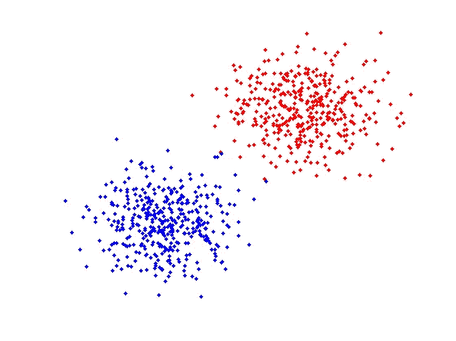
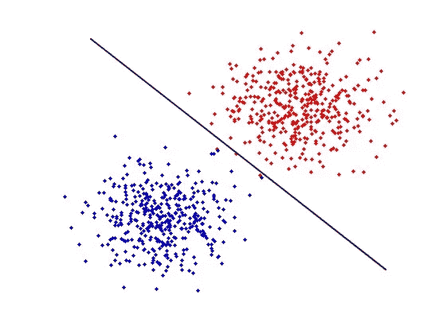
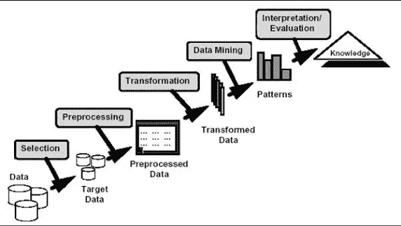
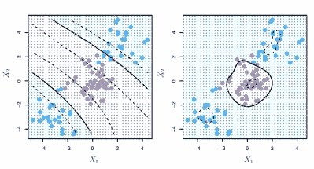

# 搜索引擎的起源

> 原文：<https://medium.datadriveninvestor.com/the-beginnings-of-a-search-engine-1429993b12dd?source=collection_archive---------16----------------------->

2018 年夏天，我报名参加了斯坦福大学的数据挖掘和分析课程 STATS 202。通过这门课程，我学到了数据科学的基础知识，包括随机森林、决策树和神经网络等概念。特别是，支持向量机(SVM)吸引了我的眼球，因为它有广泛的调优机会，包括内核类型和预算。

在课程结束时，我有机会通过创建一个类似于谷歌页面排名的模型来进一步研究数据科学。通过这个项目，我更加了解了支持向量机的美妙之处。

Figure 1: Sample Data Ready for SVM

支持向量机是将超平面分成两部分的分类器。假设给你一组看起来像左边图形的点。显然，有两个不同的点群位于图表的不同位置，红色和蓝色。如果建立一个模型来优化随机点的颜色预测，数据之间的分界线将是非常有益的。这正是 SVM 所提供的。对上述数据执行 SVM 后的图像如下所示:

我的项目围绕着分析 80047 个数据点，每个数据点有 12 个分类器，包括 url_id、query_length 和其他 10 个分类器。我创建有效模型的过程如下所示。

获得数据后，下一步是预处理，包括理解数据和各种不同的分类器。预处理还包括细化数据并确保没有数据点是异常值。对于过程的转换阶段，我决定尝试 4 种不同的模型:决策树、朴素贝叶斯、随机森林和支持向量机。这些模型的细节可以在本文末尾的 pdf 中看到。为了增强这些模型，我为每个模型使用了两种不同风格的调整，这也可以在 pdf 中看到。对于这些技术中的每一种，我都必须考虑到好处和影响，因为 MSE 的减少可能并不能定义全部的成功。

支持向量机被证明是我们数据的最佳模型，它因其各种调整方法而美丽，包括改变内核和改变预算。下图显示了 SVM 中使用的两种类型的核(除了线性核)，分别是多项式核和径向核。

接下来，基于预算的调优围绕着向不在向量边界内的点添加成本。如果成本较高，模型将能够适应更多的数据，但不如成本较低的模型灵活。

总体而言，我们使用 SVM 模型在训练集上获得的准确度约为 68.8%，这给出了 31.2%的 MSE。虽然这可能被视为每 3 个预测中有 2 个是正确的，但是对于这样的模型来说，大约 69%的准确度是相对较高的。传奇的拉里·佩奇(Larry Page)和谢尔盖·布林(Sergey Brin)构建了一个类似的算法，但有数百个以上的分类器。以下是所有数据模型的详细报告和结果。

