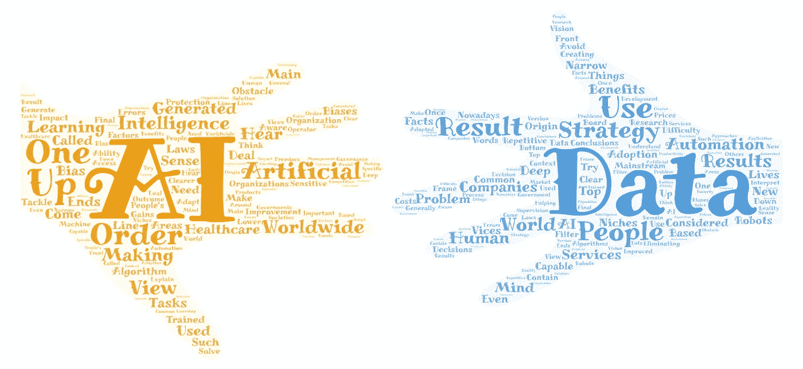

# 人工智能战略给全球组织带来的好处

> 原文：<https://medium.datadriveninvestor.com/the-benefits-of-an-ai-strategy-for-organizations-worldwide-3b890c5a6ee9?source=collection_archive---------28----------------------->

当人们听到人工智能时，像深度学习、机器人和公司中重复性任务的自动化这样的事情经常会出现在脑海中。现在人工智能研究处于利基市场，它被称为狭义人工智能，还不能根据常识做出结论。

人工智能主流应用的主要障碍是难以消除所用算法产生的结果中的偏差，这些算法是在数据中训练的，这些数据在其来源中往往也包含这些缺点，最终导致自动化决策，从而影响人们的生活。

人们通常甚至没有意识到这些事实，随着世界上新的数据保护法的出台，人工智能在医疗保健和政府服务等处理敏感数据的领域的开发和使用也需要有一个人工监管的数据治理战略，以避免偏见和错误。

为了解决这个问题，重要的是要“弄清楚”什么前提和因素被认为是生成机器学习算法的结果。换句话说，人类操作员能够在问题的上下文中解释和诠释该算法生成的结果的能力。

在我看来，人工智能策略的采用应该从两个方面来考虑，自下而上和自上而下，以便从一线人员那里了解他们对哪些方面可以改进的看法，并由组织的董事会进行筛选，获得更清晰的愿景，并制定最终版本。

一旦某个应用程序被某个特定的市场或组织采用，其他人就会尝试根据自己的实际情况调整解决方案，以保持竞争力。在我看来，全球采用人工智能的结果将是改善公司、社会和政府管理的决策过程，提高生产力，从而降低产品和服务的价格，这可能会改善医疗保健的可及性和成本，也有助于解决世界各地的贫困问题。