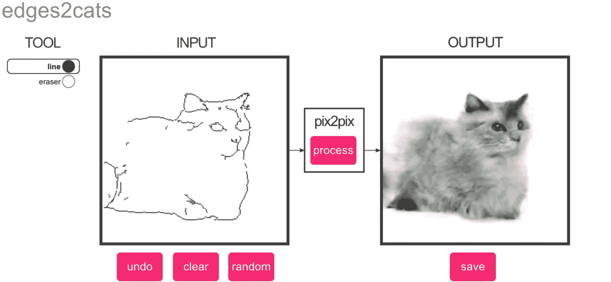

# 探索机器学习力量的最佳人工智能实验

> 原文：<https://medium.datadriveninvestor.com/the-best-ai-experiments-to-explore-the-power-of-machine-learning-eb2433c4b050?source=collection_archive---------6----------------------->

*Image: Christopher Hesse*

为了让普通人更容易接触和理解人工智能，世界各地的开发人员正在创建演示并向公众开放。通过图片、音乐、图纸等，这些有趣的人工智能实验展示了机器学习技术的创造能力。

这里是你今天可以在线尝试的最佳人工智能实验的集合。

# [AttnGAN](http://t2i.cvalenzuelab.com/) —图像生成机

[微软深度学习技术中心](https://www.microsoft.com/en-us/research/group/deep-learning-group/)的研究人员最近教授了一种算法来可视化基于文本的字幕。当研究人员仅在猫图像上训练人工智能时，它能够产生令人信服的输出。然而，当在更多样化的图像数据集上训练时，它变得有点不知所措。

Image: Rainie Nguyen

# 【艾二人转】 —与安弹钢琴

没有搭档一起弹钢琴？谷歌创意实验室的团队已经建造了一架响应你的钢琴。只需输入一些音符，机器就会对你的旋律做出反应。

# [pix2pix](https://affinelayer.com/pixsrv/) —图像到图像的翻译

多亏了这个[互动演示](https://affinelayer.com/pixsrv/)，你现在可以把你简单的线条画变成美丽的艺术作品，画一个简单的线条画，看着 pix2pix AI 自动把你的创作变成猫、建筑或鞋子。pix2pix 根据成对的图像进行训练，试图从您给它的任何输入图像生成相应的输出图像。

# [谢莉·艾](http://www.shelley.ai/)——人与人工智能合作的恐怖故事

基于人工智能的恐怖小说作家 Shelley 使用 Reddit 的 [r/nosleep](http://reddit.com/r/nosleep) subreddit 的令人毛骨悚然的故事进行训练，自 2017 年以来，她一直在与 Twitter 合作撰写恐怖故事。

Shelly 依靠 Twitter 用户通过自己写一行来继续这个故事，然后用她自己的转折来结束它。在 Shelley 的主页上找到 Shelley 写的短篇小说和更多信息。

# [快速照片风格](https://github.com/NVIDIA/FastPhotoStyle) —照片风格转换

由科技公司 NVIDIA 创建的 [FastPhotoStyle](https://github.com/NVIDIA/FastPhotoStyle) 是一种算法，可以将任何照片的风格转移到完全不同的图像，产生一些非常令人信服的结果。

以下是 FastPhotoStyle 的一些功能示例:

Image: Yijun Li

# 想看看完整的名单吗？

[*点击这里查看更多酷炫的人工智能实验和演示。*](https://lionbridge.ai/articles/10-craziest-ai-experiments-to-try-online-today/)

# 来自 DDI 的相关帖子:

 [## 用 7 个步骤解释深度学习——数据驱动投资者

### 在深度学习的帮助下，自动驾驶汽车、Alexa、医学成像-小工具正在我们周围变得超级智能…

www.datadriveninvestor.com](https://www.datadriveninvestor.com/2019/01/23/deep-learning-explained-in-7-steps/)  [## 数据科学和软件工程哪个更有前途？-数据驱动型投资者

### 大约一个月前，当我坐在咖啡馆里为一个客户开发网站时，我发现了这个女人…

www.datadriveninvestor.com](https://www.datadriveninvestor.com/2019/01/23/which-is-more-promising-data-science-or-software-engineering/)