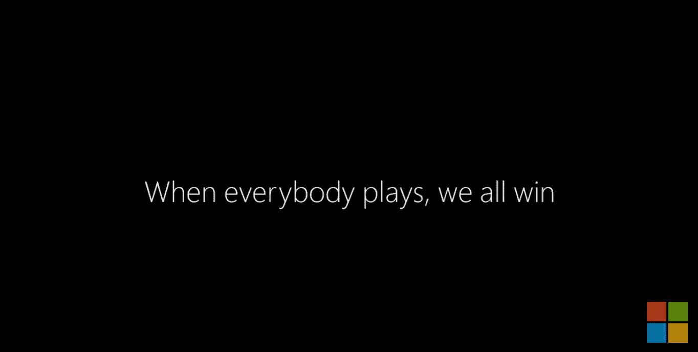
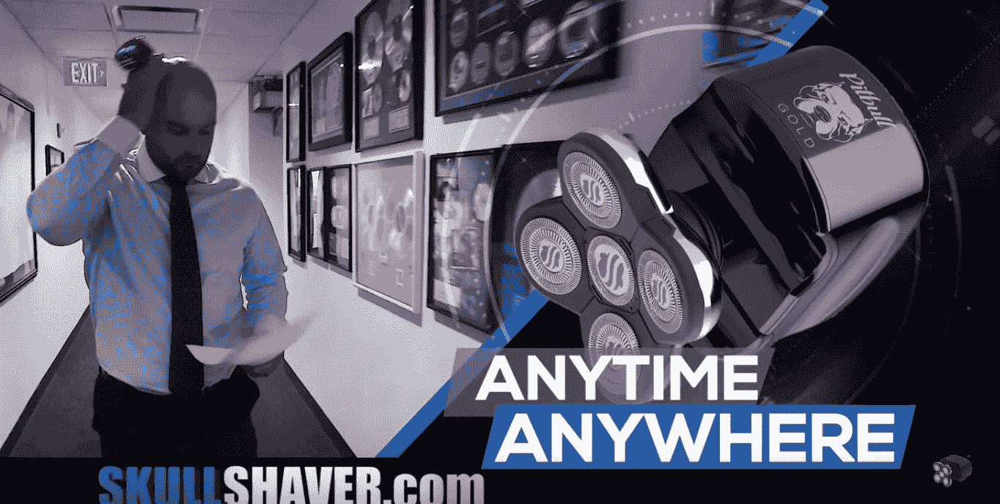
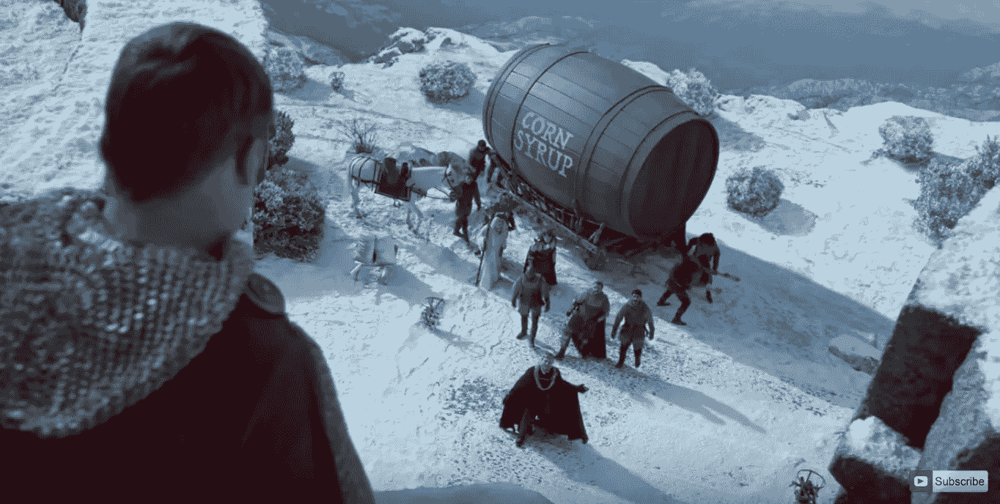

# LIII 超级碗最佳商业广告(分析和文案分析)

> 原文：<https://medium.datadriveninvestor.com/the-best-commercials-of-superbowl-liii-analysis-copy-breakdown-6c9be3bee4b7?source=collection_archive---------6----------------------->

昨晚是超级碗。

尽管公羊队和帕特队进行了一场非常无聊的防守战，但今晚有一部分没有让人失望。

商业广告。

今年有一些非常有效的。

作为一名广告人，我个人认为有三家公司在向大众销售产品方面做得非常出色。

我将在这里把它们全部分解，并分析它们为什么如此有效…所以你可以试着把同样的原则用在你自己的广告上。

让我们来看看第 53 届超级碗最佳广告中的铜牌、银牌和金牌得主…

# 铜牌:微软的“我们都赢了”活动

男人…谈论拉你的心弦。

这首歌触动了你的情感。

老实说，我甚至不知道这些特殊的自适应游戏控制器的存在。

我本人不是游戏玩家。真的没有时间或欲望开始玩电子游戏。

但如果我真的买了，我可能会优先考虑买一台 Xbox。

现在，我不确定他们这次活动的目标市场是谁。我只能推测。但我很确定这是一场针对目前不是游戏玩家的活动。

这个广告给我带来了以下好处:

**它改变了我对微软的内在信念。**

看完之后，我的感受和新的信仰体系是:

*“微软是一家创新公司，如果他们能为残疾儿童创造这种控制器。我认为他们采取主动是非常了不起的。我还没见过其他公司这么做。”*

以下是他们做得好的其他几件事:

**他们开始使用(很像百威啤酒)长篇故事和大众媒体中的多步连载故事。这真他妈的酷……因为我认为这是最好用电子邮件营销和社交媒体来做的事情。我不确定这能在电视上实现。但这似乎正在成为趋势。**

记得欧文吗？

Owen, the star of TWO major Microsoft commercials.

你可能会从微软在 2018 年 11 月和 12 月播放的“他要做到”节日广告中认出他。

他们放大了欧文(和其他几个孩子)在超级碗广告中的个人故事和奋斗。

他们展示了他们的产品是如何被使用的。

他们不只是说，“我们有一个令人敬畏的新的自适应控制系统，让每个人都可以享受我们的游戏。”

他们真的给你看了。

演示是广告中最有力的证明形式。使用它。

在整个一分钟的广告中，你可以看到孩子们有效地使用自适应控制器。

所以我可以想象，如果你是一个需要自适应控制器的孩子的父母…看到这个广告后，你怎么会不买微软的呢？

采访父母也非常有效。

有一段欧文的爸爸说，

> “早期最大的恐惧之一是，其他孩子会如何看待欧文……但当他打球时，他并没有什么不同。”

天啊。

这对你打击很大。

这是一个让你既无比悲伤又无比充满希望的声明。

好的广告唤起情感。这个超级碗广告在这方面做得非常出色。

他们也以一个很棒的标签结束。

它让你在这个有时有点疯狂和沮丧的世界里感觉良好、快乐和充满希望。

干得好，微软。

# 银牌:骷髅刨“皮特保罗”

超级碗广告是出了名的昂贵。

公司吹嘘他们如何花费数百万美元来播放 15 秒钟的广告。

因此，除非你是一家已经拥有全球品牌和分销系统的大公司，否则对大多数公司来说，这种广告支出真的很难获得投资回报。

然而，我预测有一家公司会赚回那笔钱，而且是好几倍。

这就是为什么我认为 Skull Shaver 的皮特保罗超级碗广告做得如此不可思议。

我承认，我有点偏心。

我喜欢直接回应广告。

> 直接回应广告旨在立即销售。也就是说，在广告的最后…如果我们做得好…你实际上是在掏出你的信用卡，给我们汇钱来购买你刚刚看到的产品。

这与大多数超级碗广告略有不同，后者使用的是形象或品牌广告。

对于很多大公司来说，他们在你走进的每家商店都有产品，他们可以不立即进行销售……因为他们专注于引起信仰的改变，稍微改变你的世界观……所以下次你考虑做出购买决定时，你会购买他们的产品，而不是他们的竞争对手。

无论如何…

骷髅刨削者昨晚可能赚了一大笔钱。

这是一个完美的销售视频。

他们开始大声疾呼:

*“嘿光头佬！”*

没有比这更直接的了。

*“正在寻找一种在 90 秒内剃光头的好方法……没有划痕或切口？”*

这是一个经典的没有你讨厌的东西的大福利。

他们真的击中了每个秃头男人的痛点。如果你剃过头，那你就是割伤了自己。

事实上，你可以剃光你的整个头发，而不会经历任何字面上的痛苦……并在 90 秒内完成整个过程，这就是“梦想成真的解决方案”

然后，他们继续说:

*“看看头骨刨削者的全新皮特保罗。”*

介绍产品。让人们知道它是新的。人们喜欢新事物。

“它是防水的，所以你可以湿刮或干刮。”

处理人们可能有的问题/异议。此外，它还提供了另一个令人惊叹的优势……多功能性和选择。

它有灵活的轮廓刀片，这样你就能得到尽可能平滑的剃须。伙计们……没有刻痕，没有割伤。”

所以我们来考察一下这句话。

这是一个功能/优势项目符号。

它有【产品特色】，所以你可以【体验好处】。

这是经典的直接回应文案。很棒的东西。

*“你可以随时随地刮胡子……不管是湿的还是干的。在 90 秒内完成。*

让我们来看看屏幕上发生了什么…

广告的这一部分确实说明了问题。

我们再次展示了一个戏剧性的例子。

这家伙在工作，穿着有领衬衫…甚至没有注意到。

**你能想象穿着漂亮的衣服，一边工作，一边读一些狗屎，没有专注于你正在做的事情，一边试图用一把直剃刀刮你的头吗？**

这简直是疯了。

但是有了这个产品…你可以做到这一切。

最后，它以行动呼吁结束:

在 Skull Shaver dot com 查看全新的皮特保罗

他们直接把你送到他们的网站，这样你就可以立即购买。这实际上可能很难，因为我和妻子都试图查看网站，但服务器崩溃了，我们甚至无法访问。

他们从那个广告中获得了那么多的流量。

干得好，头骨刨削者。

很好。干净。简单的广告。很棒的产品。精彩的演示。解决了很多人生活中的一个现实问题。

在我忘记之前，还有两件关于这个广告的事情我忘了提…

他们把这种产品命名为皮特保罗。牛逼的名字。很男性化。我们可能都认识一个拥有一两只比特犬的秃顶大汉。

也许他们知道人们会产生这种联想。

每个人都想变得高大强壮。这种心理联系可能影响了这个产品的命名…我真的不能确定。或者，也许这听起来很棒。不管怎样，他们做得很好。

这个广告也有我喜欢称之为“老派病毒”

意思是:它在网下疯传。

我们在电视广告上看到了这个……然后所有人立刻转向我们想到的第一个秃顶的人，给他发短信或打电话。

我弟弟刚开始剃光头。我给他发了短信。

昨晚，这样的场景在美国家庭中上演了多少次？

把这个情况乘以最少 100 万。

他们整场超级碗只播了一个节目。但是该死的…我迫不及待地想看到他们从那次广告购买中的销售增长。

*** * *骷髅头的备案机构是 AVC 传媒集团。** [**在此查看。**](http://www.avcmediagroup.com/) *******

# 金奖:百威淡“快递”

还记得你参加 sat 考试的时候，你必须做所有这些类比吗？

__ 之于 __ 如同 __ 之于 __ 一样。

嗯…

汤姆·布拉迪之于足球，就像百威啤酒之于超级碗广告。

百威啤酒是全球啤酒广告无可争议的重量级冠军。如果你不同意，我就和你打。

让我们来看看他们最新的杰作…

这就是百威啤酒在这场运动中成功的秘诀。

首先，这些商业广告非常有趣。他们真的是。看到他们我就笑。演技很棒。他们有滑稽的俏皮话，取笑自命不凡的饮酒者。

他们只是让你笑。

**第二，它们以明显的《权力的游戏》风格设定和伪故事情节吸引眼球。这是电视上最受欢迎的节目是有原因的。**

不管是什么原因，对百威啤酒来说都不重要。但是他们认识到人们会变得疯狂，所以他们设计了这个概念来迎合这股流行浪潮。非常聪明。

他们也在发展长篇故事的概念，并在大众媒体上连载故事。每一个商业广告都是故事的另一部分。

**他们训练你关注他们的广告，因为你不仅想知道接下来会发生什么……你也不想错过故事的下一部分。**

这真他妈的聪明。

还有…

这些广告感觉一点都不像广告。

当你看广告的时候，感觉就像是 30 秒钟的《GOT 》,如果 GOT 是关于啤酒的搞笑节目。

在这个广告中，他们带着玉米糖浆旅行…在不同的城堡停留…在船上航行，同时被一只巨大的乌贼攻击。这和骷髅头剃须刀形成了鲜明的对比。

这些广告真的把你带到了另一个世界，一个比你现在生活的世界更有趣的世界。

我们不要低估这一战略的重要性。

他们做的另一件大事是巩固了他们作为“透明和诚实”啤酒公司的地位。

他们的整个特别递送广告概念是基于这样一个故事，即他们必须将玉米糖浆递送给其他人……这些人实际上在他们的啤酒中使用了这种不好的东西。

由于许多其他的健康运动、饮食研究和公益广告，我们作为一个社会，已经非常清楚糖和玉米糖浆的危害。

百威淡知道这一点。

关于他们产品的优越性，他们介绍了一个被称为“不可否认的事实”的东西。

下次你去酒铺，在巴德、米勒或库尔斯之间做选择时，你会选择巴德。

**你如何欺骗自己，并试图合理化这种想法，即加玉米糖浆的啤酒比百威啤酒对你更好……我们现在都知道百威啤酒含有更多“干净和纯净”的成分？**

他们在你的大脑里种下了怀疑的种子。下次有人递给你一杯米勒或库尔斯时，你会觉得有点奇怪。

我现在唯一的问题是…

米勒和库尔斯会如何应对？

这个商业广告不仅仅是一次偶然的机会——这是一次直接的成功！

百威淡啤一拳打在他们俩的嘴上。我希望我们看到一场恶战。

无论如何…

他们做得很好。

他们让我真的后悔没有让百威啤酒来看比赛。

我不认为我会再犯同样的错误。

如果你喜欢这篇文章，请按住“拍手”按钮，直到它达到 50。请将此分享给你认识的会喜欢它的人。感谢阅读！