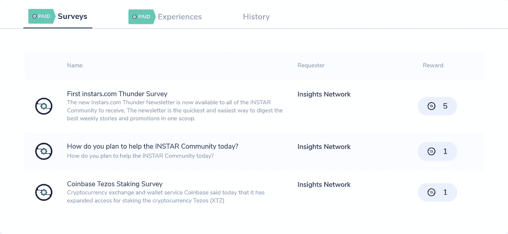
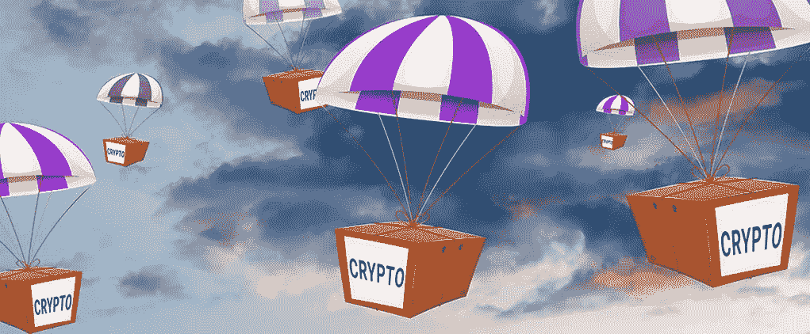
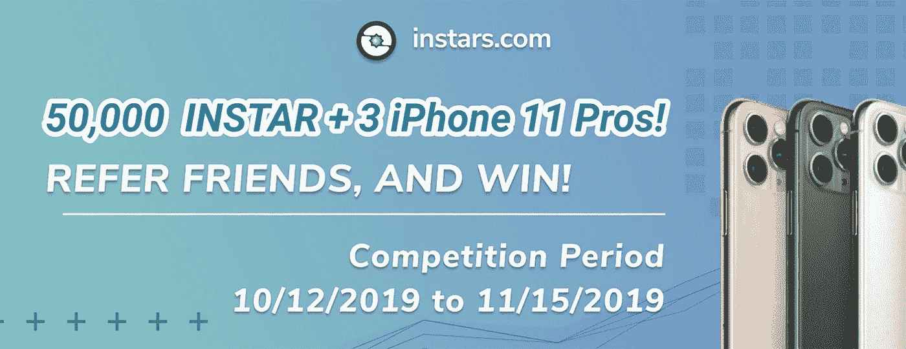
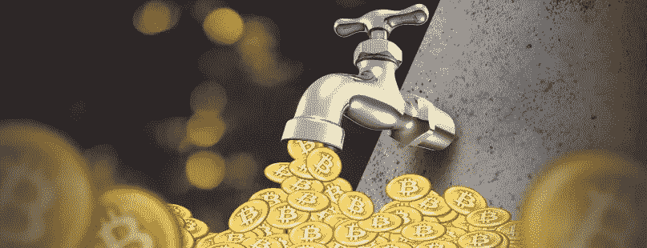

# 快速获得免费加密货币的最佳方式

> 原文：<https://medium.datadriveninvestor.com/the-best-ways-to-earn-free-cryptocurrency-quickly-5e840d24b581?source=collection_archive---------7----------------------->

## 随着越来越多的人被充满活力的加密货币行业所吸引，它的某些方面变得显而易见。


With a variety of methods now available to earn free cryptocurrency, which ones are the best? | [Source](https://pixabay.com/illustrations/bitcoin-coins-virtual-currency-4205661/)

许多人想参加，但受到进入和参加 crypto 的复杂方法的限制。然而，一旦他们开始，过程很快就变得简单。

和大多数事情一样，开始可以说是最难的部分。随着市场上出现了像 [Instars](https://instars.com/) 这样的平台，出发正成为旅程中最自然的一部分。

[](https://www.datadriveninvestor.com/2019/03/10/swiss-based-etp-enters-the-crypto-trading-market/) [## 总部位于瑞士的 ETP 进入加密交易市场|数据驱动的投资者

### 虽然金融市场几乎没有沉闷的时刻，特别是在引入…

www.datadriveninvestor.com](https://www.datadriveninvestor.com/2019/03/10/swiss-based-etp-enters-the-crypto-trading-market/) 

这篇文章回顾了人们可以通过哪些方式获得免费的加密货币，以及为什么 Instars 是那些想要开始或继续他们旅程的人的热门选择。

# **赚取免费加密货币**

赚取免费的加密货币可以说是在去中心化行业开始你的旅程的最简单的方式。也是最安全最方便的方法。风险极小。

对于初学者，甚至是业内的高级人士，免费的加密货币可以作为一种无风险的投资，只需要一点点时间，并在任务后获得有保证的回报。

在一些情况下，加密货币必须完成任务才能获得奖励，因此出现了术语**“收入”**

根据您选择的平台，您可以参加各种平台活动来赚取您的免费加密货币。

赚取免费的加密货币可能采取各种形式，这是我们将要讨论的。

## *通过参与投票和调查获得收入*

在[年龄段](https://instars.com/)，这可以说是赚取加密货币最常见的方式。

这种形式的收入是用加密货币来交换你所拥有的关于被投票或调查的话题的信息。为了获得奖励，您必须根据调查人员的指导提交您的回答。



Instars.com has numerous daily surveys and paid experiences for users to complete and earn free cryptocurrencies | [Source](https://instars.com/)

不同的调查有不同的奖励等级，都是基于 INSTAR token。

Instars 最近推出了付费体验，作为赚取加密货币的另一种方式。平台会奖励您使用他们的 INSTAR 令牌查看当天的交易体验。

# **空投**

2017 年的行业繁荣之后，各公司进行了几次空投，免费发放代币。



Airdrops are used prominently as a promotional tool for projects | [Source](https://hackernoon.com/all-you-need-to-know-about-crypto-airdrops-aka-free-money-243e60b22493)

通过空投赚取加密货币是启动或分散投资组合的另一种简单方式。

可悲的是，空投变得越来越稀少，因为它们的目的在 2017 年的加密货币高峰季节已经实现。

大多数提供空投服务的公司都试图提高他们产品和服务的知名度。那些寻找空投的人往往在签约之前就已经了解了这家公司。

Instars 也在该平台建立基础时进行了空投。然而，这些现在几乎不存在了。

可以肯定的是，已经建立的平台不会很快发布其他空投。

# **奖金**

这些在业内还是常见的。

当一个用户完成一个特定的任务时，奖励就会被给予。这可能就像加入平台一样简单。只要在 Instars 等平台上建立一个账户，就能获得一笔本地代币奖励。

奖金有不同的形式和不同的季节，确保几乎全年，人们都可以通过做最少的工作来赚取加密货币。



There are year-wide prizes and promotions on Instars for users to earn | [Source](https://instars.com/)

对于 Instars 来说，其他奖金也与比赛挂钩。用户不仅可以获得代币，还可以获得实物奖励。

各种平台根据设定的标准发放奖金。在 [Instars 的](https://instars.com/)案例中，这似乎是任何潜在参与者的显而易见的选择，因为与其他提供类似奖金的平台相比，他们会获得更多。

# *水龙头*

这些可以说是最烦人的方法。他们的投资回报率很低，但往往需要更多的参与。



Faucets are widely-used to earn very small amounts of crypto | [Source](https://sugikingdom.com/ultimate-crypto-faucet-list/)

与调查和民意测验不同，用户必须完成访问网页、玩游戏、点击特定广告或过滤内容等任务。与任务完成后提供的奖励相比，这样做所需的投入更高。

有这种设置的网站让赚取免费加密货币成为一件乏味的事情。

许多人可能更喜欢 Instars 的原因之一是它没有水龙头。考虑到一个人必须做出的投入，Instars 的奖励是公平和令人满意的。

# **整包**

Instars 还配备了用户会觉得有用的服务。

对于一个奖励或回报加密货币的平台来说，他们在建立钱包服务时想到了他们的用户。

Instars 用户可以将他们的加密货币保存在 Instar 提供的 Instar 钱包中。Instars 通过这种互补的服务使参与其平台变得方便。

学习实验室是 Instars 上的另一个有利可图的功能，这使它成为一个受欢迎的选择。通过学习实验室，Instars 开展了关于区块链技术、加密货币和使用其平台的课程。

因此，Instars 用户获得的不仅仅是免费的加密货币。他们被教授它们的价值，以及如何在未来使用它们来增加更多的价值，或者用来交易法定货币或其他加密货币。

# **结论**

在这篇文章中，我们看到了各种平台用来帮助其用户赚取免费加密货币的方法。这些方法从简单到繁琐不等，取决于所需的输入和工作量。

我们也看到了为什么 Instars 是新的和现有的加密货币行业参与者的热门选择。

Instars 奖励更多，每赢得一个代币需要的投入更少，因此使该平台更受欢迎。

此外，Instars 还提供额外的服务，作为其已经提供的“免费加密货币”服务的补充。

考虑到所有因素，Instars 比其他加密货币奖励平台更受欢迎也就不足为奇了。

有关 Instars 的更多信息，请使用以下链接:

[网站](https://instars.com/) | [推特](https://twitter.com/instartoken) | [电报](https://t.me/InsightsNetwork) | [媒体](https://medium.com/@InsightsNetwork) | [Reddit](https://www.reddit.com/r/instar/)

***# insights network # INSTAR # instars . com #领养#调查#数据#隐私***

```
***Disclaimer:*** *Please only take this information as my* ***OWN*** *opinion and should not be regarded as financial advice in any situation. Please remember to* ***DYOR*** *before making any decisions.*
```

♂️你好，我叫萨尔。*如果你觉得这篇文章有用，并想查看我的其他作品，请务必鼓掌并关注我的* [*中型*](https://medium.com/@salmanmiah) *和* [*LinkedIn！*T32*😎*](https://linkedin.com/in/salman-miah-57aa90a0/)