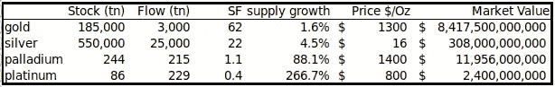
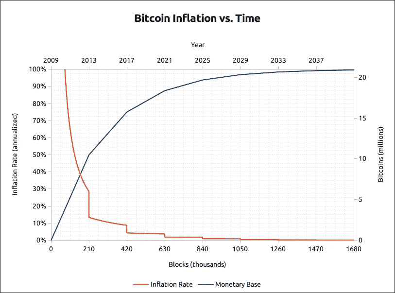
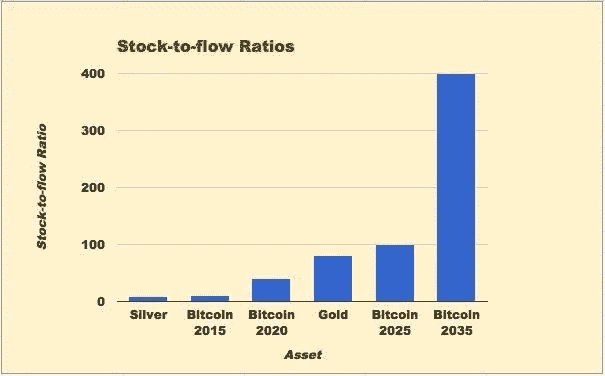

# 对比特币最大的误解

> 原文：<https://medium.datadriveninvestor.com/the-biggest-misconception-about-bitcoin-7c3a71514752?source=collection_archive---------0----------------------->

## 理解比特币很难。我在 2017 年吞下了兔子洞，经过两年不间断的研究，我现在才开始理解它更深层次的含义。

因此，对于大多数人来说——他们可能只是顺便听说过一两次——比特币仍然是一个完全陌生的概念，这并不奇怪。

当人们对某件事了解不多时，错误信息就变得更容易传播。

 [## 模式和机器人:复杂的现实|数据驱动的投资者

### 哈耶克的名著《复杂现象理论》(哈耶克，1964)深入探讨了复杂性的话题，并断言…

www.datadriveninvestor.com](https://www.datadriveninvestor.com/2019/03/04/patterns-and-robotics-a-complex-reality/) 

对比特币的一个基本误解是，它的主要用途是支付。

而这阻止了人们理解比特币的真正目的。

我这么说是什么意思？

如果你问街上的大多数人(如果他们听说过比特币的话)，他们会告诉你，这是一种购买咖啡或支付服务费用的不同方式。

大多数这样看待比特币的人会对它不屑一顾，因为在简化日常交易方面，它并不比 PayPal、Apple Pay 或信用卡更好。

人们听说了每秒 7 笔交易的限制、高昂的费用和交易的不可逆性，很自然地得出结论，比特币听起来相当有限。

除此之外，你还会想到它是 10 年前凭空出现的，它的价格每天都在剧烈波动，你就能明白为什么比特币的想法如此容易被忽视。

从这里可以很容易地陈述出比特币不起作用的所有原因。

人们会问，为什么不采取更多措施来提高其交易率，如果这不可能，为什么我们不转向另一种加密货币。

但这种“比特币作为支付手段”的想法的问题在于，它是完全错误的。

目前，比特币不需要有很高的交易率，因为它没有与 PayPal 或 Apple Pay 竞争。

目前，比特币正在与美元竞争。

这不是另一种支付形式，这是一种全新的*货币形式。*

如果你从来没有想过你的钱实际上*是什么*，那么最后一句话可能会有点伤你的脑筋。

不啰嗦了，让我们用 60 秒钟(太简单了)来解释一下钱。

# 钱是什么？

在整个人类历史中，货币以多种形式存在——这是我们最古老的技术之一。

珠子、贝壳、兽皮、石头、牲畜、武器、盐、金属和纸都曾被人类社会广泛用作货币。

这些物品充当货币，因为它们在人类环境中确实稀缺。

使用树枝或树叶作为货币是没有意义的，因为人们不需要这些东西。

另一方面，手工制作的金属匕首、一串漂亮的珠子或一张有用的兽皮对人们来说是很难生产的，因此它们的稀有性赋予了它们价值。

最终，这些稀有物品中的一些开始被接受，不是为了获得物品本身，而是作为两种其他物品之间交易的中介。

例如，如果我想购买你刚刚捕获的鹿，但我只有一把斧头可以交易，这些物品价值的潜在差异使交易变得困难。

因此，第三种有价值的物品，即易于携带和分割的物品，可以用来计算鹿的价值，我可以用它来支付你。

最适合此目的的项目需要做三件事:

它们需要被使用它们的人认为是有价值的，并倾向于随着时间的推移保持它们的价值(价值储存)。

它们被用作两个其他物品交换的媒介，在这个过程中不会被用完(交换媒介)。

并且由于它们被用作交换媒介，逐渐成为衡量价值的默认方式，即鹿值 20 个金币(记账单位)。

因此，通过这三个功能，这些物品成为我们所知道的货币。

那么这和比特币有什么关系呢？

就像我之前说的，比特币——就像它之前的珠子、贝壳和金属片一样——是一种新的货币形式。

它被发明 10 年后，人们仍在谈论它的原因是，它是我们拥有的最好的货币形式。

这句话基本上需要一整本书来解释(这一点《比特币标准》做得很好)，但我会在这里快速总结一下。

从本质上说，只有当使用者认为某样东西有价值时，它才能起到货币的作用。那东西的价值直接取决于它的生产难度。

黄金是所有金属中最有价值的原因主要由两个因素决定:我们已经开采了多少(其存量)和我们每年从地球上挖出多少(其流量)。

本质上就是这样。

铜、锡、铅、青铜和银的工业需求都远远大于黄金，但黄金的价值要高得多。

Stock to flow ratios of various metals ([source](https://medium.com/@100trillionUSD/modeling-bitcoins-value-with-scarcity-91fa0fc03e25))

为什么？

归结起来就是这个存量与流量比(SF)。

我们在任何一年从地球上挖出的新黄金数量大约是其现有储量的 2%,使其 SF 大约为 50。

拥有如此高的 SF 意味着你可以在购买黄金时充满信心，即使供应突然激增，你的投资价格也不会暴跌。

即使黄金产量翻一番，这是非常困难的，也只能将黄金存量从 2%增加到 4%，这几乎不足以对黄金价格产生显著影响。

摘自《比特币标准》:

> “正是这种持续的低黄金供应率，是黄金在人类历史上一直保持其货币地位的根本原因。”

高 SF 让你对该物品的稀有性有信心，从而实现了货币的第一个功能:随着时间的推移成为价值的持续储存。

历史上没有其他物体像黄金一样具有如此高的 SF。

直到比特币。

比特币总数的上限，以及不断减少的供应计划意味着比特币正在成为人类有史以来最稀缺的东西。

目前，每 10 分钟就有 12.5 个比特币被创造出来，并奖励给解决每个新区块的矿工。

(如果那句话没有意义，[下面是比特币工作原理的简要概述。](https://simplebitcoin.co/bitcoin-explained-with-pokemon-cards/))

Bitcoin’s inflation over time ([source](https://www.google.com/url?sa=i&source=images&cd=&ved=2ahUKEwjI3aXNzqnkAhXYF3IKHZ0GAl4QjRx6BAgBEAQ&url=https%3A%2F%2Fbitcointalk.org%2Findex.php%3Ftopic%3D130619.0&psig=AOvVaw2exLmRtd2eAwt8g2WtQQnG&ust=1567220783024586))

这使得比特币的 SF(截至 2019 年 8 月)为 22.7。

2020 年 5 月，供应量减半至每块 6.25 个比特币，比率飙升至 55。

比特币供应量减半的过程每四年发生一次，这种方式是为了模仿黄金的稀缺性。

这种供应减半的情况将持续到 2140 年，届时，一旦流通中的比特币总数达到 2100 万，它就会停止，再也不会有比特币被生产出来。

Bitcoin’s future stock to flow ratio ([source](https://imgur.com/gallery/ml5o2UR/))

因此，我们可以看到，即使到明年，比特币的 SF 也将接近黄金的 SF(比特币为 55，黄金为 50–60)。

但在接下来的一半时间里，比特币的数量飙升至 100 多枚，此后每四年翻一番。

由此得出的结论是，几年后，比特币将比人类社会有史以来生产的任何东西都更加稀缺。

这是一件大事。

历史一次又一次地向我们表明，当多种形式的货币并行使用时，每次都是最难(或最可靠)的货币胜出。

比特币是我们发明的最可靠的货币。

# 价值储存手段

好吧，理论上说比特币应该是一种很好的价值储存手段。但是现实怎么说呢？

嗯，考虑到过去 10 年比特币一直是世界上表现最好的资产，我想说现实也是如此。

人们指出比特币价格的大幅上涨和暴跌，并表示比特币太不稳定，无法成为良好的价值储存手段，这是一个泡沫，但这种观点有两个问题。

首先，好的价值储存手段并不意味着在短期内持续稳定。住房和股票“泡沫”以惊人的规律出现，但没有人说它们是糟糕的价值储存手段，比特币也不例外。

每次价格上涨时，随后的暴跌总是以高于前一个周期的低点结束，这意味着它的价值随着时间的推移一直在增加，即使价格波动很大。

第二，投机泡沫破裂后再也不会膨胀。人们喜欢将比特币比作 17 世纪 30 年代的投机郁金香狂热，但几年后这种狂热并没有复苏。18 世纪 20 年代的南海泡沫或历史上任何其他投机泡沫都没有。

但是围绕基本有用的新技术形成的泡沫总是会恢复。想想 21 世纪初的网络泡沫，19 世纪的铁路狂潮，或者任何一次股市崩盘。这些主要是由人性的非理性造成的，如果你知道要寻找什么，这些是可以预测的。

由于比特币的市场规模仍然相对较小，它很容易受到过度乐观或悲观投资者的大幅波动。

好的价值储存是指在长期内保持或增值的东西——几十年到几个世纪。在这个时间尺度上，短期波动完全无关紧要。

# 货币的其他属性

好吧，现在可以很有把握地说，比特币是一种很好的长期价值储存手段。但这就意味着它自动变成了钱吗？

不，还没有。

正如我们前面说过的，要使某物发挥货币的功能，它还需要发挥交换媒介和记账单位的功能。

由于比特币没有被商家广泛接受或用于计算商品和服务的价格，我们还不能说比特币实现了货币的所有功能。

这就是反对者被抓住的地方。他们认为比特币速度慢且不稳定，并认为没有多少人使用它来买东西，因此他们认为他们永远不会使用比特币，应该用其他东西来代替比特币。

但是这种思路的问题是它完全落后了。

你会像我们的祖先一样不太可能接受我的棍子作为报酬，因为你们都明白棍子毫无价值，因此对你们来说是一笔糟糕的交易。如果我告诉你这根棍子被“区块链保护着”，我可能会更容易让你认为它很有价值，但归根结底，它还是一根没用的棍子。

你也许能明白我的意思。声称其他加密货币作为货币的功能比比特币更好，完全忽略了货币最重要的一点:它首先需要成为价值储存手段。

人类历史上所有用作货币的物品都遵循同样的模式:

首先，它是从收藏品开始的。人们出于某种兴趣积累了这些东西——它们很稀有，通常要么漂亮，要么有用，或者两者兼而有之。

因为它们很难生产，而且人们认为它们很有价值，所以它们逐渐成为一种价值储存手段——人们在很长一段时间内仍然需要它们。

因为它们很受欢迎，它们开始在个人和团体之间交易，最终成为交易媒介和记账单位。

这是一个古老而久经考验的过程，不是几句朗朗上口的流行语就能颠覆的。

所以，不，比特币现在还不能很好地发挥货币的功能，但它正在朝着这个方向发展。

人们越是将它视为价值储存手段，就越想持有它。

持有它的人越多，它的价格最终就越稳定。

它变得越稳定，就有越多的人可能用它来交易。

这就是它成为交换媒介和记账单位的原因。

像闪电网络这样的额外功能层将允许比今天更大的交易可扩展性，就像互联网早期的额外功能允许笨重的 TCP/IP 协议从几 kB 的容量扩展到数十亿用户的高速流。

这些额外的层将促进比特币的扩展，直到有一天除了最大和最重要的交易之外，其他交易都将发生在比特币的基础层。

日常支付将发生在第 2 层(如闪电)甚至第 3 层技术上。

这才是重点。

我们今天知道的比特币并不是为了每秒处理数千笔交易而建立的，也不是为了便宜、稳定和安全。

没有加密货币能做到所有这些。

安全性、价格稳定性和速度之间存在巨大的权衡。如果你想要一个超快的网络，它需要在设计上高度集中，因此不安全。如果它的供应时间表不可靠，它就永远不会成为价值储存手段。

而且你不可能拥有一种去中心化的、安全的、而且交易廉价的超级快速的加密货币。你需要来自成千上万个节点的验证和昂贵的挖掘来保护网络。

但是货币的历史告诉我们，最可靠的价值储存手段最终会战胜次等的价值储存手段。

所以，不，比特币目前不太适合支付，但这不是它现在的本意。

比特币不是更好的贝宝，而是更好的美元。

这是我写的关于比特币最大化系列的第二篇文章。您可以 [*注册我的简讯*](http://www.simplebitcoin.co/) *来接收它们，或者关注我的* [*中*](https://medium.com/@lucdossis) *或* [*推特*](http://twitter.com/LucDossis/) *。*

*阅读第一部分:* [*我的比特币最大化之路*](https://medium.com/swlh/my-path-to-bitcoin-maxmalism-40d43bb330c5) *这里*

*原载于*[*https://simplebitcoin.co*](https://simplebitcoin.co/the-biggest-misconception-about-bitcoin/)*。*