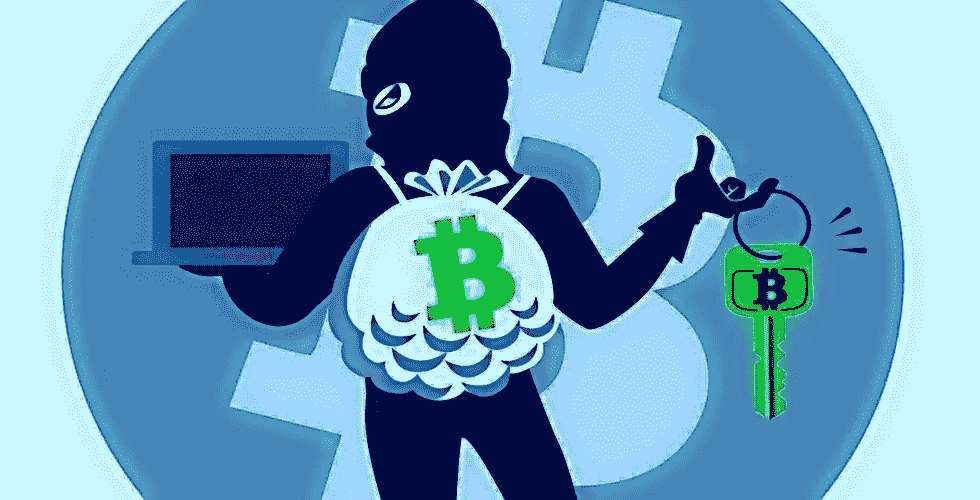
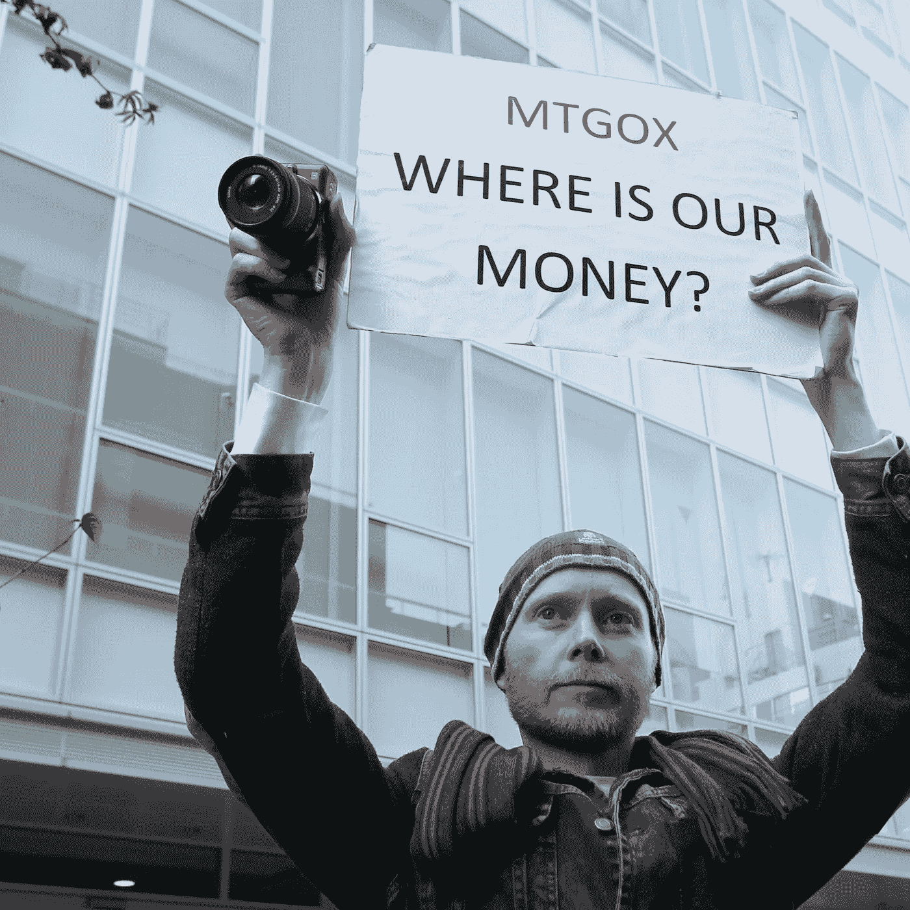

# 历史上最大的抢劫案:价值 5 . 3 亿美元的 Coincheck 加密货币盗窃案

> 原文：<https://medium.datadriveninvestor.com/the-biggest-robbery-in-history-530-million-worth-of-coincheck-cryptocurrency-theft-babce690af1d?source=collection_archive---------8----------------------->

自从加密货币成为一个“东西”，它的价值开始从以前的小财富值增加。许多人开始试图窃取它们，当然，也有一些小偷只偷了价值数百美元的加密货币，也有价值数亿美元的抢劫，如此之大，以至于它不会被归类为“抢劫”，而是被称为“抢劫”。

在 2018 年 1 月期间，CoinCheck 的高管已经证实，黑客携带超过 5 亿 NEM 逃离，在黑客入侵时价值约为 5.3 亿美元。这次 Coincheck 黑客攻击规模如此之大，以至于它取代 Mt. Gox 成为历史上最大的加密货币交易黑客。早在 2014 年，Mt. Gox 窃贼已经窃取了大约 85 万枚比特币，当时价值约为 4.5 亿美元。尽管 Mt. Gox 交易所平台的黑客攻击在被盗期间占加密货币总市值的比例更大，但 Coincheck 现在声名狼藉，成为历史上最大的纯财政加密货币交易所黑客攻击的受害者。

发生这种盗窃的原因之一是因为 Coincheck 在其热门钱包中存放了太多的钱。

大多数加密货币交易所将绝大多数资金放在“冷钱包”中，这些钱离线存储在安全的地方，因为黑客攻击在加密货币世界中非常常见。然而，CoinCheck 没有，他们承认他们很难管理冰冷的钱包，这就是为什么这种盗窃在数字上如此突出的原因。除此之外，更糟糕的是，CoinCheck 没有在他们的交易平台中实施“NEM 的多重签名智能合约系统”，如果他们这样做了，就会为钱包增加另一层安全保护，这将使盗窃更加困难，甚至可能避免盗窃。

**显然，Coincheck 黑客只攻破了交易所的 NEM 钱包。**

Coincheck 的一名高管表示，它的其他资金仍然安全，因为这次黑客攻击仅限于 CoinCheck 的 NEM 钱包。

这一消息让许多交易者松了一口气，因为早期的报道似乎表明黑客已经渗透了多个钱包。Ripple ledger 监测到 Coincheck 向一个未知投资组合发送了 1.1 亿美元的 XRP 交易，该投资组合目前持有价值超过 30 亿美元的 XRP。

**此外，该交易被认为是 Coincheck 在其 NEM 钱包遭到渗透后采取的一项安全措施。**

NEM 基金会的高管曾公开提到黑客攻击与 XEM 的安全无关，称这是其“放松安全措施”的结果因为如此大比例的 XEM 受到损害，许多人立即认为 NEM 将进行硬分叉，以收回资金。然而，这并没有发生。因此，Coincheck 现在被认为是历史上最大的加密交易黑客攻击的受害者。

> 2014 年 2 月 26 日，来自英国的比特币交易商 Kolin Burges 在公司位于东京的办公室前举着标语牌抗议总部位于东京的比特币兑换商 MtGox。

***参考文献:***

> “史上最大盗窃案”:我们目前所知的 5.3 亿美元的 Coincheck 黑客攻击。(2018 年 1 月 26 日)。[https://www . ccn . com/biggest-theft-history-know-far-5.3 亿-coincheck-hack/](https://www.ccn.com/biggest-theft-history-know-far-530-million-coincheck-hack/)
> 
> 鲁本-杰克逊。(2018 年 10 月 05 日)。比特币盗窃案:历史上最大的 5 起加密货币盗窃案。[https://big think . com/Reuben-Jackson/史上最大的 5 起比特币盗窃案](https://bigthink.com/reuben-jackson/bitcoin-burglaries-the-5-biggest-cryptocurrency-heists-in-history)

**我们，****[bidi tex](https://medium.com/u/69c756317aa9?source=post_page-----babce690af1d--------------------------------)团队，每天发布有关其新闻的加密相关文章、每周市场回顾和信息性文章。**

***如果你想了解更多，请访问 BIDITEX 页面并提出你的问题，关注我们的* [*推特*](https://twitter.com/biditex_com) *，* [*脸书*](https://www.facebook.com/biditex/) *，* [*中型*](https://medium.com/@biditex) *，* [*电报*](https://t.me/biditex%20%28edited%29) *等。投标变更用***。****