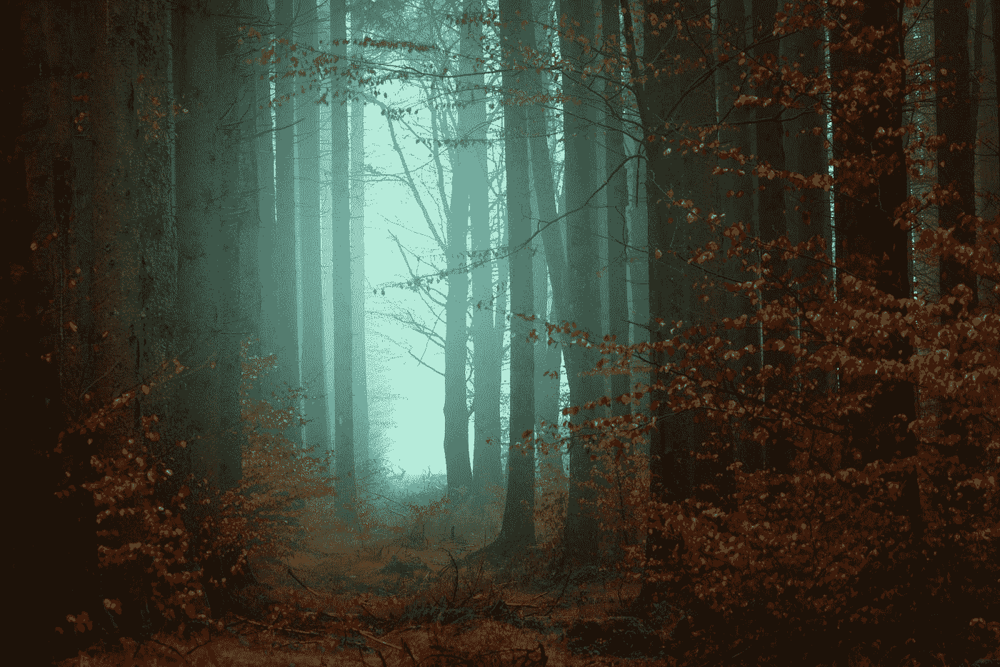

# 亲生物效应

> 原文：<https://medium.datadriveninvestor.com/the-biophilia-effect-cd8525dbf845?source=collection_archive---------4----------------------->

## 自然缺陷障碍——最新的威胁

> “完全热爱生活的人会被生活和各方面的成长过程所吸引。”—埃里克·弗洛姆

Photo by [Johannes Plenio](https://unsplash.com/@jplenio?utm_source=medium&utm_medium=referral) on [Unsplash](https://unsplash.com?utm_source=medium&utm_medium=referral)

我花很多时间在大自然中。从来没有我想要的那么多，但足以让我在日常生活的动荡中脚踏实地。在这样做的时候，我注意到了一些事情。

首先，我内心有一种冲动在慢慢积累，随着每一天或每一周的过去，这种冲动越来越强烈，召唤我去附近的国家公园迷路。这是一个压力阀，因为一旦我这样做了，我的心灵又一次平静下来，补充燃料并校准。

在一次激烈的徒步旅行或山地自行车、游泳或穿雪鞋后，我发现自己完全放松了，恢复了活力，达到了令人兴奋的顶点。我过去认为这是由于我的体力消耗和随之而来的令人愉快的内啡肽，但在遭受锁骨骨折和被迫在树林中悠闲散步后，我开始意识到还有更多事情在起作用。

 [## 气候变化、ESG 和对更好数据的追求——数据驱动的投资者

### 在地球上许多地方经历了另一个令人难以置信的炎热夏季后，来自 S&P 的最新发现…

www.datadriveninvestor.com](https://www.datadriveninvestor.com/2018/08/24/climate-change-esg-and-the-quest-for-better-data/) 

然后我偶然发现了 ***Shinrin Yoku*** 的概念——日本的*森林沐浴*的做法——这是 80 年代末发展起来的一种趋势，人们会漫步在树林中，通过开放他们对自然的自然感知来体验某种森林疗法。我认为这基本上只不过是一种好的生活方式，一种健康的活动，有助于清醒头脑，促进血液流动，也许还能给肺部注入一些所需的新鲜空气。但是似乎还有更多。

从那里，没过多久，我就拐过一个弯，遇到了“生物哲学”*，这是一个归功于埃里克·弗洛姆的假设，提出人类有一种与生俱来的寻求与自然联系的倾向，并被所有有生命和活力的事物所吸引。这就是事情开始变得有趣的地方。*

> *“研究自然，热爱自然，亲近自然。它永远不会让你失望。”—弗兰克·劳埃德·赖特*

*从心理学的角度来看，这个理论开始更加具体化。当我们在西方倾向于需要我们的物质决定性事实时，由亲生物性概念延伸的命题变得更加具体。埃里克·弗洛姆从弗洛伊德的角度探讨了这个问题，他发现与自然的接触对人类的心灵来说是至关重要的。他描述了一种被生计所吸引的心理倾向，即生命寻求与其他生命在一起，生命形式之间的这些深刻联系是天生植根于它们的生物学的。*

*这个概念不一定是新的，因为它的起源可以追溯到亚里士多德以及更远的地方，有时被不同地语境化为共生、协同、自然主义等等。*

*然而，弗洛姆的方法融入了我们似乎认为更喜欢自然而不是非自然的生物冲动，即在一个基本上已变得无生命的世界中，对任何有脉搏的事物的亲和力。*

*总的来说，我们开始意识到这一点。基于生物的设计已经成为建筑和室内设计的趋势——越来越多的设计融入了植物和绿色植物，一种人工存在的自然本质。我们可以看到同样的事情在人工智能、努力开发可再生能源以及饮食或娱乐生活方式中成形；我们越来越敬畏任何形式的生命。最终，我们似乎已经偏离我们的自然起源太远，现在正试图与它们和解——所有这一切都有充分的理由。*

> *“生物爱好者更喜欢构建而不是保留。他想要更多，而不是拥有更多。他善于思考，他更喜欢看到新的东西，而不是去寻找旧的东西的证据。比起确定性，他更喜欢生活中的冒险。他看到的是整体而不是部分，结构而不是总结。他想用爱、理性和榜样来塑造和影响他人。”—埃里克·弗洛姆*

*我们逐渐发现，无论是在家里还是在办公室，生命中缺乏生物活性物质从美学角度来说都是令人不快的，而且正如最近在《more vigor》中所做的研究一样，对我们的情绪有着不可否认的影响。但更令人困惑的可能是其生理效应的实际范围。最新的发现表明，我们的身体健康取决于自然的影响。*

*[由马克·伯曼领导的科学家团队进行的一项这样的研究](https://www.researchgate.net/publication/279989471_Neighborhood_greenspace_and_health_in_a_large_urban_center)评估了大型城市中心——多伦多的社区绿地的健康因素。根据全面的绿色空间指标和健康记录，总体研究结果表明，居住在更高密度树木中的居民报告“明显更高的健康感知”和“明显更少的心脏代谢状况”。*

> *“我们发现，平均而言，在一个街区多种 10 棵树，可以改善人们的健康感受，这相当于个人年收入增加 1 万美元，搬到一个中位收入高出 1 万美元的社区**或者年轻 7 岁**。”M. Berman 等人。艾尔。*

*除了这项研究之外，还有几项研究表明，通过多种方式，包括自我感知，置身于绿色空间在生理和心理上都是有益的。当然，有一些显而易见的观点——就生活方式而言，更绿色的郊区通常有更绿色的居民——尽管如此，生理学证据已经变得很明显。*

*除了普遍接受的心理益处，自然还能帮助我们保持健康的平衡，这很难接受吗？*

*几十万年来，人类在大自然中进化，并与大自然一起进化。进入密封的环境——我们能如此肯定我们的生物已经适应了办公室的荧光嗡嗡声或我们越来越多地发现自己处于其中的封闭的人工环境吗？*

*除了远离油漆或废气，我们还可以看看树木的物理排放。例如，松树或针叶树会释放一种叫做*萜烯*的化学物质，这种化合物越来越多地被认为可以促进情绪和身体健康。萜烯最近与大麻素(THC 和 CBD 油)一起风靡一时，但在自然界的每个角落都可以找到——树和植物都释放这种化合物。*

> *"最近，人们发现萜烯也直接作用于脑细胞来调节它们的活动."华盛顿大学神经科学家乔希·卡普兰博士*

*对我自己来说，我不需要被说服——我全心全意地相信自然不仅仅有益于思想。我觉得我们很难把重点放在我们看不见的东西上；例如，水是我们公认的健康的必需品，但我们吸入或覆盖在皮肤上以供表皮吸收的空气中流动的无数微生物化合物呢？我们经常在脸上或头发上涂抹化学物质，无论走到哪里都吸入人工香料，用合成物质涂抹我们的皮肤。但是当涉及到简单地置身于大自然中时，我们不会吹捧我们真正接触到的东西的真正好处。*

*就我个人而言，我坚信外面不仅仅只有新鲜空气。*

> *“我相信人是自然进化的产物，它产生于作为囚犯与自然分离的冲突，产生于寻求与自然统一与和谐的需要。”—埃里克·弗洛姆*

*[**读下去:掌握消耗**](https://medium.com/the-philosophers-stone/mastering-consumption-cfd80b3f547d)*

**

*Invoking reverence, moderation and understanding for that which we use and consume*

***来源***

*[https://savvytoko . com/shinrin-yoku-the-Japanese-art-of-forest-bathing/](https://savvytokyo.com/shinrin-yoku-the-japanese-art-of-forest-bathing/)*

*[https://www . research gate . net/publication/331364905 _ Initial _ Evidence _ of _ the _ Relationships _ the _ the _ Human _ postmodely _ Microbiome _ and _ Neighborhood _ Blight _ and _ Greening _ Efforts](https://www.researchgate.net/publication/331364905_Initial_Evidence_of_the_Relationships_between_the_Human_Postmortem_Microbiome_and_Neighborhood_Blight_and_Greening_Efforts)*

*[https://www . researchgate . net/publication/279989471 _ Neighborhood _ green space _ and _ health _ in _ a _ large _ urban _ center](https://www.researchgate.net/publication/279989471_Neighborhood_greenspace_and_health_in_a_large_urban_center)*

*[https://fromm-online . org/en/bio philie-liebe-zum-lebendigen-bio philie/](https://fromm-online.org/en/biophilie-liebe-zum-lebendigen-biophilie/)*