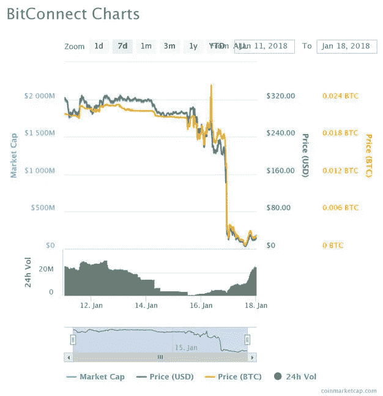

# 比特大陆大屠杀:一个值得吸取的教训

> 原文：<https://medium.datadriveninvestor.com/the-bitconnect-massacre-a-lesson-to-be-learned-885403007aee?source=collection_archive---------17----------------------->

“round gold-colored coin” by [Icons8 team](https://unsplash.com/@icons8?utm_source=medium&utm_medium=referral) on [Unsplash](https://unsplash.com?utm_source=medium&utm_medium=referral)

***原帖***

**2018 年 1 月 17 日。在加密货币投资领域，这是多么美好的一天。在许多国家对先进监管的担忧和猜测中，当时的加密货币市场大幅下挫。由于许多加密货币在接下来的几个小时内损失了 20%—30%的价值，一种特定的加密货币陷入了螺旋式下降，导致数百万投资者损失了几乎所有的原始投资。**

*Bitconnect 是一种点对点、社区驱动的去中心化加密货币，允许人们以非政府控制的货币存储和投资他们的财富，甚至赚取可观的投资利息。投资者将从帮助维护网络安全的原始投资中获得利息回报。*

*在上周，开始有消息称 Bitconnect 背后的人参与了一场大规模的庞氏骗局，基本上是为了个人利益而掠夺了许多投资者的血汗钱。自这一消息发布以来，一度高达 400 多美元的硬币价格在过去一周内已经下跌了 90%以上，跌至 5-6 美元的低点。下图(按 coinmarketcap.com 计算)显示了上周 Bitconnect 价格的大幅下跌。*

**

*加密货币是一种非常新的技术和投资形式，必须以极大的风险来考虑。这种价格波动对市场来说并不新鲜，投资者必须随时准备好损失大部分投资。市场上有成千上万的硬币没有任何金融机构的支持，监管也不存在。为了避免在投资加密货币时损失大量资金，**始终给自己留有 100%投资损失的预算。***

*区块链技术背后的潜力可能会永远改变我们所知道的经济，并将能够做许多伟大的事情。当今天投资加密货币时，请始终记住这些硬币的价格是投机性的，并准备好在熊市周期中损失大部分投资。假设你正在承担的风险，记住**购买比特币并不能保证你赚钱。***

*祝你好运，准备好乘坐加密过山车吧。*

**-JP**