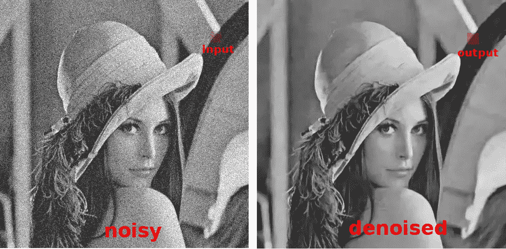

# 深度学习的黑盒

> 原文：<https://medium.datadriveninvestor.com/the-black-box-that-is-deep-learning-53646a9f5f7b?source=collection_archive---------7----------------------->

深度学习已经从根本上改变了*我们在众多领域解决问题的方式，而且这种改变还在加速。它不仅仅是用像[风格转移](http://dieswaytoofast.blogspot.com/2018/02/transferring-image-style-via-deep.html)，或者[绘画](http://dieswaytoofast.blogspot.com/2018/03/painting-with-deep-learning.html)，甚至[去除亨利·卡维尔的小胡子](http://dieswaytoofast.blogspot.com/2018/06/face-synthesis-outside-uncanny-valley.html)这样的图像做令人惊奇的事情，它现在已经深深嵌入到用于[营销](http://dieswaytoofast.blogspot.com/2018/07/deep-learning-formarketing.html)、[牙科](http://dieswaytoofast.blogspot.com/2018/05/deep-learning-and-dentists.html)和[语音合成](http://dieswaytoofast.blogspot.com/2018/03/voice-cloning-comes-to-masses.html)的工具中(因为你可能希望你的 GPS 方向被你的配偶读出？).*

这些都是非常好的东西，有一个潜在的问题，*我们真的不知道这些东西是如何工作的！*

/via [http://people.tuebingen.mpg.de/burger/neural_denoising/](http://people.tuebingen.mpg.de/burger/neural_denoising/)

以图像去噪为例。在深度学习出现之前，有大量的工作——都严格基于数学和科学——进入所使用的算法。偏微分方程、各向异性扩散和许多其他技术，*所有这些都有坚实的理论基础*。
然后，在 2012 年，Burger 等人在这个问题上投入了深度学习，基本上击败了当时最先进的去噪技术🤯。

当然，这里的问题是，通过深度学习，我们对实际发生的事情了解非常有限。哦，我们开始正式化其中的一些(潜在的表现，等等)。)，但大部分仍然归结为某种组合
1)获得大量数据
2)用 TensorFlow/Keras/…投入一大堆 GPU/TPU 来获取利润
3)

以这种暗箱操作的方式会产生一些后果，其中最主要的一个后果是，它们使得从 ***数据→信息→知识*** 的过程变得更加困难。缺乏可解释性和我们的(当前？)无法理解基础模型限制了我们从这些系统中收集的知识。提醒你，结果*是*惊人的，只是对他们来说*惊人是可以理解的*有用(科学方法 FTW！)

请注意，这并不*那么*糟糕——毕竟，我们也不太明白人类的大脑是如何工作的，所以就这样吧😆。也就是说，当[说](https://sinews.siam.org/Details-Page/deep-deep-trouble-4)我们应该“*允许深度学习影响【他的】研究团队的想法和行动，但是……继续……寻求数学的优雅和对【他们】发展的想法的清晰理解*时，我同意[的说法](https://elad.cs.technion.ac.il/)

()" [*图像去噪:朴素神经网络能否与 BM3D 抗衡？*](http://people.tuebingen.mpg.de/burger/neural_denoising/files/neural_denoising.pdf)”——作者 Burger 等人。

*(* [*这篇文章也出现在我的博客上*](https://dieswaytoofast.blogspot.com/2018/08/the-black-box-that-is-deep-learning.html) *)*