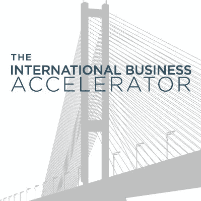
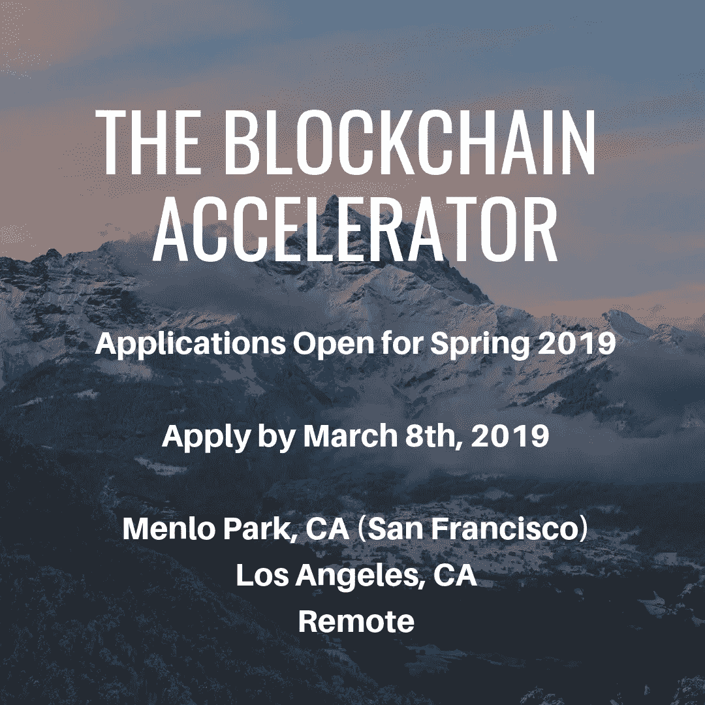

# 2019 年春季全球增长应用的区块链加速器现已开放

> 原文：<https://medium.datadriveninvestor.com/the-blockchain-accelerator-for-global-growth-spring-2019-applications-now-open-93b590f28423?source=collection_archive---------20----------------------->

## **我们非常鼓励全球各地的公司申请**

International Business Accelerator

**加州洛杉机。2019 年 2 月 19 日:** [区块链全球增长加速器](https://www.iba.io/iba-blockchain)，这是国际商业加速器与区块链咨询公司 Trailyn Ventures，LLC 合作的加速器项目之一，现正在接受他们 2019 年春季加速器队列的申请。[为期 12 周的项目](https://www.iba.io/iba-blockchain)将于 2019 年 3 月 20 日在加州洛杉矶南加州大学开始，2019 年 3 月 22 日 8 点到 8 点在加州门洛帕克开始。加利福尼亚州门洛帕克的位置将从安全的会议设施进行实时传输，为与会者创建一个虚拟的选项。**强烈鼓励女企业家、小众创业公司和 40 岁以上的创始人申请。我们接受来自世界各地的公司。在项目结束时，这些初创公司将能够向一群潜在投资者、高管和行业专家演示/推介他们的产品或服务。**

促进全球增长的区块链加速器正在建立一个全球生态系统，以便区块链公司可以成为可资助的公司，扩大他们的用户群，获得合作伙伴关系，并拥有全球影响力。在培训期间，这些公司学习如何通过我们的尽职调查获得资助。此外，学员还将了解全球税收、公司组建、会计、文化差异、区块链选择和融资机会。

[Farah Allen 创办的 Labz](https://www.thelabz.com/) 是区块链加速器的一个成功案例。Labz 是一个协作工作区，在您创作期间和创作之后，为您的数字资产提供自动跟踪、权限管理和保护。区块链加速器研讨会为实验室的数据室、推介平台、区块链选择等提供了帮助。Labz 被 Quake Capital 的洛杉矶春季项目接受，其中包括 20 万美元的现金注入。

好处:

*   强化尽职调查，帮助公司做好融资准备
*   出口商和企业家可以利用的资源
*   跨文化准备
*   全球税务、会计和公司组建会议
*   全球公关和营销会议
*   以区块链为中心
*   加州洛杉矶南加州大学或加州门洛帕克分校的晚间课程。
*   来自安全会议设施的加州门洛帕克实时流，以便世界各地的公司都能参与进来。

The Blockchain Accelerator for Global Growth

“我们很高兴在南加州大学的成功演示日之后，我们的第二批学员开始了。我们毕业的公司在展示日之前已经赢得了客户和资金。区块链加速器 Block 的负责人 Barbara Bickham 表示:“我们期待与全球更多公司合作。

申请截止日期为 2019 年 3 月 8 日星期五。适用于[https://www.iba.io/iba-blockchain](https://www.iba.io/iba-blockchain)，阵风:[https://bit.ly/2Oymqtu](https://bit.ly/2Oymqtu)或
F6S:[https://bit.ly/2JaSyhX](https://bit.ly/2JaSyhX)。

**全球增长的区块链加速器:**

[区块链全球增长加速器](https://www.iba.io/iba-blockchain)提供尽职调查，帮助公司做好融资准备，并帮助公司在国际上发展壮大。作为国际商业加速器的一部分，我们提供无与伦比的加速项目、会议、研讨会和咨询服务。大约 60%以前的 IBA 公司有女性创始人，50%为少数族裔所有。

# 联系人

全球增长的区块链加速器
芭芭拉·比克汉姆
expert@trailyn.com

克里斯·林奇
clynch@iba.io

迈克尔·麦克鲁尼
m.mcclune@iba.io