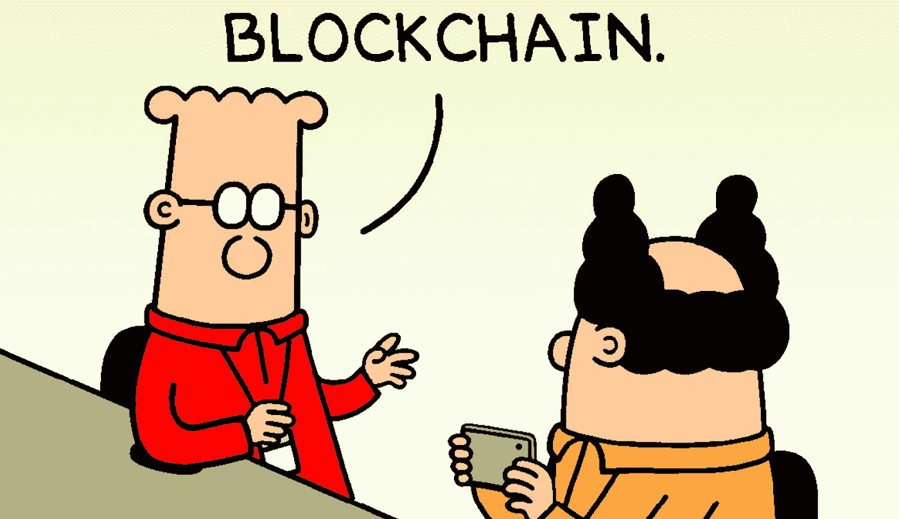
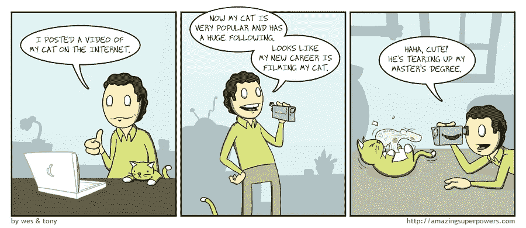
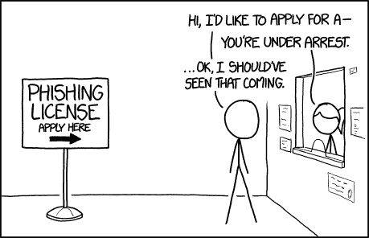
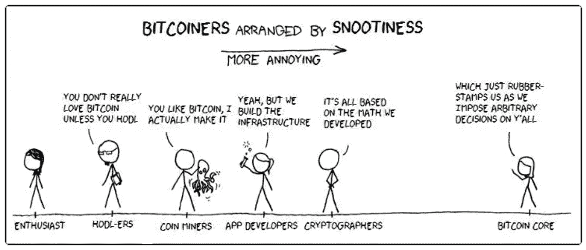

# 区块链的开端

> 原文：<https://medium.datadriveninvestor.com/the-blockchain-gang-77f1aab549e4?source=collection_archive---------2----------------------->

## “区块链”到底是什么？

我们从哪里开始解开比特币的谜团呢？既然听说比特币取决于“区块链”，那就从那里开始吧。

Credit to Scott Adams, Dilbert

当我写这篇介绍时，我对区块链以及它与数字货币的关系只有一些相当可疑的假设。如果你让我现在回答，我认为这是一个有序列表(唯一的？)代码叫做 Blocks…但是那不是很有帮助，是吗？我现在可以写一个数字列表，但我相当肯定没有人会接受它作为任何东西的付款！那么，比特币的特别之处在哪里？这个叫做区块链的东西和它有什么关系？我会查清楚的。我们走吧！

## 区块链的发现

首先，区块链是一个发表在《密码学杂志》上的理论，作者是来自贝尔科公司的 Stuart Haber 和 W. Scott Stornetta。这篇文章描述了如何使用加密保护的块链来“给数字文档加时间戳”。

关于区块链作为一种技术，我发现有趣(也出乎意料)的是，Stornetta & Haber 根本没打算用它来创造一种货币。相反，他们试图解决数字生活的一个基本问题:在轻松更新和共享数字文件的便利性与随之而来的对信任和安全的(潜在)损害之间取得平衡。

没错。听起来很简单，是吧？让我试着解释一下。

区块链方法提出通过列出任何改变以及改变的顺序来防止数字文档的时间戳被篡改。他们将列表描述为“链”,并将新的加密记录描述为添加到链末端的“块”。链上的每个块都标识其前一个块，并通过单向算法(也称为“哈希”)进行编码。散列很容易加密和验证，但很难解密。理论上，解密一个单独的数据块需要数千年的时间，并且要动用世界上所有的计算能力。因此，任何人都不会很快进入那里改变事情，而且任何人都可以查看和审计整个事情。

## 时机就是一切

他们的研究是及时的，因为这个被称为“互联网”的东西刚刚流行起来(提示一下你家固定电话上 28.8 波特拨号[调制解调器啁啾](https://www.youtube.com/watch?v=ckc6XSSh52w)的声音——那些想法现在看起来多么奇怪过时)。虽然看起来很有用，但不可磨灭的时间戳并不是什么有趣的东西，它也没有风靡全球。

我会停下来指出，他们确实解决了一个重要的难题，这归结为一种公开审计簿记的新方法。其结果是一种分散数字记录的方式，同时保持对其完整性和真实性的信任。本质上是一个开源的公共分类账，每个参与者都可以审查和独立确认内部交易的完整性。也许是自复式记账以来最好的发明！

喂？你还在吗？我知道，我知道。现在你在说“哇，慢点！我能感觉到所有这些保持记录的事情和莱杰的事情让我肾上腺素激增。”好吧，没错，这听起来确实像会计，但相信我，这很有趣，理解加密货币的工作原理很重要。除此之外，会计也很令人兴奋，对吧？他们就是这样抓到艾尔·卡朋的，记得吗？旁注:如果你最近没有看《铁面无私》,帮你自己一个忙，重新看一遍——它完全支持你！

不管怎样，我们说到哪了？哦，对了，数字时代簿记和信任的困境。

## 丰富的数字世界

因此，互联网和数字文件可以被复制和修改的便利性正在推动着每个行业不可想象的创新。我们在网上买卖东西，我们在做网上银行，签署数字合同非常方便，我们召唤陌生人驾驶的汽车带我们去我们想去的地方。还有分享。这么多分享！

所有这些便利都伴随着黑暗的一面:你如何确定你在网上看到的东西没有被改变？数字化的东西有没有可能是独一无二的？随着我们越来越多地生活在网上，信任正在成为我们越来越多地遇到的问题领域——销售假货的在线诈骗、钓鱼电子邮件和网站、身份盗窃……应有尽有。

Credits : [xkcd](https://xkcd.com/1694/)

## 区块链为什么重要？

但是这和以前有什么不同呢？我们总是有人在卖假货，有人在开空头支票，有人在说谎，有人在模仿。让我举一个例子来强调两者的区别。

我已经长大了，还记得有一段时间，书籍只是以书架上布满灰尘的书的形式存在，然后[亚马逊 Kindle](https://amzn.to/2IQbtRT) 涌现出来，开始销售各种各样的电子书籍。我并不特别在意纸质书和电子版书之间的区别，我很乐意为任何一种书付高价。但是当我停下来更仔细地思考这个问题的时候，我有点惊讶，尽管有几个坏苹果，互联网并没有导致社会的崩溃！

想象一下，你的好朋友让你花 2 美元买一本书的纸质版。显然，你的朋友是一个真正的小气鬼，你可能会因为你被收费而感到有点受伤——一些朋友！

除此之外，你决定付 2 美元是因为你真的想要这本书。这是一个物理对象的易手，你的朋友将无法再阅读这本书，这比去书店买新的便宜。所以你(不情愿地)决定赔偿他书的“损失”。

如果这位朋友向你要 2 美元，通过电子邮件给你一份这本书的 PDF 文件，你会说没门！你为什么要为此付钱？他只需点击 ctrl-c 和 ctrl-v，然后通过电子邮件发送给你，他什么也不会损失！如果你对你所谓的朋友嘀咕几句，然后怒气冲冲地跺着脚去书店，我不会感到惊讶，因为谁需要他呢，嗯？耶！

从另一个角度来看，对于一个作者来说，出售一本电子书比印刷一本实体书要冒更大的风险。虽然我可以通过复印每一页并装订在一起来复制一本实体书，但我将不得不费很大的劲，最终结果将非常糟糕，很容易被视为副本或赝品。有了一本电子书，我几乎可以无限复制出如此逼真的副本，以至于无法与原版区分开来。

所以，回到我们开始的地方，区块链有很多潜在的实际应用，不仅仅是货币。如今，任何涉及交易的事情似乎都有一个基于区块链的平台解决方案。

## 区块链和数字货币——比特币到来

然而，对于数字货币来说，当时的巨大挑战是:保存一份可信的有序交易清单。
2。防止重复支出。

然后在 2009 年，中本聪出现了，创造了比特币，改变了一切。

Photo by [David Shares](https://unsplash.com/photos/4_41-79dHvE?utm_source=unsplash&utm_medium=referral&utm_content=creditCopyText) on [Unsplash](https://unsplash.com/search/photos/blockchain?utm_source=unsplash&utm_medium=referral&utm_content=creditCopyText)

在 Haber & Stornetta 在《密码学杂志》上发表他们的文章 15 年后，一个自称中本聪的可疑人物应用区块链的想法创造了第一种所谓的加密货币:比特币。他发表了一份[白皮书，将比特币描述为一种数字货币](https://bitcoin.org/bitcoin.pdf)，编写了比特币算法，然后突然从公众视野中消失。关于中本聪的神秘身份，有很多理论，有些合理，有些疯狂，但让我们留到下次再说。

这是第一次有人利用区块链的想法来解决数字货币重复消费的难题。让我解释一下为什么这是一个突破，为什么比特币吸引了这么多人的想象力。

## 中间人攻击

对于今天的金融交易，我们依赖于一个中间人，比如银行，来确保每个人都信守承诺。当我支付一桶肯德基时，餐馆告诉他们的银行我支付的金额。他们的银行告诉我的银行从我的账户里取钱，然后支付到商家的账户里。轻松又熟悉。

如果我们不依靠银行，而是我走进肯德基说“我没有现金，但我刚刚用我的手机在网上给你转了 10 美元。它将在几天内到达那里。相信我！”我可能买不到我的肯德基……或者如果我买了，我可以去隔壁的麦当劳重新花那 10 美元，对吗？这就是双重花费的问题。

区块链的主要观点是，你不需要一个中间人来完成交易。区块链本身可以被认为是有史以来任何人所做的每一笔交易的巨大收据。这是公开可见的，虽然个人是匿名的，所以你不会看到“马蒂向肯德基支付了 10 美元”，你会看到“X 向 Y 支付了 10 美元”(尽管如果你曾经发现谁是“X”和“Y”，你就可以发现我去肯德基的频率！).

简而言之，每次交易发生时，它都被报告给区块链的监视器，作为一个新的加密块。比特币有数千名志愿者监督员，他们在区块上执行比特币核心算法来验证它，类似于科学家重复一个实验来验证结果。一旦大多数监控者同意这是一个有效的交易，该交易就用一个不可擦除的时间戳加密签名，将其作为区块链上的最新块密封。你可以看到比特币区块链[中正在添加区块](https://blockchain.info/)。

我想下次我会暂停一下，看看比特币经济、[比特币核心](https://bitcoin.org/en/bitcoin-core/)、比特币生态系统和其他加密货币参与者。

Credit @PacketOfData on [Twitter](https://twitter.com/PacketOfData/status/769193466572054528)