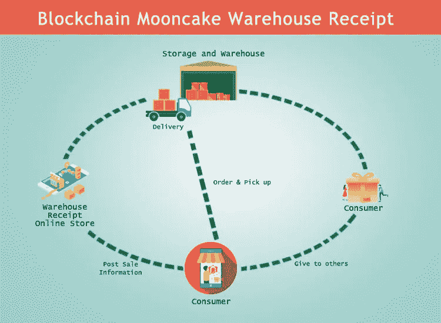

# 中国第一张区块链月饼仓单

> 原文：<https://medium.datadriveninvestor.com/the-blockchain-revolution-in-traditional-industry-fuzamei-launches-chinas-first-blockchain-dad13e33004e?source=collection_archive---------14----------------------->

> 由于价格持续上涨，比特币近年来掀起了一股热潮。此外，比特币背后的区块链技术得到了越来越多的关注和想象，然而，还没有“杀手级应用”问世。

“月饼的香味让每个人停下马车”，这是一位诗人描述百年老店知味观的话。知味观 1913 年创立于杭州，是高品质、好品味的代名词。

中秋节是中国的传统节日。如果你在中国过中秋节，不可能不注意到月饼。知味观月饼以其质量而闻名。2007 年被评为第十六届中国月饼节“质量信得过产品”。还有，该月饼从 2009 年到 2018 年连续 10 年被烘焙协会授予“中国名优蛋糕”，2016 年被授予“金月饼”。2011 年，知味观月饼的销售额超过 1 亿元人民币。

这样的百年老店，让今年的中秋节有了显著的不同。因为它使用区块链最流行的技术来销售月饼。根据国际研究公司的报告，区块链被选为二十年来十大伟大技术之一。当百年老店在 2018 年遇到最先进的科技，会发生什么？为什么知味观推出中国第一款区块链月饼？

ZHOU Dexing, general manager of Zhiweiguan, is full of confidence in launching blockchain mooncake this year.

为了回答这个问题，富扎美来到了位于杭州余杭区瓶窑的知味观总部。这里的工厂一天能生产 60 万盒月饼。知味观一个季度能卖出 2 亿个月饼，占全年收入的一半。由此可见，中秋节月饼对知味观的重要性。中秋节的人群就像是在争夺知味观。为了应对中秋节，知味观招聘了 2000 多名临时员工。

知味观总经理周德兴说，知味观从不担心销量。让他们关注的是如何用区块链科技解决传统月饼销售的痛点。他们希望给消费者带来更多的便利和创新技术。

首先是食材的问题。知味观始终认为，好材料是做好美食的前提。然而，在目前的月饼市场上，很难区分真假。如何清源成为名特产品的负担。区块链的特点可以很好地解决这个问题。在区块链，信息是公开的、透明的、不可篡改的，任何变化都被记录下来。信息输入后，任何人都可以在区块链浏览器上查看信息。

随着中秋节的来临，消费者特别关心品牌月饼是否正宗，生产日期是否标注准确。通过区块链仓库销售，月饼的生产信息，如生产批号和生产日期，将被登记在区块链上。同时，区块链还会记录月饼从预定到发货的整个销售过程。消费者可以在区块链浏览器查询月饼信息和发货信息，确保月饼为生产所知，从仓库发出，保证了消费者的权益。

为提供技术支持的富扎美 CEO 吴表示，此次合作不仅标志着企业从传统产业向产业的转型，也为传统企业插上了的翅膀，帮助百年老店解决了当前行业的痛点。另一个重大意义是，这是中国传统食品月饼首次与区块链结合，从下单、付款到结账，所有信息都将记录在区块链上。“这与前几年有人用 2 万个比特币买了一个披萨的情况类似，”吴表示。

月饼成为区块链数字仓单后，除了可追溯性，另一个好处是月饼流动性的提高。很多公司可能都遇到过这样的问题，中秋节采购几千盒月饼送到办公室。然后他们一个一个发给同事。月饼不一定受到每个人的喜爱。这个过程造成了材料和人力的浪费和低效。

然而，区块链月饼仓单可以在区块链平台上轻松转让。如果客户不想吃，可以直接输入收货地址给指定的人，或者在区块链平台上出售挂单，转给需要的个人。简单来说，月饼就像数字资产一样，可以通过区块链平台分离和流通。

吴说，月饼仓单的推出是一个实验性的行动，让更多的传统行业和消费者了解的概念。我们希望未来有更多的传统企业能够参与到区块链革命中来。

网址:[www.33.cn](http://www.33.cn)

推特:@FuzameiL

中:[福杂妹](https://medium.com/u/33022dfa54d3?source=post_page-----dad13e33004e--------------------------------)

Youtube:福扎美