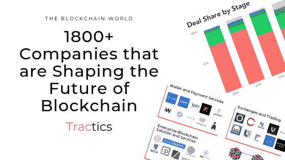
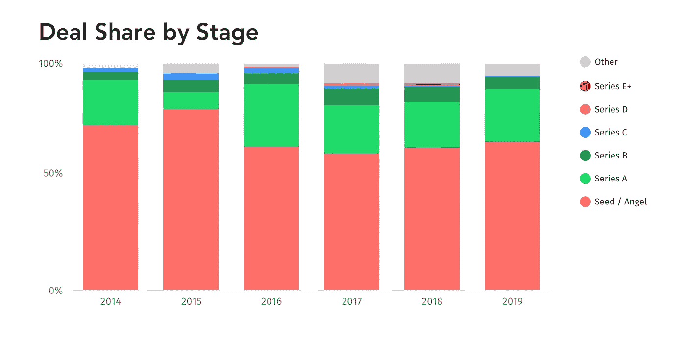
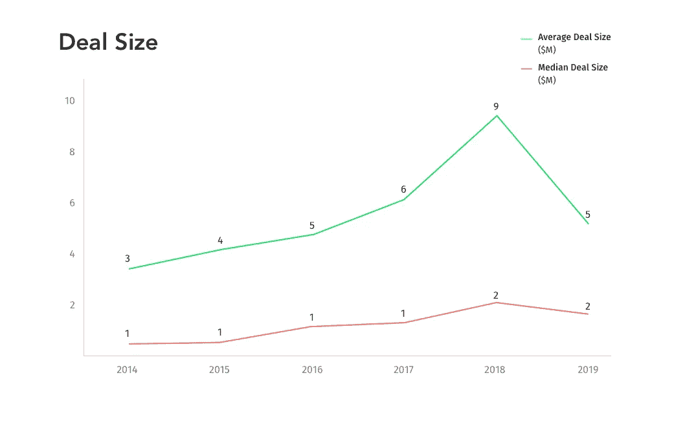
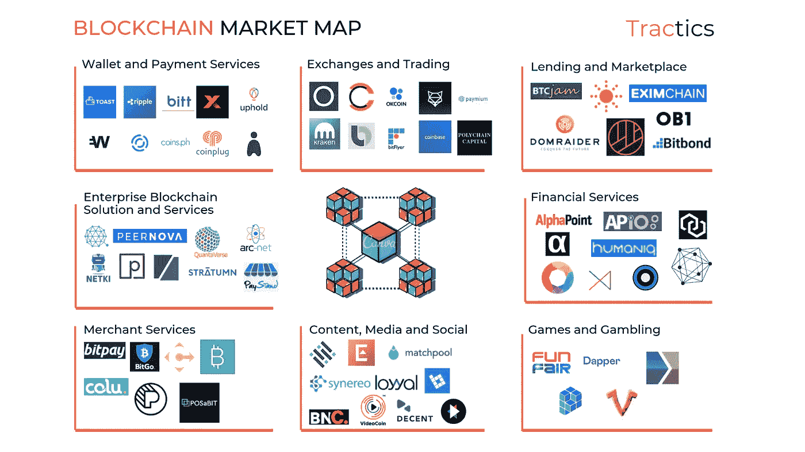

# 区块链世界— 1800 多家公司正在塑造区块链的未来

> 原文：<https://medium.datadriveninvestor.com/the-blockchain-world-1800-companies-that-are-shaping-the-future-of-blockchain-16f482619ff0?source=collection_archive---------6----------------------->

在 2008 年大衰退最严重的时候，中本聪认为，互联网上的商务在很大程度上依赖于金融机构作为可信的第三方来处理支付，但这些可信的金融机构也对市场崩溃负有责任。为了在没有可信第三方的情况下实现商业，Satoshi 提出了虚拟现金的点对点转移，这将允许在线支付，即比特币和称为区块链的基础技术。

在提出现金系统一年后，第一枚比特币被开采出来。如今，脸书、高盛和摩根大通都在开发自己的加密货币。

这是一项快速发展的技术，为了清楚地了解这个新生的技术空间，我们需要这些问题的答案。

*   比特币和区块链是什么？
*   现在发生了什么？和
*   下一步是什么？

# 比特币和区块链是什么？

少数人明白它是什么，但华尔街银行、咨询公司和 it 公司都在不停地谈论它。离开比特币很难谈区块链，但网上有大量关于它的优秀文章，所以，我尽量总结一下。

这里有六样东西。**比特币、加密货币、区块链技术、分布式账本技术、智能合约和初始硬币发行**。那么这些术语到底是什么意思呢？

**比特币**是一种去中心化的货币/资产，有公共账本，也被称为区块链。没有可信的第三方控制比特币的区块链。相反，任何人都可以阅读它，写入它，并持有副本。

这个**比特币的区块链**追踪比特币，它有规则，其中一条规定只能有 2100 万个比特币，每个人都必须同意这些规则才能使用它。由于任何人都可以在其中读写，比特币使用挖掘在这种不信任的环境中建立共识。挖掘基本上是一种激励好人的方法，这些好人投入巨大的计算能力来保护区块链，这些好人可以将一个事务块附加到先前块的链中。为此，他们会得到一枚比特币作为奖励。这也阻止了坏人接管，因为它需要大量的计算能力来做坏事。

比特币的代码是开源的。这导致人们创造出替代的加密货币或 altcoin，试图提高或扩展比特币的功能。

比特币还有更多的东西，比如哈希、建议证人、侧链、公私密钥加密等等，这些都超出了本报告的范围。

现在，我们来谈谈**区块链**。这是一种让不受信任的各方就共同的数字历史达成共识的技术。这种共同的数字历史是必不可少的，因为这种历史可以很容易地被复制，这个问题可以在没有可信中介的情况下用区块链技术解决。

这项技术在银行、身份、投票、数字广告、关键基础设施安全、工业物联网、云存储、计算、房地产和保险等独特的情况下很有意义。

然后是 **DLT 或分布式账本技术**，基本上是没有矿工的区块链。如果您删除了矿工/验证步骤，您将得到一个分布式电子表格。这是过去几年来人们对区块链重新产生兴趣的原因。在参与者之间分发数据库以确保共同的真相的想法是一个新颖的想法。

有一层共识的 DLT 是区块链，但区块链在大多数情况下速度缓慢且过于复杂。因此，企业转而关注管理宽松的 DLT。比特币和以太网是公开/无许可的区块链，这意味着任何人都可以访问它。另一方面，如果信任已经建立，即各方都是已知的，DLT 提供了一个很好的解决方案。

**智能合约**是区块链之上的另一层，允许用户放入自己的代码自动执行。参与者同意一套像合同一样的基本规则，每个人都持有这份合同的副本。当满足预设条件时，交易会自动执行。

智能合约随着以太坊的出现而出现，这也是以太坊如此引人注目的原因之一。

最后， **ICOs** 。所以所有区块链都使用代币来提供效用。对于比特币区块链是它的 BTCs，对于以太坊区块链是 ether 或 ETH。因此代币/硬币提供了不走传统风投路线的融资方式。

一个团队宣布一个 ico，他们在那里出售他们的区块链代币来筹集资金，这些代币随后在交易所交易。

目前，区块链世界仍处于萌芽阶段，但该技术有望获得各种应用。

# 现在发生了什么？

近年来，区块链空间已经经历了几次炒作周期。2017 年 12 月，比特币价格飙升至近 2 万美元的峰值，而 ico 或初始硬币发行增长至令人难以置信的高位，提供了巨大的资金渠道，甚至传统风投也涌入了代币销售。

2018 年，BTC 和 ETH 的价格在几个月内暴跌，这导致许多 ICO 项目搁浅。2019 年，区块链空间正在反弹，但《华尔街日报》宣称，由于 SEC 反对令牌化产品的激进立场，ICO 市场已经死亡。

2019 年，区块链世界的风险投资迅速下降。去年，该领域的投资额为 41 亿美元，而今年仅为 16 亿美元。由于该领域仍处于萌芽状态，更多的风险投资交易将投向早期初创企业。

Funding towards Blockchain Companies in the last 5 years | [tractics.co](https://www.tractics.co)

ico 和代币销售需要 CPR，因为它越来越得不到风投的资助，但市场正在缓慢反弹，在崩盘后重新燃起了兴趣。

Average and Median deal size in the last 5 years | [tractics.co](https://www.tractics.co)

为了真正了解现在正在发生的事情，我分析了 1800 多家区块链公司，并对它们进行了整理，以帮助您更好地了解市场。

Blockchain Market Map | [tractics.co](https://www.tractics.co)

# 钱包和支付服务

这一类包括提供钱包、汇款或转账等服务的初创公司。钱包公司主要有可以存储、发送和接收加密货币的软件，但这些钱包公司可能会兼做交易所。

**知名公司** — [Coinplug](https://www.coinplug.com/) 、 [ABRA](https://www.abra.com/) 、[秉持](https://uphold.com/)、 [Wirex](https://wirexapp.com/global) 、 [Token](https://www.cloudtokenwallet.com/) 、 [Xapo](https://xapo.com/en/) 、 [Bitt](https://www.bitt.com/) 、 [Toast](https://toastwallet.com/) 、 [Sreami](https://www.streami.co/) 、 [Wyre](https://www.sendwyre.com/) 和 [Ripple](http://ripple.com/) 。

# 交易所和交易

交易所允许人们将传统的法定货币转换为加密货币，反之亦然，而交易平台允许专业投资者和投资基金进行更大规模的交易。

**知名公司** — [鲁诺](https://www.luno.com/)、 [Coinsecure](https://coinsecure.in/) 、 [OkCoin](http://okcoin.com/) 、[北海巨妖](https://www.kraken.com/)、 [ShapeShift](https://shapeshift.com/) 、 [Bitso](https://bitso.com/) 、 [Bitflyer](https://bitflyer.jp/) 、[比特币基地](http://www.coinbase.com/)、 [Paymium](https://paymium.com/) 、 [Quoine](https://www.quoine.com/) 和 [Polychain Capital](http://polychain.capital/)

# 贷款和市场

点对点市场平台帮助用户直接交换商品，无需中间人，P2P 贷款允许用户向其同行贷款，而没有政府和金融机构施加的传统限制。

**这个细分领域有意思的公司** — [BitBond](https://www.bitbond.com/) 、[Wayne loans](https://www.wayniloans.com/)、 [DharmaLabs](https://dharma.io/) 、 [OB1](http://ob1.io/) 、 [DomRaider](https://www.domraider.com/en/home/) 、 [EximChain](http://www.eximchain.com/) 、 [BTCJam](http://btcjam.com/) 、[太阳交易所](https://thesunexchange.com/)。

# 企业区块链服务和解决方案

此类公司为金融服务、医疗保健、保险和供应链等行业的其他公司提供企业级区块链解决方案。在服务方面，有些公司为各种用例提供 API 和协议，有些公司也充当区块链的顾问。

**该细分市场的一些高绩效公司** — [Hijro](http://hijro.com/) 、 [Arc-net](http://www.arc-net.io/) 、 [Paystand](http://paystand.com/) 、 [Spratum](https://stratumn.com/) 、[震颤](http://tremor.co/)、 [Pokitdok](http://pokitdok.com/) 、 [Netki](https://www.netki.com/) 、[quanta verse](http://www.quantaverse.net/)、 [Peernova](http://peernova.com/) 和 [QTum](https://qtum.org/) 。

# 商业服务

这一类是为商家和卖家提供服务和解决方案的公司，如咨询服务、信息亭、奖励计划等等。

**知名公司** — [Bitpay](http://bitpay.com/) 、 [Coinify](https://coinify.com/) 、 [BitGo](http://www.bitgo.com/) 、 [Simplex](http://www.simplex.com/) 、 [POSaBit](http://www.posabit.com/) 、 [DotDashPay](http://dotdashpay.com/) 、 [BitPesa](https://www.bitpesa.co/) 、 [Colu](https://www.colu.com/) 。

# 内容、媒体和社交

这一类别的公司提供的服务包括基于区块链的内容平台、覆盖区块链和加密货币世界的媒体机构以及基于区块链的社交网络。

**有趣的公司** — [编年史](http://chronicled.com/)、[游戏币](https://videocoin.io/)、[体面的](https://decent.ch/)、[勇敢的新币](http://bravenewcoin.com/)、[菌丝体](http://myceliaformusic.org/)、[布洛库尔](http://www.blokur.com/)、[洛亚尔](http://www.loyyal.com/)、[辛尼瑞奥](http://www.synereo.com/)、[火柴池](https://matchpool.co/)、[英布雷斯](https://imbrex.io/)、[Earn.com](https://earn.com/)。

# 游戏和赌博

区块链游戏包括应用程序和锦标赛游戏平台，用户可以在这些平台上争夺奖金池。赌博初创公司允许用户在世界任何地方用加密货币下注。

**知名公司** — [Payment21](https://payment21.com/) 、 [Peerplays](https://www.peerplays.com/) 、 [Vicoinz](https://www.vicoinz.com/) 、 [Drapper Labs](https://www.dapperlabs.com/) 和 [FunFair](https://funfair.io/) 。

# 金融服务

这些公司为金融机构提供解决方案，帮助解决清算、数据管理、结算等问题。

**该细分市场中的一些高绩效公司**—、 [Alphapoint](http://www.alphapoint.com/) 、 [SETL](https://setl.io/) 、 [Clearmatics](http://www.clearmatics.com/) 、 [HumanIQ](https://www.humaniq.com/) 、 [Gem](http://gem.co/) 、 [Hyperledger](http://www.hyperledger.org/) 和 [Neuroware](http://neuroware.io/)

既然我们已经知道了前景是怎样的，那么让我们来看看在这个不断发展的空间中接下来会发生什么。

# 下一步是什么？

要回答这个问题，我们需要从一个不同的角度来看数据。

因此，我使用数据(如资金、势头、客户采用、媒体关注度和竞争强度)来评估技术、产品和商业模式相对于市场成熟度和采用度的情况，以得出这 8 个您需要关注的趋势。

**托管** —代表客户持有加密资产的能力一直是大型金融机构面临的一个挑战。任何可以访问私钥的人都可以完全控制资产。金融机构需要找到一种方法来大规模处理对私钥的访问，以便它不会落入坏人之手。一些公司使用离线冷藏作为规避这个问题的方法，但像 Xapo 这样的公司使用退役的瑞士军用掩体来保护用户的加密资产。为了获得蓝筹股公司的信任和主流的采用，密码世界需要为保管工具找出一个解决方案。

**采矿** —竞争加剧、需求下降和环境要求是该行业面临的一些最严峻的挑战。随着 AMD 宣布采矿设备，原始设备制造商正在进入该领域，但比特币价格下跌导致需求下降，环境批评损害了矿工的底线。

**稳定和隐私币** —针对稳定性进行了优化的加密货币是稳定币，市场上有近 60 种稳定币已经获得了大约 3.5 亿美元的资金。有法定和黄金支持的货币(如 Tether)，加密资产支持的货币(如 Dai)和非抵押货币(如 Basis)。这些都是不太可能的，但是如果他们今年设法获得一些采用，这可能会推动密码作为交换手段的发展。

然后还有隐私币。这些资产正试图在黑市之外被采用。事情是这样的，比特币和其他货币很容易追踪，为了实现完全匿名，隐私币应运而生。Monero、Zcash、Horizen、Dash 和 Bytecoin 等密码是市场上的几个突出例子。随着像比特币基地和双子座这样的主要交易所上市这些硬币，看起来未来购买和持有这些资产会更加舒适。

**令牌** —我们在这里看到两个主要令牌。一个是安全令牌，另一个是不可替换的令牌。安全令牌有助于将现实世界的资产(如股票、债券和其他证券)引入区块链，以便更容易通过互联网访问和交易(更好的流动性)。安全令牌和智能合约可以使这些令牌更具可编程性，从而消除对中间人的需求。但是将现实世界的资产迁移到区块链有其自身的一系列困难(比如监管合规、法律等等)。

不可替换令牌是稀缺和唯一的数字令牌。它在 Cryptokitties 和分散土地等游戏中找到了第一个用例。我看到有更多的令牌和真实世界的用例即将到来。

**数据市场** —数据是新的石油。每个人都希望他们的产品中有 AI，AI 需要数百万个数据集。如果你不是苹果、谷歌、微软、腾讯，你就不能创造/挖掘数据。所以我们需要买下来。区块链可以提供一种安全的方式来共享数据，没有中间人或数据泄漏。

**DLTs** —银行和金融机构是首批试验清算和结算分布式总账技术的机构之一。一笔简单的银行转账必须经过许多中介机构，但有了公开透明的 DLTs，交易可以直接结算。这对于金融机构和银行来说意味着大量的成本节约。

DLT 也找到了发展工业的道路。物联网和供应链是第一步，将进行更多真实世界的测试，以评估特定行业的 DLT 如何与传统技术相抗衡。

**比特币** —比特币/替代币——比特币/替代币并没有像过去 Venmo 或微信等大多数消费平台那样在点对点支付中发挥作用。人们仍然将它视为保值的储值手段，而不是交易媒介。困扰这些货币的另一个根本问题是可扩展性。如果交易量上升，交易速度会下降，而费用会上升。

目前，开发人员正致力于在比特币区块链之上建立另一层，例如照明网络，用于廉价的即时比特币支付。

在大多数政府采取监管立场后，ico 可能需要 CPR。但它们正以更分散的网络反弹，使这些 ICO 代币成为一种数字商品，而非证券。所以这是一个值得关注的趋势。

# 最后，

比特币对于区块链技术来说确实是一个新颖的用例。这些金融机构开始时是绕过这些中间人的，现在也设法采用了这种技术。现在，FB Libra 即将出现，尽管它被所有人讨厌，但它潜在地具有与比特币的增长率相匹配的同等网络效应。

与此同时，区块链和 DLT 将继续扰乱在线广告、教育、物联网、音乐产业、保险、人力资源、医疗保健、供应链、零售等行业。