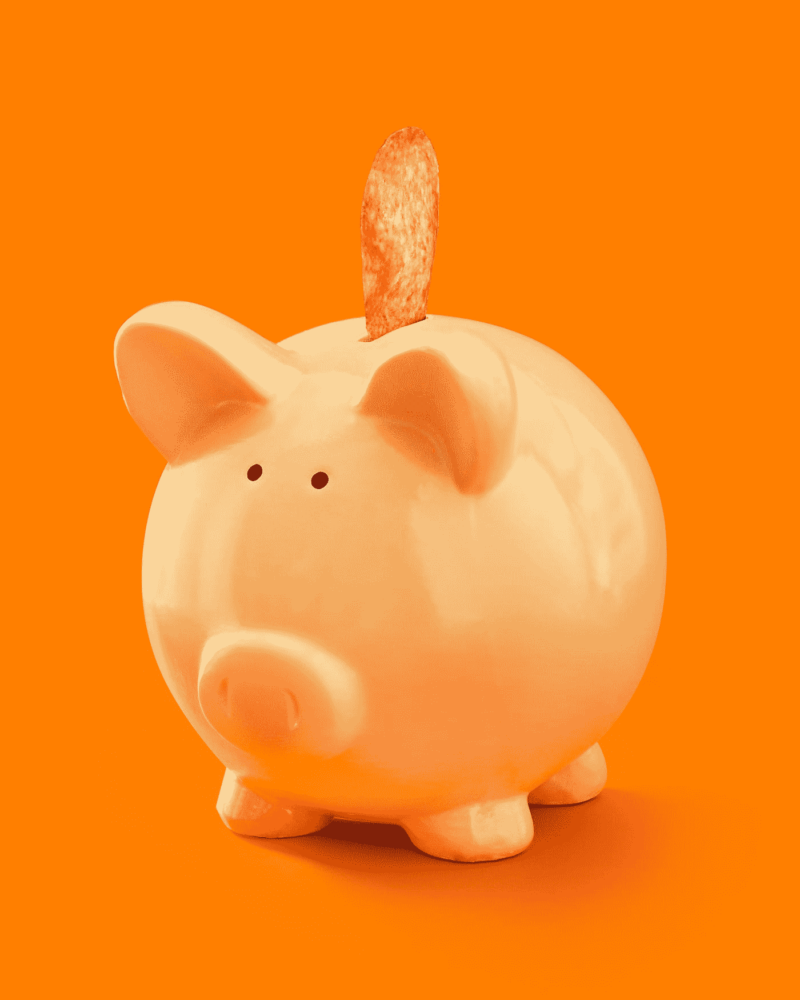

# 积累财富的无聊方法

> 原文：<https://medium.datadriveninvestor.com/the-boring-ways-to-accumulate-wealth-7a6c7c888cba?source=collection_archive---------20----------------------->

> 个人投资者应该始终如一地扮演投资者的角色，而不是投机者。(本·格雷厄姆)

“white ceramic piggy bank on orange surface” by [Stoica Ionela](https://unsplash.com/@pupile_gustative?utm_source=medium&utm_medium=referral) on [Unsplash](https://unsplash.com?utm_source=medium&utm_medium=referral)

积累和积累财富的真实和经过检验的方法不是华而不实或令人兴奋的。事实上，它们很无聊，很单调。它们需要纪律、远见、一致性、将当前的快乐推迟到未来回报的能力，等等。

让我们开门见山，详细讨论一下。

# 积累财富的 4 种无聊方法

## 在不增加支出的情况下增加收入。

为了积累财富，我们必须在降低开支的同时增加收入。这是财务素养和责任的基础。

如果你花的比你挣的多，你怎么能增加你的收入呢？你不能，这也是大多数人在改善财务状况时失败的地方。

这意味着:

**创造某种形式的副业**

**精打细算**

**量入为出意味着**

这是通向真正财富的最直接的途径。这需要努力，但绝对值得，因为如果你像其他人一样生活，那么你最终也会像其他人一样生活。

## 少买点东西，多买点资产。

简而言之，在你不需要的东西上花更少的钱，并取代那些不必要的资产支出，这将把钱放回你的口袋。

绝大多数人都把钱浪费在他们确实不需要甚至长期不想要的东西上。这是一场必败的战斗。

购买更多资产。什么是资产？资产是能让你赚钱的东西，而不是会把钱从你身上拿走的负债。

构建多种资产通常是一种方式，它为我们提供了最大的机会去过我们一直想要过的生活。

创建一项资产也为你在未来创建更多的资产铺平了道路，当你已经创建了一项资产并开始运作时，这是非常好的。

如果你一直停留在买东西的循环中，那么你将永远无法打破这个恶性循环。

## 记录你的支出。

你不能改进你不知道的东西。因此，我们必须虔诚地跟踪我们的支出。我们必须从鸟瞰的角度来看待我们的财务状况，并努力改善我们的环境。

你无法管理你没有衡量的东西，这就是为什么跟踪在我们迈向财务知识和成功的旅程中如此重要。

我个人使用 Mint 应用程序来跟踪我的财务状况，老实说，它已经改变了我的游戏规则。我不仅能对自己的财务状况了如指掌，还能培养出意识，这种意识本身就能带来变化。

## 投资低成本的指数基金。

在低成本指数基金中投资与你的财务状况相关的差额，从长期来看会产生最好的结果。

低成本指数基金利用了低成本投资以及随之而来的长期指数增长。

**为什么成本低？**从长期来看，大多数投资策略的成本都很高，而当涉及到指数增长时，你会希望利用你能获得的所有储蓄，因为在几十年的时间里，这些储蓄可能会累积成千上万美元。

**为什么是指数基金？**指数基金本质上是跟踪市场的表现。他们不会试图跑赢市场，因为通过投机几乎不可能做到。相反，他们与市场合作，并且长期合作非常出色。

下面，我们将讨论几十年来一些关于投资的名人名言。

# 金融智慧

## **我会告诉你如何变得富有。关上门。当别人贪婪的时候要恐惧。当别人恐惧时，你要贪婪。**(沃伦·巴菲特)

有意识、有策略地逆向投资是致富的基础之一，因为从定义上来说，对大多数人来说，致富是罕见的，也是违背直觉的。

密切关注整个社会的情绪，并利用这一点来获得财务优势。

## 股票市场充满了知道所有东西的价格，却不知道它们的价值的人。(菲利普·费舍尔)

这是对大多数涉猎者的一个教训，而不是深入一个领域。

如果你能教会自己理解每样东西的价值而不是价格，那么你最终会变得富有。

比大多数人走得更远，培养对承诺的热爱，并走得更远。

## 你知道有多少百万富翁是通过投资储蓄账户变得富有的？我停止我的案子。(罗伯特·g·艾伦)

储蓄账户只有一个好处，就是短期存钱。他们永远不会为个人创造财富，因为他们没有挣到任何值得尊敬的东西。

相反，选择低成本指数基金，你将获得更大的投资回报。这是许多富人变得富有的实用方法之一。

## “投资自己。你的事业是你财富的引擎。”—保罗·克里瑟罗

你是你自己最大的财富。如果你对自己的发展感兴趣，这可能是你听说过的，但我敢打赌，你没有真正在最深层次上内化它。

这一课，如果理解正确，运用得当，将会改变你的一生。

投资读书

投资吃健康食品

投资于实践自律

投资你自己会比任何共同基金或股票投资组合获得更大的回报。

## “知道你拥有什么，知道你为什么拥有它。”(彼得·林奇)

了解你完全拥有的东西和你背后的动机对于获得财务独立和整体高质量的生活是至关重要的。

这不仅能培养自我意识，还能为你提供在日常生活中购买物品时做出高质量决定的步骤。

# 结论

富有不仅仅是在金钱和资产方面积累财富。它是关于性格在各个领域的全面发展——健康、人际关系、职业等等。