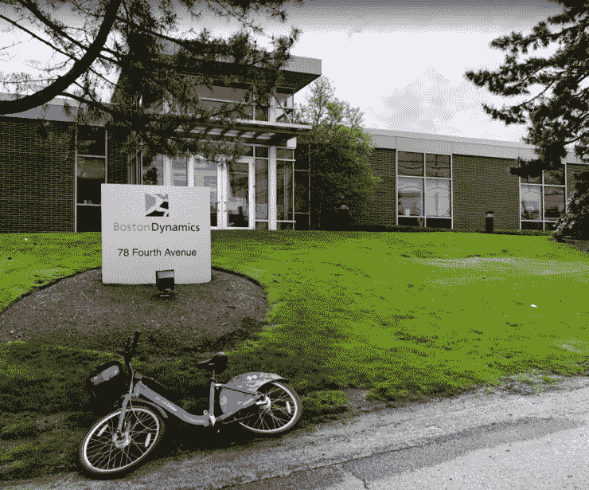
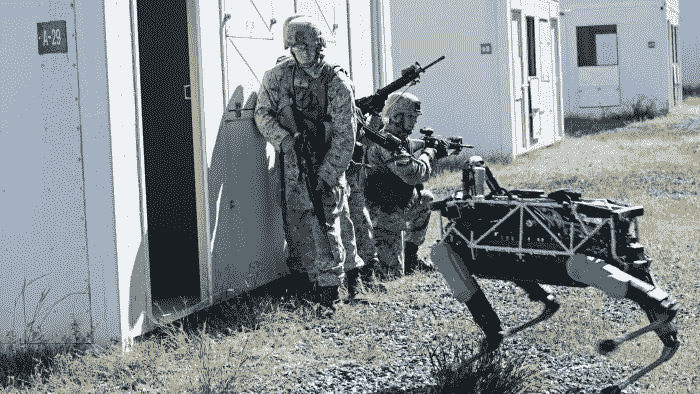
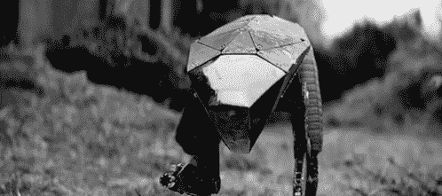
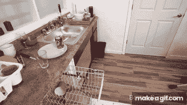
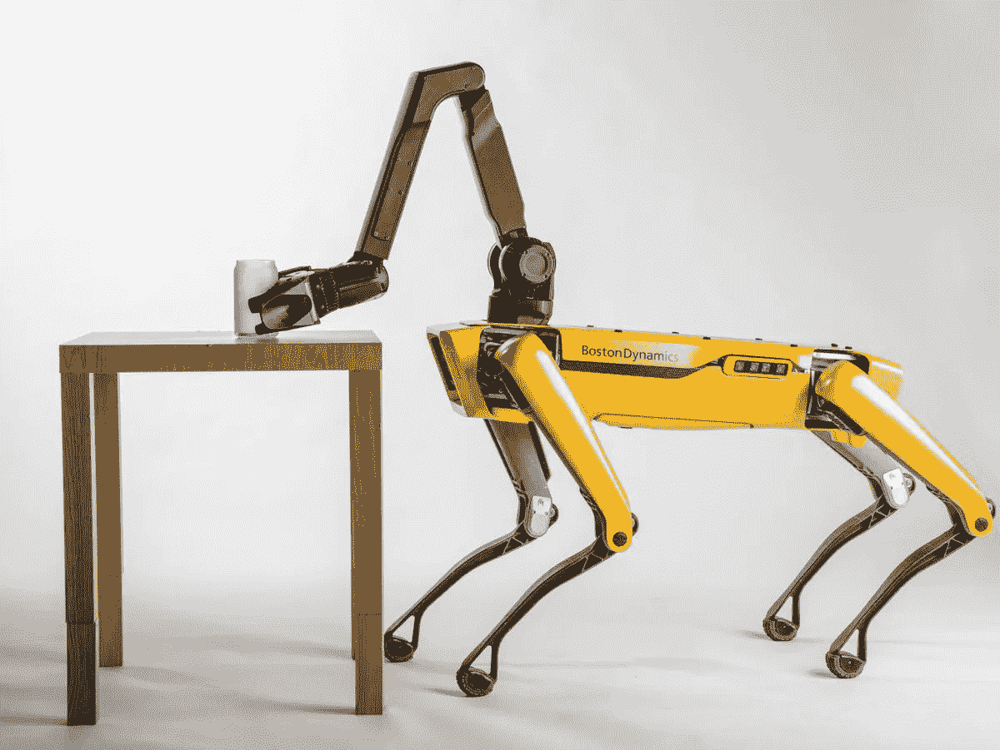

# 波士顿动力公司的传奇

> 原文：<https://medium.datadriveninvestor.com/the-boston-dynamics-saga-792e5daabb47?source=collection_archive---------13----------------------->

# 波士顿动力公司:快速回顾

1992 年，[马克·雷伯特](https://en.wikipedia.org/wiki/Marc_Raibert)决定在担任[麻省理工学院](http://www.mit.edu/)电气工程和计算机科学[教授](http://www.ai.mit.edu/projects/leglab/old-leglab/people/mxr.html)的同时创办一家公司。他创办了[波士顿动力](https://www.bostondynamics.com/)公司，目的是[制造既能打破界限，又能在现实世界中工作的机器](https://www.bostondynamics.com/about)。27 年后的 2019 年，这家总部位于马萨诸塞州沃尔瑟姆的私营公司经历了一段艰难的历程，从从事美国军事合同到推出像动物一样奔跑和机动的机器人，所有这些都被出售了两次。

Boston Dynamics location in Massachusetts — Photo by 손진성

# 卖了，卖了

波士顿动力公司是一家现金流适中的小公司。该公司接受了美国军方的合同，为美国陆军制造机器人，并从国防高级研究计划局( [DAPRA](https://www.darpa.mil/) )获得了[资金](https://www.forbes.com/sites/samshead/2018/07/23/darpa-to-fund-new-ai-concepts-with-millions/#3c1c66a8251f)来开展一些项目。这些努力创造了[惊人的](https://www.youtube.com/watch?v=cNZPRsrwumQ) [大狗](https://en.wikipedia.org/wiki/BigDog)机器人。不久之后，谷歌提出从马克·雷伯特手中收购该公司，收购金额未披露。从商业战略的角度来看，这次收购对 Marc 来说一定是有意义的，因为加入谷歌意味着波士顿动力公司有更多的资源。此外，在这个时候，人工智能热潮开始升温，谷歌处于领先地位。

Boston Dynamics Robot, Spot. It is a 72kg electrically powered, hydraulically actuated robot designed by Boston Dynamics, trains with US Marines Photo by EPA

这笔交易是让马克在[安迪·鲁宾](https://en.wikipedia.org/wiki/Andy_Rubin)[安卓](https://en.wikipedia.org/wiki/Android_(operating_system))创始人的更大保护伞下[做他们的研究和工作。这是短暂的，安迪·鲁宾在谷歌被指控不正当关系后不久就离开了。此外，似乎还有与谷歌的](https://www.nytimes.com/2013/12/14/technology/google-adds-to-its-menagerie-of-robots.html)[整合问题](https://www.businessinsider.com/why-google-and-boston-dynamics-are-parting-ways-2016-5)以及谷歌[如何设想](https://techcrunch.com/2016/03/17/google-could-be-selling-boston-dynamics-because-even-google-thinks-these-robots-are-terrifying/)人工智能与波士顿动力方法的对比。谷歌随后想要退出，幸运的是，对谷歌和波士顿动力来说，[软银](https://www.softbank.jp/en/)带着该公司富有远见的创始人[孙正义](https://www.forbes.com/profile/masayoshi-son/#2ea81d4c3818) [对该公司下注](https://www.businessinsider.com/why-softbank-bought-boston-dynamics-google-alphabet-robots-2017-6)，并支付[3700 万美元](https://www.ccn.com/boston-dynamics-37-million-softbank-robot-sales-2019/)购买该公司的股份。

 [## 模式和机器人:复杂的现实|数据驱动的投资者

### 哈耶克的名著《复杂现象理论》(哈耶克，1964)深入探讨了复杂性的话题，并断言…

www.datadriveninvestor.com](https://www.datadriveninvestor.com/2019/03/04/patterns-and-robotics-a-complex-reality/) 

# 黑镜:金属头

早在公司被卖给软银之前，波士顿动力公司的机器人和他们的动态平衡技术就已经超越了制造像动物一样活动的机器人的想法。除了波士顿动力公司的机器人[视频](https://www.youtube.com/watch?v=OnWolLQSZic)在[疯传](https://www.youtube.com/watch?v=wE3fmFTtP9g)之外，这种机器人的存在引发了关于[机器人](https://www.youtube.com/watch?v=LiNSPRKHyvo)及其未来角色的[更广泛的讨论](https://www.youtube.com/watch?v=QlJ_-iVbah8)。这个话题进入了流行文化，从网飞的黑镜开始。

Metal Head, a Netflix take on Boston Dymanics robot — Image: tenor.com

# 我们承诺了，但我们失望了

波士顿动力技术的前景吸引了许多未来学家和科学家。然而，尽管所有的[展示](https://techcrunch.com/2019/04/19/boston-dynamics-showcases-new-uses-for-spotmini-ahead-of-commercial-production/)、[演示](https://www.youtube.com/watch?v=TxobtWAFh8o)、视频和 [TED 演讲](https://www.youtube.com/watch?v=AO4In7d6X-c)都没能成功地将任何产品推向市场。然而，波士顿动力公司确实创造了这种新的先进技术，制造了一种可以像人一样操纵的机器人，并向私人投资者出售股份。波士顿动力很不幸的答应了，然后又失望了。从商业角度来看，该公司缺乏商业产品令人费解，尤其是因为它们现在在软银旗下运营。

Boston Dynamics Robots Performing daily tasks — Image: Boston Dynamics

> “我认为机器人将会对人们的生活产生积极的影响。我认为它将提高生产力，我认为它将把人们从枯燥、肮脏和危险的工作中解放出来，我不愿意看到这样一项技术中的巨大机会因为害怕可能的负面影响而被错过。"
> 
> Marc Raibert，波士顿动力公司创始人

# 永远不会太晚

好消息是永远不会太晚。在 TechCrunch 2018 [会议](https://www.youtube.com/watch?v=QlJ_-iVbah8) , [马克·雷伯特](https://en.wikipedia.org/wiki/Marc_Raibert)谈到了波士顿动力公司的道路，以及该公司发布他们机器人版本的意图，该版本将作为各种应用的平台。还有[一些消息](https://www.theverge.com/2019/7/17/20697540/boston-dynamics-robots-commercial-real-world-business-spot-on-sale)波士顿动力公司今年将推出一款机器人。抛开一切不谈，波士顿动力公司仍未向公众证明它有能力让世界变得更美好。它还需要向投资者和股东证明，它如何才能成为一家有生存能力的企业。也许我们最终会有机器人来洗碗、打扫卫生、为人们搬箱子。这一切都还没有到来。

Boston Dynamics Robots are planned to launch in 2019 — Photo by Boston Dynamics

本文原载[此处](https://mhassaballa.com/2019/08/20/the-boston-dynamics-saga/)