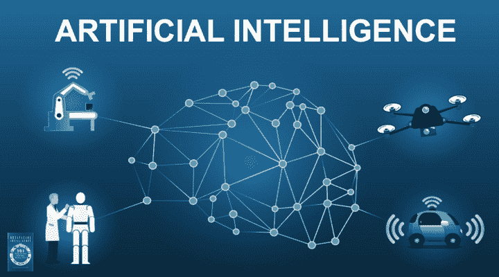

# 人工智能的无限创新

> 原文：<https://medium.datadriveninvestor.com/the-boundless-innovations-in-artificial-intelligence-c9d855743d96?source=collection_archive---------16----------------------->

帕特里克·维多利亚

在计算机进化和出现之前，人们手工完成他们的工作，仅仅为了完成一项任务就要进行太多的劳动。幸运的是，自动化机器被发明了，尽管我们花了几年时间从马拉车过渡到自动驾驶汽车，从通过邮局发送邮件到电子邮件，但很明显，这种创新不仅给我们的环境，也给我们的人类带来了巨大的影响。我们日常生活中最显著的技术进步之一是**人工智能(AI)** 的出现。

 [## 人工智能预测:“颠覆，然后是生产力”——数据驱动的投资者

### 人们越来越担心，随着机器学习和互联网的普及，所有白领工作都将消失

www.datadriveninvestor.com](https://www.datadriveninvestor.com/2018/08/06/ai-forecast-disruption-then-productivity/) 

随着我们世界的不断变革，人工智能已被广泛用于操纵大量数据以创造智能机器。更简单地说，人工智能使计算机或设备足够智能，能够**实现类似人类的交互和响应**。

Artificial Intelligence implemented in robotics, cars and drones

还记得我们小的时候，通过给我们看一本下面有标签的图画书，我们被教导如何识别“猫”、“狗”或“苹果”。或者你可能还记得你想在班级照片后面写上名字的时候，这样你就可以很容易地记住和认出他们。嗯，这些只是我们学习如何解释图片中的内容并描述它的一些方法。这对于任何人来说都很容易做到，因为人类有一个复杂的大脑，可以帮助我们自动识别任何我们知道的物体。但是，你有没有想过给计算机赋予**视觉理解和识别**的能力？

如果你曾经想过这个问题，那么你可能会想，如果这些机器只能从那些由像素组成的图像中读取数字，它们怎么能够识别图像呢？为此，人工智能最有趣的应用之一是教会计算机解释和识别物体，就像人类自然感知周围事物一样。有许多显著的创新利用了**图像识别**，这方面的一些例子包括能够自动驾驶的汽车，具有面部识别功能的智能手机，当然还有搜索引擎从关键字输出图像的能力。

总的来说，目前大多数图像识别技术都是通过**卷积神经网络(ConvNet)** 利用**机器学习**，这是一个非常深度的学习过程。基本上，机器学习就是赋予机器自主学习的能力，只要你给它足够的训练数据。就像父母如何教育他们的孩子一样，你需要教会机器，你给它的图像是一张“狗”、“猫”或任何你想让它学习的物体的图片。然后**机器提取图像属性**，包括像素的高度、宽度和深度，并以此为基础给它取名为“猫”、“狗”或任何你决定教它的名字。但是，能够识别图像仅仅是广阔科技世界的第一步。在图像识别之后，您仍然可以应用其他过程，这方面的完美例子是**增强现实。**

Image of a dog being fed to a neural network

但是构建和训练你自己的 **ConvNet** 的问题在于需要大量的资源，以及仅仅为了训练你的系统而执行的昂贵的过程。幸运的是，有许多可用的**应用程序编程接口(API)**，如 **Google Cloud Vision、Amazon Rekognition、**和**IBM Watson Visual Recognition**，它们可以帮助您只通过简单的方法调用来开发应用程序。这些**API**可能会让你感到困惑，就像我第一眼看到的一样。然而，通过对其文档的适当研究和对其功能的一些实践，您可能离完成您的系统更近了一步。

今天，人工智能已经令人惊讶地给我们的生活带来了舒适和便利。我们在研究中使用人工智能越多，我们就越能发现新的模式和解决方案，帮助我们获得世界上看似“不可能”的问题的答案。在不久的将来，图像识别仅仅是人工智能能够为我们提供的无限可能性中的一小部分。这就是技术和创新的工作方式。在每一个发现之后，仍然会有另一个创新来实现和发展它，就像一个无限循环。

# 明天，谁知道 AI 会做什么？

# AI #人工智能

使用 **RAX 编辑** : [**获得免费的机器人过程自动化(RPA)软件在这里下载**](https://www.raxsuite.com/freetrial)

**参考文献:**

 [## 如何用 Python 创建你的第一个人工神经网络

### 所有机器学习初学者和爱好者都需要一些 Python 的实践经验，尤其是创建…

www.analyticsindiamag.com](https://www.analyticsindiamag.com/how-to-create-your-first-artificial-neural-network-in-python/)  [## 关于人工智能的 7 个常见问题

### 你开始在新闻标题中看到更多关于人工智能的内容了吗？你想知道它将如何…

www.lasserouhiainen.com](http://www.lasserouhiainen.com/7-questions-artificial-intelligence/)  [## 什么是人工智能(AI)？-来自 Techopedia 的定义

### 人工智能 AI 定义-人工智能(AI)是计算机科学的一个领域，强调…

www.techopedia.com](https://www.techopedia.com/definition/190/artificial-intelligence-ai)  [## 图像识别的工作原理

### 对人类来说，解释视觉世界是非常容易的事情之一，我们甚至很难意识到自己在做什么…

www.upwork.com](https://www.upwork.com/hiring/data/how-image-recognition-works/)