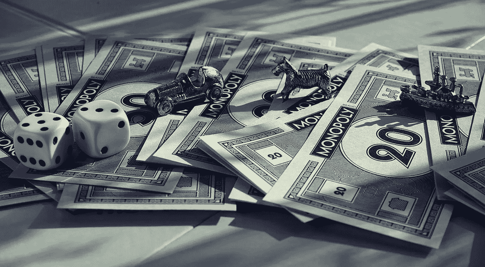

# 鲍克书号专卖

> 原文：<https://medium.datadriveninvestor.com/the-bowker-isbn-monopoly-f450295f5618?source=collection_archive---------13----------------------->

每本印刷书籍都需要一个 ISBN。甚至亚马逊的平装书也被分配了一个 ISBN。

ISBN 代表国际标准书号。在美国，只有一家 ISBNs 授权提供商，那就是 bow ker T1。
每个 ISBN 都包含作者、出版商、字号、格式、主题、定价和图书分销网络所需的其他数据。作者必须获得自己的 ISBN，或者由他们的出版商或自助出版发行商分配。

许多作者希望拥有自己的 ISBN，因为这使他们能够更好地控制 ISBN 数据，并获得轻微的市场优势(自行购买的 ISBN 将反映作者的出版公司或出版社的名称)。这就是不公平的地方。

在美国购买 ISBN 需要通过 Bowker，这是一家在美国唯一发行 ISBN 的公司。所有经销商都必须从 Bowker 购买。而且因为 Bowker 是独家垄断，所以他们收费很高。如果你是一个购买大量 ISBN 的出版商，如果你购买 1000 个，价格是每 ISBN 1 美元。然而，如果你是一个只需要一个 ISBN 的作者，Bowker 收取 125 美元或 12500%的加价。[如果考虑到服务成本，这一涨幅甚至超过了 12，500%](http://www.theindependentpublishingmagazine.com/2013/03/guest-post-how-bowker-uses-its-u-s-isbn-monopoly-to-rip-off-new-authors.html) 。当作者在 Bowker 的网站上输入数据来创建一个新的 ISBN 记录时，Bowker 几乎不需要花费任何成本。他们也有类似条形码 25 美元的追加销售。

在像加拿大这样的国家，ISBNs 是免费的，因为它们不需要任何生产成本。对于加拿大人来说，Bowker 有点像 HMO 一个不必要的中间人。

那么，为什么在美国会有对 ISBNs 的垄断呢？为什么一家公司可以设定任何他们想要的价格？为什么我们要欺骗独立作者？为了新闻自由的健康，书号应该被归类为公共物品，由国会图书馆管理。不要屏住呼吸。

尽管价格很高，但他们的技术和服务并不好。购买 ISBNs 的 Bowker 网站经常宕机。试试这里:[myidentifiers.com](https://www.myidentifiers.com/isbn/main)