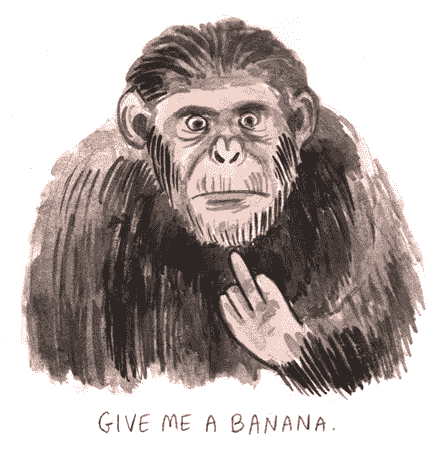
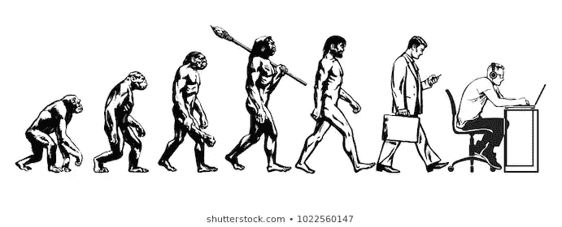
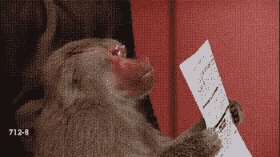
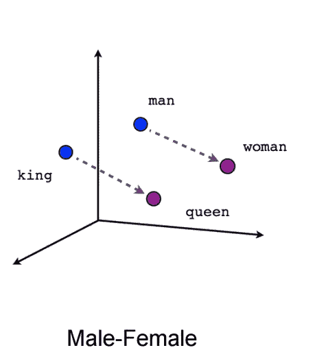
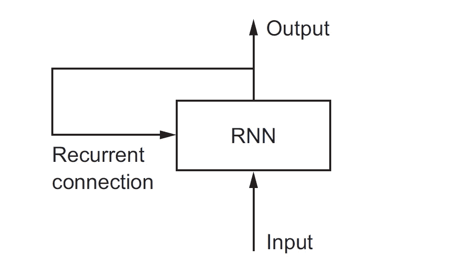

# 自然语言处理的简史

> 原文：<https://medium.datadriveninvestor.com/the-brief-history-of-nlp-c90f331b6ad7?source=collection_archive---------0----------------------->

在这篇文章中，我们将看看一个非常有趣的研究领域，叫做**自然语言处理**，看看它带来了什么好处。

我们不断地根据人类的需求塑造我们的环境，这有多种形式，其中之一是让机器理解最复杂和最特殊的功能，这种功能使我们有别于仅仅是巨猿的“语言”。

 [## 深度学习用 7 个步骤解释-更新|数据驱动的投资者

### 在深度学习的帮助下，自动驾驶汽车、Alexa、医学成像-小工具正在我们周围变得超级智能…

www.datadriveninvestor.com](https://www.datadriveninvestor.com/2019/01/23/deep-learning-explained-in-7-steps/) 

讲述我们创造性想象力的故事，以言语形式表达我们的思想、欲望和梦想的能力是人类与众不同和特别的地方。这种毫不费力的功能帮助我们聚集在数百人的群体中，在今天的时代，数十亿人团结起来，推动我们认为人类的界限——我们的口号变成了:“天空是极限”，但事实证明没有极限，因为这种分享想法和理想的能力使我们能够为了共同的目标相互合作。我们即将把这句话改为:

> “银河系是极限”，这反过来给予更多的时间甚至连*时间*都将是极限。

语音是最有效的交流方式，我们希望我们的发明能够理解它，这很正常。停下来，想一分钟！！我们主要用语音命令训练狗和许多其他动物，当它们幸运地按照指令行动时，我们用奖励信号强迫它们接受我们自己的交流机制。历史一次又一次地证明，我们愿意按照我们的愿望和欲望改变我们周围的一切，不是因为我们需要，而是因为我们想要，这是我们的天性！

用达摩智者的话来说:

> “我们的本性是心灵。而心灵是我们的天性。”

# 自然语言处理的黎明

对自然语言处理的研究通常始于 20 世纪 50 年代，尽管在更早的时期就有一些工作。1950 年，**艾伦·图灵**发表了一篇名为**“计算机器与智能”**的文章，提出了现在所谓的 [**图灵测试**](https://en.wikipedia.org/wiki/Turing_test) 作为智能的标准。

> **图灵测试—** 由**艾伦·图灵**于 1950 年开发，是一种测试机器表现出与人类智能行为相当或无法区分的能力的测试。

自然语言处理(Natural Language Processing)被广泛定义为软件对自然语言(如语音和文本)的自动处理。

**NLP** 中的挑战频繁涉及 [**语音识别**](https://en.wikipedia.org/wiki/Speech_recognition)[**自然语言理解**](https://en.wikipedia.org/wiki/Natural_language_understanding)[**自然语言生成**](https://en.wikipedia.org/wiki/Natural_language_generation) 。

> **自然语言生成**引发了我的好奇心，我们会在以后的文章中谈到。

此外，直到 20 世纪 80 年代，大多数 NLP 系统都是基于复杂的手写规则集。然而，从 20 世纪 80 年代后期开始，随着用于语言处理的****(ML)**机器学习算法的引入，NLP 发生了一场革命。这是由于计算能力的稳步增长(参见 [**摩尔定律**](https://en.wikipedia.org/wiki/Moore%27s_law) )和 [**乔姆斯基**](https://en.wikipedia.org/wiki/Noam_Chomsky) 语言学理论(例如[转换语法](https://en.wikipedia.org/wiki/Transformational_grammar))的优势逐渐减弱，其理论基础阻碍了作为 ML 语言处理方法基础的[语料库语言学](https://en.wikipedia.org/wiki/Corpus_linguistics)。一些最早使用的 ML 算法，如 [**决策树**](https://en.wikipedia.org/wiki/Decision_tree) ，产生了硬 **if-then** 规则系统，类似于现有的**手写规则**。**

## **进化**

****

**Evolution of a programmer**

**自从 20 世纪 80 年代末和 90 年代中期所谓的“统计革命”以来，许多自然语言处理研究都严重依赖于 ML，并且目前甚至更加依赖于 ML，因为 ML 的一个大突破是现在著名的子领域，称为深度学习(DL)。**

> **ML 范式要求使用[统计推断](https://en.wikipedia.org/wiki/Statistical_inference)通过分析典型现实世界示例的大型 [*语料库*](https://en.wikipedia.org/wiki/Text_corpus) (一个*语料库*(复数，“语料库”)是一组文档，可能带有人类或计算机注释)来自动学习这样的规则。**

**在 2010 年代，深度学习(DL)取而代之，深度神经网络风格的 ML 方法在自然语言处理中变得广泛，因为结果显示这种技术可以在许多自然语言任务中实现最先进的结果，如语言建模、解析和许多其他任务。**

**流行的技术包括使用[单词嵌入](https://en.wikipedia.org/wiki/Word_embedding)来捕获单词的语义属性，以及增加更高级任务的端到端学习(例如，问答)。**

# ****NLP 目前在哪？****

****

**借助 DL 模型的强大功能，我们可以处理文本(理解为构成人类语言基础的单词序列或字符序列)、时间序列(天气数据)和一般的序列数据。**

**用于序列处理的两个基本深度学习算法是:**

*   **递归神经网络**
*   **和 1D 修道院(用于计算机视觉领域的 2D/3D 修道院的一维版本)。**

**就这项技术的应用而言，我相信我们只是局限于我们的想象力，这同样适用于大多数人工智能子领域，但不是所有领域。因此，让我列出几个最明显的应用:**

*   **文档分类(比如识别文章的主题或者一本书的作者)。**
*   **时间序列分类(如天气预报或股票市值预测)。**
*   **序列对序列学习，例如将英语句子解码成法语**

**多年来，自然语言处理领域经历了许多变革，到目前为止，最引人注目的是从 2012 年(DL 热潮之后)到现在，这带来了一些基础概念，这些概念在多年的研究中达到了高潮。**

# **NLP 中的零到英雄**

*****如何处理文本数据*****

****

**文本是最普遍的序列数据形式之一。在 DL 的上下文中，我们有两种处理它的方法，要么在字符级，要么在单词级，后者是最常见的。请注意，这些 DL 模型没有一个真正理解人类意义上的文本；相反，这些模型可以映射出书面语言的统计结构(使用数字，我稍后会演示)。**

**DL for NLP 是一种应用于单词、句子和段落的模式识别，与计算机视觉应用于像素的识别方式非常相似。**

1.  ****单词嵌入****

****

**fig 5\. Word embeddings**

**像所有其他神经网络一样，DL 模型不接受原始文本作为输入:它们只处理**数字张量**(具有 3D+的矩阵)。**

***向量化*文本就是将文本转换成这个**数字张量**的过程。这可以通过多种方式实现，但我们只讨论两种方式，它们是:**

*   **将文本分割成单词，并将每个单词转换成向量。**
*   **将文本分割成字符，并将每个字符转换成向量。**

**这个过程输出不同的单元我们称之为 ***记号*** 而把文本转换成这个记号的过程称为 ***记号化*** 。然后，我们将这个令牌输入到 DL 神经网络中。**

**那么什么是单词嵌入呢？**

**单词嵌入是低维浮点向量，是将向量与单词相关联的强大方法。**它们意在将人类语言映射到一个几何空间中，**词向量之间的几何关系应该反映这些词之间的语义关系。**

**与通过其他技术(如**一键编码**)获得的单词向量不同，**单词嵌入**是从数据中学习的，或者按照单词的顺序，单词嵌入适应您的特定用例。**

> **如果您还记得图 5，它完美地说明了什么是单词嵌入以及它们是如何工作的。它只是将语义相似的词组合在一起，使它们在几何空间中接近，即男人、女人、国王和王后相对接近，因为它们都指代性别。**

**就我们所知，在单词嵌入之前，有一些标记化方法被使用，即一个热点和一袋单词。**

****如何获得这些嵌入****

**有两种方法可以获得单词嵌入:**

*   **与你关心的主要任务(即情感预测)联合学习单词嵌入。在这种设置中，您从随机单词向量开始，然后它们以与神经网络的权重相同的方式更新，以更好地学习(输入 **x** 和输出标签 **y** 之间的映射)。**
*   **将使用不同于您试图解决的 DL 任务预先计算的单词嵌入加载到您的模型中。这些被称为*预训练单词嵌入。***

# ****了解递归神经网络****

****

**递归神经网络、普通全连接神经网络和 convnet 之间的关键区别在于，与其他网络不同，递归神经网络具有记忆功能。**

**我们人类可以在处理数据的同时保持与我们正在做的活动相关的记忆。例如，当你通读这篇文章时，你是在一个字一个字地处理它，同时保留帮助你理解和停留在上下文中的记忆。递归神经网络(RNN)没有什么不同，当它们处理数据序列时，它们会保持一个包含与迄今所见相关信息的*状态*。**

> **“没有记忆，就没有文化。没有记忆，就没有文明，没有社会，没有未来。”—埃利·威塞尔**

**RNN 的状态在处理不同的、独立的句子之间被重置，这是因为一个序列不再在一个步骤中被处理；相反，网络在序列元素上内部循环。一个完美的例子是我们之前使用的关于阅读的例子。我们不会一次阅读一大块文本，我们会把它分解成更容易处理的大小，比如一行，一段。**

> ****链接到我的代码教程:****

 **[## 谷歌联合实验室

### 编辑描述

colab.research.google.com](https://colab.research.google.com/drive/1cHQeVO2CmmWfUAHy7CVvZnwRwOMDUgTy#scrollTo=-idGD2U0smUy)** 

# ****何去何从？****

****

**还有许多其他类型的 RNN 有待探索，我将在下一篇文章中谈到它们。**

*   **LSTM(长短期记忆)**
*   **GRU(门控循环单元)**
*   **双向长短期记忆**

**对序列数据使用卷积**

*   **1D·康文内特**

**就在我们结束之前，文献和研究已经超越了我提到的所有这些算法，进入了 NLP 突破的新时代，引领我们的是:**

*   ****注意机制**。**

**有趣的是，报纸的标题是“你所需要的只是关注”。**

**这种机制允许创建强大的语言 DL 模型，例如:**

*   **变压器**
*   **伯特**
*   **GPT-2。**

**迫不及待地谈论这一点以及人工智能领域最近的许多新发现，敬请关注。**

# ****外卖的 3 个要点****

*   **我们复杂的说话能力是我们如何相互交流、合作和进化的关键。这一点和巨大的大脑使我们超越了这个星球上几乎所有的生命形式**
*   **自然语言处理是一个致力于帮助机器识别、理解语言、翻译和更好地与人类交流的研究领域。**
*   **为了更好地处理语言数据，无论是文本还是声音，我们需要开发具有记忆元素的系统，以便它能够理解上下文。**

**感谢您的阅读。如果你有任何想法，评论或批评，请在下面评论。**

**在推特上关注我的 [**卡努玛王子**](https://twitter.com/CanumaGdt) **，**这样你就可以一直了解 AI 领域的最新动态**。****