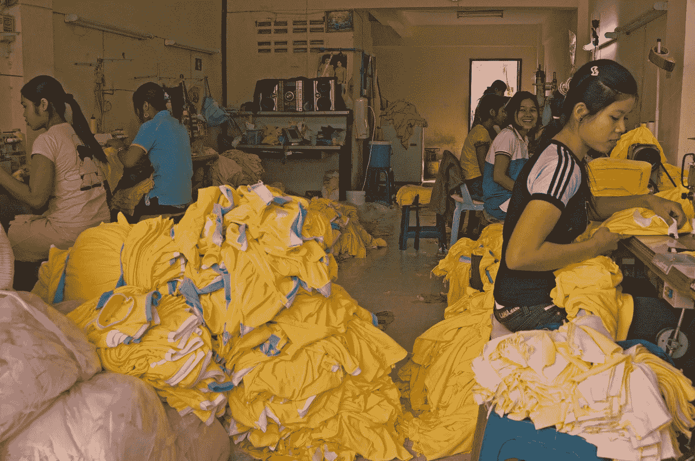

# 妓院到血汗工厂的管道

> 原文：<https://medium.datadriveninvestor.com/the-brothel-to-sweatshop-pipeline-ea4ce45c48fc?source=collection_archive---------5----------------------->

## 性贩运受害者如何被“解救”到其他类型的强迫劳动中

Photo by [Schone Kleren Campagne](https://www.flickr.com/photos/schoneklerencampagne/)

S urvivor，性交易活动家，自传*的作者，*2009 年*时代*最有影响力的人物之一；曾经显赫一时的索马利·玛姆声称已经从性交易中解救了数千名妇女和儿童。

2014 年 5 月 28 日，在被 [*《新闻周刊》*](https://www.newsweek.com/2014/05/30/somaly-mam-holy-saint-and-sinner-sex-trafficking-251642.html) 指控欺骗后，玛姆从[索马利·玛姆基金会](http://www.somaly.org/)辞职。

> “索马利·玛姆拯救了无数柬埔寨女孩”

《新闻周刊》的杰哈德·约兰写道

> "她的竞选活动是否建立在一张谎言网上有关系吗？"

Mam 曾经在 Twitter 上拥有超过 40 万名粉丝，现在只剩下不到 3000 人。在现代社会，这是一个非常明显的措施，可以衡量自从新闻周刊的文章发表以来，公众对妈妈的看法有了多大的改变。

 [## 为什么包容性财富指数比 GDP 更能衡量社会进步？|数据驱动…

### 你不需要成为一个经济奇才或金融大师就能知道 GDP 的定义。即使你从未拿过 ECON 奖…

www.datadriveninvestor.com](https://www.datadriveninvestor.com/2019/03/08/why-inclusive-wealth-index-is-a-better-measure-of-societal-progress-than-gdp/) 

Mam 让性交易受害者成为明星，用生动的细节分享他们悲惨的故事，以此为她的组织宣传。

约兰调查了这些故事，发现了许多不一致和修饰之处。

玛姆最大的“明星”之一是 Meas Ratha，她描述了 1998 年在法国电视上被卖到妓院。Ratha 后来承认她从未被贩卖，由于她的父母无力照顾他们的七个孩子，她被送到了 T21。

据说被愤怒的皮条客挖出眼睛的朗普罗斯，实际上是因为肿瘤而被摘除了眼睛。多名目击者也声称玛姆的自传中有不实之处。

玛姆的许多名气可以追溯到她与《纽约时报》专栏作家[纪思道](https://www.nytimes.com/column/nicholas-kristof)的友谊。

克里斯托夫写了多篇关于玛姆的文章，并在一次妓院突袭中发了微博，这似乎违反了联合国关于儿童权利的公约[。他还为了媒体目的购买了两名性奴，这是柬埔寨人口贩卖法所不允许的。](https://www.ohchr.org/en/professionalinterest/pages/crc.aspx)

克里斯托夫承认，他有[【强烈的理由怀疑】](https://publiceditor.blogs.nytimes.com/2014/06/02/nicholas-kristof-should-give-readers-a-full-explanation-about-somaly-mam/?_php=true&_type=blogs&_r=0)至少有一个所谓的谎言是由玛姆和她的组织制造的。

有些人可能会说，为了如此崇高的事业而夸大事实是合理的——但小谎言往往是更大谎言的先兆。

Mam 的故事很重要，因为它代表了一些非政府组织中令人不安的模式。

这种模式包括歪曲事实和推动外围议程。这方面的一个例子是基督教原教旨主义非政府组织，他们利用性交易作为宣传唯禁欲教育的敲门砖。

媒体经常很快赞扬人道主义英雄，但他们很少受到像约兰调查马姆那样的审查。

我们为什么要怀疑那些看起来做得很好的人的真实性或动机呢？

因为有时我们没有完整的故事。

> “事实是，这非常重要，”

写道*大西洋的* [帕特·约瑟夫](https://www.theatlantic.com/author/pat-joseph/)，

> “正是因为非政府组织依赖公众的信任。当人们滥用这种信任时，它不仅会伤害慈善事业，还会破坏我们对媒体的信任。”

约瑟夫早在 2012 年初就参与了玛姆的故事，当时曾在柬埔寨与玛姆一起工作的工作人员和志愿者带着担忧找到了他。这些问题包括为获救的受害者提供的服务质量差，缺乏职业培训计划，以及非政府组织是“游客和摄影人员的旋转门”。

> “我在 1 月份访问了金边的一个这样的非政府组织——不是由 Mam 经营的，而是建立在她自 2007 年以来对这个问题的关注之上的。我看到的并不令人震惊:完全正常的柬埔寨妇女在一个大房间里缝制衣服。但这也不是社会服务:这是一个服装厂，”

写着*沙龙的* [安妮·伊丽莎白·摩尔](https://www.salon.com/writer/anne_elizabeth_moore)。

> “更令人痛苦的是，我不被允许问这些妇女任何关于‘她们以前的生活’的问题……通常，一种强制的沉默文化掩盖着虐待和胁迫。然而，不知何故，我们被马姆、克里斯托夫和一些精心挑选的受害者灌输了一种信念——在这里，沉默除了治愈，什么也不是。”

大多数柬埔寨妇女生活在极端贫困的条件下。简单地将他们从一种强迫劳动转移到另一种似乎不是一个理想的解决方案。

许多非政府组织没有将这些妇女从奴隶状态中解放出来，而是简单地将其他种类的低工资工作正常化，这些工作也存在于危险和虐待性的工作环境中。

这些行为也创造了一种羞耻文化，在这种文化中，一旦一个女人已经被“拯救”了，她拒绝这种工作是不可接受的。

一场较量[世界上 80%的服装工人是女性，而在柬埔寨，女性约占时装业劳动力的 90%。柬埔寨生产的服装约有 70%销往美国。](https://www.worldbank.org/en/news/feature/2017/02/07/in-bangladesh-empowering-and-employing-women-in-the-garments-sector)

一些人(如世界银行)认为，许多妇女被服装业赋予了经济权力，因为在许多地方没有多少其他工作可供妇女选择。

在许多这样的地方，女性也可以从事的唯一其他工作之一就是性工作。

与服装厂相比，性工作往往报酬更高，时间安排更灵活。这或许可以解释为什么许多玛姆在她的激进主义生涯中“拯救”的女性(包括克里斯托夫买下的两名性奴)在“解放”后最终回到妓院工作。

由于经济状况，全世界数百万人被迫在恶劣的条件下从事各种劳动。我觉得在试图帮助这些人时，活动家们至少可以做的是允许他们在自己选择的行业中从事这项劳动。

任何行业都存在滥用和剥削的可能性。整个国际贸易体系骑在全世界受剥削工人的背上。尤其是服装业工人，100 多年来一直在为争取更好的工作条件而罢工。

下次你在沃尔玛买一件五美元的 t 恤时，想想这一点。

在今年一月的近两周时间里，5 万名服装工人[在孟加拉国的达卡](https://www.thenation.com/article/stories-the-fashion-media-wont-tell/)示威。孟加拉国的服装业每年创造约 300 亿美元的收入，但工人们通常每月只能挣 95 美元。

我不知道答案是什么，但我知道解决这些问题的方法不是将这些妇女幼稚化，而是告诉她们我们知道什么对她们最好。为了名声和影响力而挪用和歪曲他们的故事似乎也是不对的。

如果我们想要拆除一个工程化的基于性别的贫困系统，我们需要从诚实面对开始。

我永远不会怀疑女性的力量、韧性、智慧和权力。

这些女人知道什么对她们自己的生活最好，我们应该听她们的。