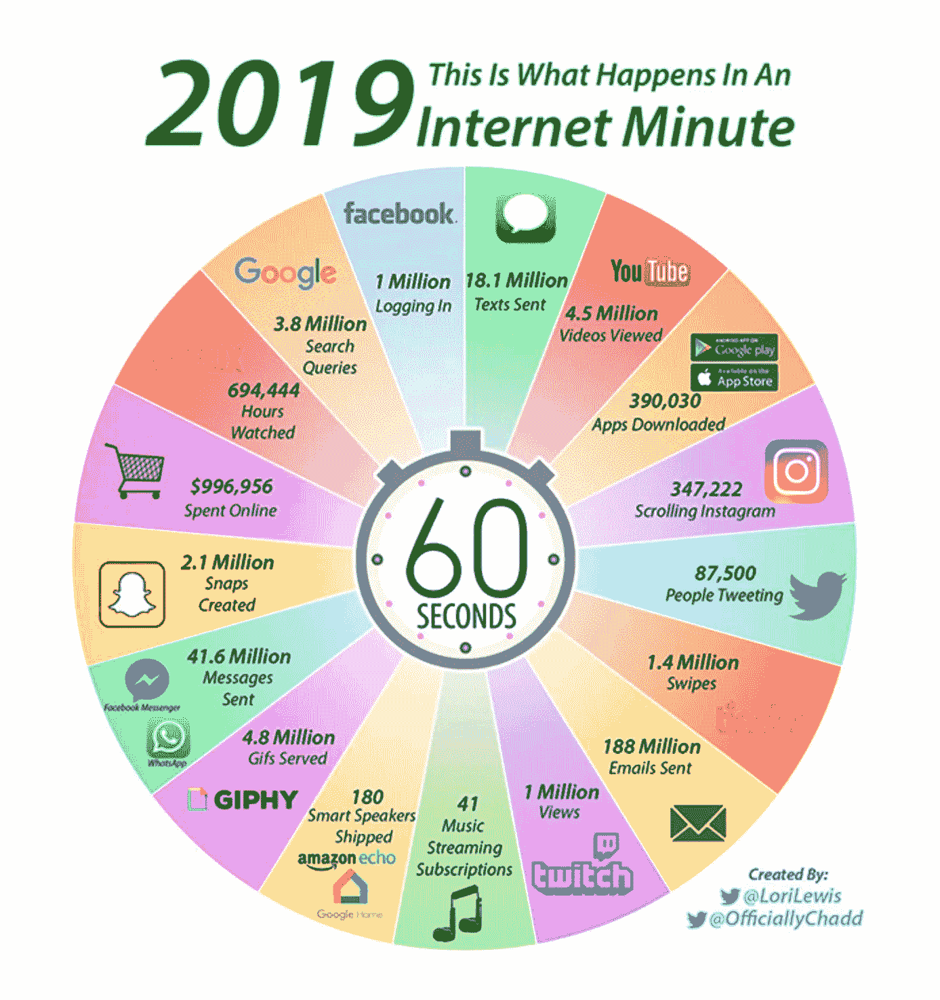

# 大数据业务

> 原文：<https://medium.datadriveninvestor.com/the-business-of-big-data-9af4f0c117c?source=collection_archive---------11----------------------->

正如 Thomas Friedman 所说"*就在几年前，脸书还不存在，Twitter 还是一种声音，云还在天上，4G 是一个停车场，linked in 是一座监狱，申请是你送到大学的东西，大数据是说唱明星，skype 是一个印刷错误"*

正如你所看到的，随着越来越多的事物相互联系，世界正以令人难以置信的速度增长。每一项活动、每一台设备、每一次点击都在产生数据。你有没有停下来想一想在互联网的一分钟里会发生什么？

90 万次脸书登录，1600 万条短信，350 万次谷歌搜索。你得到了要点…它是巨大的！所有这些数据就是我们所说的大数据。

 [## 为什么数据将改变投资管理|数据驱动的投资者

### 有人称之为“新石油”虽然它与黑金没有什么相似之处，但它的不断商品化…

www.datadriveninvestor.com](https://www.datadriveninvestor.com/2019/01/25/why-data-will-transform-investment-management/) 

今天，我将借助一些例子告诉你什么是大数据，以及你如何看待它影响你的日常生活。

嗯，教科书对大数据的定义是—任何具有容量、速度、多样性和准确性的数据。不用太专业，大数据本质上是一座巨大的垃圾山，里面埋藏着一些小宝石。宝石如此珍贵，可以改变公司的经营方式。因此，毫不奇怪，公司投资数百万美元，在高级分析的帮助下识别这些宝石，帮助他们将大量数据处理为信息，然后洞察。洞察力来执行他们的下一步行动！

你是否注意到，大数据如何影响你和我在日常生活中的决策——它影响我们如何购物、吃饭、工作、开车、锻炼——我们寻找最好的书来买，最好的地方来吃，下一个最好的电影来看。

让我给你举几个例子…

**网上购物**——你有没有注意到，当你无意中搜索了一件想买的特定商品，比如说一只鞋，然后出于某种原因决定不买它，或者只是把它添加到你的愿望清单中，然后随意退出浏览器时会发生什么？你会注意到，每次你登录寻找任何东西时，你都会被那种鞋或与那种鞋相似的商品的广告或促销轰炸。广告几乎像影子一样跟着你，直到你买了那双鞋，或者用广告拦截器设法摆脱了它。

嗯，你可以将这归咎于大数据——每次你访问一个网站，花时间在一个页面上，点击一些东西，比如一个项目——所有这些点击活动都会被记录下来。同样，数百万浏览网站的用户也是如此。所有这些数据然后被出售给零售公司，这些公司雇佣数据科学家在复杂算法的帮助下处理这些数据。由此得出的信息随后用于了解客户人口统计(年龄、位置、种族等。)来定位你我这样的消费者。

**健身行业**利用大数据获得优势。如今如此受欢迎的健身带会记录你的日常活动(如步数、心跳、燃烧的卡路里)，然后告诉你可以改进的地方。它还让用户将他们的习惯和生活方式与体重、年龄和活动量相似的人进行比较。医疗行业使用这些数据来跟踪健康模式，寻找常见问题的治疗方法。保险行业也使用这些数据来决定他们希望根据客户的健康数据向其提供的保费。

让我们从转移到**娱乐**——像 Netlflix 这样的流媒体服务使用大数据来提供符合你口味的娱乐。每当你喜欢或评价一部电影，这些数据就会被添加到喜欢这部电影的人群中，并帮助流媒体服务为你定制合适的电影。事实上，网飞甚至根据用户观看最多的内容制作内容，他们知道人们在哪里退出一个节目，下次他们制作东西时，他们确保不会犯同样的错误。

这样的例子数不胜数，从数据中可以获得巨大的价值来帮助人类和解决疾病。关键是在这个数据驱动的世界中找到平衡，正如 Steve Lohr 所说*“倾听数据很重要……但经验和直觉也很重要。毕竟，直觉是通过人脑而不是数学模型过滤的大量数据？”*