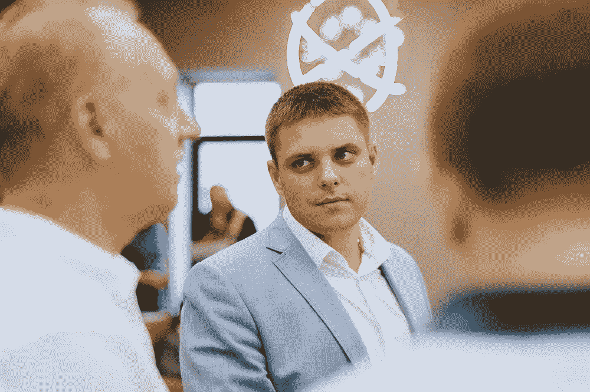
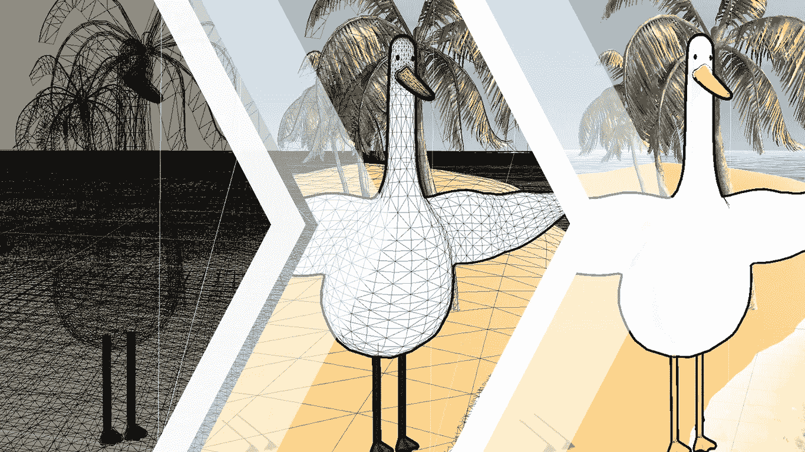
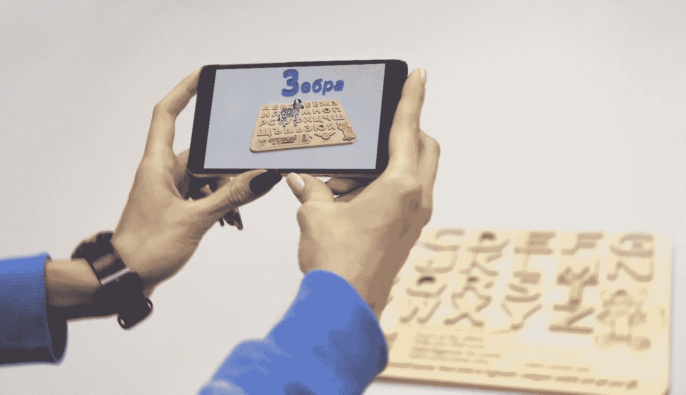

# AR 和 VR 的商业可能性

> 原文：<https://medium.datadriveninvestor.com/the-business-possibilities-of-ar-and-vr-a2070de3529a?source=collection_archive---------21----------------------->

虚拟(VR)和增强(AR)市场有多发达，企业如何利用这种技术，开发这种产品需要多少成本？谢尔盖·邦达伦科与 CEO 俱乐部分享他的专业知识。

# 虚拟和增强现实市场的现状如何？

很难谈论 VR 和 AR 市场，因为没有多少团队知道这些项目。因此，很难提供具有高质量图形的成熟解决方案。

事实是市场才刚刚兴起。从今年开始，商家一直在思考 ar 和 VR 产品的预算和营销成本。然而，形势非常乐观，这些技术现在为烟酒广告提供了一个不受监管的自由区域。

此外，只有少数公司能够完全开发出一种产品。因此，并不是每个团队都有能力独立生产所有组件。

所以，专业知识的价格是昂贵的。虽然有些公司刚刚开始寻找，但我们已经有现成的产品了。当然，你不能在收音机上卖彩电。图形也是一样——你必须看到它。

# AR 和 VR 技术有哪些瓶颈？

质量技术专家通常远离图形，3D 艺术家找不到与程序员接触的点。因此，在两种类型的专业人员之间保持适当的沟通和灵活的心态是非常重要的。

此外，目前市场上的 3D 艺术家并不完全了解 AR 和 VR 图形的所有功能。结果就出现了两个完全不同的方向。

实现增强现实的可能性有多大，包括商业项目？

我们现在才开始意识到 AR 的许多可能性。但是，任何找到最酷的机会来实现该技术的人也将从市场中获得最大收益。

我们现在有什么？在上海，已经有迪士尼乐园大小的 AR 公园了。此外，也有国际博物馆展示他们的展品，而不局限于一个单一的地方。

很多有趣的 AR 用法都是在书中实现的，比如《爱丽丝梦游仙境》。这是一种完全不同的讲故事方式。除此之外，这本书可以以一种全新的方式阅读、旋转和观看。

# 目前商业存在两个方向:

你可以把产品形象化，给消费者一个预览。例如，我们开发了一个非常有趣而简单的过程:消费者所要做的就是通过脸书应用程序打开相机，找到 3D 面具，然后选择特殊的产品选项。最重要的是，几个手指动作之后，顾客就可以把出现的家具放进室内。他们也可以马上下订单，程序本身会计算出将要投入生产的尺寸。

另一个 AR 案例是科斯米娅化妆品的演示。它是如何工作的？消费者选择产品，在相机的帮助下，他们可以看到某些化妆品在他们身上会是什么样子。最重要的是，他们可以通过应用程序下订单。是不是很酷？

通过 AR，你还可以实时记录或传输视觉指令。例如，它可以快速解决问题，无需等待专家上门。这也是一个很好的员工培训工具。

# 对于最终用户来说，使用 AR 应用的设备的价格是多少？

AR 应用程序完全可用，甚至可以在 100 多美元的廉价中国手机上运行。我们总是从最便宜的型号开始测试，然后再升级。

# 开发一个 AR 产品的预算是多少？

这项技术并不是所有人都能负担得起的，但我们也必须考虑实施的具体情况。脸书的口罩起价 400 美元。AR 产品的平均价格为 5000-15000 美元。然而，它很少会花费更多，因为技术本身的实现存在限制。

# 价格里有什么？

既要单独创建图形，也要单独思考和实现其功能。我们同时使用各种专家(3D 艺术家和程序员)，以及在不同设备上测试应用程序，为不同的屏幕格式创建灵活的设计。

# 如何才能将 VR 用于商业？技术有哪些可能性？

1.  在项目创建之前将其可视化。

有了 VR，你可以完全可视化正在开发的对象。例如，最近一家房地产公司开始在他们的办公室里展示虚拟现实中的未来公寓。

我们的另一个例子是妇产医院产房的可视化。这是一个高度卫生控制的房间。把每个游客都带到那里是不卫生和不合理的。因此，最好把一个人虚拟地放在那里，向他展示房间、房间里的物品，甚至是窗外的风景。

1.  高浓度水平的教学

虚拟现实——是一种高度沉浸式的学习。这不仅包括图像，还包括使用双耳声音的独特机会。这种虚拟的声音让你感觉自己置身于真实的空间。你可以完全模拟飞机或机器的驾驶舱。此外，您可以想象新设备或从内部介绍商店的功能。

虚拟现实还用于教授人工智能和深度学习系统——比如识别模式或空间方向。

由于虚拟现实，世界上任何地方的专家都可以出现在他需要的地方。例如，有一个解决方案，允许你在一个你不在的房间里行走，并观察其中发生的过程。在未来，它也将是可视化和控制的一个很好的选择。

# 沉浸在虚拟现实中你需要什么，对消费者来说要花多少钱？

各种技术都是可用的。单机设备只包括虚拟现实眼镜和控制器。因此，这个选项的价格为 300 美元起(例如，Oculus Quest)。一个 VR 站需要一台电脑。这一套件的成本约为 1500 美元(例如，HTC Vive——500 美元+电脑约 1000 美元)。

这么大范围？300 美元还是 1500 美元？

是的，这种差异非常显著，但也是合理的。花 1500 美元，你可以下载更多的空间，获得另一种质量的图形:使用独立设备无法计算的复杂图形效果。此外，更昂贵的设备不会引起任何不适。

结果，事实证明 VR 技术的使用给企业带来了额外的成本？最重要的是，他们不应该给用户设备本身吗？

这完全取决于如何使用它。如果我们在谈论机场，那么更容易给人们独立的眼镜。除此之外，如果我们谈论的是一个大型的演示室，例如虚拟家具，那么最好使用 VR 工作站。

# 这样一个陈列室要花多少钱？

我们为联想做了一个演示——三台笔记本电脑，价格从 800 美元到 1000 美元不等，三副眼镜，每副 400 美元。总额高达 4200 美元，一个展示的摊位已经准备好了。单机版——可以是 3-4 台 Oculus Quest，售价 300-400 美元。

技术在不断发展，只要 5G 连接一出现，我们就会彻底放弃电脑。

# 开发一个虚拟现实产品要花多少钱？

价格从 3000 美元起，甚至更高。平均项目成本为 10，000-20，000 美元。就像 AR 一样，有图形、软件设置和适应不同平台的功能。

AR 和 VR 的关键区别在于创造的世界的大小。虚拟世界总是更大，因为你可以使用电脑。另一方面，它们更具互动性，更有深度，通过它们，我们可以传递更多的信息。例如，我们创建了面积为 6000 平方米的虚拟现实仓库，每个仓库都有不同的部门和商品。这在手机上是不可能实现的，但至少也要花费 1 万美元

VR 项目的成本可能超过 2 万美元。因此，图形越多，价格也就越高。通常，当客户想要可视化某样东西时，他们希望从 50 个项目中在 VR 中使用。此外，要创建一个房间，你需要对地板、墙壁、椅子、灯光等建模。空间本身要求就很高。如果我们过于简化，那么现实主义的效果也会丧失。

# Skywell 软件为市场实现了哪些用例？

1.  实时虚拟演播室

虚拟工作室平台允许您模糊真实工作室和 3D 图形之间的界限。这个解决方案包括数字背景和前景。它还包含相机跟踪，真实屏幕铅色度键组成，可以与增强现实互动。

2.[鹅](https://skywell.software/portfolio/real-time-ar-vr-animation-for-art-nation/)

这是一个创造性的想法，使用运动捕捉技术实时执行交互式全息效果。此外，它允许观众与 3D 角色实时互动。因此，这只鹅成为了一个真正的客人，可以同时与演讲者和观众交谈。

在这次活动中，身体和面部运动的无线捕捉、实时渲染技术、投影和全息图被结合和实施。

3.[时装周](https://skywell.software/portfolio/vr-showcase-for-ukrainian-fashion-week/)

我们是两个项目的技术合作伙伴:乌克兰纽约和东京时装周。这个项目的目的是展示现代乌克兰设计师的作品。这些阶段如下:我们扫描模特和她们的衣服，并把它们放在一个虚拟的讲台上，参观者可以从各个角度欣赏模特的服装。听起来很棒？

4.生态动物

AR-适用于 Android 和 iOS 的应用程序，允许儿童通过播放和唱歌来学习字母表。

Ecotoki 应用程序将带有字母表的木板带到了增强现实的世界。这种温暖而模糊的 AR 应用程序具有小用户所需的交互性。此外，还有英语和俄语本地化，男女声旁白。

*最初发表于*[*sky well . software*](https://skywell.software/blog/the-business-possibilities-of-ar-and-vr/)*。*