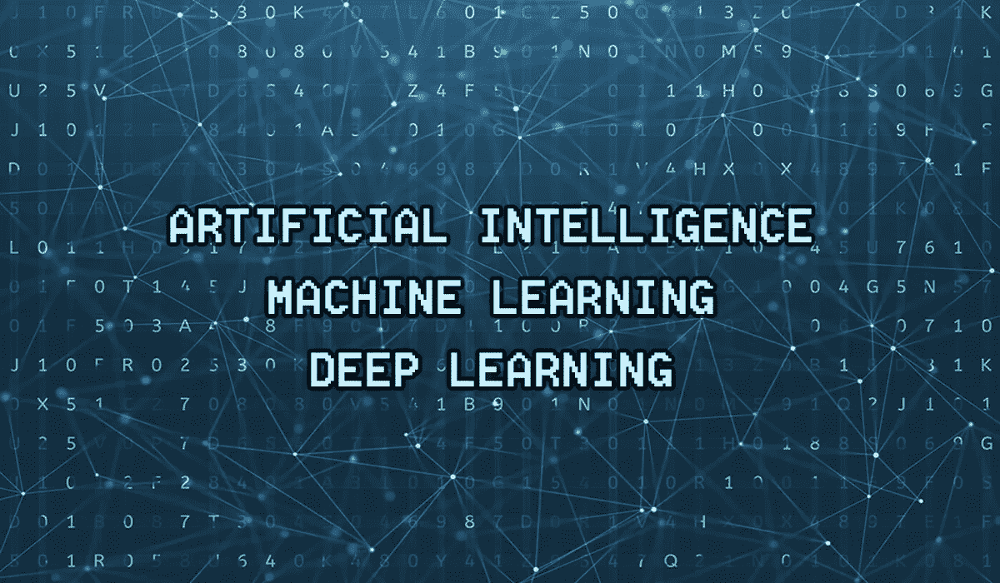
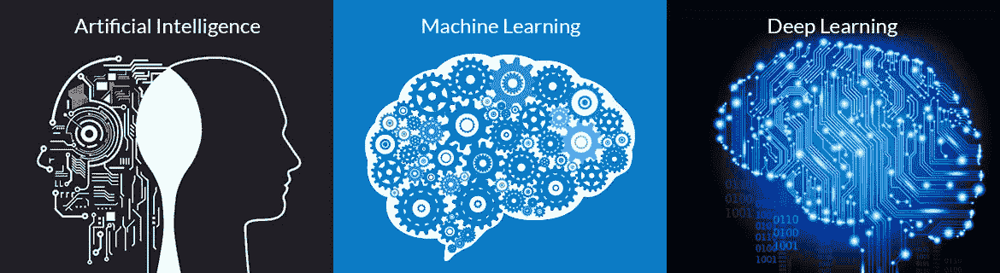
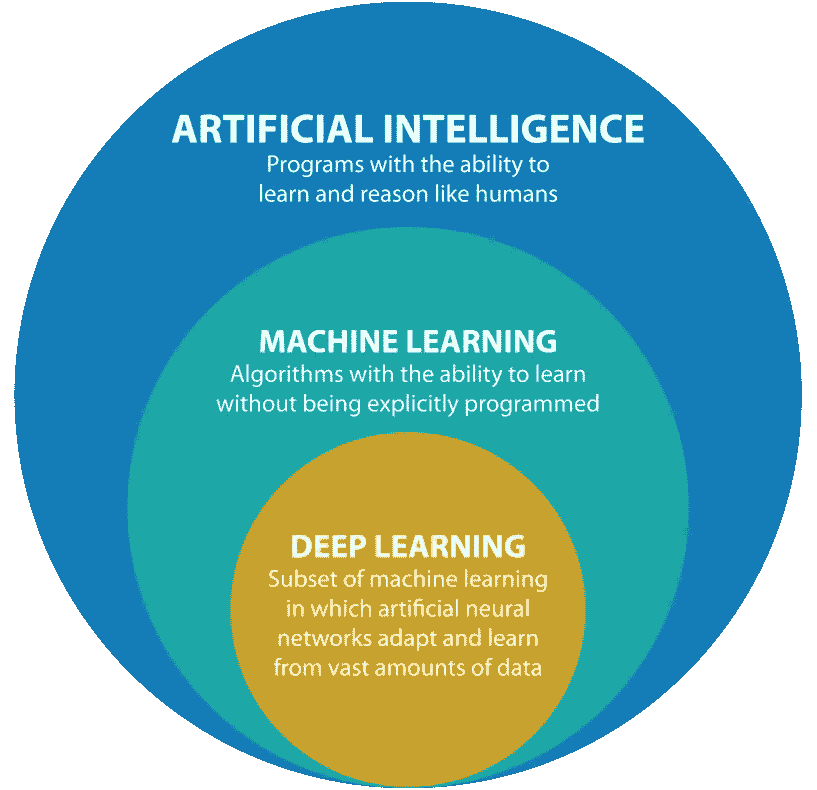

# 人工智能这个热门词汇

> 原文：<https://medium.datadriveninvestor.com/the-buzzing-word-artificial-intelligence-ef7744e6a70c?source=collection_archive---------27----------------------->

嘿，等等，你刚听说了人工神经网络？是的，你的大脑嗡嗡作响，就像人工智能、机器学习和深度学习等等。所以，让我们一起去领略一下人工智能的无限海洋吧。

首先，这是对人工智能最简单的理解形式，它是什么，如何工作，有哪些应用，利弊等等。准备好潜入算法、统计、神经网络等等的深海。这是一系列的文章，会让你了解人工智能的机制和核心部分。

**什么是人工智能？**

人工智能诞生于 20 世纪 50 年代，其动机是，是否能让计算机像人一样思考？我们今天仍在探索这种想法。人工智能是一个非常宽泛的术语，可能有成千上万个人工智能的定义，但我认为最热门的词是“**它是人类执行的智能任务的自动化实现**”。人工智能是一个研究领域，将使用机器学习和深度学习来开发系统，其中**像人类一样思考&像人类一样行动**，具有很高的准确性。人工智能涵盖了机器学习和深度学习。因此，我们可以说人工智能是将由机器学习和/或深度学习解决的问题的解决系统。

让我们来理解这意味着什么。

**什么是机器学习？**

嗯，机器学习是实现人工智能的敲门砖。

机器学习是使用算法、特征工程等等来解决人工智能任务的方法，或者我们可以说是这个领域。在机器学习中，模型将根据给定的数据集进行训练，这些数据集可以是标记数据或未标记数据。通过使用训练数据集，根据监督学习或无监督学习来训练模型。训练成功后，将给出测试数据，以检查输出是否满足预期输出。如果它与预期的匹配，那么我们可以将模型部署到生产中，否则我们可以简单地查找错误，并再次训练模型。基本上，训练所做的是，它将输入大量的数据，可以是文本文件、图像等等，并将其转换为有意义的表示。

我们举个例子。

数据集由像狗和猫这样的动物组成，将有数以千计的这两种动物的图像，ML 模型将做的是:它将从图像中提取特征，这被称为**特征工程**，根据它将进行训练，训练后，它将通过使用测试数据来测试模型是否预测正确的动物。如果模型预测正确的，我们可以说模型正在工作，否则我们需要重构它。

**什么是深度学习？**

嗯，深度学习是解决机器学习问题的方法/态度。

深度学习是机器学习的一个特定子领域。这基本上是从输入数据中学习表示的不同方法。简而言之，这就是连续层表示的概念。如图所示，深度学习由复杂的架构组成，或者我们可以说是深度学习如何工作的机制。它由输入层、隐藏层和输出层组成。它主要使用**正向传播&反向传播**机制来训练模型，每个节点都包含一些权重，优化器将使用这些权重来调整表示。从第一个输入层开始，数据将被提供给神经网络，在每个隐藏层，将从输入数据中提取越来越多的信息。隐藏层可以由单层或多层组成，只有通过实践和经验才能确定需要多少隐藏层。输出也将在训练模型时提供，如果有名为“A”的输入，输出将是“B ”,隐藏层将如何学习“B”。隐藏层只不过是一个从数据中获取信息的数学方程。

我们举个例子。

同样的例子，我们已经采取了机器学习将解决的深度神经网络。从输入阶段开始，输入和输出将被提供给神经网络，在每个连续通过层的隐藏层的帮助下，模型将学习诸如猫/狗的样子、颜色、形状、大小等等。在训练之后，测试数据将被测试，如果输出预测是正确的，那么我们可以说它工作得很好，否则它将被反向传播到隐藏层以学习它。这就是深度神经网络的工作原理。

恩，太多无聊的东西了。让我们简短地总结一下基本概况。

**AI、ML、DL 有什么区别？**

嗯，如图所示，人工智能包括机器学习和深度学习两个领域，简而言之，机器学习是解决人工智能问题的方法，而深度学习可能是解决它的技术。

这是第一篇文章，只是对这些领域的概述，我将撰写关于对这些领域的深入理解、使用的不同算法、机制等的系列文章。

我希望这能理清这三个趋势领域的基础知识。谢谢。！敬请期待下一集。！

**图片参考**

 [## 人工智能、机器学习和深度学习创意指南-

### 什么是人工智能？人工智能，也称为 AI，是模拟智能的算法…

creativefuture.co](https://creativefuture.co/what-is-artificial-intelligence-machine-learning-deep-learning/)  [## 人工智能，磁共振成像和数字成像有什么不同？

### 人工智能，磁共振成像和数字成像有什么不同？我们所有人都熟悉“人工智能”这个术语。它是…

www.techsophy.com](https://www.techsophy.com/blog-artificial-intelligence-machine-learning-deep-learning/)  [## 关于机器学习和人工智能，你应该知道的 5 个事实

### 多年来，计算机编程语言一直在发展，但迄今为止最大的里程碑是…

sociable.co](https://sociable.co/technology/5-facts-machine-learning-ai/)  [## 使用 Python 进行深度学习

### 人脑模仿。

towardsdatascience.com](https://towardsdatascience.com/deep-learning-with-python-703e26853820)