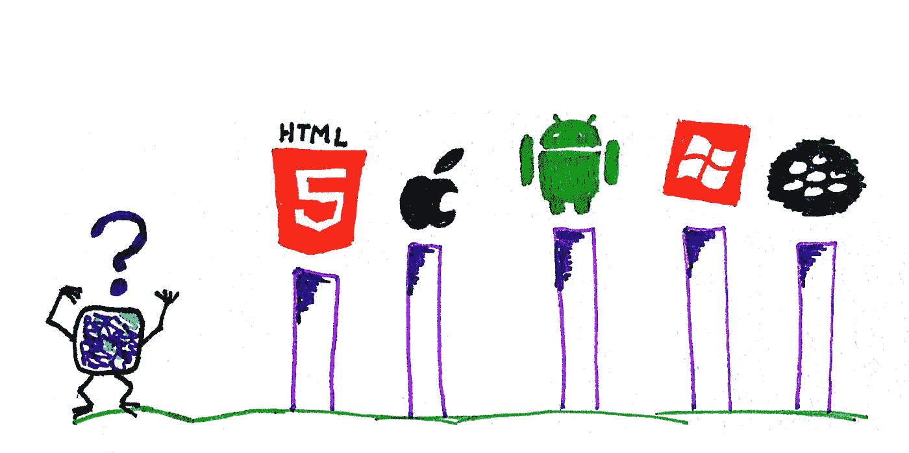

# 为您的应用选择正确技术平台的考量

> 原文：<https://medium.datadriveninvestor.com/the-calculus-of-choosing-the-right-technology-platform-for-your-app-f8f90bc5d65?source=collection_archive---------6----------------------->

Image source: [https://www.flickr.com/photos/86979666@N00/7809646882](https://www.flickr.com/photos/86979666@N00/7809646882)

在第一次开始一个技术项目或公司时需要做出的几十个决定中，没有两种决定比决定谁将加入你的团队以及你将使用哪些技术来构建你的产品更重要。这些决定具有长期的、不可逆转的影响，很难改变。他们甚至在你开始之前就为你的创业或团队设定了方向。当技术经理、初创公司高管和创始人想要为他们的下一个产品选择技术堆栈时，决策过程大致有三个阶段:发现、排除和建立共识。

# 发现

第一个阶段是发现阶段，它是一个广泛的技术搜索，这些技术已被用于构建任何与您所想的功能相似的应用程序。发现阶段帮助回答****可能*** *使用哪些技术？大多数称职的开发人员应该能够提出至少两种可以用来构建应用程序的技术。通常，软件应用程序的技术堆栈由后端服务器、前端客户端、数据库和部署基础设施组成。在决定技术堆栈时，最常见的错误是过于强调已经熟悉的技术。没有必要将自己局限于两三个堆栈或您已经知道的技术。相反，最好选择一种针对您试图解决的问题的技术。对于消息应用程序，更加强调实时通信的可靠性。对于金融应用，更加强调安全性。这将减轻可能发生的高风险问题，如服务中断、持续的性能下降和诉讼。**

*发现阶段是关于*发现*。这听起来像是常识，但很容易被忽略，因为大多数人(包括开发人员和技术人员)都倾向于做熟悉的事情。在这一发现阶段结束时，您应该有一个包含 3-5 个技术堆栈的列表，根据您的应用程序的目标和范围，这些技术堆栈对于您的应用程序来说是可行的。大多数时候，当你在 Stack Overflow 这样的在线社区中问一个关于特定技术优点的问题时,“依赖”这个词经常被滥用，而没有真正令人满意地解释选择一个技术框架*依赖于什么。所以在下一个阶段，我们将更深入地探讨这到底意味着什么:淘汰。**

# *消除:不使用什么*

*有几个成功的特征和衡量标准，一个技术产品或项目经常被用来判断。最常见的一个是上市时间。这个项目需要多长时间完成？如果上市时间真的很重要，它将优先于其他目标，如生产成本、维护费用和技术债务。换句话说，淘汰阶段的目标是**将技术工具与愿景**结合起来。快速构建并在以后修复？还是构建并维护一个可扩展的技术平台？*

*虽然许多初创公司走的是先快速构建后修复的路线，并取得了不同程度的成功，但在一些组织中，产品成功的结果比上市时间更受重视。在这些场景中，技术栈的重要部分是内部构建的；定制技术是专门为问题领域创建的。一个很好的例子就是第一款 iPhone 甚至谷歌的很多网络产品的发布。硬件、软件，甚至编程语言都被定制来做更多的事情，比如苹果的 Objective C 和谷歌的 JavaScript。这些产品通常需要数年时间来打造，但在市场上成功的几率更高，因为硬东西充当了自己的过滤器。*

*在上述两个极端中选择一个你觉得舒服的地方*。重要的是，你不要在上述两个极端之间选择一个点*，因为这些点最有可能导致平庸。介于上述两个极端之间的例子包括:构建缓慢且从不修复；快速构建并立即修复；缓慢建造，然后摧毁；构建缓慢，然后发布不兼容的版本；快速构建，将修复工作外包给其他人。你明白了。然后，使用上市时间和市场成功这两个哲学极端范围内的工具。***

# *建立共识*

*有趣的是，大多数流行的技术框架已经属于上述两个极端之一，因此建立共识实际上是容易的部分。比如 web 开发，前两个 JavaScript 库是 jQuery 和 React。jQuery 属于“稍后构建快速修复”的范畴。React 属于“构建缓慢且正确”的一方。这种模式在 web 和移动开发的各个方面反复出现。*

*当您想要使用一个真正擅长解决您的特定问题的技术平台，但它还不是一个主流技术平台时，建立共识的困难部分就出现了。如果您想在 2012 年将 node.js 服务器用于一个消息传递应用程序，您必须提出一个非常有力的理由。现在，没那么多了。另一个困难的部分是你必须是正确的，除了我接下来要说的一件事，我没有什么可以告诉你的来提高你的胜算。*

# *增长率和曲线下面积*

*微积分是理解我们世界的一个非常强大的数学工具；它和统计学一样有用，但它的应用忽略了我们大多数人，但[不是狗](http://www.indiana.edu/~jkkteach/Q550/Pennings2003.pdf):)作为一个快速复习，微积分的第一个主要思想是增长率(也称为导数)。第二个主要观点是函数会留下它们路径的痕迹(曲线下的区域)。*

*思考上述两个概念的另一种方法是比较收入和资产。收入是现在发生在你身上的资金流的比率(钱随时间的导数)，而资产是随着时间进入你的生活和你的家庭生活的资金流的积累。与货币资产类似，技术产品和平台的某些方面也是有形资产。代码库、底层技术的灵活性及其对其他平台的应用。这些很难衡量，但它们有“领先指标”。举个例子，我们来比较两个基于 JavaScript 的 app 开发框架:React Native 和 Ionic。这是一张对比两者的趋势图:*

**

*虽然 React Native 的增长速度明显快于 Ionic，但 Ionic 有一个领先指标，即在其框架内拥有更多“技术资产”，这不仅是因为它存在的时间更长，也是因为它支持 Angular 的生态系统(AngularJS 和新 Angular)。在使用了这两个框架之后，我亲身体验了 Ionic 的技术资产的成熟度。UI 组件是稳定的，在所有设备上看起来都很好，在单个版本中很少有突破性的变化，但总体来说，跨平台开发 UI 的体验是一致的和可预测的。React Native 则不然，在开始交付真正的价值之前，必须从至少 5 个导航库、10 个 UI 组件库和 3 个存储库中进行选择。*

*尽管底层框架更容易与 React Native 一起使用，但最终产品感觉像是由 package.json 文件用胶水和胶带粘在一起的。换句话说，React Native 通常更适合“以后构建快速修复”的路线，而 Ionic 则更适合“构建缓慢但做出优秀产品”的路线。*

# *结论—协调技术和项目目标*

*总而言之，没有真正“正确”的答案，但我们可以遵循一些领先的指标来理解一项技术及其生态系统的目标。Ionic 以其“一次编写，随处运行”的理念而闻名，而 React Native 以其“学习一次，随处编写”的理念而闻名(一种更温和的说法是“学习一次，然后复制意大利面”)。*

*最终，要记住的最重要的事情是，框架只是构建软件的工具。它的力量来自于团队为特定的原因使用框架。除了平衡上市时间和质量，还有技术债务积累和适当维护之间的平衡。对于一些团队来说，短期的技术债务可能值得长期的维护成本。对于其他资源短缺的团队来说，长期维护成本可能会对增长和创新产生严重影响。这就是将框架目标与您的愿景保持一致的含义。*

*如果项目失败，通常不是技术的错。这个项目缺乏一个明确的、可实现的、创新的愿景和严酷的市场力量。这是一个比工程问题更难处理的问题。与工程问题不同，很少有关于技术难题的文档，比如选择正确的团队、正确的框架，以及获得利益相关者的批准和资助。希望我们可以开始围绕这些更松散定义的问题进行更多的对话，尽管我们作为工程师讨厌不确定性，并且我们很多人希望专注于最新最闪亮的技术/功能/框架。*