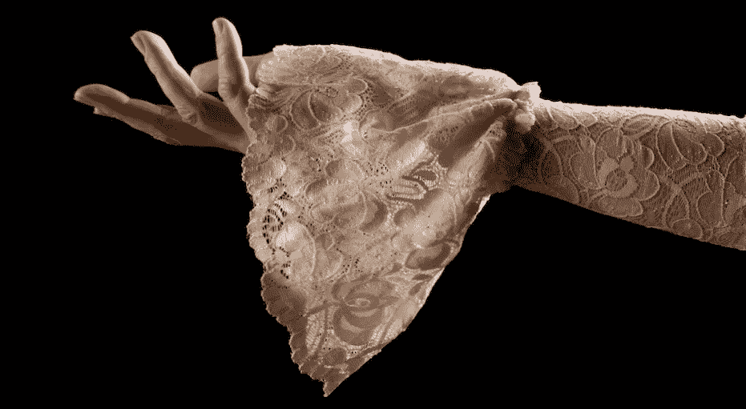

# 反对袖子的理由

> 原文：<https://medium.datadriveninvestor.com/the-case-against-sleeves-641eef2ce0be?source=collection_archive---------26----------------------->

杰拉德·迈克尔

*详细看看袖级汇报的弊端*

如果你正在考虑创建一个基于模型的统一管理账户(UMA)程序，你需要回答的一个最重要的问题是:有袖子还是没有袖子？袖子的主要情况很简单:它让您生成袖子级别的性能报告，该报告可用于评估单个模型管理器的性能。反对袖子的理由更加微妙，但最终是毁灭性的。它们很昂贵，导致低劣的税收和风险管理，最糟糕的是，它们对评估模型供应商没有用。

# 什么是袖子？

套现是一个虚拟的子账户，是投资组合中可以单独交易的一部分。这是一个“虚拟”账户，因为它没有自己的托管注册。也就是说，就托管人所知，有多个袖子的投资组合只是一个投资组合。套筒完全在会计系统中创建和维护。

# 袖子的起源

最初创建 Sleeves 是为了让财富顾问更容易将单个投资组合的管理分包给多个第三方专业资产管理公司。这个想法是，你会给这些第三方专家中的每一个人一部分投资组合的交易权——一个套子。

袖子的替代方案是将资金转移给每个第三方专家，这既耗时又操作笨拙。相比之下，只是给专家一个袖子来交易是一个优雅的解决方案。

然而，只有与电汇资金相比，它才是优雅的。让多个专家控制同一个投资组合的不同部分仍然存在问题:协调不同的专家以最佳方式管理过渡、税收和限制仍然很困难，如果不是不可能的话。你最终可能会违反洗盘交易规则，甚至会出现这样的情况:一名专家在另一名专家买入某项证券的同一天卖出该证券。

为了部分解决这些问题，财富顾问转向了基于模型的方法，其中第三方专家不交易子账户，他们只发送模型。交易由财富管理公司处理，这可能会“覆盖”税收和约束因素(因此有术语“覆盖管理”)。

如果基础策略需要特定的交易专业知识，让第三方专家直接控制账户的一部分仍然是有意义的，市政债券或小盘股策略可能就是这种情况。但对于其他一切，基于模型的方法在操作上更简单，并使税收和风险管理更容易。

基于模型的方法不需要袖子。毕竟，第三方专家不再需要他们自己的交易沙箱。但是袖子没有消失，至少没有完全消失。原因是袖级性能报告。

# 袖级性能报告

套筒级性能自然是每个套筒的回报。使用 sleeves 的一个结果是，您可以为每个第三方专家生成性能报告。这不是 sleeves 的最初目的——它只是拥有子账户的结果。事实上，具有讽刺意味的是，sleeves 的早期创新大部分都致力于使其能够超越 sleep 级别，并为客户的整个投资组合创建合并的性能报告。

但财富顾问和他们的客户已经习惯了袖珍型的业绩报告。因此，顾问保留了套子/子账户结构，即使在采用了基于模型的方法使它们变得没有必要之后。不是因为他们需要管理账户，而仅仅是为了提供报告。

*袖级绩效报告的上端*

*袖子级别的绩效报告非常适合传统的面向产品和回报的客户交互方法。套筒级报告旨在成为产品级业绩报告的一种形式，类似于单独报告客户账户中每个共同基金的回报。核心目的是帮助评估专家，回答这个问题:他们的表现如何？这种类型的产品级报告在许多程序中很常见，一些客户希望看到它。*

****袖级绩效报告的弊端****

*如果袖子级别的报告很常见——甚至经常被期望——为什么不让袖子成为通用的方法呢？答案是袖子有严重的缺点。它们很贵；它们导致低劣的税收和风险管理。最糟糕的是，它们并不总是对它们的主要功能有用:评估第三方专家经理。*

*让我们一次看一个缺点。*

## **1。成本和复杂性**

*袖子以多种方式带来复杂性:*

*套筒需要一个“影子”会计系统，记录每个套筒的持有量，以及一个对账流程，以确保每个套筒中的持有量加起来等于实际投资组合的持有量。并且袖子需要在袖子之间转移资产的过程。*

*袖子使得现金管理更加复杂。每个账户都将从分配中产生自己的现金水平。这使得为取款提供资金、支付费用和防止透支的任务变得更加复杂。要么每个账户中的现金被系统地分别转移到一个资金账户，要么每个账户保持自己的现金余额水平。*

*任何保存在不止一个套中的证券都会出现相关的问题。每个人都必须分别遵守批量舍入和最小交易规模限制，这将引入一些额外的漂移。销售的最佳纳税地段选择需要某种机制来交换袖子之间的纳税地段，以便任何给定的销售都可以用可用的最佳纳税地段来完成。为了避免在两个不同的袖子里同时买卖相同的证券，你需要某种交叉销售匹配过程。*

## **2。劣质税务管理**

*风险和税收是投资组合作为一个整体的属性，而不是任何一个单独的袖子，所以如果每个袖子都被孤立地管理，就没有办法最优地处理投资组合的税收和风险。因此，套筒管理的投资组合通常比整体管理的投资组合有更多的漂移，税收效率也更低。这是因为这使得安全级别替换和资产类别再平衡变得更加困难。我们依次考虑每个问题:*

**安全等级替换**

*   *在存在“永不卖出”或“永不买入”约束的情况下，最小化漂移的最佳方法是查看整个投资组合，找到最相关的替代证券。但是如果你单独重新平衡每个袖子，这是不可能的。比如说，假设在 sleeve one 中有一个 IBM 的增持头寸，你因为一个约束不能卖出，或者因为税收原因不想卖出。管理风险的最佳选择是通过减持像惠普这样的相关证券来平衡 IBM 的增持。但是如果惠普在第二个袖子里，这两个袖子分别重新平衡，这种情况就不会发生。*
*   *相比之下，对于整体无袖的方法，这种“交叉袖”替代没有障碍，正是因为没有袖子。*

**资产类别再平衡**

*   *在基于袖子的方法中，资产类别之间的再平衡涉及卖出一只袖子，买入另一只袖子，可能涉及几十甚至几百笔交易。这种高水平的交易在税收和交易成本上都是非常低效的。这意味着资产类别的再平衡并不频繁。这是通过设置广泛的资产类别触发器来实现的，例如，如果有 70%大型股的目标分配，您可能不会重新平衡，除非大型股低于 60%或高于 80%。但这意味着，平均而言，你会有大约 5%的资产类别漂移。*
*   *相比之下，在一个整体管理的账户中，当它达到 69%或 71%时，你可以重新平衡大盘股。原因是没有必要按比例卖出所有的大盘股。相反，您可以:*
*   *选择只卖出几只股票。特别是可以优先卖出那些升值幅度最小的，甚至有可能是亏损的。*
*   *将交易范围缩小到对资产类别平衡影响最大的交易。卖出技术上属于大盘股、但刚好高于中盘的证券，而买入技术上属于中盘、但刚好低于大盘股门槛的证券，收益甚微。为了将税收降到最低，最好是卖出“大盘股”，买入“小盘股”和中盘股。*
*   *利用每一次大盘股出售，甚至是那些主要由大盘股模型的成分证券变化所推动的出售，作为纠正你在大盘股中的增持的机会(例如，如果你出售福特来购买通用汽车，出售福特的部分或全部收益可以用来购买中型股头寸)。*

*因为它能够一次重新平衡一种证券的资产类别，整体方法使您能够同时减少税收、营业额和费用(因为您可以交易更少的证券，并优先选择交易税收影响最小的证券)和减少漂移(因为您可以在低得多的漂移水平上“修复”资产类别失衡)。*

## **3。对评估经理无用**

*袖子的高成本及其对基础投资组合的风险和税收管理造成的伤害是严重的缺陷。但是，可以说，它们不是袖子的主要问题。*袖子的主要问题是，它们不一定对评估模型供应商的表现有用。甚至不清楚，在基于模型的环境中，袖子级别的性能报告是否有意义。**

*如果您的套筒级再平衡是“纯”的，也就是说，每一个套筒都是在与其他套筒隔离的情况下真正再平衡的，那么套筒级报告可以用于在覆盖管理计划的上下文中判断模型供应商的表现。严格地说，它不适合孤立地判断模型供应商。套筒级的性能将反映覆盖管理器和模型供应商的组合贡献，任何差的性能可能仅仅反映覆盖管理器的差的执行。然而，模型供应商和覆盖管理器的组合是客户所购买的，所以组合的性能可能是最好的度量。例如，如果由于覆盖层管理器在实现模型供应商的短期信号方面太慢而导致套筒表现不佳，那么您可以正确地得出结论，鉴于覆盖层管理器的特殊能力，该模型不是一个好的选择。*

*但是有很好的理由不孤立地管理袖子。正如我们前面提到的，风险和税收是整个投资组合的属性，如果你孤立地管理投资组合的各个部分，你根本无法优化管理投资组合。因此，所有基于套的系统至少允许一些跨套影响，这意味着一个套中的持仓和交易会影响另一个套中的持仓和交易。例如:*

*   **洗涤销售*——一个袖子的交易阻止另一个袖子的交易。*
*   **税收和营业额预算* —一个套筒中的交易被冻结，因为其他套筒中的交易导致投资组合遇到税收或营业额限制。*
*   **跨套替代* —一个套中的减持或增持在另一个套中被抵消(例如，一个套中对 IBM 的“永不购买”约束被另一个套中的惠普增持抵消。)*

*当存在这种交叉影响时，每个套筒的性能反映了模型供应商+覆盖管理器+其他模型供应商的活动+其他套筒中的覆盖管理器的活动的组合影响。值得更详细地研究这一点。以下是每种因素对性能的影响:*

*   **模型供应商*——他们的安全选择好吗？*
*   *叠加经理(overlay manager)——他们执行推荐的交易有多好？他们在以限制回报漂移的方式实施约束方面做得有多好(例如，当面对“永不买入”/“永不卖出”的约束时，他们增持/减持了什么)？他们在平衡税收管理和随波逐流方面做得如何？*
*   *其他模型供应商在其他袖子中的活动——这就是前面描述的“交叉影响”:一个经理的交易可以通过清洗销售阻止另一个经理的交易。约束可能导致减持或增持，这可能会影响到另一位经理的持股。一个经理的行为可能引发税收和营业额预算，阻止另一个经理进行交易。*

*所有这一切的问题是，不清楚如何使用反映多方共同贡献的业绩报告。特别是，它不能真正用于判断模型供应商或覆盖层管理者。每个人的贡献都被另一个人的行为和其他袖子里发生的事情掩盖了。这有点像报告接力赛中的总时间——它不会帮助你评估任何一个运动员。*

*基于套筒的会计供应商认识到这个问题，并倾向于在他们的再平衡分析中最小化交叉影响。这并不是说他们不知道如何更全面地重新平衡，只是他们做得越多，袖子报告就变得越糟糕。然而，这种最小的交叉污染是以更高的分散性、更高的税收和过剩的现金为代价的。最小的交叉影响并不意味着没有，所以袖珍式的报告仍然是判断管理者的不可靠的信息来源。在实践中，我们看到的唯一一个纯套筒再平衡的例子是在机构账户中，税收和最低头寸规模不是因素，或多或少完全遵循模型是可行的。*

# *什么取代了袖级绩效报告？*

*如果袖子级别的业绩报告不能用来判断销售其模型的经理，那么一家财富管理公司应该如何选择(和取消选择)模型供应商呢？*

*答案很简单:每一个拥有开放架构项目的财富管理公司都有一个选择经理的研究和尽职调查流程(这是法律要求)。有时这个过程是在内部完成的。有时候会外包给第三方顾问。不管怎样，选择管理者有一个过程。完全相同的过程可以也应该被用来取消经理的选择。在评估经理时，这不仅仅是袖级报告的替代品。这是唯一有意义的方法。*

# *为什么有些公司仍然使用袖子*

*袖子有这么多缺点，为什么还在使用？特别是，如果袖子级别的性能报告真的没有用，那还有什么意义呢？*

*我们看到的答案是，一些客户，尤其是机构客户，会要求，甚至要求袖级报告。从逻辑上讲，反对袖珍式报告的理由很充分:它成本高昂，损害了投资者的利益，而且通常不能提供有用的信息。然而，如果客户期望的话，这份谴责清单很容易被视为没有说服力。因此，问题不是关于最佳实践，而是客户的期望。*

*这在做对客户正确的事情和做客户想要的事情之间产生了冲突。说“做正确的事”很容易，但如果客户只是走开，这对顾问或客户都没有帮助。*

*公司该怎么做？我们将在随后的帖子中看看。*

*主题:[观点](https://www.smartleaf.com/our-thinking/smartleaf-blog/topic/opinion)，[袖山投资](https://www.smartleaf.com/our-thinking/smartleaf-blog/topic/sleeve-based-investing)*

*【www.smartleaf.com】最初发表于**。***