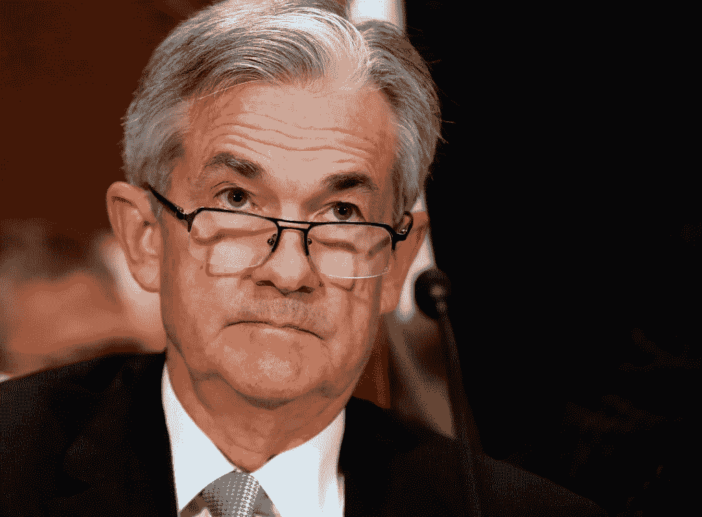
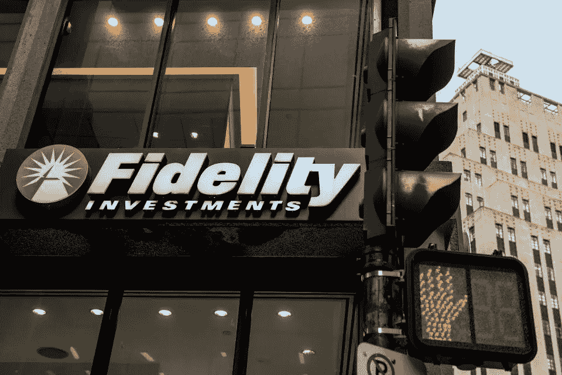

# 小密码的情况

> 原文：<https://medium.datadriveninvestor.com/the-case-for-a-little-crypto-2058df0e138f?source=collection_archive---------11----------------------->

“This has got to be one of the most boring episodes of *Bird Box.”*

随着费用、裁员、英国退出欧盟和收入下行压力的重新出现，sset 基金经理们已经为动荡的 2019 年做好了准备。虽然 2018 年是大多数资产管理公司习惯于忘记的一年，但看起来 2019 年将同样具有挑战性。过去的 12 个月是自 2018 年金融危机以来投资行业最困难的一年。这不仅仅是因为习惯了伦敦西区酒吧和剧院的资产管理公司现在需要考虑搬到欧洲大陆更古板的首都之一。全球股市遭受重创。从欧洲到美国、日本和中国。曾经，一个经理可以蒙住自己的眼睛，只买一只 FAANG(脸书、苹果、亚马逊、网飞、谷歌)的股票，就能获得可观的利润，但科技股已经失去了光泽——相反，黄金变得更有光泽了(多么讽刺)。随着低成本投资(富达的零费用产品没有起到作用)以及在某些情况下零成本投资、容易获得的交易所交易基金(ETF)和其他指数产品的兴起，资金正以前所未有的速度流出投资行业。

## 熬过投资行业的寒冬

随着美联储的鹰派杰罗姆·鲍威尔(Jerome Powell)继续从已经摇摇欲坠的市场中提取流动性，这让唐纳德·特朗普(Donald Trump)总统非常懊恼，资产管理公司将需要考虑所有留在业务中的选择，包括并购和另类投资。

Federal Reserve Chairman and man who’s not impressed by your joke, Jerome Powell.

随着 Investco 去年 10 月宣布以 57 亿美元收购 OppenheimerFunds，这场竞赛已经开始。即使是合并也不能保证一艘更大的船能更好地抵御即将到来的波涛汹涌的水域。根据纽约投资银行 KBW 和智慧树的说法，骏利恒基集团实际上预计收入将下降，去年 4 月收购伦敦 ETF 证券的智慧树可能只会出现边际收入增长。

## 向下进料压力和替代方案

随着投资者寻求更好的价值，那些继续坚持投资行业的人也将面临普遍的费用压力。会计师事务所普华永道(PwC)已经报告称，它预计 T2 的主动和被动基金的费用都将下降，四分之一的主动管理基金最早可能在 2025 年蒸发，这一趋势对被动基金的打击最大。

Raise your hand if you want to custody some cryptocurrencies.

8 月，资产管理巨擘富达投资(Fidelity Investments)宣布，正在削减其所有指数跟踪共同基金的成本，并推出免费产品。那么，10 月份，富达投资[宣布](https://www.cnbc.com/2018/10/15/fidelity-launches-trade-execution-and-custody-for-cryptocurrencies.html)成立富达数字资产服务公司，为对冲基金和家族理财室提供加密货币的托管和交易执行服务，这有什么好奇怪的呢？因为不可能从干燥的海绵中挤出更多的水分，富达投资和少数其他资产管理公司已经开始寻找其他地方，以确保足够的利润率来维持他们本来就很低的利润率或在某些情况下导致亏损的产品，在某些情况下，如富达投资，已经采取积极措施提供加密货币服务。据一位不愿透露姓名的经理说，

> “家族理财室是最容易的，因为他们已经接触加密货币有一段时间了。他们(富达投资)肯定已经注意到了这一点。”

不仅仅是富达投资，就连高盛(Goldman Sachs)这样的行业巨头也通过投资 Circle 接触到了加密货币，Circle 是另一家总部位于波士顿的公司，提供加密货币金融服务，并有自己的 stablecoin 产品。

## 另类投资需要深入的专业知识

从不良债务资产到加密货币的另类投资趋势，可能标志着主动型基金经理的回归，他们能够在特别复杂的领域带来更多专业知识。随着复杂性的增加，投资者关注更不透明的市场，如固定收益、新兴市场和加密货币等替代产品，这可能更适合积极的经理，因为深刻的洞察力会增加价值，投资者可能更愿意为此支付溢价。至于被动产品，考虑到市场的透明度和信息的自由流动性质，这种溢价更难证明是合理的。据一位经理说，

> "在这个行业向前发展，知识溢价可能是证明收费合理的唯一方式."

但不仅仅是加密货币能够利用这种所谓的“知识溢价”，随着市场变得更加动荡，能够挑选股票的经验丰富的经理也可能开始崭露头角。算法交易和量化模型的普遍存在意味着，越来越多的任何基于现有数据点存在的阿尔法值都可能在更短的时间内被交易出去，这使得大量研究人员、分析师和开发人员必须不断地、持续地加倍努力，才能停留在同一个地方。

## 监管风险

1MDB 丑闻的影响——这可能是有记录的金融史上最严重的丑闻——意味着世界各地的监管机构可能会向合规部门施加更大的压力，这将增加本已四面楚歌的行业的成本压力。

The City of London — Not Your European city anymore come March 29, 2019.

尽管没有 Priips 或 Mifid II 在酝酿中，但金融行为监管局(英国的金融监管机构)将于今年晚些时候推出的新系统将让基金管理高管承担责任，这可能会扼杀创新和阿尔法一代。在这一制度下，资产管理公司的高管将需要签署公开报告，这些报告将审查一只基金是否物有所值，如果他们的产品令人失望，他们自己也会受到牵连。如果你愿意，可以称之为投资“柠檬法则”——但这意味着高管们(他们现在将承担个人责任)可能会重新审视他们的资产配置策略，以支持更低但可能是风险调整后的回报。英国的新法律出现在一个最不合时宜的时间——随着英国退出欧盟在 2019 年第一季度末的临近，个人责任的引入为经理们提供了更多激励，让他们前往更宽容、或许更宽容的司法管辖区，这些司法管辖区对该行业众所周知的风险承担更加宽容。

## 回归行业本源

最终，风险和回报是密不可分的，这一点在加密货币等另类投资领域表现得最为明显。随着民主党领导下的新任期开始，对加密货币的监管(长期以来一直在辩论)显然不是国会目前的优先事项。随着白宫陷入穆勒调查的泥潭，显然有更大的鱼要炸。在这种背景下，顽强的寻求阿尔法的经理们可能会考虑证明他们的费用是合理的，并通过加密货币或服务提供商的配置来增加他们的回报，以提高他们的底线，并在费用继续面临压力的情况下鼓励替代收入流。

新的一年继续给投资行业带来挑战，在许多情况下，将会出现生存危机。现在不是保守主义的时候，而是该行业最初以活力和创新而闻名的时候——费用将随后而来。