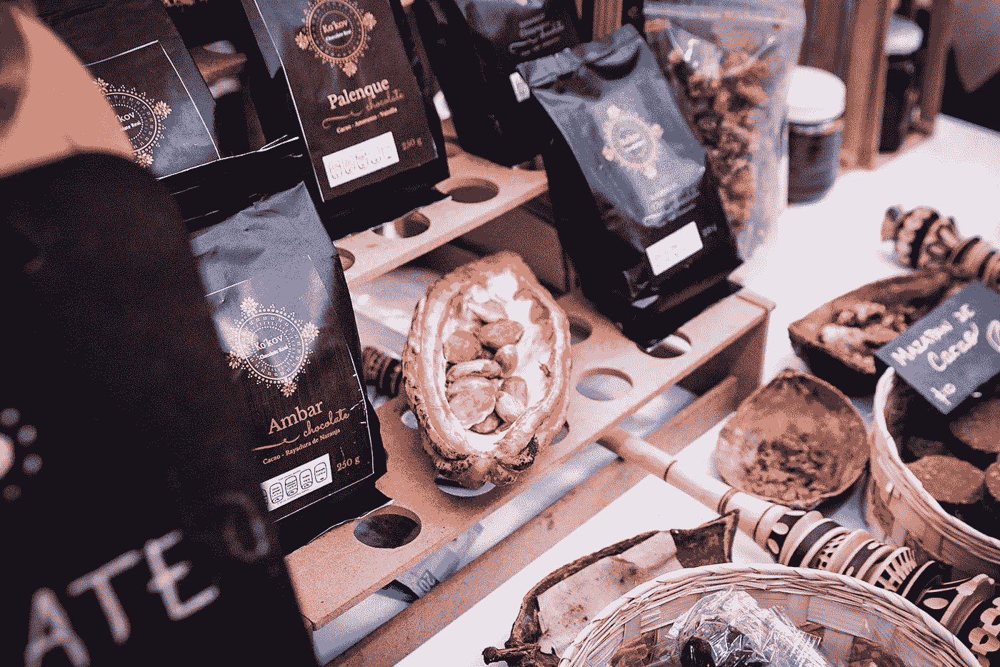

# 佛教经济学的案例

> 原文：<https://medium.datadriveninvestor.com/the-case-for-buddhist-economics-e0e767d51493?source=collection_archive---------16----------------------->

*用最少的资源实现给定的需求*

在我说别的之前，我想澄清一下，这不是一篇关于宗教的文章，而是一篇关于经济的文章(尽管我理解为什么人们可能会混淆这两者)。**如果你和我一样，曾经犯过正式研究经济学的错误，这将是他们在经济学课上问你的第一个问题:*我们怎样才能最好地利用有限的资源来满足无限的需求？*** 认为，从本质上讲，这是根本的经济问题。对吗？没错。

在某个地方，我们迷失了方向。

由于世界已经在东方预示着新一轮的资本主义/生产浪潮，我们需要记住关注我们如何更好地利用我们的资源。这一点我们都同意。然而，我们似乎仍在运行着我们的祖先曾如此强烈反对的相同的资本主义模式。年轻人失业仍被视为一个问题，但环保主义已经过时了。巴西刚刚向世界展示了亚马逊森林砍伐的速度正在放缓，不是吗？

在某种程度上，这是一个改变我们经济学教学方式的呼吁。如果我们回到基本的经济问题——无限的需求和有限的资源——答案自然是最大化这些资源来满足我们的需求。但这是完全资本主义思想的开始，即拥有无限的欲望是可以的，甚至更多，并持续期望地球会支持它们。如果我们能以某种方式从更禅的角度重新思考这个问题，我们可能会问的问题将不是如何从给定的资源中实现最大化，而是如何用最少的资源实现给定的(或有限的)需求。这为三十多年前 Fritz Schumacher 的《小即是美》这本书奠定了基础，他在书中详细讨论了重新思考经济学的必要性,“好像人很重要”。他的观点今天仍然有效，因为我们继续站在生产结构变革的风口浪尖。

停下来想一想他提出的想法:我们如何用*最少的*资源实现给定的*需求？这彻底改变了基本的经济问题，把最大化问题变成了最小化问题。如果我们的需求没有随着兽性的、无处不在的饥饿而增长，我们从地球上获取宝贵的不可再生资源的需求也不会增长。如果我们对闪亮的、能持续一个季节的机械玩具的需求减少了，也许几百个人蜷缩在拥挤的小仓库里为它们辛苦劳作的需求也会减少。“辛苦”是一个重要的词(我很容易从舒马赫那里借用)，因为**我并不主张让数百万人失业，而是主张降低他们在生产我们视为地位、舒适和现代化象征的商品时的辛苦程度。这三件事不知何故继续成为临床上过度使用马歇尔该死的资本劳动最大化问题的同义词，作为生产的一个重要部分。实际上，一件商品的劳动力、资本或资源成分越高，其价值就越高。想想大规模生产的精致皮夹克和蓝宝石屏幕的智能手机。想想血钻和黑钨矿(钨矿)。想想猴子粪便制成的咖啡运输链。***

显然，更简单的存在是可能的。我们不会对生产中使用的人力和环境资源造成不必要的压力。在这里，员工也被视为在生活中拥有个性和创造力空间的人，在这里，我们不会将环境视为“大自然母亲”,享受源源不断的美食。

作为经济学家和他们领域内的每个人，在资本、劳动力和所有马歇尔式排列之间的痴迷游戏中，我们开始忘记我们旨在实现的基本结果:衣服、食物、住房和交通，而是梦想最大化生产中使用的资源，这也许是很自然的。我们开始不停地贪图最高级也可能是“自然”的；更大，更快，更酷，更闪亮，更多。在一声讽刺的叹息中，我们把每一件新东西都称为“最好的”，而它只会比上一件“更好”。一旦我们征服了所有这些，我们就拥有了生产它们的资源。本质上，我们是在抬高商品的价格，含蓄地试图炫耀我们有能力购买资源(和人类)来提供服务。当我说“我们”时，我不是指我们所有人，也不是指我们所有人一直都在一起。我知道你能做得更好。我知道我是。但是，不断涌现的广告、生活产品和普通媒体开始用 1%(应该)的生活方式的愿景轰炸我们，似乎注定要让我们变得与众不同。孕育了这种奇特的消费主义的老年经济学家在讲台后悄悄挥挥手，发布常用的白金版经济学教科书。**但是记住这句口头禅:*这是一个最小化问题，而不是最大化问题。***

我们应该考虑这些交易对环境和参与其中的人类的影响。我们有责任考虑他们生产中的“辛苦”并将其最小化。当我们试图将尚未开发的大型零件中心转变为生产中心(南亚、非洲、拉丁美洲)时，我们需要带着实现深思熟虑和道德生产的动力前进。我们需要把参与者视为创造者，而不是交易意义上的劳动力投入。我们需要简化生产过程，不是为了最大限度地提高效率，而是为了最大限度地减少重复开采对资源(环境和人类)的影响。这可以归结为舒马赫对佛教经济学的推动——用最少的资源实现既定的需求。

更重要的是，作为一个社会，我们还需要改变经济学课程的教学方式，让我们更少地关注从我们周围的资源中获取最大价值，并开始关注更多地满足于我们所拥有的。因此，佛教经济学的基础在于简化需求，为既可持续又没有贪婪的进步腾出空间。我们已经远离了饥饿、赤身裸体的史前时代，以至于无法摇下我们能找到的每一棵果实累累的树。甚至在那些日子里，我们的祖先为他们被赋予的一切向大自然祈祷。空气、水和阳光；作为人类，我们是独一无二的幸运，因为这些元素的结合而诞生。

嘿，如果你在花自己的血汗钱中找到了内在的乐趣，那就太好了。这不是一篇让你感到羞耻/内疚的文章。更确切地说，只是呼吁停下来，考虑一下你的消耗，想想你从地球和你周围的人那里得到了什么，并从你所做的事情中获得乐趣。当然，这是一个更强的推动力，来改变你谈论经济和你自己在生产框架中的需求的方式。希望如果我们改变我们的学术课程，我们将能够培养出一代致力于继续保护自然的人。总而言之，这就是佛教经济学的情况。

**在某种程度上，这就像一个家庭。我们被困在这个星球上，这个星球也困住了我们，这取决于我们两个人互相照顾，这样我们才能过上最好的生活。**

无论如何，这是一个足够好的(非宗教的)事业。