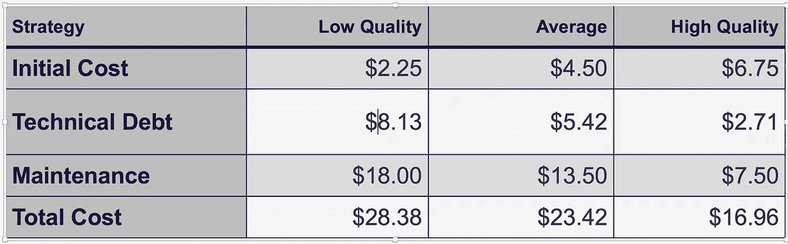
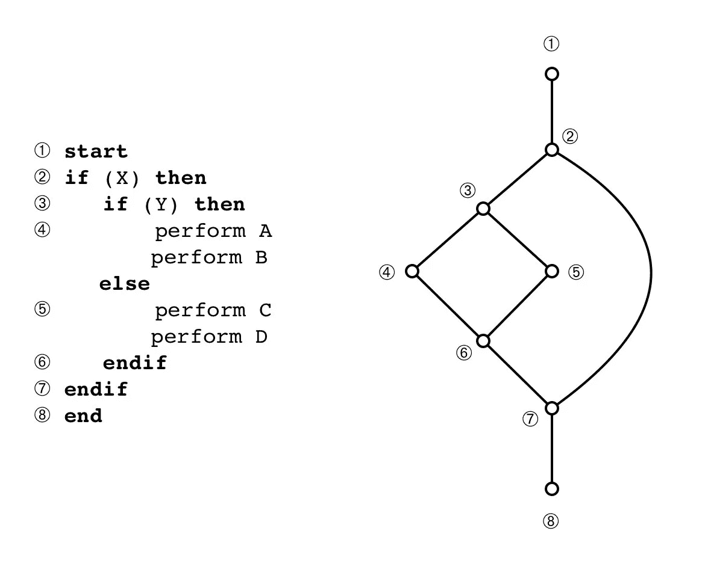

# 支持软件简单性的理由

> 原文：<https://medium.datadriveninvestor.com/the-case-for-favoring-simplicity-in-software-49fa9caf8da?source=collection_archive---------10----------------------->

支持任何软件组件的情况都需要考虑时间和预算的限制，这迫使我们对组件进行排序，以便我们首先得到最重要的组件。没有这些约束，我们就能得到所有“好”的东西，而不会去考虑每个组件带来了什么。最终，应该有团队规范来规定任何软件项目的非功能组件。根据我的经验，团队规范经常忽略软件最重要的组成部分:简单性。

简单性出现在软件的两个方面。更广为人知的领域，*架构简单性*，本质上是跨越单个软件系统的全球化。较少宣传的领域是*代码中的简单性*，这是这里的重点。

project management triangle [1]

项目管理三角形将注意力吸引到软件项目的可变区域。许多敏捷转换利用三角形来强调一个人不能修正所有的范围、时间和成本；我们只能修复一个项目的两个方面。*质量不是项目管理三角形的一部分，但是它是每一次交付的最终目标。因此，项目管理三角形代表隐含的质量*【1】。它提出了一个问题“什么是质量”？

质量的定义很大程度上取决于你问谁。销售和客户服务将根据*满足潜在客户和最终用户期望*来定义质量。工程师和产品负责人有不同的观点，关注缺陷的缺乏和潜在的高水平自动化测试。虽然前面所有的质量度量都很重要，但是它们都不能预测我们维护软件的能力。

本·莫斯利(Ben Moseley)和彼得·马克斯(Peter Marks)在他们的论文《走出焦油坑》(Out of the Tar Pit)中深入探讨了软件开发和围绕复杂性的考虑因素。这意味着简单性导致软件更容易维护:

> 仅次于测试和推理，简单性比任何一个都重要。对简单性的投资通常是更好的选择，因为这将有助于所有未来理解系统的尝试 —任何类型的尝试。*【2】*

他们把重点放在对复杂性进行分类上，让空间工程师处理的一部分问题变得清晰可见，而这些问题并没有提供最终用户关心的解决方案的任何部分。

> **本质复杂性**是问题固有的，也是问题的本质(如用户所见)。
> 
> **偶然的复杂性**是所有其他的——开发团队在理想世界中不必处理的复杂性(例如，由性能问题和次优语言和基础设施引起的复杂性)。*【2】*

所有有趣的问题都需要一定的复杂性来解决。例如，以 Identity 函数(JavaScript)为例:`const I = x => x`该函数接受一个值，并将该值作为输出返回。虽然从证明的角度来看，这是一个迷人的函数(对于其他稍微有用的应用程序)，但它本身并没有任何有趣的地方。我们需要更多。弗雷德里克·布鲁克斯(没有银弹):

> 数字计算机本身比人们制造的大多数东西都复杂:它们有非常多的状态。这使得构思、描述和测试它们变得困难。…软件实体的扩大不仅仅是相同元素在更大尺寸上的重复，…这些元素以某种非线性方式相互作用，整体的复杂性比线性增加得多。**软件的复杂性是本质属性，而不是偶然属性***【3】*

与布鲁克斯相比，莫斯利和马克斯对“本质的和偶然的”的使用有微妙的区别。布鲁克斯认为，从本质上解决有趣问题的系统是复杂的。而 Mosely 和 Marks 希望我们分类并考虑这种复杂性。论点是我们去除了不明确属于问题域的复杂性。

有趣的问题需要一定的复杂性来解决，我们应该把复杂性保持在问题的本质上。目的是通过制定更好的架构决策(例如后者中的水平可伸缩架构，以及前者中更积极地使用类型系统和引入可能/可选类型)来消除意外的复杂性(例如与编程语言的性能或限制相关的复杂性，例如空指针)。这并不能免除我们考虑剩余代码并努力简化它们的义务。

> 我没有时间写一封短信，所以我写了一封长信。

这句话被认为是伟大思想家的后代:马克·吐温、约翰·洛克、亨利·大卫·梭罗和本杰明·富兰克林(也许更多)。值得注意的线索(如果我们不考虑起源，可能是布莱士·帕斯卡:“*e ' n ' ai fait celle-ci plug longue que parce que je ' n ' ai eu le loi sir de la faire plus court。”所有这些伟大的思想家都在某个时候提到了这个原则:简单并不容易——它需要前期工作。*

agile-doctor.com 研究了软件开发的成本[4]:

Agile-doctor: high quality costs three times as much up front but is 40% cheaper in the long run

高质量的软件(如图表所示)几乎没有技术债务，并且易于维护。这要求工程师提供足够的测试(强烈倾向于自动化，但是最少记录案例)，文档(最新的)并关注代码的开发——以支持简单性。

一行低质量代码的成本最初是 2.25 美元，但在整个生命周期中，这个数字膨胀到 28.38 美元。一行高质量的代码最初的价格是现在的三倍:6.75 美元。然而，在整个生命周期中，该系列的成本降低了 40%,为 16.96 美元。这解放了开发团队，让他们专注于添加特性，而不是在技术债务和维护(bug 修复等)中苦苦挣扎。).在前面多花一点功夫，在达成一个更简单的维护解决方案方面有很大的好处。

> 那些想要真正可靠的软件的人会发现，他们必须找到避免大多数错误的方法，结果编程过程会变得更便宜。*【7】*

我们每个人理解任意大小的代码块的能力都是有限的，在某一点上，我们突破了这个界限，一段代码就太难理解了。如果我们能够将代码块保持在一个我们可以轻松合理化的大小，我们就可以向*进军，避免大多数 bug*。当我们保持函数[纯净](https://en.wikipedia.org/wiki/Pure_function)，确定性，优化模块/对象关系，限制代码分叉时，代码变得更容易合理化。幸运的是，度量标准的存在可以量化我们代码的复杂性。

耦合比旨在提供对对象稳定性的洞察。它需要将*传入*(传入引用:依赖于相关类的类的计数)与*传出*耦合(传出引用:相关类引用的类的计数)进行比较。

> 传出和总耦合(传出+传入)之间的比率定义了一个类的(不)稳定性。它显示了一个类在改变时有多有弹性，在不影响应用程序中其他组件的情况下改变一个组件有多难。
> 
> 具有高传出耦合(有很多依赖项)但低传入耦合(很少被其他人使用)的类不太稳定:它们很可能受到依赖项变化的影响，并且它们不太依赖于依赖项，所以变化很容易。
> 
> 稳定或不稳定与改变事物的技术难度有关，这可能与改变事物的需要或愿望不一致。稳定性高就好，只要不需要经常换实现。*【9】*

**LCOM4** 算法主要测量一个类被分成更小部分的可能性。度量值为 1 表示该类设计良好；然而，度量值> 1 表示该类可能会被拆分。

**圈复杂度**通过检查一段代码中的分叉来评估复杂度(简单性)。

[e](https://craftofcoding.wordpress.com/2017/06/18/coding-a-small-note-on-cyclomatic-complexity/)xample of cylcomatic complexity code and flow graph [5]

“最简单的形式是，CYC 是对源代码中决策数量的计数。计数越高，代码就越复杂[6]。”分数是由`*Complexity = Number of Edges — Number of Nodes + 2 * Number of Connected Components*` 或者更简洁地说`*C = E — N + 2P*` *计算出来的。左边的代码片段的复杂度为`*C=9–8+(2*1) = 3*` [5]。*

可以找到确凿的证据，证明复杂性分数不满足于 10 分以上。一项研究着眼于一个复杂性得分为 16 的应用程序的两次独立重构。每个独立工作的(专家)工程师重构应用程序的分数是 10 分。另一项关于缺陷和复杂性的研究发现，10 分是缺陷逃逸率开始上升的分界点[8]。

我认为这是一个很好的暂停点。我将接着写一篇关于利用类型系统创建类结构的文章，以消除一些我们习惯于认为必不可少的意外复杂性。

1.  [https://www . tutorialspoint . com/management _ concepts/project _ management _ triangle . htm](https://www.tutorialspoint.com/management_concepts/project_management_triangle.htm)
2.  [http://curtclifton.net/papers/MoseleyMarks06a.pdf](http://curtclifton.net/papers/MoseleyMarks06a.pdf)
3.  [http://www . cs . nott . AC . uk/~ PSZ CAH/g51 ISS/Documents/nosilverbullet . html](http://www.cs.nott.ac.uk/~pszcah/G51ISS/Documents/NoSilverBullet.html)
4.  [http://www.agile-doctor.com/tag/total-cost-of-ownership/](http://www.agile-doctor.com/tag/total-cost-of-ownership/)
5.  [https://craftofcoding . WordPress . com/2017/06/18/coding-a-small-note-on-cyclomatic-complexity/](https://craftofcoding.wordpress.com/2017/06/18/coding-a-small-note-on-cyclomatic-complexity/)
6.  [https://www . perforce . com/blog/qac/what-cyclomatic-complexity](https://www.perforce.com/blog/qac/what-cyclomatic-complexity)
7.  [https://www . cs . ute xas . edu/~ EWD/transcriptions/ewd 03 xx/ewd 340 . html](https://www.cs.utexas.edu/~EWD/transcriptions/EWD03xx/EWD340.html)
8.  【http://www.mccabe.com/pdf/mccabe-nist235r.pdf】
9.  [*https://www.mullie.eu/measuring-software-coupling/*](https://www.mullie.eu/measuring-software-coupling/)