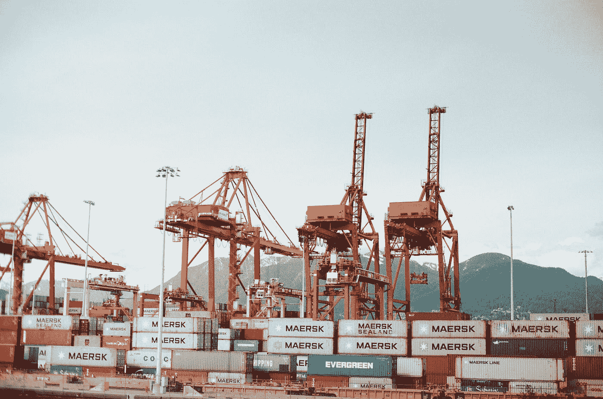

# 支持自由贸易的理由

> 原文：<https://medium.datadriveninvestor.com/the-case-for-free-trade-58046dd8f016?source=collection_archive---------5----------------------->

贸易战……那么现在怎么办？

“cargo port crane” by [Kyle Ryan](https://unsplash.com/@kylry?utm_source=medium&utm_medium=referral) on [Unsplash](https://unsplash.com?utm_source=medium&utm_medium=referral)

自由贸易最近受到了政治上的打击。这一概念在 2016 年总统竞选期间遭到了猛烈抨击，左翼的伯尼·桑德斯和右翼的唐纳德·特朗普多次攻击。北美自由贸易协定(NAFTA)和跨太平洋伙伴关系(TPP)是最受欢迎的出气筒，它们都被指责为美国工作岗位流失到国际工人手中的原因。各种政治派别的许多选民接受了这些信息，信奉自由贸易的概念，认为自由贸易是一种经济恶魔，它剥夺了美国工人的生计，并把它们送给了别人。自上任以来，特朗普已将美国从 TPP 中撤出，并通过对朋友和竞争对手征收关税来发动“贸易战”。

毫无疑问，一些美国工人在全球经济中苦苦挣扎，尤其是那些受雇于制造业的工人，尽管自由贸易只是解释这一现象的众多因素之一。然而，如果自由贸易确实导致一些美国工作被输出，它也为高薪工作和经济增长打开了新的更大的机会之门。

问题不在于自由贸易，问题在于政策将财富向上输送，却忽视了那些工作被外包的人。如果时间、金钱和资源被用于解决他们的需求，人们会赞美自由贸易，而不是抨击它。改变这一范式需要促进公平的创造性政策解决方案，而不是试图遏制驱动社会数千年的经济引擎。

从跨越河流进行商品交易的小部落到控制地区或全球物资流动的强大帝国，贸易一直是创造财富的引擎。传统上，贸易壁垒是地理上的:河流；山脉；海洋；沙漠；等等。从历史上看，人们非常努力地工作，并且相当成功地克服了这些障碍。

今天，这些因素都不是贸易的严重障碍，但税收和关税是。伯尼·桑德斯和唐纳德·特朗普认为这些壁垒是适当的，因为它们增加了外国商品的成本，从而增加了对美国制造产品的需求，从而为美国工人创造了就业机会。转眼间，好时光又来了。

要是这么简单就好了。尽管部分基本思想是正确的，但这种反自由贸易的分析从根本上来说是有缺陷的，并将导致损害个人消费者和国家经济的自作自受的经济障碍。

因为美国工人比国际竞争者要求更高的工资，当这些产品在美国生产时，目前在国外生产的产品的成本将会上升。由此带来的任何就业增长都将被影响所有人的更高消费价格所抵消。如果增长真的发生了，对那些以更高价格形式从中受益的人来说，它将被抵消。对于那些绝大多数认为贸易政策不会带来新机会或加薪的人来说，关税可能是毁灭性的，除了推高商品成本之外什么也不会做。

除了避免这些负面后果，促进自由贸易还有另一个有力的论据。如果政府和公司利用全球化的收入来再教育、再培训和支持他们的劳动力——诚然他们没有这样做——那么美国工人应该能够获得更高收入、更有优势的工作。

当然，这说起来容易做起来难，但做起来也比用关税振兴经济的某些部分容易。对于西弗吉尼亚州的前煤矿工人来说，即使他们想去旧金山找谷歌的工作，也很难收拾行李，而且很可能许多人没有这样的愿望。但是，这是对减轻全球化影响的刻板狭隘的看法。不如我们帮助他们学会在自己的社区安装太阳能电池板，而不是推动前煤矿工人在沿海地区获得技术工作？像这样的项目在各个方面都更加可行，从需要多少和什么类型的培训和资金，到工人有什么可转移的技能。此外，这种职业转型将为因工作转移到海外而遭受损失的社区带来改变。城市研究所是一家位于 DC 华盛顿州的智库，专注于教育、经济和减贫领域。该研究所进行了大量研究，强调了这些努力的功效，并为这些努力提供了模板。

最后，这不是美国选民的主要关切——尽管“世界工人联合起来”左派攻击促进全球繁荣的经济进程具有一定的讽刺意味——自由贸易确实在其他地方创造了财富和机会，理想地为繁荣和稳定奠定了可持续的基础，同时减少了混乱和动荡的可能性，虽然现在看起来很遥远，但最终可能会像国际动荡经常发生的那样，将美国卷入其中。

有许多趋势可能会剥夺美国公民的就业机会，但如果真正致力于帮助那些失业的人，自由贸易不应该是其中之一。机器人抢饭碗；贸易将工作外包出去，从而为新的机会打开了大门。想象一下，如果特朗普的贸易战以某种方式成功了——不会是——十年后，美国的钢铁制造业将蓬勃发展，未来的技术工作岗位——以及它们产生的财富——将在中国和其他地方。

不可否认，自由贸易的结果是有输家，但情况不一定是这样。调整税法和其他政策，让全球化产生的大量财富更加公平地分配，而不是集中到一小撮精英手中，这将释放资金和激励，抵消就业损失，为更美好的未来铺平道路。

如果美国拥抱自由贸易，并投资于自身及其创造能力，它的明天将会更加强大和富有。结构性竞争优势是存在的，但国家必须抓住这些优势，而不是相信关税可以振兴那些辉煌时代已经过去的行业。