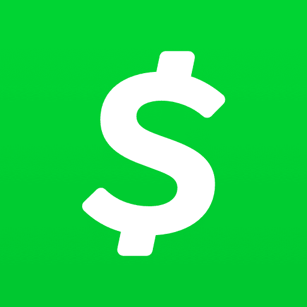
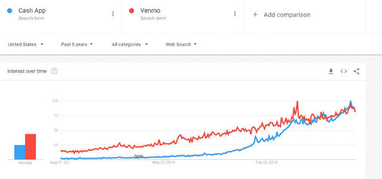
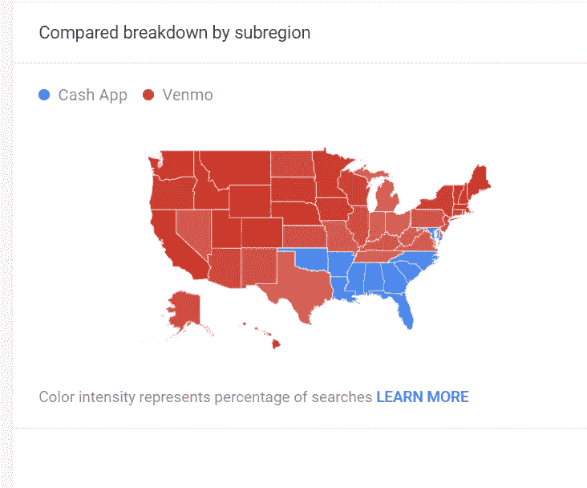

# 现金应用将会变得巨大

> 原文：<https://medium.datadriveninvestor.com/the-cash-app-is-going-to-be-huge-1074f1429532?source=collection_archive---------4----------------------->

如果你和我一样是 Square 的投资人，你就知道[现金 App](https://cash.app/) 是个大买卖。点对点(P2P)支付应用发展非常迅速，目前正在为该公司带来可观的收入。事实上，该平台刚刚达到了[5 亿美元的收入增长率](https://www.fool.com/investing/2019/08/27/the-gap-between-cash-app-and-venmo-is-getting-bigg.aspx)，现在占 Square 服务收入的一半以上。

那么到底什么是现金 App 呢？像 Venmo(PayPal 旗下的 P2P 应用)一样，你可以即时免费向你的任何一个朋友汇款。然而，与 Venmo 不同的是，使用 Cash 应用程序，您还可以:

 [## 为什么包容性财富指数比 GDP 更能衡量社会进步？|数据驱动…

### 你不需要成为一个经济奇才或金融大师就能知道 GDP 的定义。即使你从未拿过 ECON 奖…

www.datadriveninvestor.com](https://www.datadriveninvestor.com/2019/03/08/why-inclusive-wealth-index-is-a-better-measure-of-societal-progress-than-gdp/) 

*   购买比特币
*   从银行直接存款
*   用免费现金卡向商家付款，这是一种借记卡，可以提供 10%的折扣和其他优惠

现金卡带来的半出名的提升(永久折扣的花哨名称)是我注册该应用程序并开始使用该服务的原因。到目前为止，我发现这非常简单，是一个真正的省钱方法。

这款现金应用目前势头强劲。让我们来看看为什么会出现这种情况，**，以及为什么我认为 Square 最终会有 100 亿美元的业务。**

# 现金应用程序是相关的，无论是在金融上还是文化上

据分析师估计，Cash 应用程序已被下载[5980 万次](https://www.marketwatch.com/story/square-just-had-its-best-month-ever-for-cash-app-downloads-analyst-says-2019-08-20)，而 Venmo 仅被下载 5270 万次。仅在 7 月份，就有 240 万用户(实际上包括我自己)添加了这款应用。app store 排名也保持不变。在过去两年的大部分时间里，Cash App 一直是排名第一的金融应用，击败了 Venmo、PayPal 和 Zelle(大型银行 P2P 应用)。

谷歌趋势，所有投资者都应该利用的东西(有史以来发明的最纯粹的数据集)，对于现金应用来说[看起来棒极了:](https://trends.google.com/trends/explore?date=today%205-y&geo=US&q=Cash%20App,Venmo)

不到五年前，Venmo 在搜索相关性方面统治着 Cash 应用。如今，他们看到的搜索查询数量大致相同。我不知道我是对 Cash 应用程序所做的事情更兴奋，还是对 PayPal 放弃如此领先的地位感到震惊。我猜网络效应不是一切。

现在，投资者真正关心的是:销售。

在他们的第二季度股东信中，Square 披露现金应用带来了 2.6 亿美元的收入，如果不包括比特币，则为 1.35 亿美元。这一数字高于 2016 年第二季度的 100 万美元，**过去三年的复合年增长率为 400%(尽管基数较小)。**

# 那么他们是怎么做到的呢？

我认为 Square 对现金应用的营销策略是:与有影响力的品牌发展广告合作关系，不太考虑支出。用户是无价的，所以从长远来看，花费大量金钱来获得他们是值得的。

Cash 应用已经与两个顶级播客签署了协议，即原谅我的观点和乔·罗根的经历。他们还与说唱歌手达成了[多项交易，这些说唱歌手在应用上给粉丝钱，这是一种让人们下载的非常有创意的方式。](https://www.complex.com/music/2018/08/why-are-rappers-giving-away-money-cash-app-lil-b)

从我的简短研究来看，Cash 应用击败 Venmo 有三个原因:更好的功能、创新/更大的营销支出和现金卡。但是现金应用不仅仅是一个更好的 Venmo。我认为 Square 有一个 100 亿美元的平台，这个平台将为许多美国人重塑个人理财。

# 现金应用:你的个人理财中心

这个世界(这在很大程度上要感谢 Square)正走向一个无现金主导的社会。消费者想要易于使用、移动友好的平台，并可能真的对传统的银行分支机构和自动取款机不屑一顾(就最后一个而言)。大银行已经感受到了这方面的压力，这就是为什么他们决定联合起来，建立 Zelle(仍然为我的支票账户支付不到 0.25%的利息，但无论如何)。

Square 可能比其他任何公司都更了解 30 岁以下的人如何支配自己的钱。我相信他们将利用这一专业知识以及他们的现有资产，使现金应用程序成为一个无所不包的银行/支付中心。他们已经建立了支付技术、用户和应用程序。剩下的就是获得监管部门的批准，这是他们在 2018 年末申请的。

我的意思是，只要读读杰克·多西的这句话，告诉我他们不会很快推出银行功能:

他们在我们这里存钱，在任何接受 Visa 的地方都可以。他们可以发送和接收朋友和家人的钱

他还在收益电话会议上提到，人们“从根本上”像使用银行一样使用现金应用程序。我个人使用现金卡来支付任何我能得到提升的东西，并且很乐意将我所有的个人财务转移到这个应用程序上。我保证他们会支付比大多数大银行更高的利率(看看你，美国银行)。此外，如果你喜欢，你可以用比特币支付。

也不要低估银行业对 Square 商户的影响。中小企业喜欢把钱存在处理支付和贷款的同一家公司。

Square(可能还有 PayPal)提供强大的银行产品将是大银行的最后一颗钉子，让消费者很容易永远告别。这个机会不容小觑。它的市值高达数百亿美元，甚至可能达到 1000 亿美元，我认为 Square 可以抓住其中的很大一部分。