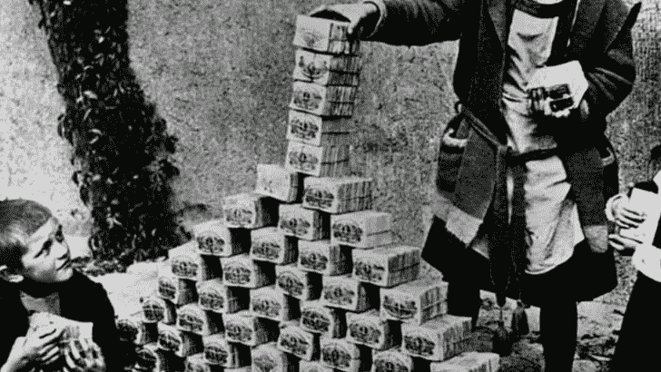
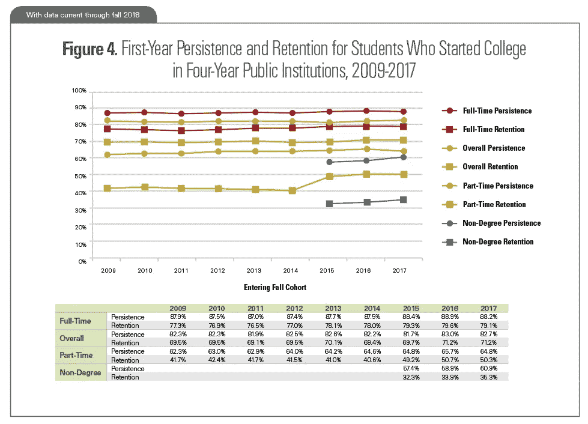

# 下一次衰退的催化剂

> 原文：<https://medium.datadriveninvestor.com/the-catalyst-of-the-next-recession-189ceabb0473?source=collection_archive---------6----------------------->

German Inflation — [Dustin Krause](https://nl.pinterest.com/pin/691584086497561404/?lp=true)

2008 年，银行通过出售 AAA 级抵押贷款包赚了数百万美元，而我们却被这些垃圾塞满了。不受监管的住房市场使得该计划成为可能。评级机构、房地产卖家、信贷机构、投资者都受益于经济的增长，但却视而不见。

2019 年，全球各地的大学通过出售定价过高的大学学位赚了数百万美元。美联储在美国持有的学生贷款债务估计为 1.5 万亿美元；比美国所有的信用卡债务还多。美国何时达到临界点？

# 学生债务的连锁反应

千禧一代住房拥有率的稳步下降，与财务健康状况的缺乏相对应。虽然工资每年都在增长，但还是跟不上房价和租房成本。据英国[卫报](https://www.theguardian.com/society/2019/feb/08/million-more-young-adults-live-parents-uk-housing)；20 至 34 岁与父母同住的人口比例从 1997 年的 19.48%，相当于 240 万人，上升到 2017 年的 **25.91%** ，相当于 340 万人。因此，房地产市场将缓慢下滑。

2018 年 6 月至 2019 年 6 月，美国最近的毕业生失业率在 3.6%至 3.8%之间( [Statista](https://www.statista.com/statistics/633660/unemployment-rate-of-recent-graduates-in-the-us/) )。记住我的话，这将在未来几年慢慢增加。

此外，招聘人员有时会要求一份核心工作需要长达三年的经验。然后，毕业生将争夺带薪实习机会，或者被迫选择薪水很低的实习。从今以后，在工作的最初几年，人们将无法获得财务稳定，因为他们正在偿还债务。

# 临界点

我预测两个小费点:

*   当学生贷款利息达到> 18%时( [1980 年抵押贷款记录](https://www.valuepenguin.com/mortgages/historical-mortgage-rates)
*   当不太成熟的教育机构开始申请破产时

## 利率

目前，美国学生贷款的利率在 5 %到 7.5%之间(数据来自教育部)。2019 年)。这与[美国 2018 年平均抵押贷款利率 4.45%](https://www.valuepenguin.com/mortgages/historical-mortgage-rates)相比，简直令人发指。

这个 IRSL 将会增加，直到家长和学生看不到隧道尽头的光。

尤其是像哈佛、耶鲁和麻省理工这样的巨头，由于其稳固的声誉，将能够在未来几年提高价格。在线学位和教育创新者将提高不同学校之间的竞争。因此，一个标准学位的平均成本将持续飙升。

## 坚持

[National Student Clearinghouse Research Center](https://nscresearchcenter.org/snapshotreport35-first-year-persistence-and-retention/)

总体保留率停滞在 70%左右。当这个百分比开始下降时；人们会自己计算。选错领域的错误会让你付出沉重的代价。从长远来看，高中和高等教育之间的差距将会扩大。

据[美国消费者新闻与商业频道](https://www.cnbc.com/2019/06/19/just-41percent-of-college-students-graduate-in-four-years.html)称，四年内只有 41%的毕业生。当这一比例降至 4/10 至 7/10 时，人们将选择退出学习。通过利息赚钱的美联储；将无法继续贷款。债务危机的结果。

Do you recommend your children to go to university? — Photo by [Matese Fields](https://unsplash.com/@tesecreates?utm_source=unsplash&utm_medium=referral&utm_content=creditCopyText) on [Unsplash](https://unsplash.com/s/photos/student?utm_source=unsplash&utm_medium=referral&utm_content=creditCopyText)

# 从债务危机到经济衰退

高等教育的下降意味着收入的减少，因此政府的税收也减少了。

许多需要学位的职业将不得不在别处寻找雇员；使得就业市场竞争更加激烈。

因为人们找不到工作，全球巨无霸指数会下降，也就是所谓的经济购买力。

其他国家还没有解决学生贷款债务问题；因此，经济衰退将是一个全球现象。

# 预防

幸运的是，联邦政府拥有 92 %的学习贷款债务。因此，一些政治家起草了消除学生债务的计划。即使我们改变政策或削减贷款，会准时吗？房子被分开了。此外，这样的政策变化对那些已经支付了学费的人公平吗？

在我看来，我们已经破釜沉舟了。随着一个又一个国家泡沫的破灭，全球萧条的迹象将慢慢浮出水面。再多的量化宽松也救不了当前的经济体系。未来的大萧条将会比三十年代的大萧条更严重，并且会影响到世界上的每一个经济体。

# 加深你的理解

不要相信我的话，研究一下世界经济，给自己提个意见！

这里有一个关于这个话题的更详细的视频列表。

## 学生债务

[为什么美国的学费这么贵？](https://www.youtube.com/watch?v=HL24_NSSEXo)

[学生贷款豁免:美国能消除学生债务吗？](https://www.youtube.com/watch?v=1DCLRrraR-A)

## 宏观经济学

[雷伊·达里奥《经济机器如何运转》](https://www.youtube.com/watch?v=PHe0bXAIuk0&t=1s)

[什么是量化宽松？|经济学家](https://www.youtube.com/watch?v=4TihoBfdCe8)

## 两种观点

[即将到来的金融危机 2019 ᴴᴰ —纪录片](https://www.youtube.com/watch?v=3JwFBT7kXIo&list=WL&index=29&t=0s)

[全球货币危机即将来临——“美元奶昔”理论(w/ Brent Johnson)](https://www.youtube.com/watch?v=vDr3lRZ01Zo&t=1281s)

## 财富哲学

【2018 年世界不平等报告

金钱:历史上最大的骗局——金钱是什么？

在一个面临气候变化、难民危机、政治不稳定的世界，我们应该清醒过来，改变金融体系。

*注:我不是经济学家。在网上研究后，我不得不得出结论，金融机器已经奄奄一息了。下一个大泡沫崩溃只是时间问题。但这一次，我们没有准备纾困计划，因为所有债务都是政府自己的。这篇博客文章旨在警告人们即将到来的政治和社会经济动荡。*

*这篇博客是 30 天创意写作挑战的第 24 篇。*

*写于:2019 年 07-10 月*