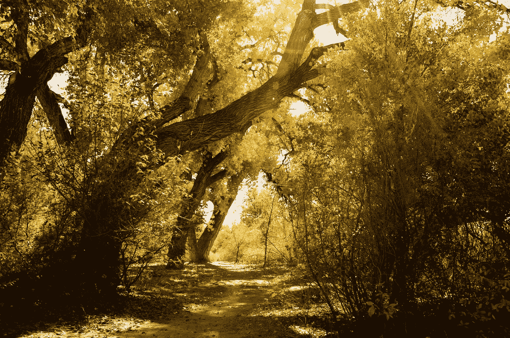

# 不断变化的挑战:管理你的方式通过荒地

> 原文：<https://medium.datadriveninvestor.com/the-challenge-of-constant-change-managing-your-way-through-the-wastelands-72822de0e792?source=collection_archive---------13----------------------->

by [Aziz Acharki](https://unsplash.com/@acharki95?utm_source=medium&utm_medium=referral) on [Unsplash](https://unsplash.com?utm_source=medium&utm_medium=referral)

"我已经掌握了成功的秘诀。"

我亲爱的叔叔波在他的圣达菲起居室里发表关于生活的意见。作为一个狂热的钓鱼爱好者，也是我见过的最有魅力的男人之一，博靠在他宽大的沙发上，冲我微笑。

“找到工作了。稳定地工作四十年。退休。简单。”

薄叔叔的第一任妻子，我母亲的妹妹爱丽丝，很久以前就死于帕金森病。他后来娶了我母亲的第一个表妹克莱尔。在我年轻的时候，我听博讲过他们去非洲旅行的故事。

1983 年 9 月的一个甜美的日子，我和博坐在他的沙发上，就在几个月后，我开始了人生中第一次伟大的旅行冒险。我要去澳大利亚、新西兰和斐济，表面上是三个月。

那会变成四年，但我当时没有任何线索。我们很少这样做。

导致波宣布成功的原因是，我当时的雇主马丁·玛丽埃塔公司刚刚甩了我。薄熙来在罗斯福时代就参加了工作，当时工作 40 年是一种常态。

这是八十年代。可以预见，公司会定期解雇成千上万的员工。所以我被解雇了。

我和成千上万的其他员工。那时，本迪克斯公司已经尽力收购了该公司的航空航天部分。作为这个时代的典型，马丁进行了反击，但也付出了巨大的代价，包括人们的工作、生活和生存能力。20 世纪 80 年代是大公司贪婪的时代。你们中的一些人可能还记得。

当我离开军队几年后开始和他们一起工作的时候，我已经下定决心要把这家公司作为我一生的事业。

by [Steve Johnson](https://unsplash.com/@steve_j?utm_source=medium&utm_medium=referral) on [Unsplash](https://unsplash.com?utm_source=medium&utm_medium=referral)

回过头来看，我会带着原地不动的想法开始工作，这似乎有点古怪。在我的职业生涯中，我被解雇过大约六次，这最终导致我说【去他的】。

我有自己的生意已经很久了。是不可预知的收入。你生活在召唤你自己的能力，让它下雨。经济可能会打击你。考虑到我经历的一些艰难时期，我非常幸运我有一份伤残军人收入。

在 90 年代初我第三次失业后，我决定参加一个如何通过改变来管理自己的课程，因为这显然是我生活中的一个主要主题。威廉·布里奇斯博士写的这本小而有力的书，《T2》、《转变》、《T4》、《理解生活的变化》、《T5》出版时间不长。

布里奇斯于 2013 年去世，他留下了一份了不起的遗产——为像我这样提供企业培训项目的人提供一系列书籍和培训课程。也许最有帮助的是他那种有思想的书，这些书触及到了动荡时期伤害我们最深的地方。

那些熟悉伊丽莎白·库伯勒-罗斯关于死亡和濒死工作的人知道我们如何面对失去的基本阶段。这是同样的事情，但策略不仅仅是承认。

by [Gabriel](https://unsplash.com/@natural?utm_source=medium&utm_medium=referral) on [Unsplash](https://unsplash.com?utm_source=medium&utm_medium=referral)

变化是生活中唯一不变的，考虑到我们的时代，布里奇斯的材料现在更加贴切。他解释得很简单:变化发生在我们身上。我们很少能控制它。疾病、失业、家庭成员的死亡、经济地位的改变、婚礼、离婚。我们对这种变化的反应就是他所说的*转变。*

过渡解决了我们所有人在应对变化时的情绪。这是一个禁忌的领域，对我们许多人来说很难。

这一转变有三个阶段。第一，结局，这涉及到*损失*。在我们快节奏的社会中，我们很少承认这些损失，这可能是毁灭性的。例如，某人得到了提升，可能会感觉很好，对吗？

如果那个人热爱他们的团队，喜欢避开聚光灯和行政责任，并且升职意味着离开熟悉、安全、可预测和受欢迎的一切，那就不是这样了。那些是*损失*。这种情况可能会因为朋友们喋喋不休地告诉他们应该如何快乐而降低痛苦的价值而加剧。

我们通常会努力坚持下去。忘掉这一切吧。毕竟人生是向前的，对吧？

by [Alex Iby](https://unsplash.com/@alexiby?utm_source=medium&utm_medium=referral) on [Unsplash](https://unsplash.com?utm_source=medium&utm_medium=referral)

**错了**。当我们不说出自己的损失，不承认代价，不允许自己有时间哀悼——而所涉及的时间对我们每个人来说都是独一无二的——那么那些损失就被装进了我们背负的背包里。它们影响着我们的情绪和观点，并会破坏我们的表现和快乐。

这些损失会压垮我们，甚至击垮我们，除非我们接受它们。拥抱它们带来的礼物。每一次损失都为我们的未来提供了一把钥匙。成为我们真正想要成为的人的下一步。

你不能重新开始，直到你处理好你的结局。在我们的西方世界，离婚协议上的墨迹一干，你的朋友就会为你找到约会对象。

你甚至不能开始赞同这个想法。你还在为失去孩子的监护权而耿耿于怀。你仍然爱你的配偶。

你的朋友很难理解你的悲伤(这是他们的问题，但仍然如此)。他们正试图尽快治好你。他们希望你快乐。在许多情况下，这实际上意味着他们无法处理你的情绪强度。

在精彩的电影《海洋饼干》中，海洋饼干的最终所有者查尔斯·s·霍华德被他的有钱朋友们匆匆送往墨西哥。在那里，人们期待他参加聚会，喝酒，观看赛马，并在他年幼的儿子和妻子去世后恢复过来。

这就是我们在美国处理重大情绪的方式。我们忽视、回避、隐藏它们，把它们扫到地毯下面。最重要的是，我们*避免*。

by [Velizar Ivanov](https://unsplash.com/@lycan?utm_source=medium&utm_medium=referral) on [Unsplash](https://unsplash.com?utm_source=medium&utm_medium=referral)

但是它们不会消失。它们只是渗入我们意识的底层，再次强势崛起，擦肩而过我们的进步。

布里奇斯认为，过渡的下一阶段是他所谓的中立区。想象你已经放开了一个空中飞人——你所熟悉的世界——并在等待下一个。你被吊在高处。不仅如此，你在雾中。你不知道其他飞人什么时候会拍你的手掌，你什么也看不见。可能会这样很久很久。

你怀疑在你下面很远的地方，也没有安全网。

这个时期对某些人来说是一个绝佳的创作机会。确实是。在不知道的这段时间里，你可以发明、尝试、失败、实验。没有多少人在看，尤其是在工作中，因为他们被自己的问题所困扰。

其他人的反应是恐惧。那些喜欢脚踏实地的人，那些在可预测性、过程和程序中茁壮成长的人在这个阶段过得很糟糕。如果他们没有做好处理损失的深层情绪工作，这种负担会让处理这段中间时间变得更加困难。

我们中的许多人躲在洞穴里，舔舐各自的伤口。这时，同情聚会的倾向就会出现。

by [Dardan](https://unsplash.com/@dardan?utm_source=medium&utm_medium=referral) on [Unsplash](https://unsplash.com?utm_source=medium&utm_medium=referral)

在这个阶段，那些利用缺乏结构和规则的人进行实验。探索。突破界限。这是我们可以挑战现状的时候。修理坏掉很久的东西。与我们自己、我们的老板、我们的伙伴、我们的生活重新谈判。

在中立区生存的最重要的策略是

1.建立信任的联系和关系

2.创建常规的、日常的*脚手架*。

脚手架是建立日常可衡量的目标和小的中期胜利，我们可以根据我们今天知道的，现在。这让我们专注于我们能控制的事情。

例如，公司可以随时调动我们，改变我们的头衔或职责，调整一个部门。我们不知道。因此，我们现在就着手于手头的工作，*。*

学习创造、完成并庆祝每天的小胜利为那些渴望成功的人创造了结构，并为那些在“中间地带”茁壮成长的人提供了大量具有高度创造力的机会。

Photo by [rawpixel](https://unsplash.com/@rawpixel?utm_source=medium&utm_medium=referral) on [Unsplash](https://unsplash.com?utm_source=medium&utm_medium=referral)

最后，在某种程度上——主要是由我们无法控制的力量驱动——我们进入了一个新的开始。这是事情再次正常化，结构回到原位，我们有一种可预测性开始的感觉。

对一些人来说，这是又一次损失。那些喜欢中立区自由放任、相对无政府状态的人有时会对正常化感到不满，而另一些人则以极大的宽慰拥抱理智的开始。

我们所有人都一直在生活的某个方面发生转变。对于非常大的变化，评估一下你可能在哪里会有帮助。也许最重要的第一步是**列出你失去的东西**。这个极具洞察力的过程让你能够直接解决导致你痛苦、愤怒、怨恨和伤害的问题。你可以把它们写在一张纸上，和重要的纪念品一起放在盒子里，埋在你的后院。

你可能会非常惊讶，像这样一个小小的、非常个人化的仪式能把你从愤怒的束缚中释放出来。仪式解放了我们。它们标志着一个进入新世界的转变时期，就像一些部落中离开青春期的年轻人去追寻梦想一样。许多人仍然正式承认这种生活变化，包括它们带来的损失和机会。

在一个不可预测的、不断变化的世界里，估量我们的损失，并允许自己为那些我们真正关心的事情悲伤，是自由的开始。你有权表达你的感受，无论它们是什么，*它们都是完全正常的*。

by [Melanie Magdalena](https://unsplash.com/@eli_archgirl?utm_source=medium&utm_medium=referral) on [Unsplash](https://unsplash.com?utm_source=medium&utm_medium=referral)

这些年来，我经历了从失业到大规模伤害的翻天覆地的变化，其中只有几个常量。首先，我必须首先重视我对这些变化的情感权利。我认可我的愤怒、痛苦、怨恨、恐惧和伤害。这缩短了时间框架。然后，我会预测中间的时间——无论是学习接受该死的，我现在已经 60 多岁了，还是失去了一个大客户，或者我不得不放弃一些对自己的固有观念，而这些观念后来被证明是错误的。

我知道它要来了。仅仅理解存在可预测的、符合法律的阶段就提供了一种连续性的感觉，一种少量控制和可预测的感觉，以及一种前进的方式。

我们有时可能会倒退，但我们可以确定我们的位置。这给了我们结构，即使是暂时的。

by [Markos Mant](https://unsplash.com/@markos_mant?utm_source=medium&utm_medium=referral) on [Unsplash](https://unsplash.com?utm_source=medium&utm_medium=referral)

这些变化中的每一个都为它的伙伴提供了一个机会，通过决定如何在中立区发挥创造力来重塑自己。很难受(很好)也很惊险(超级)还深深的吓人(没关系)。最终事情会正常化，直到它们再次改变。

对我帮助最大的是说真话的密友。他们让我对自己的情绪负责，确保我哀悼我所失去的，当我畏缩时，他们让我开怀大笑。当我们面对生活中不可避免的变化时，一群超级诚实的人是我们对抗愚蠢恐惧的最佳武器。

另一件事是，每次有大事发生，我总能挺过去。无论如何都不是毫发无伤，但我做到了。这弯曲并加强了*信仰*的情感肌肉。前方有大量的变化和转变。

永远不会有一个时候，一切都可以预测、安全和平静。

至少在我的生活中没有。这没关系。

此外，到现在为止，我已经学会了成为一个中立区的无政府主义者，在空中飞人之间的那段时间允许我挑战，再创造和实验。

最重要的是，最重要的信息是，每当我面对一片新的森林，我必须开辟一条道路时，我就会想起:

你被爱着。你安全了。你受到保护。

**我们都是。**生活本不容易。*这就是生活。*

我们如何选择拥抱这些不可避免的变化取决于我们自己。

享受旅程。

by [John Westrock](https://unsplash.com/@johnwestrock?utm_source=medium&utm_medium=referral) on [Unsplash](https://unsplash.com?utm_source=medium&utm_medium=referral)