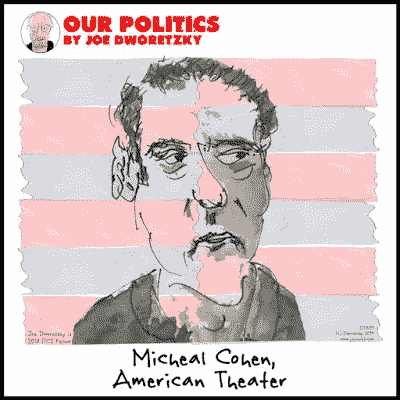

# 困扰国会的变革。

> 原文：<https://medium.datadriveninvestor.com/the-changes-roiling-congress-3eadaf5a93d3?source=collection_archive---------5----------------------->

回想起来，不清楚迈克尔·科恩在众议院监督委员会面前的电视证词是否有任何作用。唐纳德·特朗普饰演的老古董提供了一些不错的戏剧，但他真的没有告诉我们任何我们不知道的事情。唐纳德·特朗普是骗子吗？当然，马尔科·卢比奥早就告诉我们了。他是个自恋的骗子吗？这并不新鲜，三年前，特德·克鲁兹对川普的病症给出了最简洁的诊断。他是一个可怕的人吗？这是南卡罗来纳州众议员米克·马尔瓦尼(Mick mulva ney)——现任特朗普的幕僚长——在 2016 年支持特朗普当选总统的那天所做的总结。最值得注意的是，当这些指控在听证会上再次提出时，听证室里的共和党人实际上没有一个人费心去争论它们。

 [## 数据驱动的投资者

### 事实上，在各行各业，数据的大规模激增正在改变我们感知世界的方式。而且只有…

go.datadriveninvestor.com](http://go.datadriveninvestor.com/youtube) 

在委员会主席以利亚·卡明斯(Elijah Cummings)下令举行听证会之前，我们就知道公众舆论会对迈克尔·科恩可能要说的话产生怎样的影响:超过三分之一的美国人会团结在总统身边，告诉民意调查者科恩是一个自私的骗子，而大约 60%的公众会确认科恩提出了一个令人信服的案例，即唐纳德·特朗普是我们所知道的一切。在一整天的听证会中，过道对面没有任何话语。实际上，没有人来到听证会，寻求了解科恩、特朗普集团或总统本人的新情况；这些观点早就有了定论，尽管实际情况尚不清楚。

然而，除了科恩的证词，听证会为了解国会内部不断变化的政治格局以及每个政党核心小组的权力消长提供了一个宝贵的窗口。在民主党掌权的情况下，共和党成员明显对自己是少数派感到恼怒，这是他们中的许多人从未经历过的。与此同时，新当选的左翼民主党人毫不掩饰地接受了此前由右翼自由核心小组成员持有的煽动性衣钵。当密歇根州民主党人 Rashida Tlaib 猛烈抨击共和党人 Mark Meadows 时，这让人们想起了人们习惯于听到的史蒂夫·金(Steve King)、路易·戈默特(Louie Gohmert)或其他人从右翼发出的刻薄言辞。正如自由核心小组创始人吉姆·乔丹(Jim Jordan)对不得不听从委员会主席的命令感到震惊一样，梅多斯对 Tlaib 的召唤感到震惊，因为他试图为特朗普辩护，反对迈克尔·科恩断言唐纳德·特朗普是种族主义者。

对于梅多斯来说，在这个地方坚持为总统辩护是很奇怪的。毕竟，特朗普的种族动机行为的长期历史是有据可查的，从他的房地产公司的住房歧视政策，到他对中央公园五人组的嘲讽，到他对出生论的支持，到他的反墨西哥和反穆斯林言论，到部分基于种族仇恨和迎合在夏洛茨维尔获得充分发言权的白人民族主义者的政治运动，到他对折磨并在许多情况下摧毁移民家庭的政策的支持。信奉特朗普主义的梅多斯未能在特拉伊布身上看到十年前的自己:一位新当选的国会议员，他拒绝遵守旧规则，并准备积极挑战违反自己原则世界观的行为和态度。面对这种对抗，这位曾经的保守派扔炸弹者感到不安，绝望地请求委员会主席伊莱贾·卡明斯为他辩护，反驳特莱布的话:*你是我的朋友，*梅多斯恳求道，*如果我最好的朋友之一是黑人，我就不能是种族主义者。*

如果政治是一个钟摆，我们正看着它实时摆动。正如马克·梅多斯和吉姆·乔丹正在努力应对生活在少数群体中的新现实——梅多斯从未经历过的事情——民主党人正面临着生活在多数群体中的挑战。亚历山德拉·奥卡西奥·科尔特斯和她的助手们给民主党核心小组带来了新的、积极的活力。就像 2010 年当选的茶党共和党人，其自由核心小组迅速将目标对准了议长约翰·博纳和共和党内其他他们认为是温和派的人一样，本周 AOC 威胁要保留一份温和派民主党人的[名单](https://www.washingtonpost.com/powerpost/house-democrats-explode-in-recriminations-as-liberals-lash-out-at-moderates/2019/02/28/c3d163fe-3b87-11e9-a06c-3ec8ed509d15_story.html?utm_term=.c9c5d95437a6&wpisrc=nl_politics&wpmm=1)，这些人可能会不时地投票给共和党人，其明确目的是从左翼初选他们。正如 2010 年的选举导致共和党内部建立了一套严格的政治正确准则，并最终通过初选挑战和辞职清洗了温和派，民主党内的活动人士变得更有胆量在自己的党内策划类似的清洗思想错误的成员。

新墨西哥国会女议员索绮特·托瑞斯·斯莫尔是公开反对 AOC 威胁的人之一。与 AOC 一样，Torres Small 是一名新成员，但与 AOC 不同的是，她是一大批新成员中的一员，这些新成员将以前的共和党席位转向了民主党，他们所代表的地区既不像 AOC 所代表的地区那样安全，也不像 AOC 所代表的地区那样左倾。新墨西哥州南部的托雷斯·斯莫尔选区与布鲁克林和皇后区的街区相距甚远，正是这些街区将 AOC 送进了国会。虽然新墨西哥一直是蓝色州，但在许多问题上——特别是枪支和堕胎——它远比正常情况保守。在这方面，托雷斯·斯莫尔的选区有着广阔的孤立社区，与美国民主党候选人努力争取获胜的地区相似。因此，当她告诫奥卡西奥-科尔特斯(Ocasio-Cortez)和她的左翼同事尊重来自该国不同地区的人的观点和政治现实时，全党的活动人士都应该听听她在说什么。对于一个热衷于身份政治的民主党来说，AOC 被土著美国人 Torres Smalls 教导有关飞越州的美国政治现实是值得注意的。多样性有许多方面。

AOC 可能是给共和党的礼物，这似乎是她没有想到的。她确信自己的事业是正确的，并准备将自己的观点强加给民主党的其他人——这些特点是她与自由党团中的政治对手共有的——与她实际上可以声称的选举授权形成鲜明对比。在初选中，她战胜了长期在任的乔·克劳利(Joe Crowley)——这是她左派观点受到考验的唯一一场比赛——赢得了 16898 张选票。这一投票总数占她所在选区注册民主党人的 7.9%，占全体选民的 5.2%。虽然人们不能质疑她当选的有效性，但人们可以很容易地质疑她从选民那里获得的授权——与她从朋友和敌人那里吸引的注意力相反——是否证明她似乎准备行使的权力是正当的。

随着迈克尔·科恩的证词逐渐结束，如果说这个房间里有一个胜利者，那就是伊莱贾·卡明斯本人。他坚持说，我们比这更好，尽管成员们争吵不休，偶尔还会猛烈抨击。*我们必须恢复正常。*这些观点无疑引起了全国许多观众的共鸣。问题是国会议员们自己是否在倾听。对共和党人来说，一党统治的结束应该是一个警告，即特朗普时代可能正在结束，共和党的未来取决于它能否回到自由核心小组给该党带来严重破坏之前。对于民主党人来说，该党左翼的崛起以及与自由核心小组的真实相似之处，应该是一次当头棒喝。

毫无疑问，左翼活动人士将继续辩称，他们的道路是通往胜利的唯一道路——也是解决困扰这个国家的不平等问题的唯一道路——然而，支持他们结论的证据很少。民主党面临的更大风险是，如果左翼活动人士坚持将自己的意愿强加给该党，他们不仅可能会阻碍该党在 2018 年获得的真正势头，而且——正如共和党人热切希望的那样——他们可能会疏远去年 11 月蜂拥支持民主党的独立人士和温和派人士，并使这个国家不仅要承受特朗普总统任期的四年，还要承受最高法院和司法机构进一步右倾的压力，这将伴随我们一代人。

*在 Twitter @dpaul 上关注大卫·保罗。他正在写一本书，书名是《联邦退出！为了拯救我们的民主，是时候让阿拉巴马成为阿拉巴马，让加州自由了。”*

Joe Dworetzky 的作品。在 www.jayduret.com[*看看乔的政治漫画吧。*](http://www.jayduret.com.) *在 Twitter @jayduret 或 insta gram @ Joe faces 上关注他。*